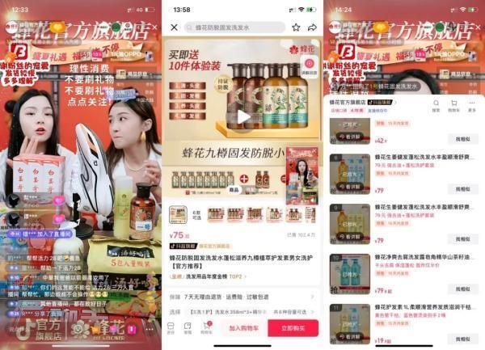

# 李佳琦的一次“翻车”，为何带来了老牌国货的“线上狂欢”

人们用购买的方式支持这些容易被忽视的国货品牌，是消费的转移，也是情感的补足

李佳琦掉粉，蜂花涨粉；花西子人气大落，部分老牌国货品牌销量暴涨。

过去几天，老牌国货都在抱团商战处CP，蜂花卖断货开始卖鸿星尔克。国货品牌郁美净也终于出手，连夜通网注册抖音，1天时间已涨粉至61.3万……这些老牌国货，正创造着一个互联网“奇观”。

如果说李佳琦事件给了这些老牌国货一个机会，那么它们的借势而起才是成就自己的决定性因素。

蜂花作为其中一个“显眼包”，凭借“连夜上架3款79元的洗护套餐”“快递箱都是捡来的”等话题一度引发热议。在某种程度上，蜂花作为花西子的反面，为大众抵消了“贵”的直观感受，自然能获得好的观感。蜂花直播间卖断货后，直接卖起了鸿星尔克；鸿星尔克则在直播间用蜂花洗头，吃白象方便面，镜头前摆满了国货，颇有一种团结互助的味道，也有一种出名了要带带其它国货品牌，有钱大家一起赚的意思。

于是，他们的直播间渐渐演变成互相推荐，几大品牌也玩起了直播连线，这样的梦幻联动一次比一次超出想象。有人说，这是国货显眼包团聚；也有人说，这是国货品牌的相互救赎。

**无论是救赎还是团聚，都无外乎一种营销手段，但和直播间里演着讨价还价、大喊大叫的模式相比，显然这样的方式更直击人心。**
他们顺应网友的情绪，创造话题，吸引了更多“自来水”。可见，在互联网上耳濡目染久了，一些老品牌也擅长借势了。这种思维和行为方式的转变，让老品牌在这个激烈的竞争时代，也能获得流量，成就一个个热搜话题。

人们为什么要去买这些老牌国货？当然不是因为他们推出的79元套餐，而是在于它们物美价廉实惠好用。当然，更直接的原因可能是人们想借此表达对李佳琦和花西子的不满。消费时代，购买成了表达情绪最直接的工具。既然李佳琦“嫌弃”大家，那就索性把这“泼天的富贵”送给老牌国货们。人们用购买的方式支持这些容易被忽视的国货品牌，是消费的转移，也是情感的补足。

但其实，还有一个不易察觉的原因在于，这些老牌国货和普通大众有诸多相似之处，比如没有高显示度，都在默默努力让自己变得更好，都有自己的困境和难处，都需要友爱互助等等。也许，
**正是这种境遇上的相似，情绪上的暗合，让大众想通过支持的方式，抚慰正在努力的自己。换个角度说，挺老牌国货，也是在挺自己。**

目前来看，流量是有了，但能否变成留量，还要靠国货品牌们继续修炼内功，既在营销上突破，更在产品上创新，以适应大众的需求、时代的需要，真正接下这“泼天的富贵”。而一个个老牌国货直播间的悉数登场，让人联想，李佳琦的一次“翻车”就已经让众多老牌国货迎来流量和销量的小高峰，那么直播巨头的存在对于直播行业生态链到底有着什么样的影响，或许是一个值得思考的问题。

红星新闻评论员 黄静

编辑 汪垠涛

红星评论投稿邮箱：hxpl2020@qq.com

