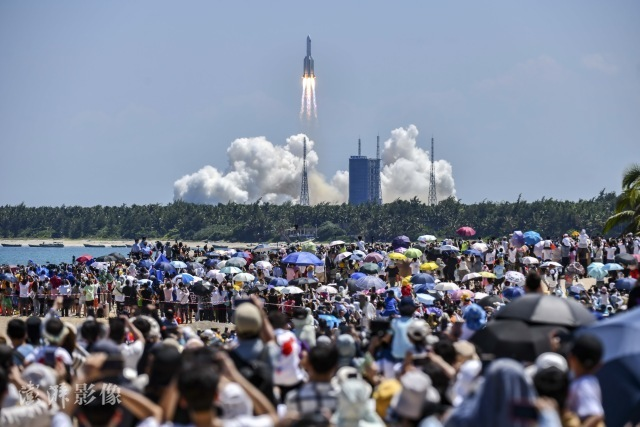
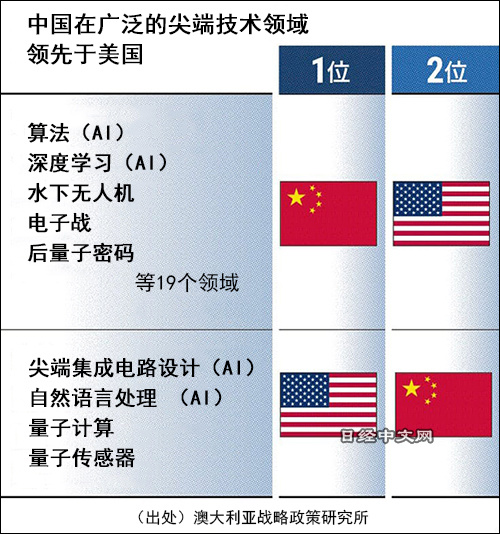
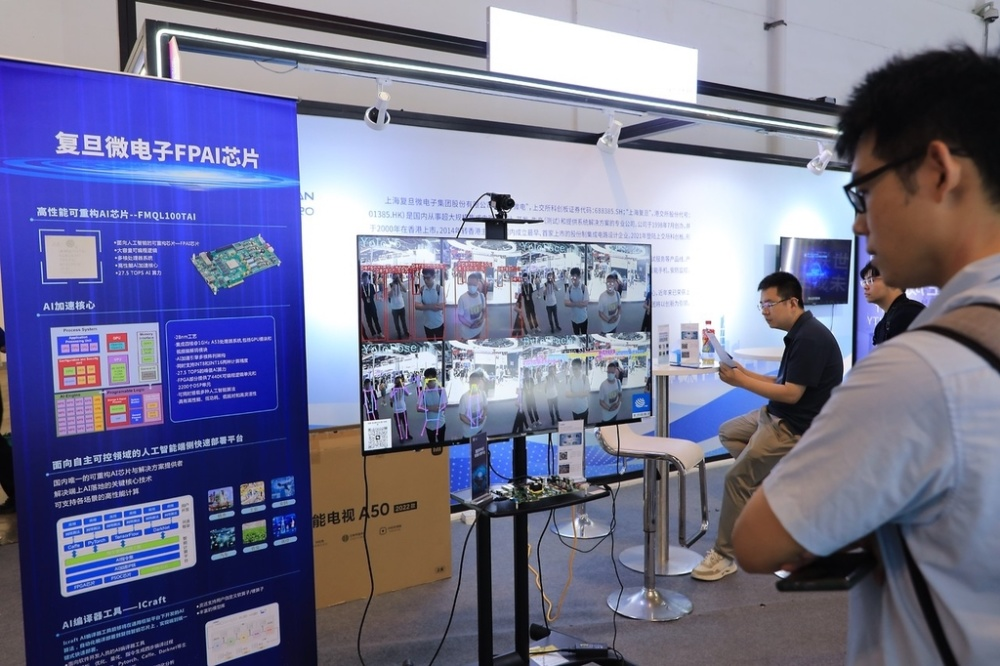

# 澳“反华智库”又炒作：23项关键领域先进技术，中国19项全球第一

【文/观察者网
熊超然】今年3月，知名“反华智库”——澳大利亚战略政策研究所（ASPI）曾发布一份报告，炒作渲染在全球44项最关键和最新兴技术中，中国有多达37项世界第一。半年时间过去了，如今ASPI又发布了一份类似的报告。

据《日经亚洲》（Nikkei
Asia）9月15日报道，ASPI的这份报告称，分析23项关键领域的先进技术后发现，中国在其中19项技术上处于全球领先地位，涵盖了包括高超音速和水下无人艇等80%的关键领域。报告宣称，中国通过推进“举国投资（国家主导投资）”，使之在这些技术领域遥遥领先于美国、欧洲和日本，而美国则在其余的4项技术上处于全球第一。

日媒报道援引该份报告称，这一排名结果，是根据2018年至2022年期间发表的220万篇论文中“被引用次数排名前10％”的学术论文而得出的，这些重点关注领域被认为是美国、英国和澳大利亚三边安全伙伴关系（AUKUS）涉及的关键领域。

作为日媒，《日经亚洲》也关注了日本的排名情况，并发现，日本进入前10名的只有量子计算和后量子加密技术等7个领域。

_澎湃影像资料图：2022年7月24日14时22分，搭载问天实验舱的长征五号B遥三运载火箭，在中国文昌航天发射场准时点火发射，取得圆满成功。中新社记者
骆云飞 摄_

这份报告逐一领域分析称，中国在高超音速探测、跟踪以及刻画塑造方面，高影响力研究产出占据73.3%，远远领先于美国、英国和德国。

比如，高超音速导弹的飞行速度是音速的五倍以上，被视为是一种潜在的“改变游戏规则的武器”，中国正在开发速度更快、轨迹更不可预测的高超音速导弹，以穿透敌人的导弹防御网络。

ASPI的报告声称，考虑到中国遥遥领先于竞争对手，以及从事高影响力研究的机构都集中在中国，中国在这项技术上占据主导地位“风险很高”。

在自主水下航行器（AUV）领域，中国占重要研究的56.9%，排名第二的美国仅占9.5%。报告称，水下无人艇采用了各种尖端技术，包括耐压外壳、无人导航技术和通信系统。此外，中国在先进的水下无线通信和声纳方面也处于领先地位。

报告提到，中国和美国这两个世界大国，在人工智能和量子技术等领域的竞争则更加激烈。

在6个人工智能相关的领域中，中国在无人机等4个领域处于领先地位，而美国在先进集成电路设计和制造领域排名第一。同时，在4个量子技术相关的领域中，中美分别在2个领域占据榜首，在有望应用于量子计算和医疗等领域的高灵敏度量子传感器方面，美国占据优势，而在量子计算机也难以破解的“后量子密码”技术等方面，则是中国遥遥领先。

ASPI执行董事贾斯汀·巴希（Justin Bassi）就此情况称：“这体现出中国寻求在与国家安全相关的关键技术上获得优势的战略意志力。”

 _ASPI报告中，中美在23项关键领域先进技术的排名情况
图自日经中文网_

需要注意的是，早在特朗普政府时期，美国就因担心中国的科技进步，在高速通信标准“5G”等高科技领域寻求同中国“脱钩”。到了拜登政府上台执政，这种对华打压限制的力度进一步加强。

今年8月9日，美国总统拜登签署行政命令，限制在半导体、量子计算和人工智能等敏感技术领域的对华新投资，并要求美企就其他科技领域的在华投资情况向美政府进行通报。

《纽约时报》对此认为，拜登政府此举升级了美中之间的对抗，并可能使得世界两大经济体之间的距离更加遥远。“（美国）政府官员认为，其努力完全是出于国家安全的考虑，而非试图获得经济优势。但该命令本身却已显示出将两者分开是多么困难。

8月10日，中国外交部发言人答记者问表示，中方对美方执意出台对华投资限制措施强烈不满、坚决反对，已向美方提出严正交涉。商务部新闻发言人强调，中方将保留采取措施的权利。希望美方尊重市场经济规律和公平竞争原则，不要人为阻碍全球经贸交流与合作，不要为世界经济恢复增长设置障碍。

_2023年7月8日，2023世界人工智能大会在上海世博展览馆举行。图自IC Photo_

值得一提的是，今年3月2日，ASPI也曾发布一份报告称，中国在44项最关键和最新兴技术中，有多达37项“惊人领先于全球”，包括国防、太空、机器人、能源、环境、生物技术和人工智能等领域。

报告发现，尽管美国在高性能计算、量子计算、小型卫星和疫苗等领域引领全球发展，但通常情况下只能位居次席。这一研究还发现，中国在关键技术方面要比以前认为的更先进，在某些领域，世界排名前十的研究机构都在中国。

借此报告，ASPI渲染“西方民主国家”在全球研究竞争中失利，敦促各国政府加大研究投资。而澳媒《澳大利亚人报》也据此报告声称，在全球科技领域，中国正朝着超越西方的方向“急速发展”，将引发其很快会钳制某些最关键技术供应的担忧。

ASPI，素来被称为是“披着学术外衣的反华急先锋”，是出著名的“反华智库”，该研究所一直标榜为“独立智库”、“学术研究机构”，但实际上长期受金主指使和操控，此前就炮制了大量臭名昭著的涉疆、涉华谎言和虚假信息。

资料显示，ASPI成立于2001年，其2020至2021“年报”显示，来自澳大利亚政府及其盟友国家政府以及军工产业的经费占到了该智库总预算的87%，其中，美国国务院更是其海外经费最大的来源。该“年报”显示，美国国务院提供的两笔费用合计约158万澳元，占该智库2020至2021年度海外政府经费的80%。

路透社报道披露，ASPI今年3月发布的这份涉及中国科技发展的研究报告，同样得到了来自美国国务院方面提供的资助。

**本文系观察者网独家稿件，未经授权，不得转载。**

