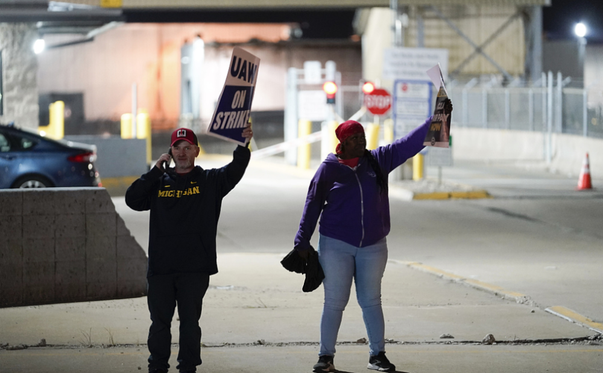
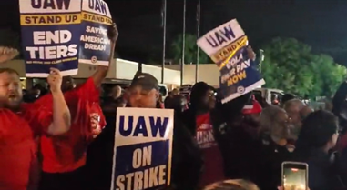
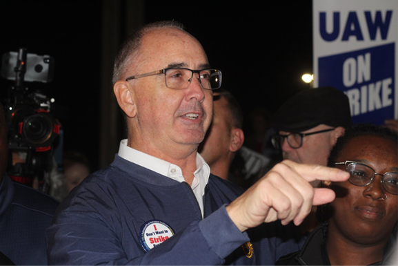

# 美国15万汽车工人大罢工，“我们破坏的不是经济，而是亿万富翁财富”

 _来源：视觉中国_

作者 ｜ 程潇熠

编辑 ｜ 康晓

出品丨深网·腾讯新闻小满工作室

美国大罢工浪潮愈演愈烈。在今年7月美国好莱坞掀起60年来最大规模罢工、35万名卡车司机与美国运输商UPS展开罢工谈判后，罢工行动战火烧到了汽车制造行业。

美东时间9月15日，美国汽车工人联合会（UAW）与美国三大传统车企——通用汽车、福特汽车、Stellantis的合同到期，双方未能就新合同达成一致，UAW将联合三大车企内约14.6万名工会工人，从当地时间14日午夜12点（北京时间15日中午12点）起发起罢工。

根据UAW主席肖恩•费恩(Shawn
Fain)公布计划，工会将先在三家工厂进行罢工，分别是：通用汽车位于密苏里州温茨维尔的装配厂；福特位于密歇根州韦恩的装配和喷漆厂；Stellantis
位于俄亥俄州托莱多的装配厂。

这是UAW第一次针对三家车企同时开展罢工行动，在此之前UAW的战略向来是逐一攻破。费恩称，如果谈判仍未有进展，UAW将扩大罢工范围。参与罢工的工人每周能从工会获得500美元罢工补贴。

 _来源：UAW_

“我们（美国）即将面临今年以来最大的劳资冲突。”纽约时报资深汽车记者尼尔·布德特（Neal
Boudette）在一档播客中称，汽车工业是美国最大的制造业，三家车企同时罢工的情况前所未有，影响巨大。

**汽车行业作为链条最长、涉及面最广的行业，大罢工行动必然会导致地区经济衰退。**
作为参考，2019年UAW对通用汽车发起为期6周的罢工时，通用汽车总部所在地美国底特律密歇根州经历了单季度经济衰退。

**美国经济咨询公司安德森经济集团预计，即使是为期10天的短暂罢工也可能会导致美国经济损失56亿美元（约合人民币408亿元）。**
其中工人将损失约8.59亿美元工资，车企遭受9.89亿美元损失，损失最多的则是汽车零部件供应商、汽车经销商及消费者。

“我们的目标不是罢工，我们的目标是达成一份公平的合同。”UAW主席费恩在直播时称。“如果我们必须通过罢工来赢得应有的薪酬和福利，我们就会这么做。”

UAW近一年来行动较为频繁。去年6月，UAW曾组织了美国史上最大规模学术罢工，涉及美国加州大学约4.8万名研究生、博士后及学术研究人员。最终UAW取得了阶段性胜利，参与罢工的UAW人员获得了20%-80%的涨薪及更多福利。

“这（这次汽车行业罢工行动）对UAW来说将是一个非常重要的时刻。”尼尔称，几十年来UAW的规模一直在萎缩，如果这次UAW没能在全体成员支持的情况下争取到相关权益，工会的影响力和可信度将大打折扣。

**“我们破坏的不是经济，而是亿万富翁财富”**

今年8月初，UAW向美国汽车三巨头（通用、福特、Stellantis）提交了新劳资合同的要求，其中包括：
**一周工作时间缩至四天（薪酬发五天）；四年内薪酬涨幅达40%；以及提高退休待遇，在工厂关闭时为工人提供工作保障等。**

此外，UAW还希望推Stellantis重新开放位于伊利诺伊州贝尔维代尔的一家工厂，该工厂今年闲置，导致1350人失业。

“我知道这些要求听起来很激进。”费恩在接受采访时说，但三巨头的利润正在创新高，他相信三家企业可以轻松负担起来，费恩的目标是制定能让人们过上中产阶级生活的标准。

**费恩认为，目前很多工人每周工作时间在6到7天，几乎没有时间过自己的生活，而三巨头的高管们享受着大幅涨薪和工作与生活的平衡，这并不公平。**

美国工会最早出现在19世纪末，创立初衷是为了维护劳工群体的合法权益。UAW成立于1935年，是代表美国（包括波多黎各）和加拿大工人的美国工会组织，拥有合法地位。

UAW是美国最大的工会，也是被公认为“全球最具战斗力的工会”，成员几乎遍布各个行业，甚至包括大学、医院、地方政府等。UAW会代表工会工人每四年与美国汽车三巨头签订一次劳资合同。

上一次重新签订合同时，UAW曾对通用汽车发起了一场长达40天的罢工行动，给通用汽车造成了超20亿美元的损失。最终通用汽车妥协增加数千个新工作岗位，并缩短工人涨薪所需要的时间，并为公司内工会成员进行加薪或发放奖金。

这次史无前例的罢工行动也给拜登政府出了难题。

**“现在是这个国家的政客们选择立场的时候了。”费恩在接受CNBC采访时称，UAW的罢工是在向拜登政府重申美国工薪阶级的立场。**

根据去年美国的《通胀削减法案》和2021年通过的《两党基础设施法》，拜登将为投资电动汽车工厂的车企提供约120亿美元财政激励。车企加速转型电动化，福特的首席执行官吉姆·法利（Jim
Farley）去年曾称，电动汽车的生产将减少40%的劳动力。而UAW大部分成员都在生产燃油车的工厂内工作，是最直接的利益受损者。

UAW要求三巨头不会因电动化转型而令工会成员失业，还要求自称“美国历史上最亲工会的总统”乔·拜登（Joe Biden）支持UAW。

拜登迫于压力，上个月就UAW与三巨头的谈判发布声明，称汽车行业必须提供“能养家糊口的好工作”，并确保现有工人有机会找到新的工作。8月底，拜登政府又向车企提供了155亿美元的资金和贷款，以主要支持车企向电动化转型过渡和对工人的再就业培训。

在多轮谈判后，UAW将涨薪要求降至四年内36%，三巨头也在不断妥协：福特、通用、Stellantis分别同意加薪20%、18%、17%。双方僵持不下，谁也不愿意再退后一步。

**“如果同意UAW的要求，我们将损失150亿美元并破产。”** 福特汽车首席执行官Jim
Farley在接受CNBC采访时称，福特已经向UAW提供了80年来“最慷慨”的涨薪计划。

UAW则表示，鉴于这三家汽车制造商CEO的薪酬在过去4年里上涨了40%，用于股票回购的金额攀升了150%，UAW工人的薪酬上涨了6%，车企和其掌控的媒体对广泛经济损失的预测是错误的。
**“我们破坏的不是经济，而是他们的经济、亿万富翁财富。这就是他们所担心的……他们想吓唬美国人民，让他们认为有问题的是汽车工人。”**

**三大车企进退两难，特斯拉隔岸观火**

如果美国汽车三巨头目前在汽车行业拥有绝对领先优势，或许三家企业面对UAW的要求会进一步退让。但现实情况是，全球正在经历能源变革，而三巨头在新能源汽车领域并不占优。

**此时对于三巨头管理层而言，相比罢工带来的短期损失，他们更担心历史重演——退让带来长期竞争力损耗。**

1970年，UAW在与通用汽车的罢工对抗中获得胜利。UAW帮助汽车工人过上了舒适的中产阶级生产，例如能拥有一套湖边的房子及属于自己的一艘船，供养全职太太及孩子上学。UAW还帮助提高了不同行业的非工会工人及其他工会工人的工资。

然而80年代日系车进军美国市场，开始快速挤压三巨头的市场份额。三巨头需要开源节流，但碍于与UAW的合同，只能选择用更便宜的材料设计生产成本更低的汽车。

“如果你今天和通用汽车高管交谈，他们会承认他们当时制造了一些非常蹩脚的汽车。”尼尔在播客中讲到，但那是他们在预算范围内所能做的最大努力，工会的要求确实影响了通用的竞争力。

从2005年开始通用汽车连年亏损，甚至2009年开始申请破产保护，福特也曾在一年之内亏损上百亿美元。被逼到墙角的车企与工会展开谈判，最终工会同意降低聘用新工人的最低时薪，并让三巨头摘到了沉重的养老负担。

车企资金得以转圜，开始投资生产更有竞争力的汽车，到了2015年三巨头利润创历史新高。但这次退让使得工会影响力受到沉重打击，从俭入奢易，从奢入俭难，工会成员不得不放弃曾经习以为常的福利待遇，美国工会规模开始缩减。

**如今，工会认为这是他们“拿回他们所放弃的东西”的好时机。费恩在动员工会成员时称，“是时候结束企业的贪婪了。”**

但是事实上，“贪婪”的不仅仅是企业，还有工会这一利益集团。

根据Center for Union
Facts的统计，大型工会领导人的年薪堪比总统。而近些年工会领导人也频出腐败丑闻。UAW第五区负责人曾因挪用工会资金和其他违法行为被联邦政府逮捕，前任主席也受到相关指控被调查。

马斯克是美国工会反对者，他一直反对在特斯拉内部筹建工会。马斯克深知明确的拒绝会受到强力反弹，于是他给了工人选择，并十分自信自己给的筹码——加入美国工会或者拿到特斯拉期权，工人只能选择其一。

“谁都不能阻止特斯拉筹建工会，但员工为什么要放弃特斯拉股票期权，选择缴纳会费呢？”去年3月，马斯克更是曾在社交媒体上叫板，
**“UAW从工人手中偷走了数百万美元，特斯拉却让大量的工人变身为百万富翁。差不多的金额，却是截然不同的结局。”**

今年美国罢工行动数量猛增。据康奈尔大学工业与劳工关系学院统计，今年美国已有251起罢工事件，比政府统计的数字多了数百起。

越来越多的员工走上街头，“不仅仅是新闻中报道的大型罢工，每个行业都存在许多规模较小的罢工。” 康奈尔大学工业与劳工关系学院高级讲师凯特·布朗芬布伦纳
（Kate Bronfenbrenner)）在接受采访时称，罢工和工会组织的复苏还将持续，越来越多的美国人开始支持工会。

布朗芬布伦纳在上述采访中称，“当大规模罢工像浪潮一样席卷全国时，它们会具有传染性。”

