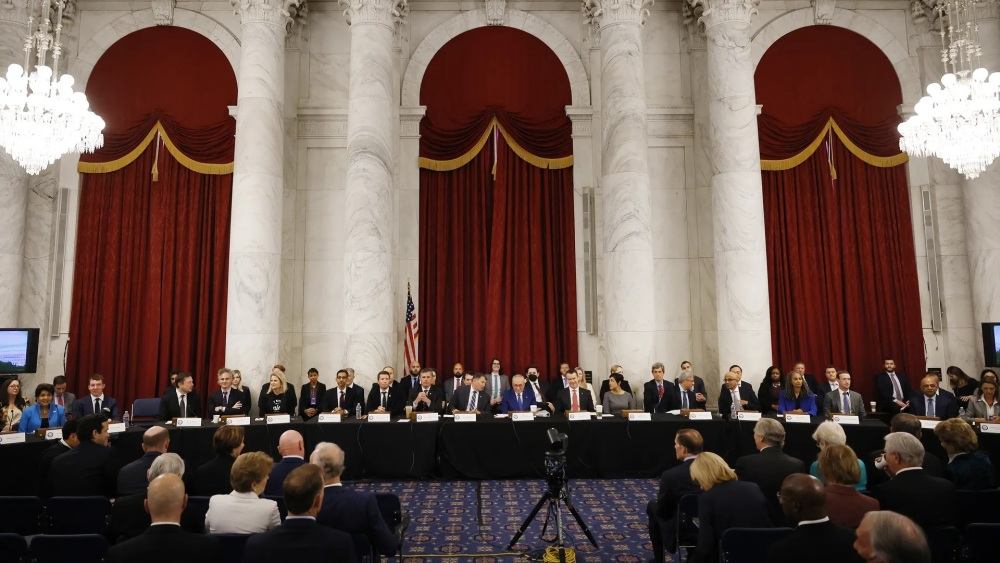
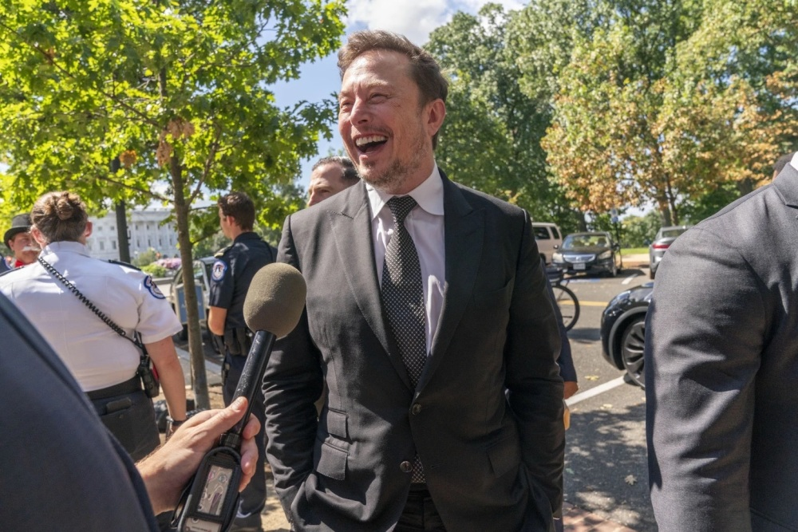
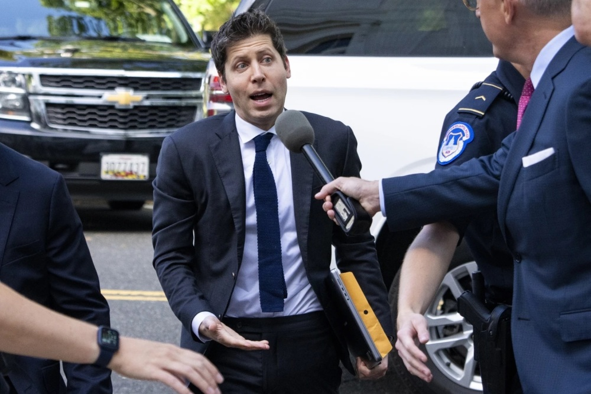
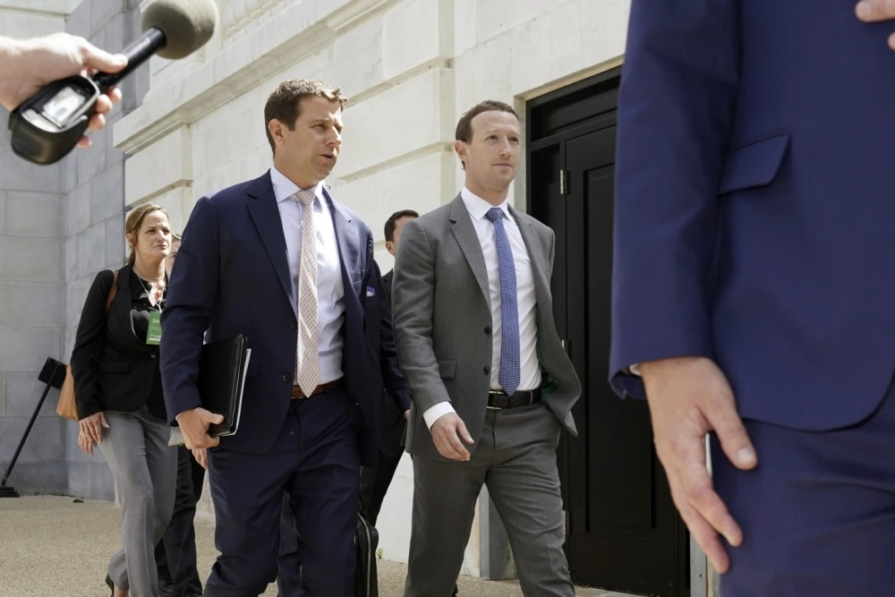
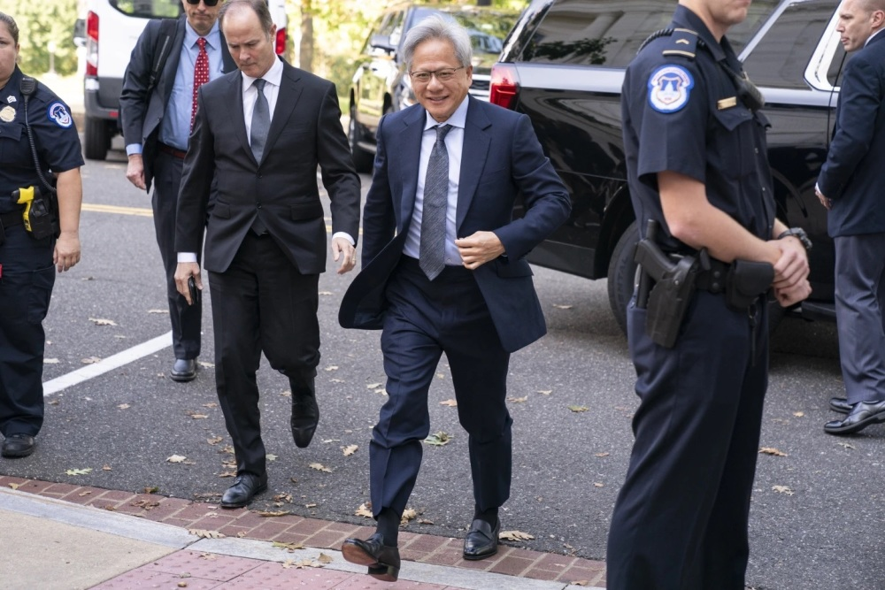
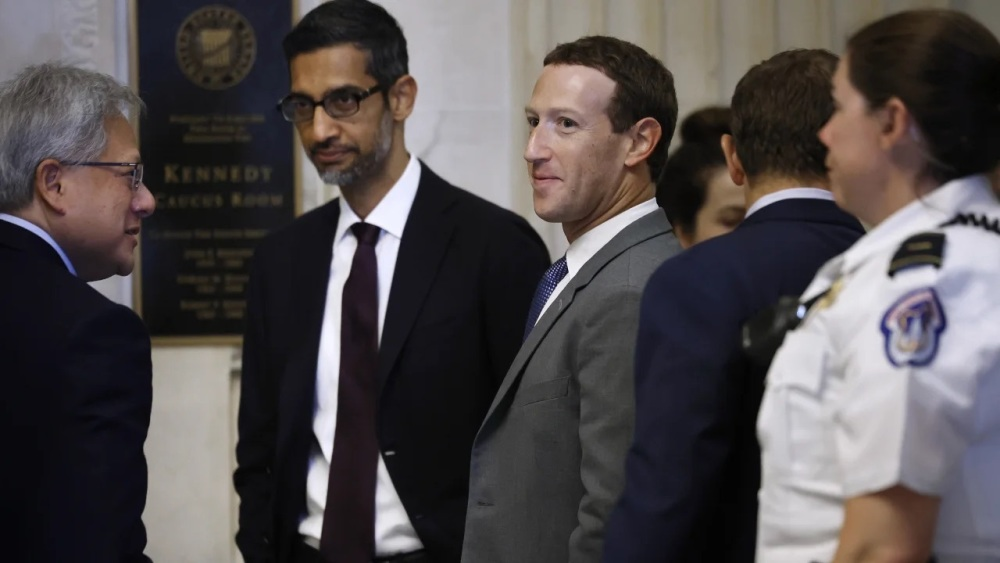
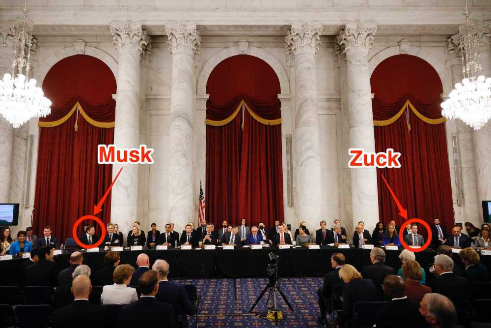

# 美国科技大佬齐聚国会闭门商讨AI，“对文明的未来非常重要”

_当地时间9月13日，美国参议院举行“人工智能洞察论坛”的闭门简报会，20多名硅谷首席执行官和人工智能伦理学家坐在台上讲话。_

当地时间9月13日，美国参议院举行了一次不同寻常的闭门简报会，与会者是美国最大的科技公司高管，被戏称为“镀金时代以来最大的垄断者聚会”。

通常在听证会上，议员们端坐台上逼问台下的科技企业家，而在这次闭门会议中，60多名参议员像小学生一样坐在台下，聆听台上20多名硅谷首席执行官和人工智能伦理学家讨论生成式人工智能的“文明风险”。

特斯拉、SpaceX和X（前推特）的首席执行官埃隆·马斯克在会场外对记者说：“对我们来说，有一名裁判很重要。”“（会议）可能会载入史册，因为它对文明的未来非常重要。”

相比马斯克言辞中的科幻色彩，一些与会者更强调人工智能在当下现实中的风险。会议中，科技公司高管大致认可了政府对人工智能进行监管的想法，但对于监管的内容几乎没有达成共识，立法的政治道路仍然困难。

_特斯拉、SpaceX和X（前推特）的首席执行官马斯克在闭门会后接受记者的采访_

**“人工智能的发展应该遵循美国的价值观”**

此次会议是美国参议院首届“人工智能洞察论坛”的一部分。每位参与者有3分钟时间就他们选择的主题发表演讲，组织简报会的纽约州民主党人、参议院多数党领袖查克·舒默（Chuck
Schumer）和南达科他州共和党参议员迈克·朗兹（Mike
Rounds）随后主持了小组讨论。尽管是一次闭门会议，但很多与会者会后都接受了媒体的采访，关于会议的细节逐渐得到披露。

舒默问与会嘉宾：“政府是否需要在监管人工智能方面发挥作用？”“每个人都举起了手，尽管他们有不同的观点。”舒默说，“所以这给了我们一个信息：我们必须尝试采取行动，尽管过程可能很困难。”在上午的会议后，舒默告诉记者，立法应该在几个月内而不是几年内出台。

ChatGPT的开发机构OpenAI的首席执行官山姆·奥特曼（Sam
Altman）表示：“我认为人们都同意，这是我们需要政府领导的事情。”“对于如何发生存在一些分歧，但一致认为这是重要且紧迫的。”

_OpenAI首席执行官山姆·奥特曼抵达会场后与记者交谈_

与会者称，马斯克和谷歌前首席执行官埃里克·施密特提出了人工智能带来的生存风险，微软联合创始人比尔·盖茨专注于解决全球饥饿问题。IBM首席执行官阿尔文德·克里希纳（Arvind
Krishna）表示，反对关于人工智能开发许可证的提案。

Meta首席执行官马克·扎克伯格谈到了封闭与开源人工智能模型。他称Meta的开源人工智能是确保广泛使用该技术的一种方式，不过Meta“对此并不狂热”。“我们并不开源一切。我们认为封闭的模式也很好，但我们也认为更开放的方法在许多情况下可以创造更多价值。”他说：“下一个领先的开源模式……来自阿布扎比。”

_Meta首席执行官马克·扎克伯格离开会场_

一位发言者提到1996年制定的《通信规范法》第230条，即著名的“230条款”。该条款授予互联网公司“豁免权”，旨在保护互联网公司免于对第三方在其平台上发布的内容承担责任。“其中一位发言者说，‘让技术的用户和创造者承担责任。’”怀俄明州共和党参议员辛西娅·鲁米斯（Cynthia
Lummis）说，“换句话说，他特别说，‘不要为人工智能制订第230条。’”

印第安纳州共和党参议员托德·扬（Todd Young）说，与会者一致认为，人工智能的发展应该遵循美国的价值观。

一位不愿透露姓名的与会者表示，与会者普遍认为联邦政府需要“帮助应对我们所谓的变革性创新”。舒默告诉记者，这可能需要创建一个320亿美元的基金，以帮助“最大限度地发挥人工智能的好处”。

 _英伟达首席执行官黄仁勋抵达会场，没有穿皮夹克_

**不平等、隐私、假消息**

会议中存在很多具体的分歧。一些人设想建立一个全面的新人工智能机构，而另一些人则认为现有实体——比如国家标准与技术研究院（NIST）更适合实施监管。马斯克后来表示，他认为有可能成立一个监管机构。谷歌首席执行官桑达尔·皮查伊（Sundar
Pichai）拒绝透露具体细节，但总体上支持华盛顿参与的想法。

扎克伯格、奥特曼和盖茨在整个上午的会议中“明显存在分歧”，比如在开源人工智能带来的风险上看法不同。马斯克与加州大学伯克利分校的研究员黛布·拉吉 （Deb
Raji）发生了争执，据房间里的一位人士透露，他似乎淡化了对人工智能驱动的自动驾驶汽车的担忧。

除了企业家和议员，受邀在简报会上发言的专家也阐述了对人工智能的担忧。

西班牙裔民权组织UnidosUS主席珍妮特·穆尔吉亚（Janet
Murguía）表示，论坛的与会者和科技领袖讨论建立和扩大人工智能的收益，但许多拉丁裔仍然缺乏宽带互联网接入。她说，这一现实凸显了“现有基础设施的差距如何阻碍我们进入人工智能的大门”。

穆尔吉亚也提到了地理定位跟踪和人脸识别等人工智能驱动的工具，并指出最近发布的一份报告发现，使用人脸识别的联邦执法机构缺乏保护人们隐私和公民权利的措施。

美国教师联合会主席兰迪·温加滕（Randi
Weingarten）发表讲话称，400美元就可以资助虚假信息活动。随后，人道技术中心的特里斯坦·哈里斯（Tristan
Harris）谈到如何花费800美元和几个小时的工作来剥离Llama
2（Meta开发的大语言模型）的安全控制，并使其分享制造生物武器的指南。“这就像我们在争论毁灭世界的成本有多低。”温加滕说。

温加滕表示，教师和学生应该受到保护，免受不平等、身份盗窃、虚假信息和人工智能可能助长的其他伤害，有意义的联邦立法应该保护隐私并寻求解决工作岗位流失等问题。

**房间里的人总净资产为5500亿美元**

一些参议员批评公众被排除在会议之外，认为科技高管应该公开作证。

密苏里州共和党参议员乔什·霍利（Josh
Hawley）表示，他不会参加“大型科技公司的大型鸡尾酒会”。霍利与康涅狄格州民主党参议员理查德·布卢门撒尔（Richard
Blumenthal）一起提出立法，要求科技公司为高风险人工智能系统申请许可证。“我不知道为什么我们会邀请世界上所有最大的垄断者来向国会提供如何帮助他们赚更多钱的建议，然后不对公众开放。”他说。

_黄仁勋（左一）、皮查伊（左二）和扎克伯格（左三）在会场_

非营利组织AI Now Institute的董事总经理莎拉·迈尔斯·韦斯特（Sarah Myers
West）估计，会议房间里的人总净资产为5500亿美元，“很难想象这样一个房间能以任何方式有意义地代表更广泛公众的利益。”她没有参加会议。

还有议员对这种形式的讨论会是否有作用表示怀疑。“让科技巨头参加闭门会议与参议员交谈并且不回答任何棘手的问题，对于试图制定任何形式的立法来说都是一个可怕的先例。”马萨诸塞州民主党参议员伊丽莎白·沃伦（Elizabeth
Warren）说。

_马斯克和扎克伯格坐的位置距离很远，分别位于一张很长的桌子的两端_

一些人把关注点放在了其他地方。一张照片显示，马斯克和扎克伯格坐的位置距离很远，分别位于长桌的两端。马斯克和扎克伯格最近关系紧张，推特和Meta的新社交媒体产品Threads正处于竞争中，两人都表示要组织一场在笼子里的肉搏。

