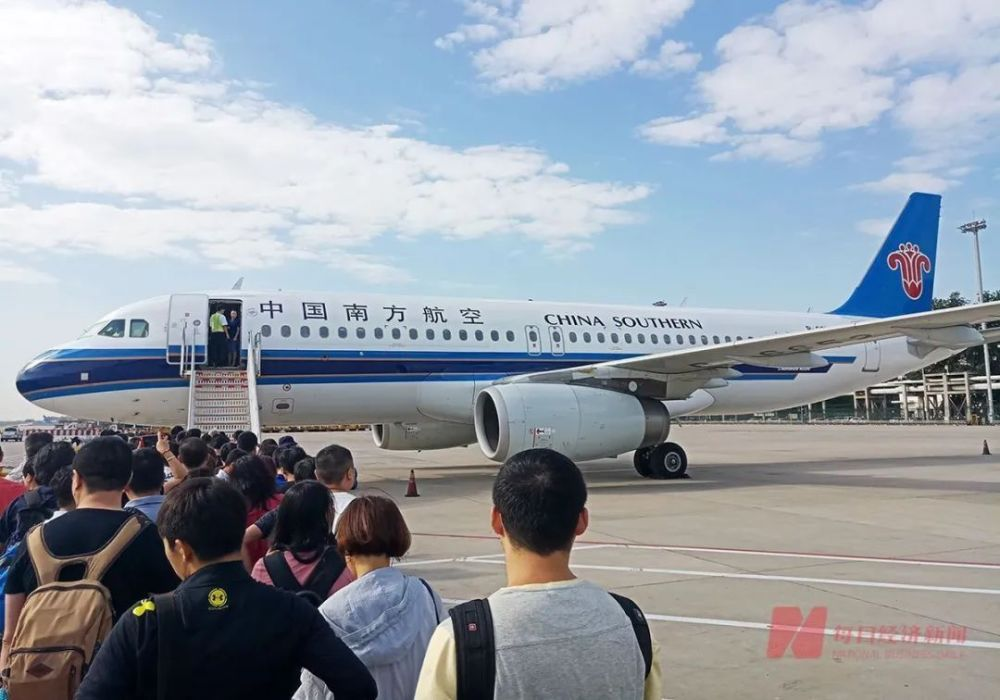

# 美飞机发动机存缺陷 数百架飞机面临停飞 国航发动机起火或与此有关

美国普惠公司发动机召回事件引发的关注度正在不断攀升。涉事发动机型号为PW1100G，主要装配在空客公司A320neo系列飞机。普惠公司的母公司RTX（雷神技术）最早于今年7月份宣布该款发动机存在质量缺陷。

据航班管家统计， **截至2023年8月末，国内共有237架A320系列飞机搭载PW1100G发动机，分布在青岛航空、吉祥航空、四川航空等9家航空公司。**
目前，吉祥航空已发布公告，表示有4架飞机受到影响，补偿方案正在制订和谈判过程中。

9月14日，针对补偿方案，吉祥航空（603885.SH，股价15.03元，市值332.76亿元）方面向《每日经济新闻》记者表示，目前没有更多信息。记者同时联系了中国国航（601111.SH，股价8.47元，市值1372.21亿元）、南方航空（SH600029，股价6.43元，市值1165亿元）等多家航司，欲了解公司机队和运力受影响程度，截至发稿尚未获得回复。

**普惠发动机存缺陷，数百架飞机面临停飞**

9月10日，从成都飞往新加坡的国航CA403航班在着陆前客舱出现烟雾，左侧发动机起火。落地后，机组人员组织旅客实施紧急撤离，新加坡樟宜机场第三跑道短暂关闭。据中国国际航空官方微博，该航班机型为A320neo，初步判断（事件）系发动机机械故障所引发。

_图片来源：微博截图_

有媒体报道称， **前述CA403航班飞机使用的发动机正是美国普惠公司的PW1100G发动机，但这一说法尚未得到普惠公司证实。**

与此同时，另一则消息加重了市场对普惠公司PW1100G发动机的担忧。

今年7月，普惠公司母公司RTX曾表示，由于制造某些发动机零件的粉末冶金材料出现罕见状况，大部分为A320neo提供动力的PW1100G-JM发动机需要在未来9至12个月内进行加速拆除和检查。当地时间9月11日，RTX公司再次发声，表示从2023年到2026年，将对600台~700台发动机进行检查。

作为动力装置，发动机被视作飞机的“心脏”。普惠PW1100G发动机的召回，意味着有大量飞机面临停飞，这对航司来说并不是个好消息。

据媒体报道， **直到2026年，这一障碍可能导致平均每年有350架飞机停飞，2024年上半年，将有多达650架飞机闲置。**
RTX公司最初估计，每台发动机的维修工作需要持续60天，但现在预计需要长达300天。

国际航协北亚区副总裁解兴权对《每日经济新闻》记者表示，全球的航空公司都面临着供应链问题，以及飞机零部件的短缺。供应链问题不仅引发新飞机的交付延迟，也导致现役飞机的定期维护严重推迟。近期的发动机召回事件进一步加剧航空公司面临的挑战，因为航空公司无法更快复飞和增加座位运力以满足强劲的旅行需求，这势必影响行业未来数年的发展。

世界三大评级机构之一的惠誉评级在精神航空（Spirit
Airlines）最新评级报告中指出，预计RTX公司将针对最近的问题向航空公司提供补偿，但目前尚不清楚此类补偿的时间和规模。

9月14日，《每日经济新闻》记者通过邮箱向RTX公司发送了采访函，截至发稿尚未收到回复。

由于PW1100G发动机主要装配在A320neo系列飞机上，空客公司成为陷入舆论漩涡中的另一家航空业巨擘。

9月14日，记者向空客中国寻求对上述发动机维修事项的评价，对方表示，空客公司CEO傅里（Guillaume
Faury）近日已作出回应。据媒体报道，傅里近日在出席活动时表示，
**“我们不喜欢这种情况，但我们认为这是正确的做法”，“为了确保安全，维修是必要的”。**

**将削减运力，有航司正在谈补偿**

2016年12月，南方航空率先引进A320neo，成为中国内地第一家引进该款机型的航司。而据航班管家统计，截至8月末，国内民航客运机队中A320系列机队规模已达1870架，其中搭载PW1100G发动机的机队规模为237架，涉及的中国航司为9家。

按搭载PW1100G发动机的A320系列飞机数量由高到低排名，分别是四川航空（54架）、中国国际航空（49架）、深圳航空（29架）、吉祥航空（28架）、中国南方航空（24架）、青岛航空（22架）、天津航空（13架）、华夏航空（12架）、西部航空（6架）。其中，青岛航空运营的搭载PW1100G发动机飞机数量，占其总机队规模的61%。
**若全部召回，青岛航空或将成为上述9个航司中受影响最大的航司。**

_图片来源：每经资料图_

对于PW1100G发动机召回维修的影响，上述大部分航司尚未公开发声，仅有吉祥航空在9月12日的一份投资者调研报告中有所提及。

吉祥航空表示：“PW1100G款发动机并不是所有的批次都出现了问题，目前公司按照民航局下发的指令，8台发动机是属于需要进场维修的批次。
**按照民航局之前的要求，该批次发动机在9月15号之前需要进场维修，这个是公司在7月份就得到的指令。**
公司未来准备引进的320neo系列飞机也还是用这个型号的发动机，未来交付都是已经更新过的而非有问题的批次，未来交付的飞机已经不会再涉及到相关问题。”

那么，发动机召回将在多大程度上削减运力？吉祥航空表示：“目前出问题的是8台发动机，影响的飞机数量是4架。从9月15号开始，发动机陆续进场维修。因为全球发动机市场资源非常紧张、没有更多的备用发动机可投入使用，因此目前需要停飞4架。”

吉祥航空进一步表示，一台发动机大概（需要）3个月左右可以维修完毕出厂，目前刚好是处于第三季度淡季，4架飞机的运行完全可以通过运力的调配填补上，此外也可以去调减收益最差的航线，来减少收益的负面影响。

值得一提的是，吉祥航空在调研中披露，与发动机供应商的补偿方案正在制订和谈判过程中，尚未确定。9月14日，对于补偿方案的最新进展，吉祥航空向《每日经济新闻》记者表示，目前没有更多信息可提供。
**中国东航和春秋航空向记者表示，并未使用涉事发动机。** 记者同时就该发动机的使用情况、召回影响，询问了中国国航、南方航空，截至发稿未获回复。

民航业内人士林智杰通过微信向《每日经济新闻》记者表示：“普惠召回发动机，体现出了民航业对航空安全一贯的严格要求，就是不把隐患带上天。这会导致一定数量飞机的停场，对整个行业运力会有一定的影响。但由于使用所涉发动机型号的飞机数量不多、召回为分批次，对民航业影响也会控制在一定范围之内。”

**记者|** 杨煜 王帆 舒冬妮

**编辑|** 王月龙 董兴生 杜恒峰

**校对|** 孙志成

｜每日经济新闻 nbdnews 原创文章｜

未经许可禁止转载、摘编、复制及镜像等使用

