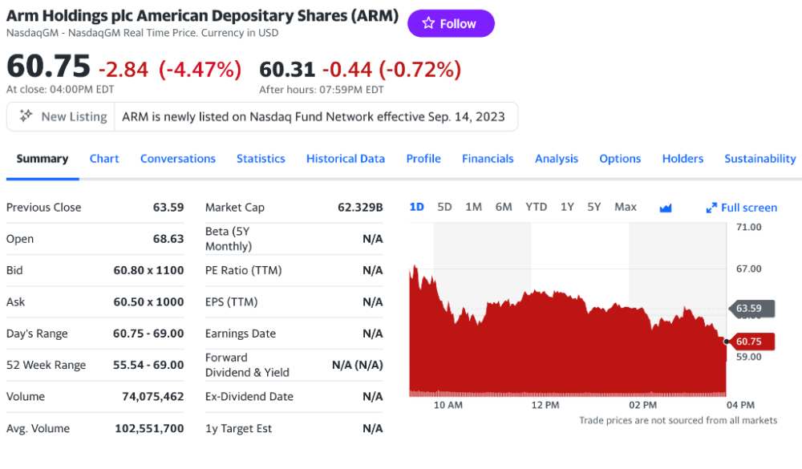

# IPO出场即巅峰？ARM能否撑起170倍的估值，要看收不收得动“高通税”

“不太赚钱”的Arm在上市后，市盈率已达到惊人的170倍，质疑声甚嚣尘上，软银高呼，Arm要用“高通税”的方式收费，未来营收将持续以两位数的速度增长，但能否真能如其所愿，新的定价模式下，效果又有多好或许还是个未知数。

周四，Arm成功在美上市，成了投资者们最关注的“新星”，上市首日即大涨25%，盘中涨幅一度达到的30%。但周五，Arm股价下挫，收跌4.47%，报60.75美元，市值达到了623.33亿美元。IPO“巨无霸”会遭遇出场即巅峰的困境吗？

Arm不太赚钱

ARM让全世界99%的智能手机都用上了自己设计的芯片架构，但却不太赚钱。

ARM营收来源主要分为许可费和版税，其中40％为许可费，版税收入约占营收的60％。

授权收入指的是，其他公司在用 Arm 的架构设计芯片时，需要给一笔授权费。而版税收入则是芯片厂商把芯片卖出去以后， Arm再进行抽成。

有媒体感叹，Arm的版税定价实在是低，可以称为“大慈善家”，按照 2019 年的数据， Arm平均一个CPU 的版税才 **16 美分（1.1元）。**

在2022年，基于ARM技术的芯片总价值达989亿美元，占了近一半市场份额。但ARM的版税收入只有16.8亿美元
，占芯片价值的1.7%。这也是其市场占有率高达99%，收入和利润规模却不是特别大的重要原因。

一方面，由于基于ARM架构产品大部分是MCU（微控制器），价格非常较为便宜；另一方面，ARM是从芯片价格中抽成，而非针对终端产品收费，因此带来的收入却并不高。

作为对比，高通的创收手段也是“收税”。以高通在2010年和苹果签的独占协议为例：高通每年支付苹果10亿美元，换取iPhone的独家供应权；但苹果向高通支付专利费：
**每台苹果手机售价的5%。**

**看到了高通的“赚钱路子”，Arm也眼馋了，宣布征收“高通税”。**

Arm想涨价赚钱

在手机领域，有一个著名的“高通税”（Qualcomm
Tax），指的是高通的专利收费，不是按照手机使用的专利数量、价值等来计算的，而是根据手机价格按照一定比例来算的，
**手机价格贵，收的费就高，手机便宜，收的费就低** 。

而这种收费模式，一直备受争议，因此高通也曾被多个国家的反垄断机构调查和罚款，但高通的模式依然不变，因为这样可以利润最大化。高通公司正是通过入场费，芯片和专利许可等方式的高额收费，成就了在收入和利润上面的快速成长。

高通的定价模型是基于使用高通知识产权（IP）的整个设备的成本或售价的一定比例，而不仅仅是用于直接支持无线通信的组件。这意味着无论设备中是否包含了高通的无线通信技术，只要该设备使用了高通的任何IP，都会按照设备的整体成本或销售价格的一定百分比向高通支付许可费用。

显然，Arm看到了自己和高通市场地位的相似之处 **，2021年Arm便尝试采用类似的定价策略。**

2022年开始，Arm下了最后通牒，说是要彻底改变收费方式。从Arm变更授权模式后的收费来看，以前授权费是收芯片价格的1%-2%，现在改成了
**直接收终端产品价格的 1%** ，基本约等于涨了10倍。

保守估计，在排除了苹果手机外，Arm若直接针对终端收费，对于高、中、低端这三个细分市场将分别收取：12美元、6美元和3美元。
**这意味着，对于非苹果的高端智能手机，一年内Arm将获得额外的54亿美元的营收。**

有分析师认为，Arm在架构领域的主导地位让其拥有可以灵活执行各种战略的能力，收“高通税”的战略可以让Arm提高针对终端收取的销售额，但前提是Arm这一定价策略会被市场接受。

会有人买单吗？

Arm在移动端当前不可撼动的地位来自“生态”：即有多少下游客户愿意采用Arm架构设计芯片。如果Arm的“税率”太高，促使下游的芯片公司铁了心寻找新的架构方案，或许就会有大量客户离开。

从2022年，Arm与高通的起诉案便可看出，大客户已经对Arm生态有所忌惮：Arm指控高通未经许可使用Arm的知识产权，因是高通曾在2021年收购一家名为NUVIA（从事Arm架构CPU开发）。收购完成后，Arm希望与高通针对NUVIA产品重新签订授权协议以增加收费，高通显然不愿意。

两大巨头各执一词，Arm一度威胁高通将终止所有许可协议。尽管并且付诸实践，但这显然使得高通以及Arm所有的大客户，都开始对其有所忌惮。

业内人士分析，涨价会加速让ARM的一些合作伙伴，逃离ARM生态，转而拥抱X86、RISC-V等生态。

开源免费的RISC-V架构正虎视眈眈，不断尝试切入ARM的既有客户之中。

RISC-V架构凭借开源、精简、模块化的优势，成为芯片架构领域的“新秀”。RISC-
V的开源性质吸引了众多企业的关注，尤其对于小公司和初创企业而言，可以更容易获得芯片设计授权，从而降低成本。

ARM也在招股书中提到， **我们的许多客户也是RISC-V架构及相关技术的主要支持者** 。如果与RISC-V相关的技术不断发展，市场对RISC-
V的支持增加，我们的客户可能会选择使用这种免费的开源架构，而不是我们的产品。

根本上而言，ARM赚不了大钱，可能是因为产业链话语权不足。有分析指出，整个产业链中，最赚钱的还是控制软件生态的芯片公司，它们直接决定了某款芯片在市场上有多大竞争力。

ARM一直都处在中立的位置，架构标准对各大企业开放授权，导致其地位并不稳固。反观其竞争对手英特尔，不但设计IP，还拥有自己芯片工厂，并通过与Windows形成Wintel联盟来垄断生态，从而掌握产业链话语权。

