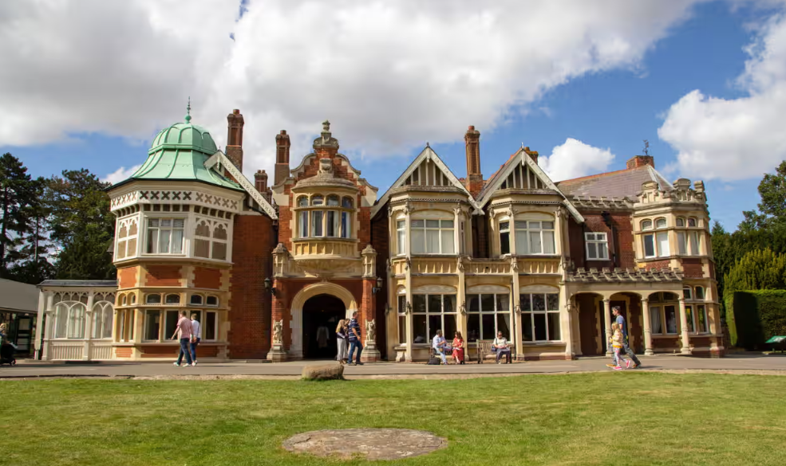

# “英国因间谍风险考虑限制中方参加AI峰会”，中方已多次驳斥

【环球网报道 记者
索炎琦】英方一些人又开始纠结了。英国《卫报》15日再度炒作“中国间谍风险”，宣称随着对北京“间谍活动”的担忧加剧，苏纳克政府在考虑只允许中方参加将于11月初在英国举办的人工智能（AI）峰会中的“一半活动”。对于所谓“中国间谍”问题，中方已多次驳斥，相关案件完全是英方的无中生有和自导自演。

据《卫报》介绍，唐宁街方面已经邀请中方参加首届人工智能峰会。峰会为期两天，将于11月1日-2日在位于伦敦西北的布莱奇利公园举行。

_位于伦敦西北的布莱奇利公园 资料图 图源：《卫报》_

随后，这家英媒便提到近来被英方炒作的“中国间谍”案，称一名英国议会研究员因涉嫌为中国从事“间谍活动”而被捕，因此英国邀请中国参加人工智能峰会的决定受到批评。报道援引消息人士的说法称，英国政府目前考虑的一个办法是“仅允许中国官员参加两天峰会中的第一天活动”。

尽管中方已多次批驳，在英国当前持续渲染“中国间谍风险”的背景下，英媒作出上述“爆料”似乎并不奇怪。此外，值得注意的是，在英国早前筹办人工智能峰会之际，英媒似乎就开始关心“请不请中国”这个问题了。

当地时间6月7日，英国首相办公室发布公告称，英国将主办首届人工智能峰会，以应对人工智能快速发展带来的挑战和机遇。首届AI峰会的消息一发出，就有英国媒体围绕是否邀请中国参会开始讨论。英国《每日邮报》援引不具名英国官员言论称，中国人工智能产业规模庞大，应该被邀请参会。但英国《金融时报》认为，由于唐宁街强调了志同道合的盟友，中国可能被“排除在外”。此外，英国政坛一些反华政客也借题发挥，炒作“中国科技威胁”。

《卫报》援引消息人士的话称，预计受邀参加本届人工智能峰会的人员包括多国政府首脑、科技行业高管和民间代表。法国总统马克龙、加拿大总理特鲁多以及欧盟委员会主席冯德莱恩等人预计出席该活动。美国总统拜登将不会出席，而由副总统哈里斯代为参加。美国亿万富翁马斯克也可能参加。

对于英国议会近来讨论的所谓“中国间谍”案以及相关英媒报道，9月15日，中国驻英国使馆发言人发布公告，英方炒作的所谓“中国间谍”案完全是无中生有，自导自演。中方已向英方提出严正交涉，予以强烈谴责。此事表明，英国某些政客已陷入一种令人惊讶的反华妄想症。他们针对中国进行的毫无依据诬蔑指责，是为了掩盖自己在解决英国国内政治经济社会问题上的无能和败绩，转移公众视线。

“我要强调，中英关系必须建立在相互尊重、互不干涉内政、平等互利原则基础上。我要正告英方，中方绝不接受英方针对中国的无端指责和恶意诬蔑！如果英方还想同中国开展合作，就必须立即制止这场连英国公众都深恶痛绝的政治丑剧！”发言人说。

9月15日中国外交部例行记者会上，发言人毛宁就所谓“中国间谍”问题表态。毛宁说，中方此前已经阐明了在有关问题上的立场，所谓中国对英国进行间谍活动的说法毫无根据。中方没有兴趣也不会干涉别国内政。

