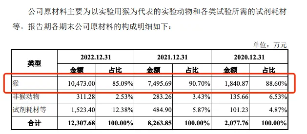
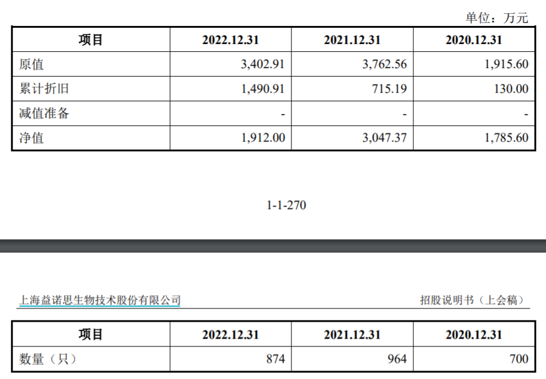

# 实验用猴撑起半边天？国药集团旗下益诺思拟IPO冲刺科创板

据招股书，2020-2022年，益诺思涉及使用实验用猴的业务产生的收入分别为1.17亿元、2.6亿元和 4.1亿元人民币，占主营业务收入的比例分别为
35.12%、44.77%和 48.00%，呈逐年提高态势。

9月13日，上海益诺思生物技术股份有限公司（以下简称“益诺思”）在上海证券交易所（以下简称“上交所”）科创板IPO（首次公开募股）首发过会，公司拟募资16亿元人民币。

_益诺思募股情况。图片来源：招股书_

益诺思成立于2010年，2017年成立股份公司，国药集团是其实控人。招股书显示，截至招股说明书签署日，国药集团直接持有发行人622.3318万股股份，占发行人总股本的5.8858%，同时国药集团通过其下属全资子公司医工总院和国药投资间接持有发行人3966.6044万股，占发行人总股本的37.5147%，合计持有公司43.4005%的股份，实际支配的股份表决权超过30%，为公司实控人。

招股书显示，益诺思给自身定位于专业提供生物医药非临床研究服务为主的CRO（Contract Research
Organization，合同研究组织）企业。非临床研究是公司业务发展的基础，是公司主营业务收入的最主要的组成部分，其中包括非临床安全性评价、非临床药代动力学研究、非临床药效学研究，均占主营业务收入的90%以上。

而在非临床安全性评价服务中，需要选择相关的实验动物种属及动物模型，进行非临床安全性研究。其中，可选择的动物种属主要包括：大鼠、小鼠、兔、犬、猪、以及非人灵长类（食蟹猴、恒河猴、狨猴）动物等。

 _实验用猴是益诺思开展业务的主要原材料。图片来源：招股书_

实验用猴是益诺思开展业务的主要原材料。据招股书，2020-2022年，公司涉及使用实验用猴的业务产生的收入分别为1.17亿元、2.6亿元和
4.1亿元人民币，占主营业务收入的比例分别为 35.12%、44.77%和 48.00%，呈逐年提高态势。

价格方面，2020年、2021年及2022年，益诺思实验用猴的采购单价分别为2.73万元人民币/只、5.53万元/只及10.78万元/只，翻了数倍。招股书显示，截至2022年底，益诺思账面上共有874只恒河猴。

_益诺思生产性生物资产恒河猴的具体明细。图片来源：招股书_

不少网友表示：“这是靠实验猴撑起的IPO。”据澎湃科技此前报道，中国的实验猴供给量主要靠“自养”和从东南亚“引种”两种途径保证，所谓“引种”，就是把外地或国外的新猴种引入当地，与当地猴群交配，以保持猴群的高质量发展。在新冠大流行期间，进出口野生动物受阻，而全球快速发展的生物医药产业又增加了对实验猴的需求，在此背景下，实验猴价格曾一度涨到20多万元/只。

由此，为了生存的CRO企业，开始通过参股、收购、签订长期协议等方式争夺猴资源。2020年，医药界头部CRO企业药明康德收购广东春盛猴场，成为国内食蟹猴饲养存栏量最大的企业之一；2021年，康龙化成分别以1.1亿元人民币和2.06亿元人民币，接连收购肇庆创药生物科技有限公司50.01%控股权、安凯毅博（湛江）生物技术有限公司（原康瑞泰（湛江）生物）100%股权。

2021年，益诺思收购了安徽省盛鹏实验动物科技有限公司（以下简称“安徽盛鹏”）。这是一家成立于2015年11月，受安徽省林业厅批准的实验动物饲养公司。

但这起收购并不算完全顺利。据招股书，在收购时，益诺思与安徽盛鹏就部门实验用猴的价格并未达成一致，争论的结果是：剩余300只实验猴仍归安徽盛鹏所有，但暂时将饲养权交予黄山益诺思，由安徽盛鹏支付这批猴子的饲养费用。企查查显示，黄山益诺思是益诺思子公司，安徽盛鹏是其第二大股东，持股30%。

_黄山益诺思设立时的股东及出资结构。图片来源：招股书_

此外，益诺思还通过股权绑定供应商，益诺思的上游实验猴供应商华珍合伙、金港生物（国家实验灵长类种质资源中心海南基地）在IPO之前都成为了公司的新股东，分别持有2.94%和0.88%的股份。

据悉，大型CRO企业收购头部猴场，锁定大批的优质实验猴，导致目前还在市面流通的实验猴质量有所降低。同时，还有超卖问题。比如根据某企业的猴子生产量，一年只适合售卖1000只猴子，但为了满足客户需求，很多猴养殖企业近几年会扩大约50%的销售比例，还会出售用来引种的种猴。

据中国政府采购网2023年4月公布的《中国食品药品检定研究院食蟹猴采购项目中标公告》，该批食蟹猴的预算采购价为2240万元人民币。最终，120只食蟹猴的中标价格为2040万元人民币，食蟹猴单价为17万元/只。此前，根据中国政府采购网“中国食品药品检定研究院实验用食蟹猴采购项目”2022年公布的结果，两次采购食蟹猴的价格分别为18.4万元/只和19.4万元/只。而在2020年的项目公示中，采购400只实验用食蟹猴的预算金额为1200万元，即每只3万元。

不过到2023年上半年，猴价开始下跌，可能会对益诺思及其所处行业的涉猴业务收入产生一定影响。招股书中，益诺思也提到，实验用猴价格自2023年年初高点回落后，进入一个相对平稳并略有波动的状态。除猕猴类原材料以外，公司其他实验动物采购单价呈现小幅上涨趋势。若未来以实验用猴为代表的主要原材料价格出现大幅波动，将会对公司的生产经营造成不利影响。

上交所在问询函中，也屡次提到了关于业务增长的可持续性问题。据益诺思回复函，截至2023年6月底，食蟹猴价格基本稳定在12万元/只左右，恒河猴价格基本稳定在9万元/只左右，分别较2023年初的15万元/只、10万元/只，下降了20%、10%左右。

随着实验用猴的价格下降，如何对冲和控制生物资产减值风险，成为包括益诺思在内的多家CRO公司的新课题。

此前，在A股上市的CRO公司北京昭衍新药研究中心股份有限公司，在2023年的半年报内披露：公司持有的生物资产实验用猴的公允价值变动带来的净损失，约为人民币1.77亿元至1.89亿元。

