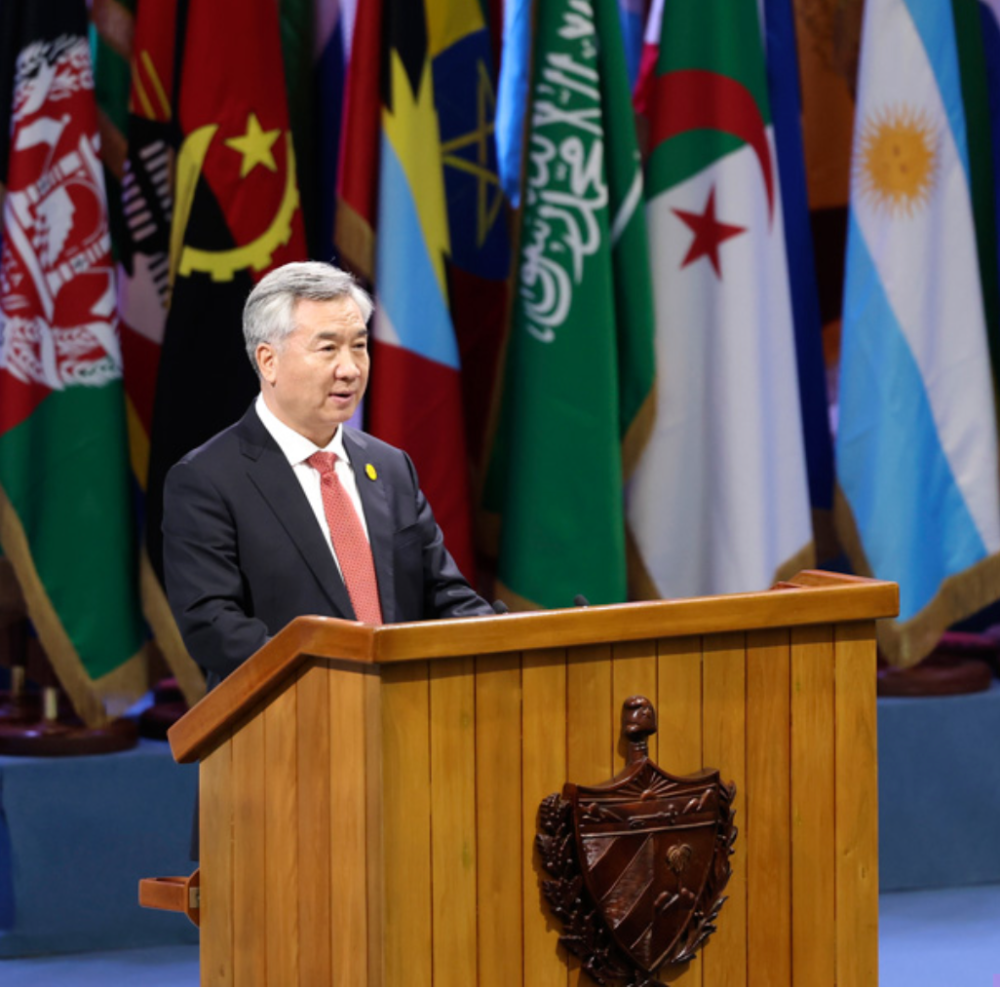

# 李希履新后首次以这一身份出国，有重要背景

**撰文 | 高语阳**

当地时间9月15日，中共中央政治局常委、中央纪委书记李希在古巴哈瓦那出席“77国集团和中国”峰会并发表致辞。

这次是李希履新后首次出国参加活动，而且，他还有一个身份——“习近平主席特别代表”。

重要背景

据新华社消息，这次峰会由“77国集团和中国”轮值主席国古巴举办，主题为“当前发展面临的挑战：科学、技术和创新的作用”。

巴西、委内瑞拉等约30个国家的国家元首或政府首脑、多名国际和区域组织负责人及近100个国家的高级别代表团参加会议。古巴革命领袖劳尔·卡斯特罗出席会议。

77国集团成立于1964年，是由发展中国家组成的政府间国际组织，旨在加强团结合作以加速发展中国家经济社会发展进程。

**中国不是77国集团成员，但一贯支持该组织正义主张和合理要求。自上世纪90年代以来，中国同77国集团关系在原有基础上有了较大发展，通过“77国集团和中国”这一机制开展协调与合作。**

**“77国集团和中国”目前是世界最大的发展中国家合作组织，有130多个成员国。**

去年9月23日，“77国集团和中国”在纽约举行会议，古巴当选该组织2023年轮值主席国。

古巴外交部长布鲁诺·罗德里格斯当天公开表示，古巴是第一次当选该组织轮值主席国，这是“巨大的责任”和“至高荣誉”。

今年8月23日下午，国家主席习近平在约翰内斯堡出席金砖国家领导人会晤期间会见古巴国家主席迪亚斯-卡内尔。蔡奇、王毅等参加会见。

**习近平强调，“77国集团和中国”是发展中国家重要合作平台。** 古巴作为今年“77国集团和中国”主席国，为加强发展中国家团结作出积极贡献。
**中方高度重视并支持古巴下个月成功主办“77国集团和中国”峰会，愿同古巴和其他77国集团成员一道，更好维护发展中国家的共同利益和发展权利。**

迪亚斯-卡内尔则表示，古方愿同中方密切合作，推动“77国集团和中国”峰会取得成功。

履新后首次出国参加活动

新华社9月12日消息，应77国集团2023年主席国古巴国家主席迪亚斯—卡内尔邀请，
**国家主席习近平特别代表中共中央政治局常委、中央纪委书记李希将于9月14日至16日出席在哈瓦那举行的“77国集团和中国”峰会。**

此外，应古巴共产党，巴西政府和劳工党，埃及祖国未来党主席、参议长阿卜杜拉齐格邀请，
**中共中央政治局常委、中央纪委书记李希将于9月16日至26日率中共代表团对上述三国进行正式友好访问。**

李希于去年10月出任中共中央政治局常委、中央纪委书记。 **这次是李希履新后首次出国参加活动。**

李希在“77国集团和中国”峰会表示，当今世界正在经历百年未有之大变局，发展中国家力量不断壮大，南南合作为维护发展中国家群体性崛起势头、推动世界经济稳定增长发挥日益重要作用。

与此同时，单边主义、霸权主义依然甚嚣尘上，特别是个别国家大搞单边制裁、脱钩断链，严重损害发展中国家正当发展权益和空间。

**李希指出，中国愿同古巴和其他77国集团成员一道，共筑全球南方命运共同体，同创共同发展的新时代。**

“永远是全球南方国家的一员”

李希提到的“全球南方”是一个重要概念。

政知君注意到，国家主席习近平8月22日向约翰内斯堡金砖国家工商论坛闭幕式发表致辞时说， **作为发展中国家、“全球南方”的一员，**
中国始终同其他发展中国家同呼吸、共命运，坚定维护发展中国家共同利益，推动增加新兴市场国家和发展中国家在全球事务中的代表性和发言权。

此外，8月24日，习近平在金砖国家同非洲国家及其他新兴市场和发展中国家领导人对话会上宣布，
**中方已经成立总额40亿美元的全球发展和南南合作基金，中国金融机构即将推出100亿美元专项资金，专门用于落实全球发展倡议。**

“全球南方”源自“南方国家”，是新兴市场国家和发展中国家的集合体。一般认为，“全球南方”通常泛指拉丁美洲、亚洲和非洲等地区，由于在地理范围上大多位于南半球而得名。

中国网7月发文写道，去年以来，美西方国家将“全球南方”的概念政治化、工具化，处心积虑地将中国等国家排除在外，对“全球南方”进行分化瓦解，在“全球南方”大搞阵营对抗。

对此，中国坚定维护自身“全球南方”定位，坚决维护广大“全球南方”国家利益。

今年7月10日，中共中央政治局委员、中央外办主任王毅在全球共享发展行动论坛首届高级别会议上表示，
**中国是世界上最大的发展中国家，是全球南方阵营的当然成员。**

7月25日，王毅在约翰内斯堡出席金砖国家安全事务高级代表会议时表示， **“全球南方”国家面临抵制外部干预渗透、维护政治安全和政权安全的重要使命。**

“我们要保持战略定力与自信，坚定不移走好自己的路，在涉及彼此核心利益和重大关切问题上相互支持，以实际行动回击一切挑拨金砖团结、抹黑金砖合作的杂音。”

在9月15日召开的“77国集团和中国”峰会上，李希指出，
**中国是世界上最大的发展中国家。不论中国发展到什么程度，都将永远是发展中国家大家庭的一员，永远是全球南方国家的一员。中国始终将南南合作作为对外合作的优先方向。**

同时，李希说，中国愿同77国集团成员密切沟通协调，优化发展资源投入，发挥共建“一带一路”倡议等公共产品最大效能，破解发展难题。

“积极响亮发声、主持公道”

“中国同广大发展中国家都曾走过争取民族独立解放的艰辛历程，都有让人民过上更美好生活的强烈愿望，始终同呼吸、共命运，相互扶持、共同发展，早已成为休戚与共的命运共同体。”

李希在“77国集团和中国”峰会上表示，只要我们顺应时代潮流，加强团结、友谊、合作，相互支持彼此走符合本国国情和特色的现代化道路，就一定能够更好维护发展中国家的共同利益，提升在全球治理体系中应有的话语权，实现共同发展、共同繁荣，为全球和平与发展事业注入更多稳定性和正能量。

李希就77国集团和中国合作提出三点建议：

一是坚守独立自主、联合自强的初心， **坚决反对集团对抗和冷战思维** ，坚持以和平方式解决国家间分歧和争端，共同守护世界和平安宁；

二是弘扬公道正义、平等包容的精神， **在联大等重要国际场合积极响亮发声、主持公道，**
推动联合国各项议程符合发展中国家发展利益，敦促发达国家切实履行发展援助承诺， **扩大发展中国家的话语权和代表性；**

三是践行发展振兴、合作共赢的使命，合力重振全球发展伙伴关系，培育各国发展新动能，围绕粮食安全、减贫、工业化、绿色发展、数字科技、人工智能等开展合作，构建开放包容、互利互惠的南南科技合作体系，促进各国平等享有数字红利，
**让发展中国家在新技术新产业发展中不掉队、不缺位。**

**资料 ｜ 新华社 中国网 人民日报 央视新闻**

**【版权声明】本文著作权归政知新媒体独家所有，未经授权，不得转载。**

