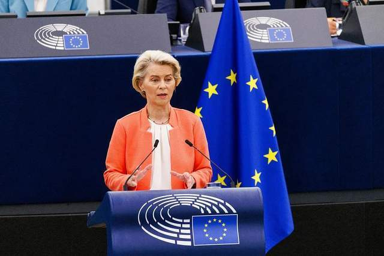
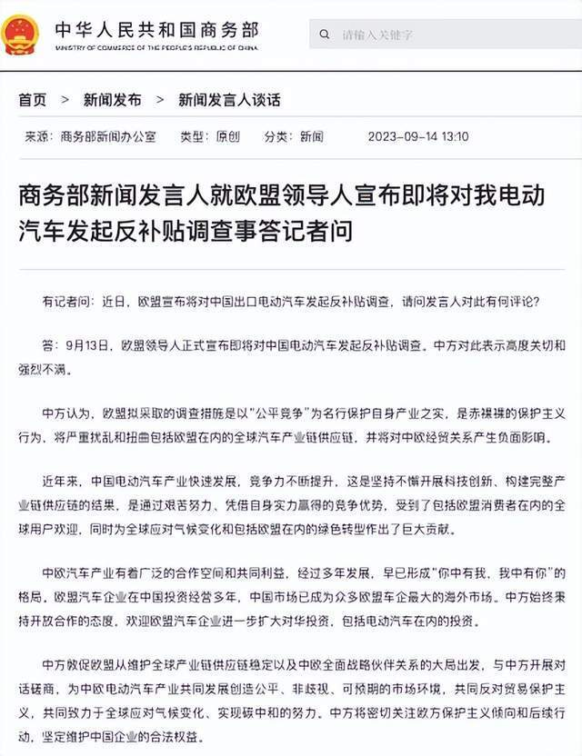

# 欧盟急了，因中国电动车太便宜？

这一次，欧盟真的急了。

“全球电动车市场充斥着平价的中国汽车，它们的价格之所以低，是因为获得了巨额的国家补贴，而这正在扭曲我们的市场。”

_欧盟委员会主席冯德莱恩 图/视觉中国_

近日，欧盟委员会主席冯德莱恩（von der Leyen）在欧洲议会发表第四次“盟情咨文”时表示，欧盟委员会将启动一项针对从中国进口的电动汽车的反补贴调查。

冯德莱恩强调，“我们必须对面临的风险保持清醒的头脑。”

对此，商务部新闻发言人9月14日回应称，中方对此表示高度关切和强烈不满。中方认为，欧盟拟采取的调查措施是以“公平竞争”为名行保护自身产业之实，是赤裸裸的保护主义行为，将严重扰乱和扭曲包括欧盟在内的全球汽车产业链供应链，并将对中欧经贸关系产生负面影响。

_商务部网站截图_

“这说明中国的新能源汽车产业已经到了一定的高度。”欧洲宁波总商会会长、意大利中央政府中国事务特别工作小组成员李永平向中国新闻周刊表示，“目前在新能源汽车市场，除了特斯拉基本上就是中国的汽车品牌。我们质优价廉的产品大量出售到海外，引发一些海外人士担忧。”

岚图汽车CEO卢放向中国新闻周刊表示，这件事本质上是大量中国电动车出海欧洲，让欧洲车企有了压力。“因为他们在电动化、智能化方面离中国汽车有一定的差距，产生了焦虑，就向政府施压，要求政府做出一些动作。”卢放认为，从竞争和商业的角度来看，“反补贴调查”都是政策干预，不是很好的解决问题的办法。“他们应该去思考，怎么像中国一样进行再发展。过去十几年，中国的汽车产业不仅积累了整车（研发制造）的优势，我们还有人才优势、产业链的优势，这是一套体系。如果欧洲想和我们竞争的话，要想办法构建自己的体系。”

**来自中国的“威胁”**

事实上，欧盟将大棒挥向中国电动汽车，并不令人意外。

所谓“反补贴调查”，是指一国政府或国际社会为了保护本国经济健康发展，维护公平竞争的秩序，或者为了国际贸易的自由发展，采用贸易制裁的主要手段，针对补贴行为而采取必要的限制性措施，包括临时措施、承诺征收反补贴税。

据了解，此项调查可能需要长达13个月的时间来完成，最终决定除了对中国自主品牌汽车产生影响，还有可能波及在中国制造的非中国品牌车型，如特斯拉、雷诺和宝马等。目前，欧盟汽车的标准税率为10%。欧盟委员或将在未来13个月内决定是否征收高于这一标准的关税。

中汽协数据显示，今年1-8月，中国汽车出口已达到294.1万辆，同比增长61.9%。在前不久举办的慕尼黑2023年国际车展（简称IAA）上，德国总理奥拉夫·朔尔茨更是对德国车企表示：“你们应该被激励，而不是被（中国车企）吓到。”奥拉夫·朔尔茨还表示，“1980年代，人们说日本汽车正在超越所有其他市场；20年后，又担心韩国制造的汽车；今天，轮到中国的电动汽车。”

欧盟委员会认为，中国在欧洲售出的电动汽车的市场份额已经上升到8%，并有可能在2025年达到15%。这一快速增长的市占率是由中国电动车相较欧洲车型普遍存在20%左右的价格优势所致。

瑞士百达资产管理公司高级投资经理Evgenia
Molotova表示：“汽车行业对欧洲尤其敏感，因为它是一个提供大量就业机会的行业，遭到报复的风险一直存在。”

**中国电动车，太猛了**

乘联会秘书长崔东树坚决反对欧盟对中国新能源汽车出口的评价，他表示，中国新能源车补贴在2022年底已经完全退出，而且为了公平竞争，国家要求地方在2018年底开始就不能给新能源车补贴，规范市场秩序。

在崔东树看来，欧盟应客观看待中国电动汽车产业发展，而不是随意动用单边经贸工具来阻止或提高中国电动汽车产品在欧发展和经营成本。中国则应该积极应对，有理有据有节地应对调查，力争最好的结果。

尽管欧洲车企在过去几年时间里已经开始电动化转型，但大多数还是处于试水阶段。而中国车企则伴随新能源汽车市场规模的扩大快速成长，这也令欧洲车企感到前所未有的压力。

数据显示，2022年比亚迪以180.5万辆的销量位居国内乘用车企业销量冠军之位，终结了南北大众等合资企业长达40年霸榜的局面。今年上半年，一汽-
大众83.87万辆的销量成绩依然明显落后于比亚迪的115.46万辆。不仅如此，德系、日系等主流合资品牌在中国的市场份额也在逐渐下降，这让不少外资车企都感受到了压力。

价格方面，中国的电动车产品确实在欧洲拥有巨大的价格优势。Jato
Dynamics的研究表明，2022年上半年中国电动汽车平均成本不到3.2万欧元，而欧洲品牌的平均成本高达5.6万欧元。不过，这仅代表中国品牌电动汽车与欧洲品牌相比价格更低，而不代表价格低于在中国市场的售价。

卢放表示：“欧洲老百姓也希望用更低的价格买到更好的产品，不能通过这件事人为提高产品价格，让老百姓去买单。”

德国汽车研究中心(CAR)主任费迪南德·杜登霍费尔教授认为，保护主义总是会以失败告终。“如果欧盟真的对中国企业采取行动，将是一个很大的错误，中国的新车市场每年超过2000万辆，为了阻止每年只有75万辆左右的中国出口的汽车，损失一个千万辆级别的市场，得不偿失。”

**如何走好国际化？**

商务部新闻发言人在答记者问时表示，中欧汽车产业有着广泛的合作空间和共同利益，经过多年发展，早已形成“你中有我，我中有你”的格局。欧盟汽车企业在中国投资经营多年，中国市场已成为众多欧盟车企最大的海外市场。中方始终秉持开放合作的态度，欢迎欧盟汽车企业进一步扩大对华投资，包括电动汽车在内的投资。

事实确实如此，如大众汽车公司宣布投资10亿欧元在合肥建立电动汽车创新中心。随后，大众和其豪华子品牌奥迪分别宣布了与小鹏和上汽的合作决定。除大众外，欧洲第二大汽车集团斯特兰蒂斯也传出了与零跑的合作传闻。

而对于反补贴调查一事，即便是在欧盟内部，也有不同的声音。德国汽车工业协会代表认为，启动调查需要更谨慎的决策，因为必须要考虑到来自中国的反应。“德国汽车公司目前在中国投资巨大，与中国的贸易战可能使损失大过潜在的收益”。

李永平也认为，未来，中国汽车走出去不仅仅是产品走向海外，还要在海外建厂。“核心原材料、核心零部件还在中国，至少可以把组装工厂也开到东欧去，要以更加开放、包容的态度走向世界。”

卢放直言：“中国车企想要真正走进欧洲市场，甚至全球市场，就需要融入当地用户、政策、法规、生活环境中，也要参与到当地的经济发展中，为当地的老百姓创造一定的福利，这样可能是一条比较合理的路线。”

“汽车公司发展很难一步到位，都是从整车出口再到海外建厂，只有通过各种渗透才能到全球去。”零跑汽车创始人、董事长、CEO朱江明认为，“德系、日系渗透到中国也是要跟中国企业合作，不可能都是进口。中国车企还是要用各种模式出海。要不拘一格用各种方式获得市场份额，多种模式并存才有可能走向世界。”

目前，包括上汽、比亚迪、长城等头部车企已经在紧锣密鼓准备欧洲本地化生产，最早一批欧洲本地产品很可能在2025年下线。

中国车企走向海外的过程，必然面对种种考验。学会应对进军欧美发达汽车市场的种种难题，也是中国汽车企业崛起的必经之路。

作者：刘珊珊

编辑：郑宇

