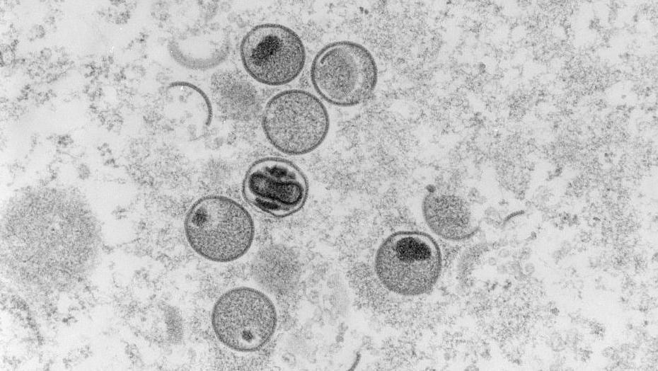

# 猴痘纳入乙类乙管是否意味着疫情有传播扩散风险？专家解读

9月15日，国家卫生健康委发布公告称，根据《中华人民共和国传染病防治法》相关规定，自2023年9月20日起将猴痘纳入乙类传染病进行管理，采取乙类传染病的预防、控制措施。

国家卫健委发布的政策解读指出，猴痘是由猴痘病毒感染所致的一种人兽共患病，其既往主要发生在中非和西非。2022年5月以来，全球100多个国家和地区发生猴痘疫情。多国疫情显示，猴痘已发生人际传播，并广泛传播到非洲以外的国家和地区，病死率约为0.1%。2022年9月我国报告首例猴痘输入病例，2023年6月开始出现本土猴痘疫情，目前全国20多个省份先后报告猴痘病例，引发新增本土续发疫情和隐匿传播。

国家卫健委提到，这次将猴痘纳入乙类乙管，是考虑到猴痘疫情将在我国一定时期内持续存在，是为进一步科学规范开展猴痘疫情防控工作。

猴痘正式纳入乙类乙管是否意味着猴痘疫情可能会传播扩散？对猴痘传染病民众如何防控？澎湃新闻采访了北京佑安医院感染综合科主任医师李侗曾和国家感染性疾病临床研究中心主任、深圳市第三人民医院院长卢洪洲。

专家表示，近期，猴痘在高风险人群可能会持续存在，病例数可能会有所上升。此次纳入乙类乙管，一方面使得管理猴痘的防控措施将更具有法律依据，所有防控部门、医疗部门的工作人员依法实施工作，更具有权威性和可实施性。另一方面猴痘患者也必须履行配合调查义务，同时也应获得个人隐私的法律保护。此外，专家提到，从猴痘的致病性、传播能力、易感人群来看，猴痘传染病目前不会对公共卫生造成很大威胁。

**猴痘为何正式纳入乙类乙管**

2020年10月，国家卫健委发布的《传染病防治法》修订征求意见稿提到，乙类传染病是指对人体健康和生命安全危害严重，可能造成较大经济损失和社会影响，需要采取严格管理，落实各项防控措施，降低发病率，减少危害的传染病。

《传染病防治法》修订征求意见稿中提到，国家建立传染病疫情报告制度。传染病疫情报告包括法定传染病疫情报告、具备传染病流行特征的不明原因聚集性疾病疫情报告和其传染病疫情暴发、流行报告。

其中，对乙类传染病患者、疑似患者和规定报告的传染病病原携带者在诊断后，应当于24小时内进行网络报告。医疗机构发现乙类或者丙类传染病患者，应当根据病情采取必要的治疗和控制传播措施。发现疑似呼吸道传染病患者的，应当引导至发热门诊进行筛查。

针对猴痘传染病，今年7月，国家疾控局、国家卫生健康委就曾印发关于《猴痘防控方案》的通知。其中规定，根据病例的不同情况分类实施医疗机构隔离治疗或居家隔离治疗。各地发现猴痘疑似病例和确诊病例后，应先及时转运至医疗机构进行隔离治疗，如病例临床症状明显好转，病变部位已结痂，可转为居家隔离治疗，直至皮疹结痂自然脱落，解除居家隔离。对病情较轻且具备居家隔离治疗条件的确诊病例，经医疗机构与疾控机构联合评估后，可直接采取居家隔离治疗。

猴痘为何此时纳入乙类乙管？北京佑安医院感染综合科主任医师李侗曾表示，我国从6月份开始出现本土病例，并且6、7、8月持续出现，且出现病例的地区越来越多，鉴于这种情况，猴痘可能在未来一段时间内会持续存在。尤其在高风险人群有可能还会持续存在，病例数近期可能会有所上升，所以需要一个长期制度明确下来。

国家感染性疾病临床研究中心主任、深圳市第三人民医院院长卢洪洲也表示，猴痘纳入乙类乙管，一方面使得管理猴痘的防控措施将更具有法律依据，所有防控部门、医疗部门的工作人员依法实施工作，更具有权威性和可实施性。另一方面猴痘患者也必须履行配合调查义务，同时也应获得个人隐私的法律保护。

**普通群众没有必要担心**

今年6-8月猴痘疫情监测情况显示，中国内地（不含港澳台）月新增报告猴痘确诊病例分别为106例、491例、501例。其中6月有6个省份出现猴痘确诊病例，7月猴痘确诊病例分散至23个省份，8月则有25个省份出现猴痘确诊病例，病例数呈上升趋势。

同时，今年8月的疫情监测情况显示，8月确诊的501例猴痘患者中首次出现5例女性，并出现除性接触以外的密切接触者发生感染。

那么，从猴痘的致病性、传播能力、易感人群来看，猴痘传染病目前会不会对公共卫生造成很大威胁？卢洪洲表示，猴痘的传播途径仍然是密切接触传播为主，尤其是同性行为人群的性接触传播被高度关注；其致病力并不大，全国目前尚未出现猴痘致死病例，本地区也尚未出现重症病例。“这意味着从猴痘的致病性、传播能力、易感人群来看，猴痘传染病目前不会对公共卫生造成很大威胁。”

在李侗曾看来，目前猴痘传染病还不会造成大范围传播，“目前猴痘主要还是经黏膜和破损的皮肤侵入人体。男男性行为更容易感染，异性的性接触也可以感染，但普通人群感染很少。目前，我们对猴痘病例的密接人员进行观察，发现基本上没有发生性接触，就不会被传染。”李侗曾提到，日常接触感染猴痘的风险是非常低的，普通群众没有必要担心。

“主要是重点人群，高风险人群要注意。”李侗曾表示，如果发现周围有猴痘患者或者发现有人症状像猴痘如出现发烧、疱疹，就尽量不和其发生皮肤的密切接触。另外，如果自身皮肤有伤口，外出时应该使用创可贴或者纱布等把伤口遮盖住，避免有裸露伤口接触他人。

