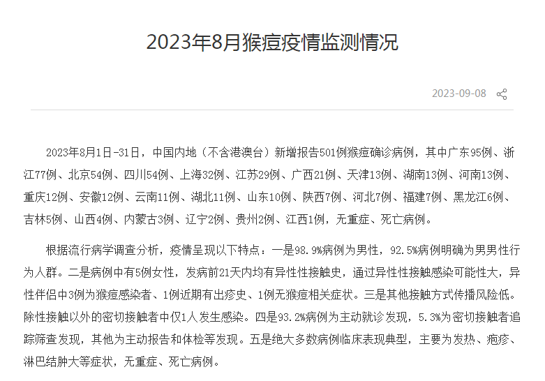
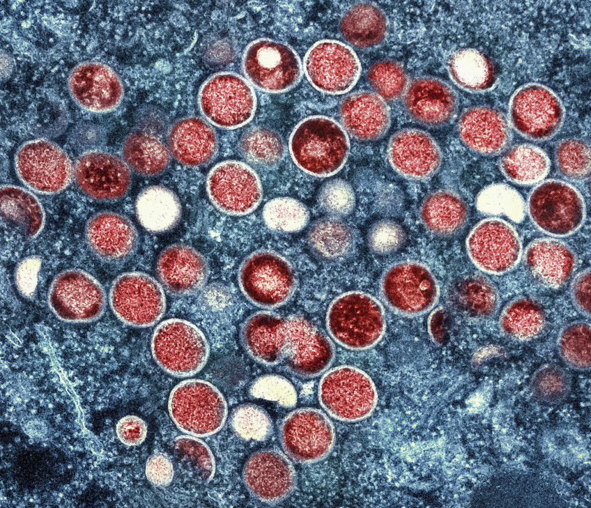

# 猴痘纳入乙类传染病管理后，普通人应如何防范？专家详解

9月15日，国家卫生健康委发布公告称，根据《中华人民共和国传染病防治法》相关规定，自2023年9月20日起将猴痘纳入乙类传染病进行管理，采取乙类传染病的预防、控制措施。

香港大学李嘉诚医学院生物医学学院教授、病毒学专家金冬雁接受红星新闻记者采访时表示，绝大多数人并不会得猴痘，它的传染性非常低，市民大众无需过虑。现在出于防患于未然的考虑，加之国际上现在对猴痘比较重视，因此将它列入乙类传染病管理。

**过去三个月内，本土猴痘病例累计已经超过千例**

据新华社报道，2022年5月以来，全球100多个国家和地区发生猴痘疫情。多国疫情显示，猴痘已发生人际传播，并广泛传播到非洲以外的国家和地区，病死率约为0.1%。2022年9月我国报告首例猴痘输入病例，2023年6月开始出现本土猴痘疫情，目前全国20多个省份先后报告猴痘病例，引发新增本土续发疫情和隐匿传播。

9月8日，中国疾病预防控制中心公布数据显示，2023年8月份中国内地（不含港澳台）新增报告501例猴痘确诊病例。此外，6月中国内地新增报告106例猴痘确诊病例，7月新增报告491例。过去三个月内，本土猴痘病例累计已经超过千例。

_▲中疾控猴痘疫情监测情况_

新华社报道称，根据国家卫生健康委发布的政策解读，国家卫生健康委、国家疾控局认真贯彻落实党中央、国务院决策部署，将猴痘作为新发突发传染病进行应对处置，充分发挥多部门协同防控的重要作用，不断完善防控政策措施，加强信息发布、宣传教育、重点人群干预和规范治疗，猴痘疫情防控工作取得积极成效。

据介绍，考虑到猴痘疫情将在我国一定时期内持续存在，为进一步科学规范开展猴痘疫情防控工作，切实保障人民群众生命安全和身体健康，国家卫生健康委决定，自2023年9月20日起将猴痘纳入《中华人民共和国传染病防治法》规定的乙类传染病进行管理，采取乙类传染病的预防、控制措施。

**此前已印发猴痘防控方案，专家：在特定人群中传播，公众不用过虑**

据了解，我国法定的传染病共有40种，其中甲类2种、乙类27种和丙类11种。《中华人民共和国传染病防治法》规定，乙类传染病主要包括传染性非典型肺炎、艾滋病、病毒性肝炎、脊髓灰质炎、人感染高致病性禽流感、麻疹、流行性出血热等。

金冬雁教授告诉红星新闻记者，猴痘的流行主要在一个特定的群组，就是男男同性恋中间，所以重点是去像防治艾滋病一样，在接触那些人群时做好防范。现在暂时研判它的危害性是比较低的，主要特点是传染性低，致病性也低。

 _▲电子显微镜下的红色猴痘颗粒 资料图_

金冬雁解释说，绝大多数人并不会得猴痘，它的传染性非常低，所以对于市民大众不需要过虑。过去猴痘没有在我国特定人群里面流行，现在出于防患于未然的考虑，加之国际上现在对猴痘也比较重视，因此将它列入乙类传染病。

此前的7月26日，国家疾控局、国家卫生健康委发布《关于印发猴痘防控方案的通知》（以下简称《方案》）。《方案》强调，针对重点人群、出入境人员和一般人群等不同人群分类开展宣传教育。《方案》专门制定了《重点人群宣传干预指南》，规定的策略为在现有艾滋病防治综合干预服务体系基础上，形成常态化艾滋病与猴痘综合防控一体化应对机制，综合运用行为学干预方法和手段，通过宣传教育、促进安全性行为、动员检测、外展服务、同伴教育和互联网干预等，从个体、群体和社会等多个层面为目标人群提供猴痘综合干预服务，并强调在工作过程中注意保护重点人群个人隐私。

**纳入传染病乙类管理意味着什么？专家：防控有法可依，医务工作者要及时诊断、报告**

首都医科大学附属北京佑安医院感染综合科主任医师李侗曾告诉红星新闻记者，国外的猴痘流行已经一年了。今年6月，我国出现了本土猴痘病例，从6、7、8三个月的经验来看，猴痘可能会长期存在。猴痘的高风险人群主要就是男男性行为人群当中，发生猴痘病例的地区越来越多。

李侗曾说，考虑到这个病有可能会长期地散发，短时间内为利于国家规范管理，国家卫健委把它正式纳入到法定传染病里，并且按照乙类传染病来管理。这意味着以后就有法可依了，要求医务工作者及时地诊断、报告。因为猴痘现在是法定传染病，就要按照规定的流程去上报，相关的疾控部门、当地政府也要配合进行流调管理，防止疫情扩散，尽量切断传播链，不要让它再持续扩散。

根据《方案》，县（市、区）级疾控机构接到辖区疑似病例和确诊病例报告后，及时组织开展流行病学调查，查找感染来源，掌握、追踪和管理密切接触者，分析传播链及传播特征，及时发现潜在的风险人群及其范围、特征，有针对性地开展宣传教育和综合干预。

那么，普通人应该如何防范猴痘？李侗曾解释说，如果确实需要去探视一些有发烧、有疱疹的猴痘病例的时候，一定要提前了解。原则上要求大家不去探视猴痘的病例，因为猴痘疱疹液有传染性。如果自己有伤口、皮肤破损，在接触猴痘病例的时候还是有风险的，所以如果有伤口要外出的时候一定要用创可贴或者纱布覆盖上。此外，尽量不和一些健康不明的人发生密切的接触。

红星新闻首席记者 吴阳 实习生 蔡君安

编辑 张寻 责编 任志江

