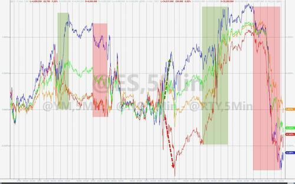
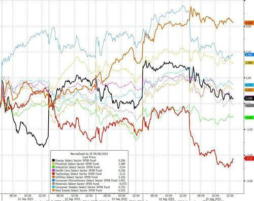
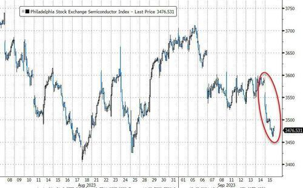
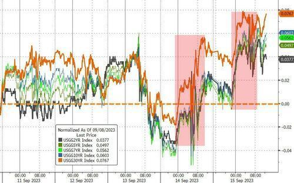
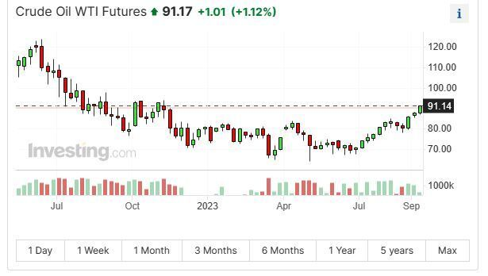
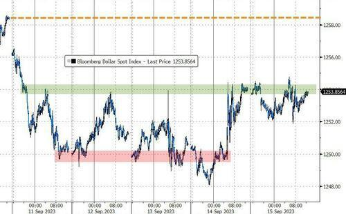
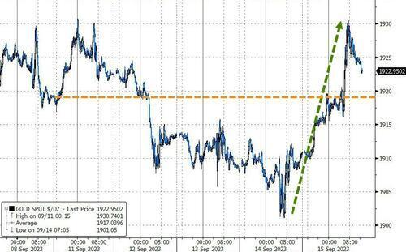

# 美股收盘：四巫日标普纳指跌超1%且连跌两周，芯片股重挫

美国通胀数据好坏参半。在能源成本上涨的推动下，8月进口价格环比增0.5%超预期，出口价格涨1.3%，均创一年多最高。而美国9月密歇根大学消费者信心指数初值超预期降至67.7，一年期通胀预期降至3.1%，创2021年1月来新低，五年期通胀预期降至2.7%创2020年底来最低。

再结合本周前期发布的美国8月CPI和PPI数据，均显示出核心通胀正在放缓，市场仍普遍认为下周美联储不会加息，对11月加息25个基点的押注从一周前的约44%降至不足33%。

同时，美国9月纽约州制造业指数意外扩张，从前值-19骤然升至正值1.9，新订单指标大幅回升，但支付和接收价格指数也有所反弹，显示通胀压力挥之不去。美国8月工业产出环比增0.4%，弱于前值1%但远高于预期的0.1%，衡量潜在产出的产能利用率也略超预期反弹至79.7%。

在昨日连续第十次加息后，欧洲央行行长拉加德重申欧洲央行没有在讨论降息。但对年底之前是否还继续加息，欧央行票委内部明显存在分歧。欧元集团主席Donohoe警告称，欧元区经济明显失去了一些动能。交易员们押注最早从明年6月起欧央行当年会降息约75个基点。

不过，交易员们还是将12月欧央行加息的可能性从前一天的20%小幅提升至30%。拉脱维亚央行行长称，若通胀未能按预期下降，仍有可能再次加息。另一管委也称12月会议是关键。但法国财长勒梅尔敦促欧洲央行不要继续加息。德银不排除未来一年利率存在上行风险。

标普、纳指、小盘股齐跌超1%，道指全周累涨，标普纳指连跌两周，芯片股周五重挫

9月15日周五，美股集体低开低走，并在午盘触及日低。科技股居多的纳指在开盘半小时便跌1%，开盘近一小时道指跌超百点，芯片指数跌1.7%。标普可选消费和科技板块均跌超1%。

道指最深跌超330点或跌约1%，午盘时标普11大板块全线下挫，科技板块跌近2%领跌，可选消费、能源和电信均跌超1%。芯片指数最深跌3.4%，纳指跌1.7%，纳指100跌300点或跌1.9%。

**最终，美股均收于日低附近，标普大盘、纳指和罗素小盘股齐跌超1%，** 道指跌近290点：

道指几乎抹去周三以来涨幅，脱离昨日所创的一个月高位，标普和纳指均创8月28日以来的近三周新低，罗素小盘股下逼周三所创的两个半月最低。

全周道指勉强累涨0.12%，在三周里第二周上涨，标普和纳指则分别累跌0.16%和0.39%，为连续第二周累跌。不过非必需消费品板块周内领涨，归功于特斯拉和亚马逊表现优异。

标普500指数收跌54.78点，跌幅1.22%，报4450.32点。道指收跌288.87点，跌幅0.83%，报34618.24点。纳指收跌217.72点，跌幅1.56%，报13708.33点。纳指100跌1.8%，罗素2000小盘股跌1.1%，“恐慌指数”VIX盘中涨10%并升破14，脱离三年半低位。

 _标普大盘、纳指和罗素小盘股齐跌超1%，道指跌近290点_

 _科技板块本周表现最差，防御型的公用事业领跑，能源变动不大_

周五还恰逢四巫日（Quadruple witching
day），即美国股市于每年3月、6月、9月和12月的第三个星期五为衍生性金融商品到期结算日，期间的市场价格波动较大。

**明星科技股齐跌** 。元宇宙”Meta跌3.7%至一周新低，脱离五周高位；iPhone
15系列机型正式开启预购的苹果跌幅收窄至0.4%，接近四周低位；亚马逊跌3%至一周最低，周三曾创去年4月来最高；微软跌2.5%也至一周新低，脱离一个半月最高；奈飞跌近1%至三个半月最低；谷歌A跌0.5%，脱离17个月最高；特斯拉跌0.6%脱离两个月高位，但全周仍累涨超10%。

**芯片股跌幅较深。**
费城半导体指数跌3%，失守3500点至四周最低。英特尔跌2%至一周半最低，周二曾创去年7月来最高；AMD跌近5%至四个月最低，英伟达跌3.7%至四周最低。、

_费城半导体指数跌3%，失守3500点至四周最低_

台积电美股跌2.4%至四个月最低，有报道称台积电要求供应商推迟交付高端芯片制造设备，理由是经济状况和终端市场需求疲软，芯片设备股ASML和应用材料跌4%、KLA和拉姆研究跌5%。

今年美股最大IPO、昨日新晋上市的英国芯片设计公司Arm早盘高开8.5%至历史盘中最高69美元，市值一度突破720亿美元，昨日曾收涨超24%。该股交投颇为震荡，盘前涨超10%后又转跌近1%，最终收跌4.5%至日低60.75美元，市值站稳620亿美元上方，上市以来累涨19%。

不乏有分析师认为Arm的估值过高，基于过去12个月的市盈率接近170倍，甚至超过了盈利能力更强的行业巨头英伟达，后者估值为市盈率109倍。券商Needham对Arm评级“持有”，认为在后智能手机时代，其估值看似在IPO当时便已得到充分体现，不足以支撑继续上涨。

**AI概念股齐跌** 。C3.ai跌3 %至近四个月最低，Palantir Technologies跌超3 %至一周新低，脱离月内高位，
SoundHound.ai跌1%至五周最低，但BigBear.ai转涨超2%脱离月内最低。有报道称，由于AI应用货币化前景不明，Adobe、Salesforce和Zoom都“小心翼翼”，不敢效仿微软“大涨价”。

**热门中概追跌美股大盘：**

ETF KWEB跌0.7%，CQQQ跌约1%，纳斯达克金龙中国指数（HXC）跌0.7%，仍站上6800点，进一步脱离上周五所创的两周低位。

纳斯达克100成份股中，京东跌0.5%，百度跌1%，拼多多涨0.4%。其他个股中，阿里巴巴跌和B站跌1%，腾讯ADR跌1.6%，蔚来汽车涨0.5%，理想汽车涨近2%后微跌，小鹏汽车涨0.2%。

腾讯混元大模型首批通过备案，将陆续对公众开放。蔚来新版智能电动轿跑SUV
EC6上市，起售价35.8万元，比去年EC6降价。名创优品去年营收超114亿元，拟回购不超过2亿美元。

**银行股指齐跌0.6%。**
昨日涨1.7%的行业基准费城证交所KBW银行指数（BKX）脱离一个月最高，5月4日曾创2020年10月以来最低。KBW纳斯达克地区银行指数（KRX）脱离一周高位，5月11日创2020年11月来最低；SPDR标普地区银行ETF（KRE）也脱离一周新高，5月4日创2020年10月来最低。地区银行Keycorp逆市涨0.6%，Piper
Sandler上调评级至增持。

**其他变动较大的个股包括：**

多媒体软件开发商Adobe跌超4%至三周最低，二季度营收和盈利超预期，前瞻指引也符合预期，高盛和美国银行维持买入评级，但摩根大通认为经济不利和200亿美元收购Figma的溢价很高。

美国最大廉价健身连锁Planet Fitness跌近16%至三年最低，董事会意外罢免任职十年的CEO。

福特汽车微跌，通用汽车涨近1%，斯特兰蒂斯（Stellantis）涨超2%。全美汽车工人联合会开启对上述三大车企特定工厂的历史性大罢工，央视称美国经济损失或达50亿美元。

纽柯钢铁跌6%至两个半月最低，因定价能力和销量疲软，发布了低于预期的第三季度盈利指引。

知情人士透露，在线杂货配送公司Instacart计划下周一（9月18日）确定美国IPO的发行价，下周二正式开盘交易。在Arm周四大涨的情况下，Instacart已将发行价指导区间从每股26至28美元提高到每股28至30美元。

受欧洲央行暗示加息周期可能结束，以及中国经济数据高于预期的提振，欧股普涨，法股涨近1%领跑主要国家股指。泛欧Stoxx
600指数收涨0.23%，家居用品类股涨1.4领跑，奢侈品股提振。

昨日欧股大盘曾涨1.5%，创6月初以来的三个月最大涨幅，全周累涨1.6%。同时，意大利银行股指数和英国股指全周均累涨超3%，德股累涨1%，法股和意大利股指累涨约2%

两年期美债收益率站稳5%上方，全周涨4个基点，基债收益率全周涨近6个基点

美债收益率周五集体小幅走高，在密歇根大学通胀预期降温数据公布后短线走低。

对货币政策更敏感的两年期美债收益率日内最高上行4个基点，站稳5%关口上方，接近收复周三以来跌幅，离月内高位不远，全周累涨超4个基点并重新突破5%。10年期基债收益率最高涨5个基点至4.34%，接近三周最高，全周累涨近6个基点。

_美债收益率全周累涨，两年期美债收益率站稳5%上方_

欧元区基准的10年期德债收益率尾盘升超8个基点，刷新日高至2.68%，本周累涨6.5个基点，昨日欧央行暗示加息周期结束后曾跌6个基点。两年期收益率涨5个基点，触及六周最高3.214%，全周累涨近14个基点，创6月中旬以来最大单周涨幅。30年期长债收益率创2011年来最高。

10年期英债收益率尾盘涨约8个基点，刷新日高至4.359%，令全周累计跌幅收窄至不足7个基点。两年期收益率涨7个基点升破5%，全周累跌逾6个基点，下周四英国央行宣布利率决议。

有分析称，由于预期欧美主要央行的货币紧缩周期即将结束，风险偏好令欧债价格恢复跌势。欧元区负债较深外围国家基准的10年期意债收益率周五跳涨11个基点，昨日曾跌11个基点。

油价再创十个月新高，美油站稳90美元，与布油全周均累涨近4%且连涨三周

国际油价再创十个月收盘新高，并连涨三周。WTI
10月原油期货收涨0.61美元，涨幅0.67%，报90.77美元/桶。布伦特11月期货收涨0.23美元，涨幅0.25%，报93.93美元/桶。

美油WTI最高涨约1美元或涨1.1%，日高91.15美元创去年11月8日以来最高。布伦特最高涨超0.90美元或涨1%，日高94.62美元刷新去年11月16日来最高。

全周美油累涨3.7%，布油累涨3.6%。WTI昨日自去年11月来首次升破90美元整数位心理关口，全周受到来自OPEC+的供应紧缩和中国经济数据利好的提振。WTI在9月过半已累涨超8%。

以美国银行为首的分析师预计油价将在年底前很快重返并超过100美元大关，摩根大通也认为，短期内油价可能在80至100美元区间波动，但长期应维持在80美元左右。还有分析称，油价走高将重燃通胀压力，若利率在更长时间内保持高位，或对经济和石油需求增长产生负面影响。

欧洲基准的TTF荷兰天然气尾盘涨近4%，全周涨约6%，ICE英国天然气尾盘也涨4%，全周累涨超9%，全球供应风险增加，加剧了欧洲冬季供暖季到来前市场对燃料供应的担忧。

美元连涨九周，日元再创十个月最低，离岸人民币一度涨300点升破7.26元

衡量兑六种主要货币的一篮子美元指数DXY小幅，仍站稳105关口上方，离昨日触及105.43所创的六个月最高不远，全周累涨0.2%且连涨九周，创2014年连涨12周以来的最长周期。

_美元连涨九周为2014年来最长周期_

欧元兑美元小幅转涨，仍不足1.07关口，昨日曾跌至1.0629的六个月最低。英镑小幅下跌并失守1.24，刷新三个半月最低。欧元连跌九周为史上最长周期。日元兑美元下逼148，再创十个月最低，日本央行官员称行长植田和男的讲话遭误读，引发维持负利率的猜测。

离岸人民币兑美元在美股盘中徘徊7.28元一线，较上日收盘涨近百点，日内最高曾升破7.26元，较上日收盘涨300点，徘徊一周半高位。央行主管媒体《金融时报》称，9月11日以来，人民币兑美元汇率实现连续五个交易日上涨，截至9月15日16:30累计涨幅达到1%，市场预期改善。

**主流加密货币普跌。**
市值最大的龙头比特币跌1.5%至2.63万美元，仍徘徊月内高位，周一曾创三个月最低。第二大的以太坊跌超1%失守1620美元，仍徘徊周内高位，周一曾创半年最低。

现货黄金最高涨1%至1930美元，脱离三周低位，伦铜全周涨约2%

COMEX 12月黄金期货周五收涨0.69%，报1946.20美元/盎司，全周累涨0.18%。期银周五涨约1.7%，全周累涨约0.9%。

现货黄金日内最高涨1%或涨近20美元，一度触及1930美元整数位，连涨两日至一周新高，脱离昨日所创的8月23日以来三周低位。现货白银涨超2%并重上23美元/盎司。

巴克莱利率策略师们建议，应针对美联储11月按兵不动的前景进行利率交易。IG市场策略师Yeap Jun
Rong则认为，利率在更长时间内保持高位的前景将一直令金价承压。

_现货黄金最高涨1%至1930美元，脱离三周低位_

**伦敦工业基本金属周五普跌：**

经济风向标“铜博士小幅下跌，仍站稳8400美元上方，全周累涨约2%，为7月下旬以来最大单周涨幅，盘中触及9月4日以来的近两周最高并突破8500美元。

不过，尽管主要金属消费国中国的经济数据利好，上海期交所监测的铜库存升至7月下旬来最高，伦敦金属交易所LME的注册库存升至去年10月来最高，令近期交割与三个月铜期货的折扣价创一个月最深，代表即时供应充足。

伦铝跌1.5%并失守2200美元，脱离一周高位，主要由于中国8月份月度产量创下历史新高。伦锌也跌1.5%，但离六周高位不远。伦镍跌2%，失守2万美元，接近去年7月来的一年多新低。

