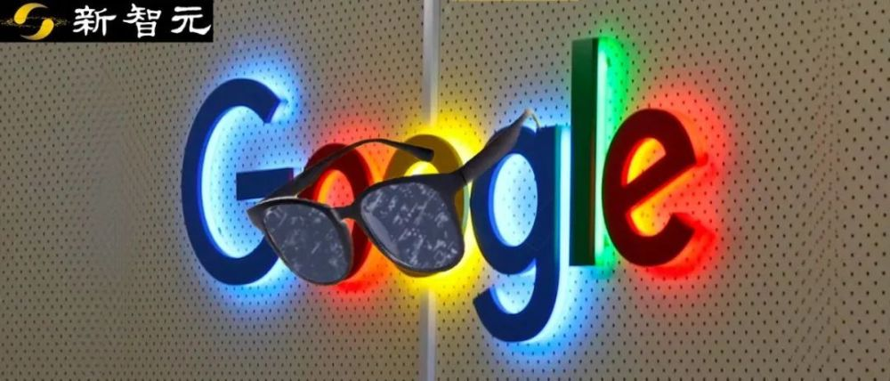
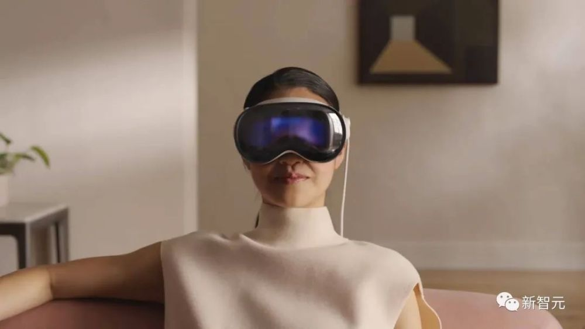
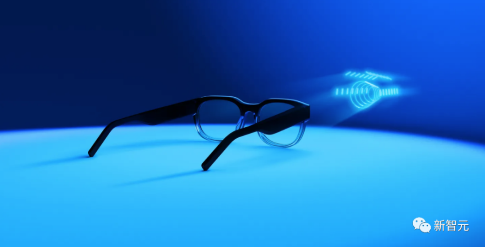
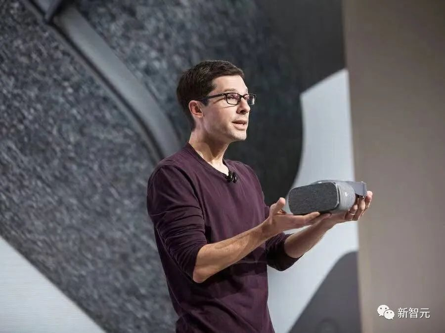
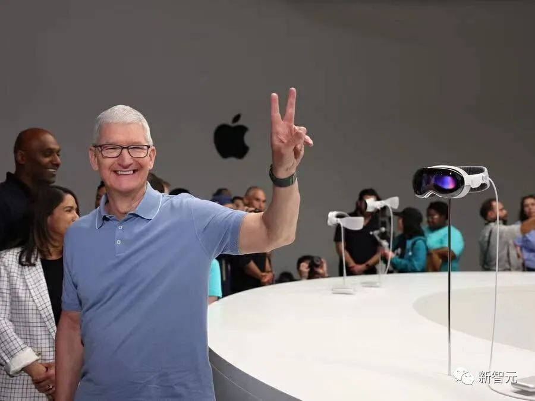

# 谷歌AR眼镜几近梦碎！战略异常混乱，高层毫不关心，人才大量流失

新智元报道

编辑：海兰利 Aeneas

**【新智元导读】**
内部人士爆料，谷歌AR眼镜深受战略混乱之扰，在关闭了AR眼镜项目Iris后，又在打造一个AR眼镜软件平台。而与三星合作研发的头显项目Moohan，也在公司内部引起了轩然大波。

今年6月，苹果公司推出众人期待已久的Vision Pro头显，发布会现场洋溢着激动和兴奋。

苹果CEO蒂姆-库克宣称，Vision Pro是新一代「革命性 」产品。

相反，谷歌内部却弥漫着另外一种情绪——沮丧。

多年以来，谷歌一直试图重新踏足「混合现实」领域，推出一款惊艳所有人的新产品。

然而作为首次尝试推出的谷歌AR眼镜，却在公众面前一败涂地，后续的虚拟现实设备，也都后继乏力。

尽管如此，谷歌上层始终坚信XR是下一个计算前沿。他们在2020年重建一个团队，再次向AR进击。为此，谷歌还收购了初创公司North和Raxium。

然而，这款被委以重任的AR眼镜「Project Iris」，却在研发过程中遇到了技术障碍。

今年上半年，谷歌彻底关停了Project Iris项目，转而与三星合作，把重点放在开发代号为Project Moohan的头显上。

与此同时，谷歌又启动了一项新的工作——把Iris的软件改造成平台，提供给制造AR眼镜的合作伙伴，并希望最快在2025年推出。

事实证明，面对来自苹果和Meta的激烈竞争，谷歌在AR方面的频频失误让员工感到沮丧。

根据7位知情人士透露，苹果和Meta并非没有失误，但是谷歌还存在着战略混乱、高层缺乏关注等问题。

此外，1月份的公司裁员和高层相继出走，也让AR部门元气大伤。

一位业内人士表示：「如果只凭现在这种程度的投入就想引领这个行业，那谷歌就想得太简单了。」

谷歌眼镜回归

谷歌还有一个希望，就是收购的North。

这家加拿大初创公司曾推出一款AR眼镜，它与正常的眼镜非常类似，却烧掉了数百万美元。

_North研发的首个智能眼镜产品_

据加拿大广播公司报道，2018年，加拿大联邦政府承诺向North提供2400万美元，用于创造230个就业岗位；但是政府才刚支付了1/3，North就裁员了，于是政府要求退还已支付的资金。

谷歌看准了这一机会，在2020年以1.8亿美元的价格，把North收归囊中。

「谷歌想要AR，但他们没有团队，也没有产品战略。收购North之后，这两个问题就都迎刃而解。」一位前North员工这样评价。

 _谷歌前AR与VR负责人Clay Bavor_

North团队被收归谷歌后，将开展一个新项目，由谷歌硬件负责人Rick Osterloh和AR与VR负责人Clay Bavor领导。

此时，谷歌开始关注到了Iris，它的产品是一副可以在用户面前投射图像的眼镜。

谷歌希望借鉴North对于AR眼镜的核心理念，打造一款更时尚、可搭载谷歌地图或Lens等应用程序的眼镜。

该团队还开发了两款代号为Alius和Alexandrite的定制硅芯片，分别为Iris的脑部核心和显示屏提供算力。

这就让Iris成为一款真正由谷歌打造的产品，就像Pixel一样。

2021年，谷歌请来了校友Mark Lucovsky，由他负责指导在Iris眼镜的新操作系统。

这个团队里，还有Magic Leap的前首席技术官Paul Greco。

据内部人士称，Iris的研发战略一直在变。Iris是单眼的，即图像只投射到一只眼睛前。

由于显示技术上的障碍，研究小组把目光从普通眼镜转向了太阳镜，然后又转了回来。

另外，Iris应该投射彩色还是单色图形，在团队内部也有分歧。

在2022年5月的I/O大会上，谷歌展示了一款Iris眼镜，它可以实时翻译。一位知情人士表示，这个演示获得了热烈的反响，但这款产品不久后却成为弃子。

「每隔六个月，Iris项目就会有一次重大调整。然后高层会说，『我们想要一个稍微有点不同的产品』。」

与三星合作，开发VR头显

2022年初，有报道称苹果传闻已久的VR头显已进入最后阶段，谷歌上层开始担心起来。

一位前员工说：「苹果发布新产品后，也许会改变谷歌的格局，大家对此十分忧心。」

大约此时，谷歌在和三星合作，后者是谷歌在硬件方面来往最久的盟友之一。

三星希望打造一款类似苹果Vision Pro、把VR和AR现实技术结合起来的产品，而谷歌则为其设计基于安卓系统的软件。

这个代号为Moohan的项目在谷歌内部引起了政治风波。

据内部人士透露，三星告诉谷歌，它不希望谷歌的其他硬件团队了解这项技术，因为他们可能会据此开发竞品。

_谷歌的Hiroshi Lockheimer（右）在三星 Unpacked 2023活动现场_

这就造成了难题。怎么做到既研发眼镜，又让三星满意呢？

一位前员工说，这种合作关系也意味着三星在产品功能上更有决定权。「这很容易造成无人主控的局面。」

这种态势已经开始显现。韩国SBS Biz就曾报道称，因为担心不足以与苹果抗衡，三星和谷歌的设备可能会推迟到2024年夏季推出。

谷歌上层已经向员工确认了这一消息，但很多人怀疑，就算推迟到明年夏天，谷歌也未必能推出一款让公众惊叹的产品。

抛弃Iris，启动新项目

今年1月份谷歌宣布裁员时，Iris项目也关闭了，一直在开发的定制芯片也被取消。

几周后，工龄18年的Bavor宣布离开谷歌，一位员工说，这让AR部门变得一团糟。

另一位知情人士说：「这很奇怪，他们好不容易说服自己谷歌需要开发定制芯片，费了好大劲去做了，然后又把它冲进了马桶。 」

现在，谷歌AR部门的主要项目是Project Moohan，负责人是副总裁Shahram Izadi。

AR部门属于设备与服务部门，由谷歌高级副总裁Hiroshi Lockheimer领导。

_Project Moohan项目_

尽管Iris已被封杀，但谷歌高层还是意识到，眼镜是下一次变革的必然选择。

今年2月，谷歌在Izadi的领导下成立新团队，把Iris项目改名Betty。

谷歌希望利用Betty打造一款Micro XR软件，提供给眼镜制造商。与Iris一样，Betty也是单目眼镜，但团队还在开发一款代号为Barry的双目产品。

一位知情人士说，公司领导告诉员工，他们希望最快在今年找到合作伙伴，但预计最快也要到2025年才有产品上市。

大家猜测，三星大概会成为第一个合作伙伴。

另外，AR部门的一个小组也在探索如何将AI应用于AR眼镜。

同时，留在谷歌设备部门的Greco团队，也在探索新的AR硬件，或许会打造一款类似Iris的眼镜。

Greco负责管理谷歌收购Raxium后吸纳的员工。

内部人士爆料，Greco已经被三星项目和Betty团队拒之门外，这可能使他的团队难以获得资源。

此前他曾告诉同事，他们可能会在未来3-4年内拥有新的引擎，以支持更具沉浸感的眼镜。

一位在职员工说：「这是一个官僚主义的怪圈。」

人才外流

谷歌现在面临的最大挑战，可能是如何留住花费数年时间和数百万美元打造的人才队伍。

Lucovsky最近宣布，这次人才流失中自己也未能幸免。

在离职声明中，他说：「我做出这个决定，很大程度是因为最近AR领导层的变动，以及谷歌飘忽不定的承诺。」

据公司内部名录，Iris项目高级产品总监Eddie Chung也于今年2月离职。

成像初创公司Lytro（2018年谷歌以4000万美元收购该公司）前CTO Kurt Akeley也与去年退休。

_苹果CEO蒂姆-库克（Tim Cook）在公司总部展示新款Vision Pro_

与此同时，苹果和Meta正在大力投入研发MR技术。

2022年，Meta Reality Labs的投入将近140亿美元经费，来开发VR和AR产品。

据彭博社此前报道，为了开发Vision Pro，苹果每年花费超过10亿美元。

而谷歌却不愿意做出类似承诺，这打击了员工们的士气，他们觉得谷歌已经失去了领先优势。

一些人认为，谷歌去年缩减开支，随后将重点放在人工智能上，这也延缓了AR部门的进展。

一位前员工这样评价：「从根本上说，谷歌在硬件的问题在于，它很难保持产品的一致性。」

谷歌决定转向软件，短期内这可以让公司发挥自身优势，但高层清楚地知道，只有制造自己的设备才能保持竞争力。

据此前报道称，谷歌正在加倍投资第一方硬件，因为担心三星等合作伙伴会将其智能手机市场份额拱手让给苹果。

据报道，谷歌CEO劈柴称，此举是「保护公司的最佳方式」。

「谷歌喜欢安卓模式，」一位前员工说。

「不过，尽管谷歌喜欢谈论安卓模式的成功，但从内部看，这非常危险。」

参考资料：

https://www.businessinsider.com/google-ar-augmented-reality-apple-project-
iris-fail-2023-8

