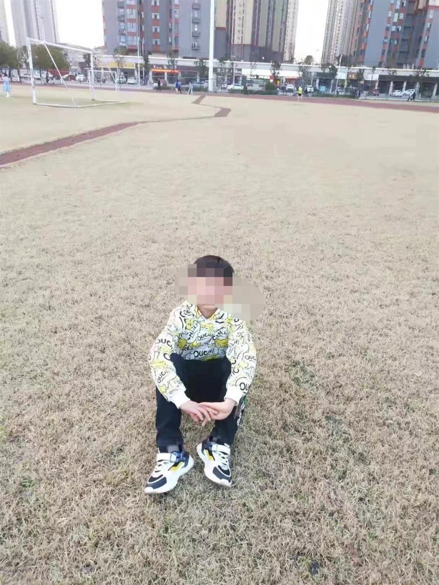
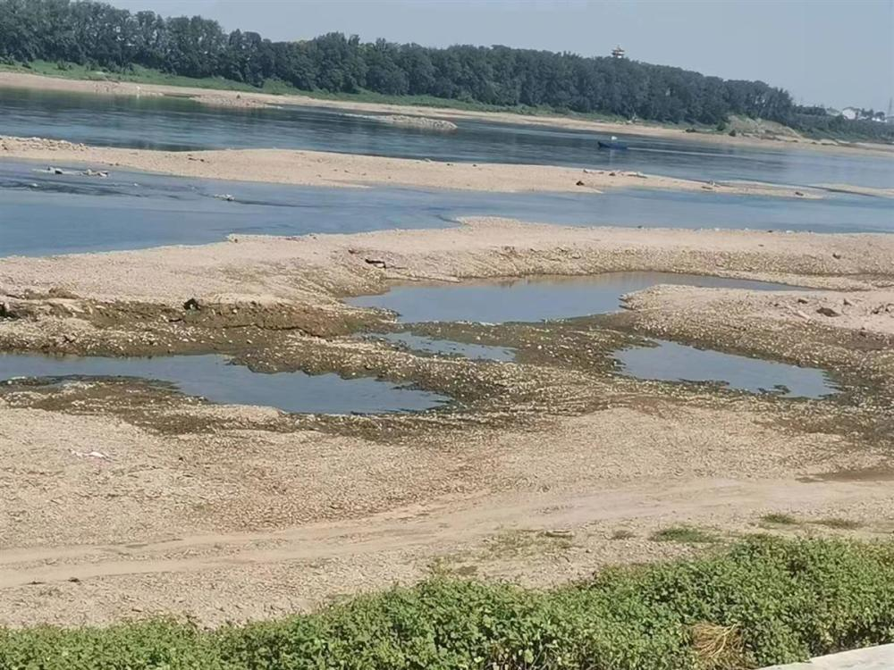
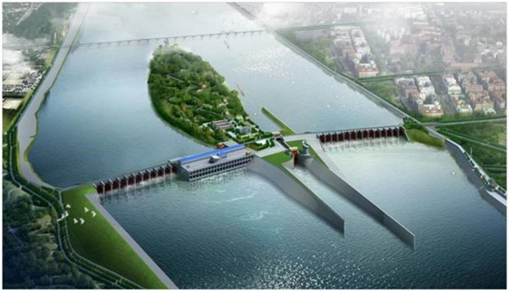

# 两初中生在河床溺亡：家长称事发前上游水电站排水量突增，水电站回应

极目新闻记者 詹钘

近日，两名14岁的初中男生在湖南省常德市桃源县沅江不幸溺水身亡。两位孩子的家属向极目新闻（报料邮箱：jimu1701@163.com）反映，事发时两孩子在河床玩水，河流上游的桃源水电站陡然增加排水量，导致两人被冲走。两人的遗体陆续在下游被找到。家属质疑水电站相关预警不到位，江边警示措施不足。

9月17日，桃源水电站工作人员回应极目新闻记者称，水电站相关操作均严格按照电力企业的规程执行，如果有诉求，家属可寻求法律途径解决。

**两名初中生在河道玩耍时溺亡**

今年49岁的文先生是常德市桃源县人。此前，他一直在福建宁德打工，妻子也在外工作，儿子常年跟外公外婆生活在一起。

8月22日晚上9时许，文先生接到妻子打来的电话。妻子焦急地说，儿子找不到了，可能在沅江被水冲走了，让他赶紧回家一趟。那时，家里人已经报了警。挂掉电话，文先生赶紧订好机票。23日一早，他乘飞机赶到长沙，然后包车从长沙赶回桃源县。抵达事发现场时，已是下午1时许。“当时，警察、蓝天救援队，还有街道办的人都在现场搜救。”看到现场混乱的情景，文先生号啕大哭。

搜寻一直持续到24日上午9时许，文先生接到警方的电话，称在事发地下游数公里的三汊港村，有钓鱼者发现了一具遗体。文先生和妻子第一时间去往现场。文先生称，他看到遗体受损严重，身上只穿有一条短裤，面目全非，身体也被划破，已经完全无法辨认。

_文先生的儿子(图片来源：受访人）_

直到第二天下午，DNA比对结果出来，才确认这就是他们的儿子。

文先生的妻子告诉极目新闻记者，夫妻俩也只有这一个孩子，儿子今年14岁，正在上初中。暑假期间，儿子主要由外公外婆照顾。事发当天，孩子吃完午饭之后，跟朋友一起出去玩耍，不料却出事了。文先生称，事发地离水电站只有一公里左右。

8月25日，家属将孩子安葬。

**事发前电站放水量增大**

与文先生的儿子一同溺水的，还有吴先生的儿子，今年也是14岁。

吴先生夫妻俩都在广州的皮包厂打工，孩子由爷爷奶奶照顾。爷爷72岁，奶奶今年也68岁了。22日晚上接到孩子可能溺水的消息后，夫妻俩包车从广州出发，第二天上午8时许到了事发现场，跟救援人员一起寻找孩子。

24日上午，吴先生接到警方的电话，称在下游的常德市武陵区，有人发现遗体并报警。夫妻俩驱车50分钟到达现场时，离事发已经过去了40个小时。两人第一眼看着遗体很模糊，但是从身长、头发、眼睛、耳朵等特征认出就是儿子。夫妻俩最终通过指纹确认了儿子的身份。

吴先生有两个孩子，溺水的儿子是老二。因为无法承受失去弟弟的痛苦，家里19岁的女儿一直精神不佳，没办法走出阴影。

“我们做家长的是有责任，但是水电站应该也要负责。”吴先生称，事发地有多名村民称，8月22日下午2时许，水坝放水量陡然增大。而且这个水量从事发当天下午起，一直持续了三至四天。

还有附近的村民告诉吴先生，事发当天，曾看到两个孩子在河床的浅水区玩水，但没有人目击到两个孩子被水冲走。

_事发地河床（图片来源：受访者）_

文先生曾经在事发地附近找到了对着江面的监控探头，但因为离孩子玩耍的地点太远，监控画面只能勉强看到人影。不过，他从监控中能够看到，当天下午2时30分左右，河面水流量突然加大。文先生称，因警方要求，其未能将监控相关证据留存。

文先生给记者发来的图片显示，在主河道旁的河床处，有不少积水的坑洼地带，一旦上游来大水，在河床内玩耍的人如不及时上岸，很容易被水围困。

事发后，两家也多次找到当地政府和水电站协商，但一直没有结果。文先生向极目新闻记者表示，两家人只希望电站能赔偿孩子的丧葬费用，没有索要大额赔偿。

文先生还希望相关部门要把下游的警示牌立起来，把坑坑洼洼的河道给填平，“如果没有这些措施，以后还会有同样的事情发生。”

**水电站称可走法律途径解决**

17日上午，桃源水电站工作人员王先生回应极目新闻记者称，建议家属走法律途径提出相关诉求，水电站会依照法院判决来承担相关责任。

王先生介绍，水电站是在2013年左右建成并投产发电的，十年间，在水坝下游确实也发生过小孩和钓鱼者溺水的事件。但桃源水电站作为企业，所有的操作都非常严格，都是按照电力企业的规程来进行。

据王先生讲述，桃源水电站是在水流量大的沅江上，不是在什么小河里，不会出现断流的情况。所以从水电站开始投产发电到现在，一直发着电，不会停。水电站日常依照电网调度，根据电网负荷的大小来增加或者减少发电量，水量就会实时发生变化。

一般排水量加大时，会通过广播系统进行广播预警，白天由于各种噪声的影响，广播预警的声音差不多能传到周边一公里范围。另外，根据国家相关规定，水电站的安全区域为水电站大坝上下游300米以内的范围，此范围内由水电站负责管理。

 _桃源水电站效果图（图片来源：湖南省库区移民事务中心官方网站）_

事发那几天水坝增加放水量，是因为8月份气温高，用电负荷大，上下游水电站都要增加发电量。

王先生还称，桃源县位于沅江的下游，这里的江面很宽，来水量的变化对江面水位的变化影响有限。“在感情上面，我们也很心痛。”王先生告诉极目新闻记者，事发当天，两个孩子是自己在下游玩水，且事发地离水电站距离较远。王先生表示，水电站的责任可以通过法院认定，建议家属走法律途径解决诉求。

17日，极目新闻记者致电桃源县辖区公安部门了解相关情况，未获回应。

桃源县信访局负责人肖先生则表示，已经组织家属和水电站面谈协商了多次，目前水电站一方坚持让对方通过法律途径解决问题。

（来源：极目新闻）

