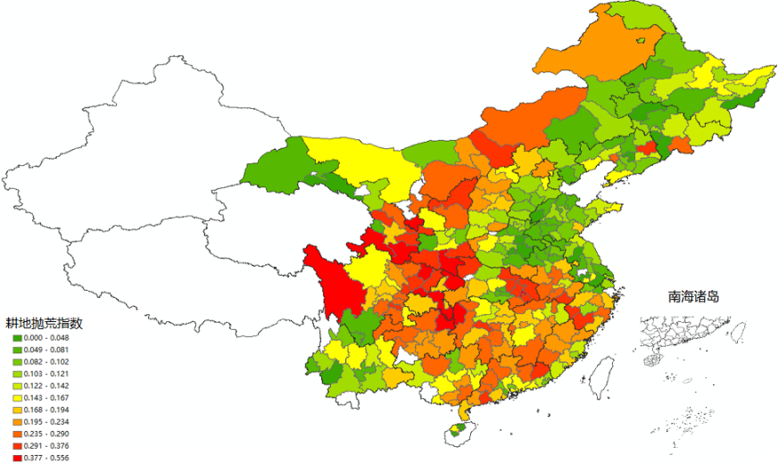
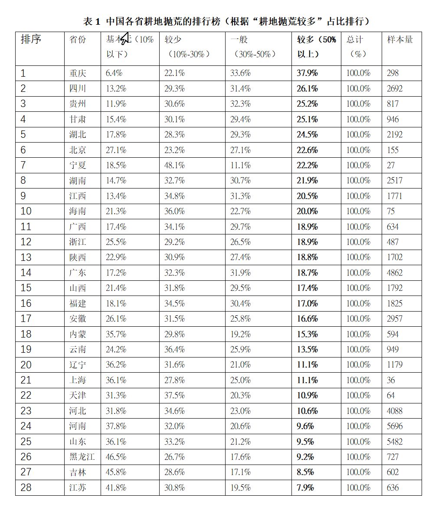
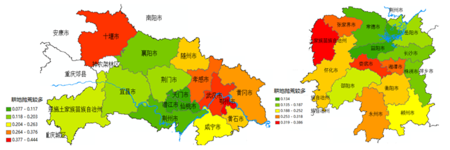
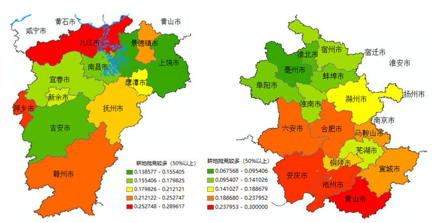

# 中国耕地抛荒排行榜：西南地区比较严重，江苏抛荒最少

**核心要点：**

  * _1_ 农村耕地抛荒的形成原因，主要与耕地本身的利用价值（预期收益）、农产品市场需求和地方政府行为等因素密切相关，耕地抛荒治理需要因势利导。
  * _2_ 抛荒整治中各类形式主义的问题，其主要的原因在于，当前耕地抛荒的识别和监测主要是通过卫星图斑来判断，卫星图斑可以判断某块地是否出现抛荒，但却无法判断这些地块究竟是否适合耕种，无法实现分类治理。

（相关文章：[住了几十年的房子，卫星拍照认定违法须拆除，执法人员：我都觉得不对](https://new.qq.com/rain/a/20230915A02EN200)）

**龚为纲 武汉大学社会学院副教授**

耕地抛荒治理是当前农业生产领域的重要议题。自从2021年开始，全国范围内耕地抛荒整治力度空前。那么，经过一番整治之后，当前全国范围内耕地抛荒现象具有怎样的分布特征？耕地抛荒的形成机制是怎样的？如何针对不同地区耕地抛荒的情况开展有针对性的抛荒治理？

2023年春节期间新浪微博与武汉大学中国乡村治理研究中心在全国范围内开展大规模问卷调查，利用广大网友回乡过年获得回乡见闻的机会，在新浪微博平台上发起了当前乡村耕地抛荒问题调研，其中家乡为农村的网友57334名，共反映了全国5万多个村庄的耕地抛荒情况，获得了有关当前全国耕地抛荒的最新一手数据，数据广泛分布在全国31个省市。

本报告基于网友所反应的大约5万多个村庄耕地抛荒情况，并结合武汉大学中国乡村治理研究中心在全国各地的田野调研资料，分析当前耕地抛荒整治过程中的突出问题，并提出相应对策建议。

一、乡村耕地抛荒的总体分布特征

**（一）耕地抛荒现象的南北差异和省际差异。**

本次调查共有57334位网友反应了家乡的耕地抛荒现象，我们让网友将家乡耕地抛荒的程度划分成四个层次：（1）基本无（抛荒在10%以下）；(2)较少（10%-30%）；(3)一般（30%-50%）；(4)较多或非常多（50%以上）。从地级市层次对各地耕地抛荒的情况进行统计，形成图1的全国耕地抛荒地图，从中可以发现，耕地抛荒现象既存在南北差异，也存在东西差异，还存在各省内部的区位差异。

从各大区域比较的情况来看，东北平原、华北平原耕地抛荒程度最低，长江流域各大平原（长江中游的江汉平原、洞庭湖平原、鄱阳湖平原等地区）次之，耕地抛荒现象比较严重的是南方山地丘陵地区，主要分布在湖北、湖南、江西、广东、福建等地区。

耕地抛荒的南北差异与南北自然地理环境、种植模式、耕作的便利程度、耕作的机械化程度等因素密切相关。即华北平原和东北平原等地区，方便耕作，机械化程度比较高，同时旱作物对农田水利设施的要求相对较低，耕作的成本比较低，因此耕地抛荒现象比较少；而南方山地丘陵地区，很多是以水稻等耕作方式为主，在农田水利设施、农村机耕道荒废、山地丘陵地区机械化不太方便耕作的情况下，留在乡村社会的老年劳动力显然难以胜任繁重的粮食生产任务，因而出现不少耕地抛荒。

_图1 全国各地级市耕地抛荒指数的空间分布（颜色越红代表抛荒程度越高，越绿代表抛荒程度越低，下同）_

表1显示，从全国28个省区的情况来看（西藏、青海、新疆三省因为调查样本低于30个村庄，本报告不纳入省级比较），西南地区某市的耕地抛荒程度高居榜首，网友反映该省耕地抛荒程度较高的比例高达37.9%，遥遥领先全国其他地区；同属西南地区的某两个省的耕地抛荒程度在全国也是遥遥领先；耕地抛荒程度排在前10的地区还包括甘肃、湖北、北京、湖南、江西、海南等地区，网友反映耕地抛荒较多的比例都超过20%。

**（二）南方各省耕地抛荒现象的区位分布特征。**

鉴于耕地抛荒主要发生在南方地区，本报告重点分析耕地抛荒现象相对较为严重的南方地区。

西南地区是全国耕地抛荒的重灾区，某市的耕地抛荒在全国高居榜首，耕地抛荒比较严重的比例高达37.9%。

_图2 各地级市耕地抛荒程度的分布_

贵州也是全国耕地抛荒的重灾区。根据我们在贵州某县的调查，贵州该县某村，有耕地面积4700亩，目前，该村田土抛荒至少占1500亩。

总体而言，贵州土地抛荒主要基于几个原因：

**第一，地形问题，** 贵州92%的山地，没有平原，农业生产的自然条件不好； **第二，农业基础设施不足。**
农业自然条件差，后续投入也不足，导致农田水利、机耕道等条件较差，农业机械化水平低，耕作不便，所以在务工经济背景下，青壮年宁愿外出务工也不愿留在村里种地。

**湖北省各地的耕地抛荒现象：**

湖北省两大工业中心城市武汉和十堰农村郊区的耕地抛荒在全省高居榜首；距离武汉市比较近的地区，比如说、孝感、鄂州、随州等地区，耕地抛荒现象明显要更为严重；而离武汉市比较远的鄂中江汉平原、鄂西等地区则耕地抛荒程度明显要低；湖北省耕地抛荒程度最低的要数江汉平原上的荆门、潜江、天门、仙桃等地区。

 _图3 湖北和湖南各个地级市耕地抛荒程度的分布_

**湖南省各地的耕地抛荒现象** ：

耕地抛荒现象突出体现在湘西、张家界、怀化、娄底等山地丘陵地带，洞庭湖平原附近的常德、益阳、岳阳等地区耕地抛荒现象相对较轻，而靠近长沙的湘潭等地区耕地抛荒相对严重。另外，湘潭、衡阳等粮食生产重点地区（都有产粮大县），也出现比较高程度的耕地抛荒现象，值得警惕。

_图4 江西和安徽各个地级市耕地抛荒程度的分布_

**江西省各地耕地抛荒现象：**

江西省的耕地抛荒的分布特征是，赣中各地耕地抛荒不太明显，而南北两端则耕地抛荒相对严重。南昌、上饶等地级市耕地抛荒程度较轻，而赣州、抚州、萍乡、九江等地耕地抛荒相对严重。

**安徽省各地耕地抛荒现象：**

皖南、皖中和皖北的差异明显，地处皖北的各地级市耕地抛荒程度很低，而皖南的安庆、池州、六安、黄山、宣城等南方山地丘陵地带则耕地抛荒现象比较明显；另外，作为安徽省的省会城市，合肥市同样面临较高程度的耕地抛荒现象。

**两广地区的耕地抛荒情况：**

广东珠三角的耕地抛荒程度非常低，广东省耕地抛荒程度较高的是内陆梅州、河源、清远、肇庆等地区。广西的耕地抛荒程度相对较高的是毗邻广东的玉林、北海等地级市，以及以山区为主的河池等地。

_图5 广东和广西各个地级市耕地抛荒程度的分布_

二、当前重点地区耕地抛荒形成的主要原因

农村耕地抛荒的形成原因，主要与耕地本身的利用价值（预期收益）、农产品市场需求和地方政府行为等因素密切相关，耕地抛荒治理需要因势利导。

**（一）耕地本身的利用价值和耕种的预期收益是决定耕地抛荒程度的主要原因。**

研究发现，在耕地质量较好、耕种便利和市场区位条件相对较高的村庄，耕种的预期收益往往比较高，这些村庄的耕地流转价格也比较高，耕地抛荒程度往往比较低；而在耕地质量较差、耕地利用价值较低的村庄，农户耕种的动力往往比较弱，耕地抛荒的程度也比较高。

分析结果显示（图7），在耕种的预期收益较低、耕地流转价格较低的村庄（比如说耕地流转价格为0），耕地抛荒发生的风险最大，在这种类型的村庄，耕地也往往很难流转出去；而随着耕地流转价格的上升，耕地抛荒的程度在持续下降，耕地流转的变得越来越容易。比如说，在耕地流转价格在600以上的村庄，耕地抛荒的平均水平最低，而耕地流转最为充分。

_图6 不同耕地流转价格下的耕地抛荒程度与耕地流转规模_

（说明：耕地流转价格实际上直接反应了耕地的利用价值，在耕地利用价值较高的村庄，容易形成“耕地高度流转-
耕地低度抛荒”的态势，而在耕地利用价值较低的村庄，则更容易形成“耕地难以流转-耕地高度抛荒”的态势）

 _图7 全国各地耕地流转价格的空间分布_

进一步的区域比较分析发现，耕地流转价格的空间分布和耕地抛荒的空间分布具有高度的类似性，在耕地流转价格相对较高的华北、东北等区域，往往耕地流转价格相对较高，这说明这些区域的耕地利用价值比较高，农户耕种的动力比较强；而在耕地流转价格相对较低的南方丘陵山区、西北干旱地区以及西南喀斯特地貌区，耕地流转价格低，耕地的利用价值低，农户耕种意愿较弱，耕地抛荒程度也相对较高。

这一分析结果说明， **耕地抛荒实际上主要发生在哪些耕种预期收益较低、耕地利用价值相对较低的区域**
，比如说南方丘陵山区、西北干旱地区以及西南喀斯特地貌区，这些地区的耕地流转价格低，很多耕地甚至是0租金都没有农户原因耕种，其根本原因在于，地块细碎、耕种不便利、机械化操作困难等，耕地质量本身是决定这些地区耕地抛荒程度低的主要原因。

**（二）城镇化进程中的地方政府行为激化耕地抛荒。**

地方政府主导的县域城镇化进程中，地方政府在增加挂钩、占补平衡等政策约束下，有很强烈的推动农村宅基地复垦、荒地复垦的冲动，通过将这些非耕地转为耕地，进而腾挪出耕地建设用地指标。但问题在于，复垦的宅基地、荒地等，因为地方政府对农业的财力投入有限，整治后的耕地农田水利设施跟不上，耕作条件差，肥力不足，农民普遍不愿意耕种，地方政府将这些所谓的耕地开发出来之后，形成新的抛荒现象。那么行政力量主导的耕地流转为什么会激化耕地抛荒呢？

据武汉大学中国乡村治理研究中心在某地区的长期调查，发现该地区近10多年，为了充分利用增加挂钩政策，将更多的农业用地转为工业用地，推动该地的城市化发展，在大规模占用良田搞工业开发的情况下，为了占补平衡，开发了很多山地丘陵荒地作为耕地补充，实现“占补平衡”，并在各种农业补贴的支持下，发动农民种植新开发的“耕地”，但由于这些新开发的荒地农业基础设施投资不足，农田水利设施跟不上，加上本身地力不足、也不太方便耕种，没有农户愿意种植，大户也不愿意种，由此产生了比较严重的耕地抛荒问题。

**（三）地方政府推动的大规模耕地流转也是形成耕地抛荒的重要原因。**

随着农村人口的城镇化，农民大量进城，农村耕地抛荒现象逐年增多，在这个过程中，将耕地大规模流转给大户或龙头企业被认为是解决耕地抛荒的基本办法，但耕地流转未必是解决耕地抛荒的“绝招”，图8的相关分析显示，一个村庄的耕地流转规模和耕地抛荒的程度之间是成正相关关系，
**那些耕地流转最为活跃的地区，往往也是耕地抛荒程度较高的地区。** 那为什么大规模耕地流转与耕地抛荒会有如此密切的关系呢？调研发现，
**龙头企业或种粮大户大规模流转耕地之后，一旦利润不佳或者没有利润时，就出现大面积撂荒事件。**

**案例1：**
某县农技人员2020年04月24日反映，今年全县上下掀起治理耕地抛荒热潮，基层直接要求大户完成任务面积，但是由于种植效益无法保证，导致再抛荒再治理的怪圈。

**案例2：**
某县农技人员在2022年7月26号反映，现在的耕地抛荒有三种突出表现，第一就是违占问题。一些地方违规占用耕地，植树造林，挖湖造景，甚至发展林果业等经济产业，致使耕地受到损失。第二是土地撂荒问题，尤其是一些工商资本大规模流转土地过度开发，破坏了耕作层，而一旦利润不佳或者没有利润时，就出现大面积撂荒事件。三是违规盖房、乱建其他非农设施。这也是当前十分多发的一个问题。

三、对策建议

**（一）全国耕地抛荒整治的重点在南方山地丘陵地区以及中西部人口流出地区。**

在中西部地区中，大中城市的郊区以及县域城镇化快速推进的县区构成耕地抛荒整治的重中之重。以湖北省为例，湖北武汉抛荒程度位居全省之首，尤其是武汉周边的黄陂、江夏等地区耕地抛荒现象普遍，这些地区由于地处城郊，中老年劳动力非农务工机会非常多，对粮食种植毫无兴趣，因此这些地区往往耕地抛荒程度非常高。

**（二）针对抛荒重点地区，加强农业基础设施投资力度是耕地抛荒治理的关键。**

通过全国比较，会发现长三角和珠三角等经济发达地区农村地区耕地抛荒程度比中西部地区要低很多，其中一个重要原因是，这些地区因为处于经济发达地区，地方政府的农业财政投入也非常巨大，地方经济发达以后，它对农业的反哺也相对强很多，比如在浙江，他们用自己的地方财政把土地都整了好几遍了，它的基础设施比中西部要好很多，耕种的便利性要高很多。

而在中西部地区，随着城镇化的进一步推进，越来越多的耕地是通过宅基地整治、荒地整治等方式转化而来，在农田水利设施投资不足的情况下，其耕种的可持续性成为问题。

**（三）撂荒整治的关键问题是要解决谁来种谁来收的问题，在乡村基层组织进行撂荒整治之后，谁来复垦成为难题，一些地区抛荒整治之后继续抛荒的现象很常见。**

总体而言，2021年以来各地对撂荒地的整治、核查、排查力度空前加大，但所面临的问题在于，撂荒地的复耕、复垦工作难度大，如何在整治耕地之后，将耕地承包流转出去，真正种粮食是关键。在当前粮食价格总体低迷而农资成本、劳动力成本大幅度上涨，单位面积种粮收益低下的背景下，农田水利设施、机耕道破损、无法使用机械等问题，以及耕地流转机制不顺畅，有些地区耕地流转租金价格过高等都影响了整治耕地由谁来复垦的问题。

**（四）要警惕耕地抛荒整治过程中的形式主义和一刀切。**

在抛荒整治行政压力下，有些地区出现形式主义和一刀切的做法，对于增加国家粮食产量没有实质性意义，而且还增加了乡村两级的债务。

比如说，在很多南方山地丘陵地区的山垅田，由于农田水利设施的长期失修和瘫痪，经过多年抛荒，周围的生态环境早已经不适合耕种，没有任何经济收益可言。但在一些地方
**“超过三亩或者五亩连片抛荒，党政一把手就地免职”**
的高压下，乡镇两级干部只能勉为其难，也要“种政绩、种作风”，把这些田种下去，或者种上荷花、南瓜藤等，这些做法既要给种植者良种补贴或机械补贴，还要耗费掉基层大量的行政资源，成了劳民伤财的形象工程。尤其是在类似的抛荒情况很常见的情况下，会大幅度加剧乡村两级的债务。

案例3：某县，2021年04月03日，农技人员反映，现在全国各地都在进行抛荒地整治。我们这里很多坵水田里，农民群众种植了南瓜藤，这样的行为与中央精神背道而驰。

案例4：2022年5月26日，农技人员反映，为应付上级检查，地方政府在公路边开展不计成本不讲方法的抛荒瞎治理，搞些捞民伤财，为应付检上面检查的形象工程。

**抛荒整治中各类形式主义的问题，其主要的原因在于，当前耕地抛荒的识别和监测主要是通过卫星图斑来判断，卫星图斑可以判断某块地是否出现抛荒，但却无法判断这些地块究竟是否适合耕种，无法实现分类治理。**
比如说无法判断耕地抛荒的形成原因是因为农田水利设施瓦解、机耕道损坏和道路不便，还是野生动物侵害等客观原因导致无法耕种，它只是说这个土地撂荒了，所以地方上必须整改，然后就产生非常多的问题。

为什么依据卫星图斑指导耕地抛荒整治会脱离现实呢？

卫星图斑所依据的土地性质标注和用途标注，都是按照十几年甚至二十年的标准来分类的，在南方山地丘陵地区，不少被标注为基本农田的地块，由于生态环境变化，很多地都已经不适合耕作了，或者已经自然地退耕还林了，但是现在卫星图斑依据多年前标注的土地类型，判断这些地块需要进行抛荒整治，基层干部不得不花钱去对这些荒地重新开荒，但是开完了荒其实也种不了，整治完之后继续抛荒，给基层的政府和老百姓造成一个非常大的冲击，在乡村两级形成了新的乡村债务，而抛荒整治工程则成了劳民伤财的行动，给基层造成更大浪费。

**（五）需要将上级督查与基层社会的能动性结合起来，不搞一刀切和运动式治理。**

上级频繁地督查与乡村两级治理撂荒乏力之间存在结构性矛盾，不能将所有责任推到乡村两级，也需要给地方因地制宜的空间。频繁地督查并不能实质性地解决问题，因为撂荒整治存在结构性困境，包括农民种粮收益低下与生活成本开支大之间的矛盾，以及乡村两级缺乏财力、治理效能弱化与撂荒整治成本高昂、复耕复垦难度大等问题。

一方面，需要加大财政投入力度，加大复垦整治力度，针对乡村两级推动撂荒整治和复垦财政能力不足的情况下，可以设立专项财政资金，推动撂荒土地复垦的力度。另一方面将复垦耕地以有效的形式进行流转，推动撂荒耕地复耕复垦，在单位面积粮食效益低下的背景下，适度规模经营才是解决撂荒问题的根本。

