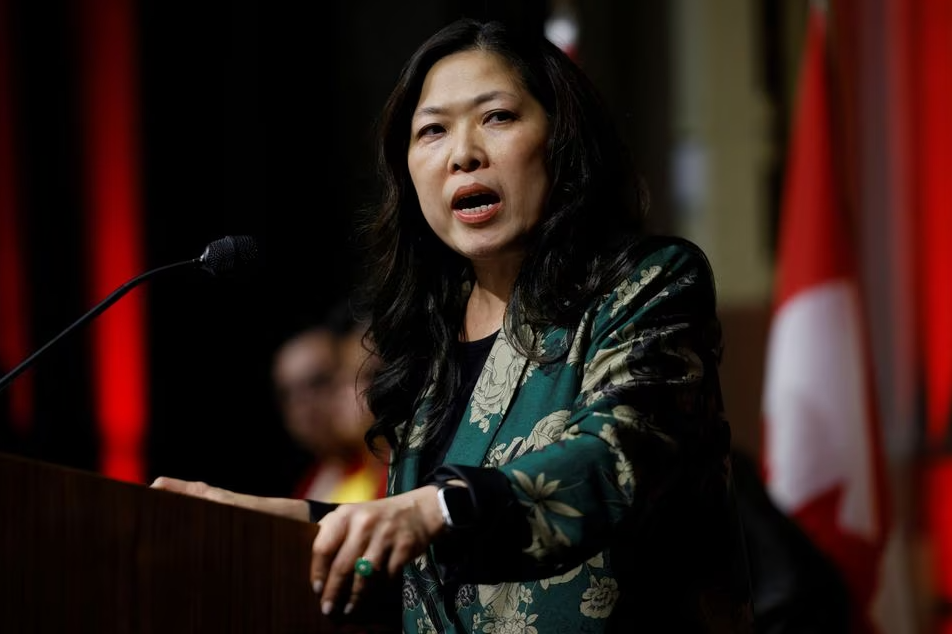

# 加拿大推迟贸易代表团访印计划，外媒：两国紧张关系升级

（观察者网讯）据彭博社9月16日报道，当地时间15日下午，加拿大国际贸易、出口促进、小企业与经济发展部长伍凤仪的发言人表示，加方将推迟原计划于10月初派贸易代表团访问印度的计划。

路透社提到，就在不久前，印度总理莫迪在二十国集团（G20）领导人峰会期间“训斥”了加拿大总理特鲁多。彭博社称，此举正值两国之间关于贸易协定的谈判陷入停滞之际，显示双方紧张关系升级。

_2023年1月，加拿大国际贸易、出口促进、小企业与经济发展部长伍凤仪在渥太华春节庆祝活动上发表讲话（图源：路透社）_

按照原计划，伍凤仪打算于10月9日率领一个由加拿大商界人士等成员组成的贸易代表团前往印度孟买，访问的重点是汽车、农业和信息技术等领域。

在当地时间9月15日下午发布的一份声明中，伍凤仪的发言人表示，“在这个时候，我们推迟了即将开启的贸易代表团访印计划”，并补充称，明年加拿大将把业务带到日本、印度尼西亚、韩国、马来西亚、菲律宾和越南。

但加拿大政府没有解释取消代表团原定行程的原因，也没有公布未来向印度派出贸易代表团的日期。

加拿大和印度此前一直就拟议的贸易协定保持对话，以期早日取得进展，但就在特鲁多赴印度参加二十国集团领导人峰会前，加拿大政府8月要求谈判“暂停”，并于9月初发布声明称，需要暂停此类活动以“评估”情况。9月15日早些时候，印度表示已经暂停与加拿大的贸易谈判。

而在大约四个月前，两国还表示，他们的目标是在今年达成初步贸易协定。

路透社提到，前不久，莫迪在二十国集团领导人峰会期间“训斥”了特鲁多，加方最新决定凸显两国外交关系紧张。

当地时间9月10日，在二十国集团领导人峰会期间，莫迪与特鲁多在印度举行非正式会晤。会晤后，印度总理办公室声明称，莫迪就“加拿大极端分子从事反印活动”向特鲁多表示强烈关切。莫迪称，这些极端分子鼓吹分裂主义，煽动针对印度外交官的暴力行为、破坏外交场所，并对在加印度社区构成威胁。

特鲁多则在新闻发布会上表示，加拿大将永远捍卫“言论自由、良心自由和和平抗议”。他补充说，加拿大“永远抵制暴力、仇恨”，且少数人的行为“不代表整个社区或加拿大”。

伍凤仪本周对记者表示，双方正在花时间“反思”关于贸易协定的谈判，部分原因是为了与更多利益攸关方进行磋商，“这是这些谈话中很正常的一部分”。

印度贸易部长皮尤斯·戈亚尔在接受印度《第一邮报》采访时表示，需要暂停贸易谈判，以确保两国在“地缘政治和经济”上达成一致。“我们遇到了一些让人严重关切的问题。”戈亚尔补充称，莫迪在二十国集团领导人峰会期间向特鲁多强调了这些问题，“我们希望在采取行动之前先让一些问题得到解决。”

加拿大是印度之外锡克教教徒最多的国家，有超过75万人，该国发生了多起令印度方面担忧的抗议活动。今年3月，示威者聚集在印度驻温哥华领事馆外抗议。今年6月，印度批评加拿大允许一场花车巡游重现1984年时任印度总理英迪拉·甘地遭锡克教警卫暗杀的画面，认为这美化锡克教分裂主义者的暴力行径，损害印度主权和尊严。

加拿大去年公布“印太战略”，强调在该地区实现贸易多样化，称印度是实现目标的关键合作伙伴。

**本文系观察者网独家稿件，未经授权，不得转载。**

