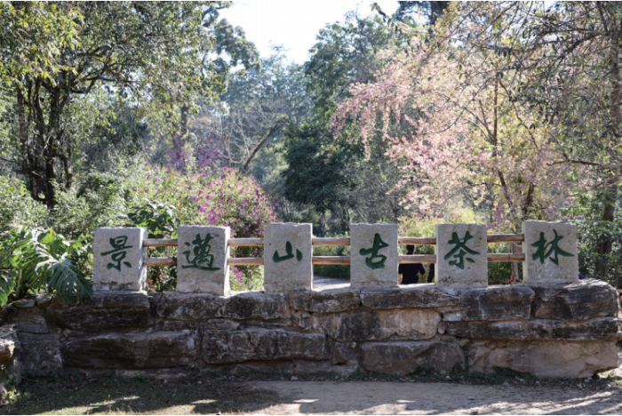
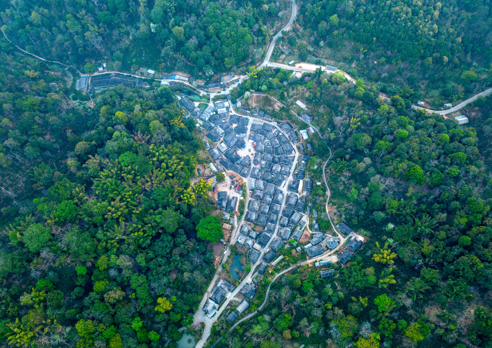
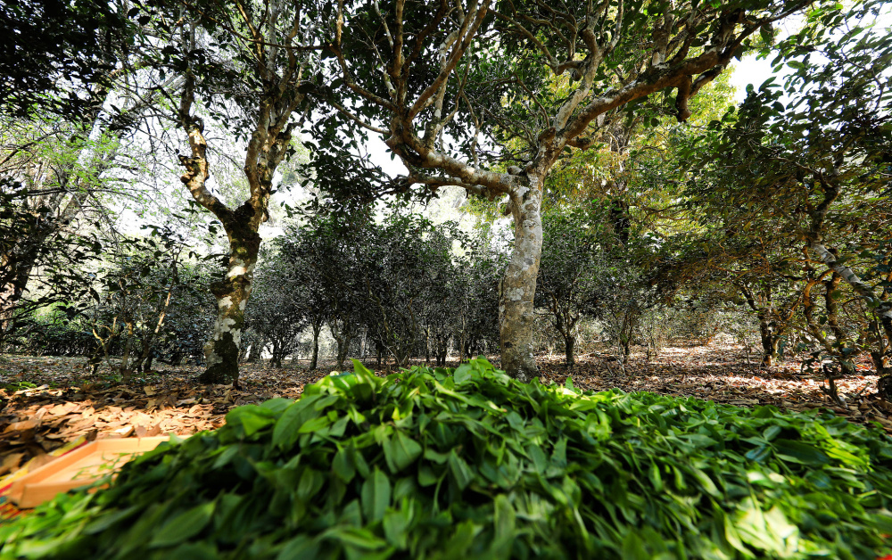
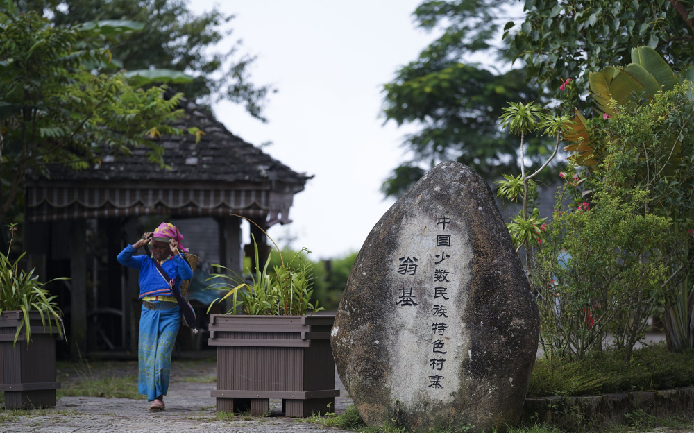
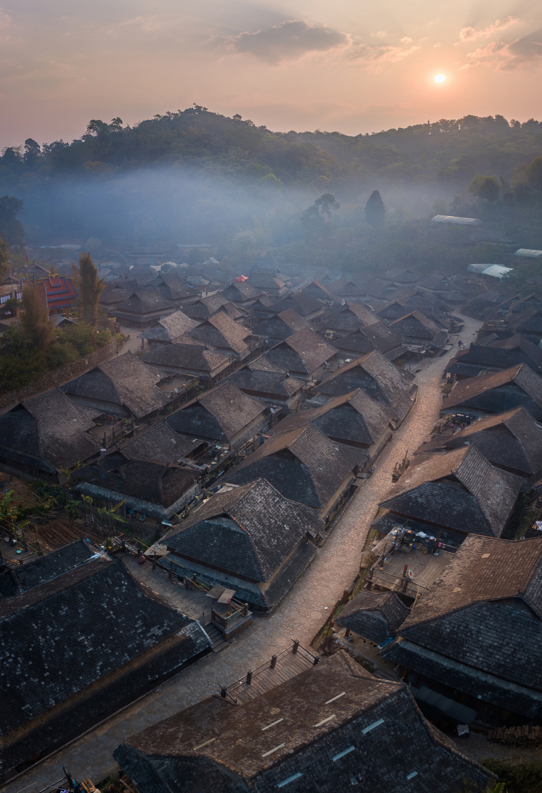
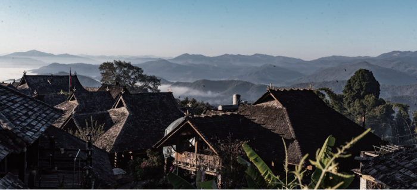
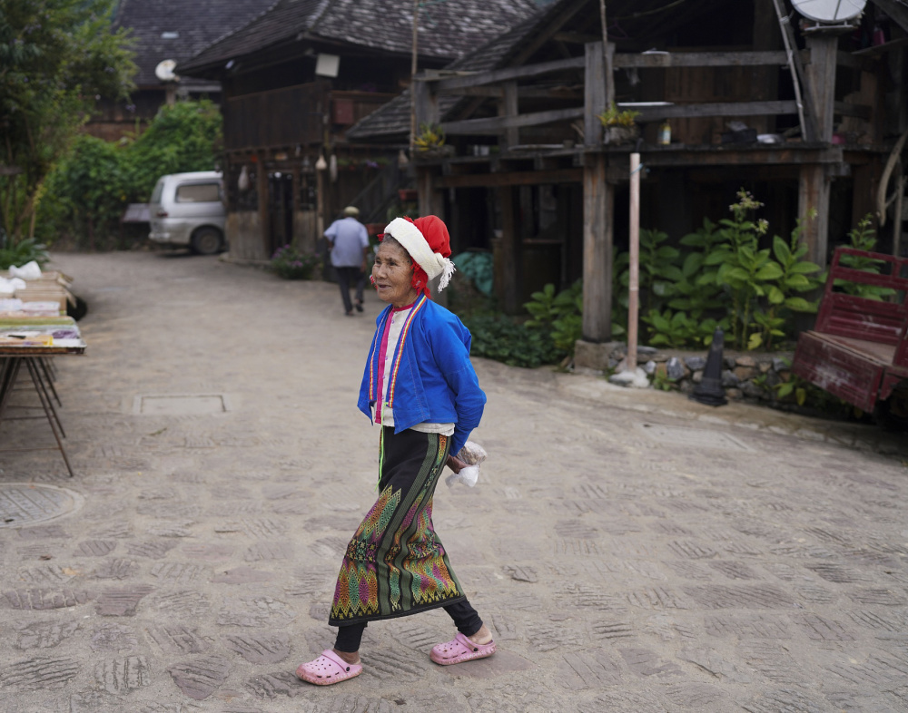
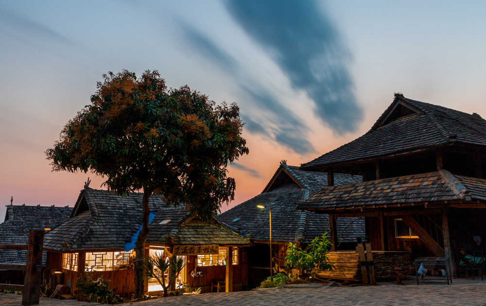
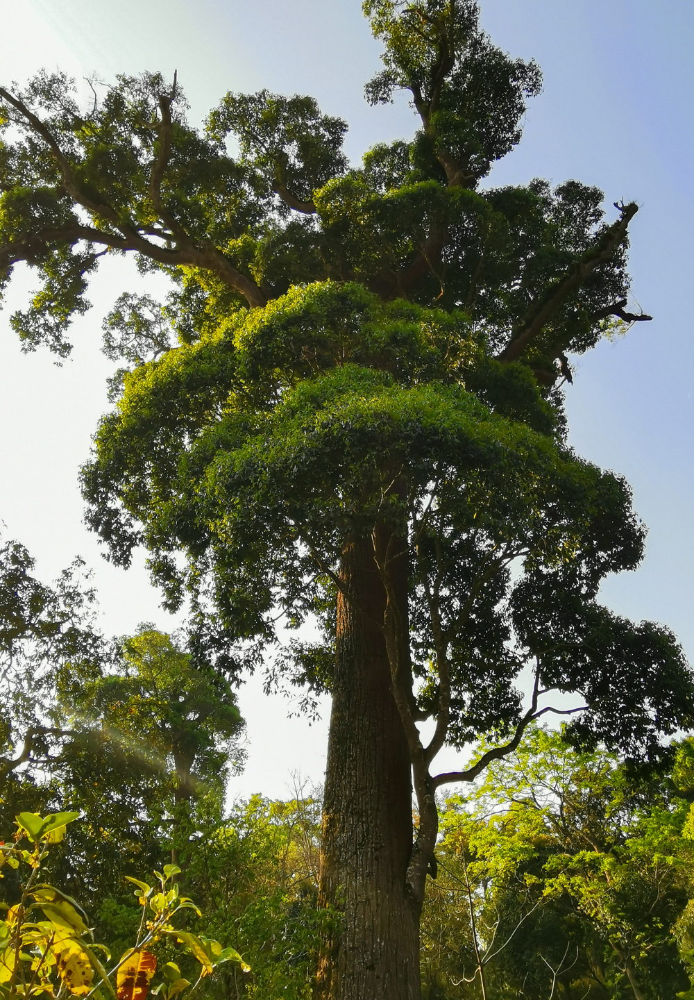

# 历经13年申遗，云南“普洱景迈山古茶林”列入世界遗产

澎湃新闻获悉，当地时间9月17日下午三点多（北京时间晚8点多），在沙特阿拉伯首都利雅得举行的第45届世界遗产大会上，随着大会主席的落锤，中国提交的“普洱景迈山古茶林文化景观”项目经世界遗产委员会审议获准列入世界文化遗产名录，成为中国第57项世界遗产。

“普洱景迈山古茶林文化景观”历经13年申遗，成为云南省第6项世界遗产，填补了全球茶叶世界文化遗产的空白。获悉“普洱景迈山古茶林文化景观”申遗成功消息，中国茶叶博物馆原馆长王建荣在接受澎湃新闻采访时说，景迈山古茶林核心价值首先在其千年万亩古茶林，有着“茶叶天然林下种植方式的起源地”和“人类茶文化历史自然博物馆”的美誉，它提供了研究茶树的起源、演化、人工驯化与传播以及理清茶树物种起源与早期驯化栽培之间关系的真实而强有力的证据。

 _在沙特阿拉伯首都利雅得举行的第45届世界遗产大会现场_

_景迈山古茶林入口_

中国文物学会会长、原故宫博物院院长单霁翔此前表示，中国茶文化有着极其深厚的底蕴，源远流长，景迈山古茶林则因其“古”和“林”而独树一帜。相较于世界上其他著名的梯田式、
农庄式台地茶园，景迈山古茶林不仅历史更为悠久，其传统的林下种植方式和利用森林生态系统稳定性的维护方式也具有鲜明特色。

_2023年2月25日，云南省普洱市，航拍糯岗古寨。_

普洱景迈山古茶林文化景观位于中国云南省普洱市澜沧拉祜族自治县惠民镇，是一处由古茶林、茶园、森林和传统村寨构成的不断演进的文化景观。布朗族和傣族在这里的土地利用实践可追溯至公元10世纪。世居民族在长期探索实践的基础上形成了智慧的林下茶种植技术并传承至今，是原始森林农业和人类茶种植模式的典范。景迈山古茶林体现出人地和谐的朴素生态伦理和智慧，对当今世界可持续发展具有启示意义。

_在沙特阿拉伯首都利雅得举行的第45届世界遗产大会现场_

王建荣在接受澎湃新闻采访时表示，景迈山古茶林核心价值首先在其千年万亩古茶林，在于多民族聚居的传统村寨，还在于它是立体复合的山地高效农业和特色人居景观的范例。“我坚信，景迈申遗成功，必将有力推动中国茶产业可持续发展，极大提升中国茶产业的世界影响力。”

单霁翔在此前透露：“2010年6月，我来普洱市参加茶马古道研讨会，几位朋友给我看了景迈山古茶林的照片，其原生态面貌使我震撼。中国的茶文化传播世界，但至今还没有一处关于茶的世界遗产，景迈山古茶林是不是可以申报世界遗产？回到北京，我请当时的国际古迹遗址理事会副主席郭旃先生亲自到景迈山考察。考察归来，郭旃先生特别兴奋，认为景迈山古茶林完全符合申报世界遗产的标准。景迈山古茶林的申遗工作由此正式启动。此后的十多年间，景迈山古茶林遗产地围绕申遗工作，在价值认识、遗产保护等方面做了大量工作，取得了很多成果。
”

回望普洱景迈山古茶林文化景观申遗之路，走过整整13个年头。2010年，普洱景迈山古茶林文化景观申遗工作全面启动。该项目于2013年列入预备名录，为2021年中国提交的申报项目，2022年完成ICOMOS现场考察，获得咨询机构“推荐列入”，具有符合OUV价值标准(iii)(v)的潜质。2023年在沙特阿拉伯首都利雅得举行的第45届世界遗产大会上被获准列入世界遗产名录。

**景迈山古茶林文化景观**

景迈山古茶林文化景观遗产区面积7167.89 公顷，缓冲区11927.85 公顷，遗产要素包括5片古茶林、3片分隔防护林和9个传统村落。

_云南普洱的景迈山_

景迈山位于中国云南省普洱市澜沧拉祜族自治县，滇西南怒山余脉形成的群山之中，三面被澜沧江支流南门河及南朗河环绕。景迈山世居民族傣族、布朗族在景迈山原始森林中发现野生茶树，通过人工驯化、栽培，经过漫长时间的持续努力和发展，形成了从海拔1250米至山顶的共计1230.63公顷古茶林，茶林外围保留有宽约40米的森林防护带。村寨选址于茶林之中，依山势而建，海拔在1280至1500米之间，海拔更低处是生态茶园、耕地和林地，形成农林复合的垂直土地利用方式。作为有机演进的文化景观，延续至今的传统“林下茶种植方式”是人类早期利用茶树的活态样本，“山共林、林生茶、茶绕村、人养茶”的景观格局承载着“林茶共生、人地共荣”的千年悠远历史。

**神奇的古茶林**

古茶林主要分布在海拔1250~1550米之间的森林之中，村寨周边。它们具有千年以上的悠久历史并完整保存至今。先民在森林中开垦，在树林下种茶，最大限度地保留了茶的生物多样性，从而确保不施肥，不用药，体现了高超生态智慧。古茶林至今依旧充满活力。

 _景迈村大平掌古茶林_

古茶林是千百年来布朗族、傣族先民在生产生活实践中逐渐培育起来的。由于栽培型普洱茶树在一定树龄以后（约100年）逐步进入低产期和衰亡期，因此古茶林存在更新演替的动态过程。

_景迈山的古树茶_

景迈山古茶林采用独特的林间和林下种植技术。

为了有效防止大风和霜冻、病虫害传播等自然灾害，景迈山的先民们选择在森林间有限度地片状开发古茶林。他们一方面围绕村落控制茶园开垦面积，另一面在开垦的古茶林外围保留森林防护线，即为禁止砍伐的原始森林带，宽约40米，围绕在茶林周围，布朗族称为“背”。村子和村子之间也会保留一定面积的森林作为分隔界限，界限内不仅不可以砍伐树木，也不可以种茶。

 _进入采茶期，人们在景迈山的古茶林里采茶。_

云南大叶茶是耐荫、喜温、喜湿的作物，当光强达到80%左右时茶树达到最佳生长状态与最大产量。景迈山先民逐渐认识到茶树生长习性，模拟和利用森林生态环境，在天然林中砍除部分乔灌木而保留一定的遮荫乔木，然后栽种茶树，养护茶园。这种古老而特殊的林下种植技术使得古茶林呈现出明显的乔木层——灌木层（茶树主要分布层）——草本层的上——中——下的立体群落结构。

独特的林间和林下种植方式，使景迈山古茶林具有与天然林十分相似的、丰富的生物多样性。古茶林的物种数、丰富度指数、多样性指数和均匀度指数与天然林极为相似，且明显高于林相相对单调的现代茶园。

在景迈山古茶林文化景观申遗“四中心”展厅，生物多样性得到了完整呈现：篦齿苏铁、翠柏、红椿、金荞麦等14种我国重点保护野生植物与茶树共生，野生动物更是不计其数。

良好的植物、动物多样性一方面使物种间形成相互制约的关系，可有效抑制病虫害发生，同时上层乔木的落叶又为茶树的生长提供了丰富有机养料，因此有效地维持了古茶林生态系统的稳定。

**和谐的古村落**

传统村落具有十分悠久的历史。布朗族先民在公元7世纪的唐代从今瑞丽和缅甸佤邦一带迁徙至此，而后傣族先民也由今瑞丽地区远道而来。他们在景迈山定居，种茶为生，相互交流，和谐共处，共同建设着美丽的茶山家园。

_2022年9月22日，翁基一名布朗族村民前往茶山采茶。_

申报遗产区包含北部白象山脉的景迈村和南部芒景山脉的芒景村两个行政村。前者包括芒埂、勐本、景迈大寨、糯岗等4个傣族村寨，而后者则包括翁基、芒景上寨、芒景下寨、芒洪、翁洼等5个布朗族村寨。各类建筑中，传统建筑比例高达40%以上。

 _2023年2月25日，云南省普洱市，澜沧糯岗古寨。_

布朗族和傣族先民在村落选址上具有共同的原则，即依山而建，既有神山，也有茶山。它们都是自然与文化高度结合的产物。

布朗族和傣族村落均以寨心为中心向心布局，体现了宗教对村落的凝聚力。围绕神山而建。神山既是其神圣的宗教祭祀之地，也是村寨的水源林所在。布朗族和傣族的先民围绕神山选择背山面水、坡度较缓、用地条件较好、适于种植茶树的地方建设村寨。围绕茶山而建。遗产区先民到哪里定居，就在哪里种茶，其村寨与茶林密不可分，尤其是布朗族对于古茶林的依赖性更加强烈，傣族与布朗族的村寨几乎都是镶嵌在茶林中的。

_2022年9月21日，云南省普洱市，一名游客在糯岗古寨中的翁基佛寺参观。_

村寨入口一般有“佛寺”建筑，中心区域为寨心，村寨以外一定距离较高海拔的位置分布着村寨的风水林与信仰林（竜林）。出于对神灵的尊敬，村寨内部建筑与街道基本围绕寨心成向心式布局。村寨由内部到外部形成“寨心”——向心式建筑街道——入口“佛寺”建筑——古茶林、森林（茶神自然崇拜）——风水林（自然山神崇拜）的体现信仰体系的空间布局特色。

故宫博物院原院长单霁翔在其新近出版的新书《万里走单骑》中也记述了他行走于景迈山古茶林的所见所闻，其中详述了糯岗和翁基两个传统村落的生态。

在这些传统村寨中，糯岗是保存最完整的，是人与自然和谐相处的重要体现。“糯岗”在傣语中意为“鹿饮水的地方”，据说常有成群的鹿来此处饮水，村寨由此得名。目前村寨中79栋传统民居成为国保级传统民居。

 _糯岗民居（屋顶有水牛角装饰）_

在糯岗，我们感觉到了居民们在传统村寨中进行茶叶种植、生产活动的场景。整个寨子分为空间独立的老寨和2000年建的新寨。村寨道路顺应地形高低弯曲，形成了生动多变的巷道空间，溪流穿村而过。

在景迈山，传统的干栏式民居体系是世代居住在这里的人们为了适应山里潮湿多雨的气候，合理利用山间土地而不断改进完善的，充分彰显了世居人民的智慧。

_翁基民居（屋顶为“一芽两叶”装饰）_

……翁基则属于典型的布朗族村寨，屋顶装饰为“一芽两叶”。这些装饰由建筑部件演变而来。因为早期的干栏式建筑是茅草顶，屋顶由两组交叉的椽子支撑，结绳捆紧后总会留出一截，后来才改为装饰。水牛角和“一芽两叶”装饰成为两个民族图腾的建筑语言，又融合了茶文化，颇具特色。

**丰富的茶文化**

普洱景迈山地区少数民族在漫长的历史生活中，与茶相伴，依茶为生，形成了林茶互生、人地共荣的独特人文景观，并衍生出种茶、采茶、食茶、制茶、饮茶、品茶等极为丰富的茶文化，具有鲜明的地域特色和浓厚的民族特色。

 _2022年9月22日，云南省普洱市，糯岗古寨中的布朗族老人。_

茶，在景迈山的传统饮食、民俗风情、民居装饰、婚丧嫁娶、宗教崇拜中体现得淋漓尽致，并深刻影响着世居民族的价值观念和生产生活。

_云南普洱，晚霞中的景迈山糯岗古寨。_

**突出的遗产价值**

景迈山古茶林文化景观申遗之路，走过整整13个年头。该项目于2013年列入预备名录，为2021年中国提交的申报项目，2022年完成ICOMOS现场考察，获得ICOMOS以符合标准(iii)、(v)建议无保留列入的评估结果。

 _景迈山古树茶园里的古树_

标准(iii)：能为延续至今的或已消逝的文明或文化传统提供独特的或至少是特殊的见证。景迈山古茶林文化景观是中国西南地区世居民族延续至今的林下茶种植传统的典型例证，是人类早期茶种植模式的活化石，在当今世界规模化台地茶种植园主导的背景下十分独特。

标淮(v):是传统人类聚居、土地使用或海洋开发的杰出范例，代表一种（或几种）文化或者人类与环境的相互作用，特别是由于不可扭转的变化的影响而脆弱易损。景迈山古茶林文化景观是世居民族保护并合理利用山地和森林资源的典范，当地族民利用因地制宜的土地平面、垂直利用技术以及聚落选址、村寨建设技术等传统知识体系，通过以古茶林为核心的生产、生活、生态用地的合理分配，创造了茶在森林中、村在茶林中、耕地和其他生产活动在茶林外的智慧山地人居环境，是可持续发展的山地森林农业文化景观的杰出代表。

_2023年2月25日，云南省普洱市，俯瞰糯岗古寨。_

华中师范大学特聘教授范建华及其博士生邓子璇在《景迈山古茶林文化景观的价值意蕴与申遗意义》一文中提到，景迈山从过去到现在一直处于有机演进的历程中，它的历史和文化没有中断，主体民族没有发生更替，古茶林的位置及茶树品种未曾改变，茶产业和传统民居建筑发展、原住族群茶树资源利用的每个历史阶段在此都有完整的物质文化与非物质文化例证，正是这些真实生动的人文印记、得天独厚的地理优势才造就了景迈山多元化的文化遗产价值。价值辨识是文化景观遗产认定的核心要义，景迈山古茶林文化景观符合世界遗产突出普遍价值（简称OUV价值）评估标准中的标准iii和标准v。在漫长的历史长河中，景迈山的景观内容不断发生动态演化，景观价值也在不断地延续和沉积。全面、准确地厘清景迈山古茶林文化景观的遗产价值，既是深层次地诠释遗产所具备的突出普遍价值的有效方式，也是申遗成功之后实现遗产地长效、有序保护和可持续发展的现实所需。

【本文部分内容参考了《云南普洱景迈山古茶林申遗宣传册》、《景迈山古茶林文化景观的价值意蕴与申遗意义》（作者 范建华 邓子璇）等相关内容】

