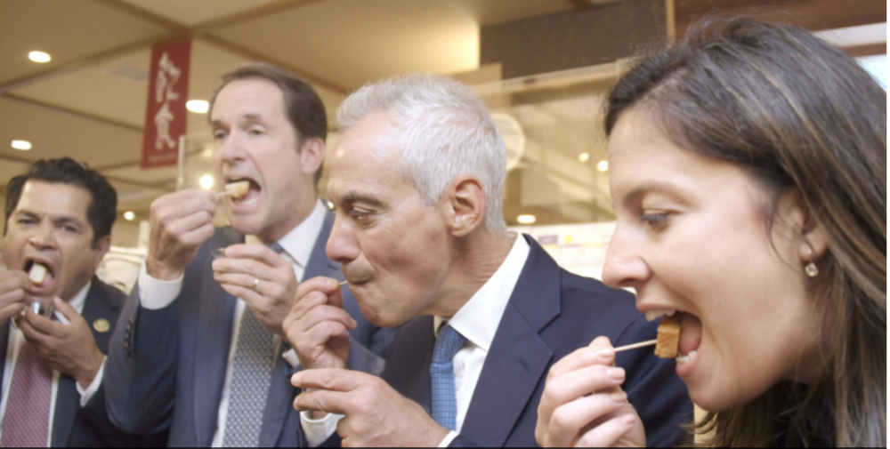

# 日媒放风：美大使馆拟支援日本水产商，为其介绍中国大陆以外加工地

【环球网报道】为全面防范日本福岛核污染水排海对食品安全造成的放射性污染风险，中国自8月24日起全面暂停进口原产地为日本的水产品。日本共同社9月16日放风称，据美国政府相关人士15日透露，美国驻日本大使馆正探讨携手日本政府为扇贝水产商提供支援，介绍中国（大陆）以外的水产品加工地。

报道炒作称，驻日大使伊曼纽尔“强烈谴责”中国暂停日本水产品进口措施，并对遭受打击的盟友——日本的水产商，有意展现出支持姿态。

共同社继续说，日本捕获的带壳扇贝出口到中国（大陆）后经过加工，不仅在中国国内消费，还会再出口至美国等第三方。美国驻日本大使馆力争建立一个机制，通过介绍台湾地区、泰国和越南等地在美国食品药品管理局（FDA）注册登记的加工设施，使得对美等国的水产品出口能够维持。

报道还说，据称，在中国（大陆）加工后再出口到美国的日本扇贝去年达到1亿美元以上。美国大使馆本月派遣职员赴北海道，与扇贝相关的日本水产商会面，商议如何确保日美之间不经由中国（大陆）的水产品流通路径。

_美国驻日大使伊曼纽尔（右二）及美国众议员等9月4日还在东京都中央区吃用福岛县产鱼类制作的鱼糕。图自日媒_

在一片反对声中，美驻日大使伊曼纽尔还曾于8月31日专程前往福岛吃海鲜，给日本核污染水排海“站台”。不仅如此，伊曼纽尔还无理指责中国对日本实施“经济胁迫”，声称如果日本将中国告上世界贸易组织（WTO），美方将予以支持。伊曼纽尔的“吃播秀”在日韩社交媒体上遭到猛烈批评。有分析认为，美方嘴上说着“道义”，心里全是生意。从更深层看，美国纵容日本排污入海，与经济利益和地缘政治利益交换有关。

中国外交部发言人汪文斌9月1日表示，那些口头上表示支持日本的国家恰恰是进口日本水产品数量下降最多的国家。如果日方尊重科学，为什么日本国内有高达四成的民众明确反对核污染水排海？为什么多达八成的日本民众对此表示担忧或不满？中方主管部门对原产地为日本的水产品采取紧急措施，这是维护食品安全和公众健康的正当、合理、必要之举。包括韩国、俄罗斯、马来西亚、泰国等在内的地区国家也都采取了相应防范措施。难道日方可以向全球转嫁核污染风险，其他国家就不可以采取维护海洋环境和民众健康的应急保护措施吗？天下哪有这样的道理？日方声称中方是唯一反对福岛核污染水排海的国家，这纯属罔顾事实、颠倒是非。必须指出，如何处置核污染水，绝不是日本一家私事，也不仅仅是个别国家之间的事，而是事关污染海洋还是保护海洋、破坏环境还是呵护环境、危害人类健康还是维护人类健康的重大问题。在这个问题上，日本需要面对的，不是哪一个国家，而是整个国际社会。日本应该做的，不是以受害者的面目“鸣冤叫屈”，而是以加害者的身份检讨反省。

