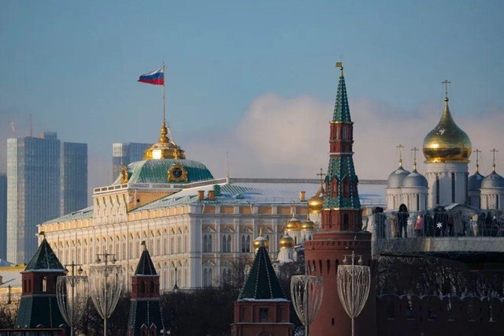

# 时隔10年俄罗斯再提远东大开发战略，普京有何最新规划

刚刚过去的一周，第八届东方经济论（EEF）在俄远东城市符拉迪沃斯托克举行。俄罗斯远东地区，再度成为与会各方关注的焦点。

在本届论坛上，俄总统普京通过演讲具体勾勒了俄罗斯的远东规划，并强调远东对俄罗斯来说是整个21世纪的战略重点。这是俄远东地区战略规划生效10年后，普京再度强调远东地区对于俄经济发展的重要性。

东方经济论坛，由普京2015年亲自倡议举办，每年他都会到会并发表主旨演讲。论坛网站信息显示，9月11~13日为期3天的论坛以“走向合作、和平与繁荣”为主题，涉及招商投资、改善营商环境、加强俄远东与亚太发展合作等诸多内容。

兰州大学政治与国际关系学院副教授韦进深韦进深告诉第一财经记者，作为一个地跨欧亚两洲的大国，东方政策一直是俄罗斯外交政策的重要组成部分。“进入21世纪以来，尤其是2008年金融危机以来，俄罗斯加快了远东地区发展的步伐。”他说，“普京政府的远东政策更多的注重地区开发和经济发展的考量。”

**俄远东发展规划**

普京在演讲开篇提到，近些年来国际经济发生了巨变，且这种变化还会持续，“一种新的双边关系和融合的模式正在诞生。正是在这种模式下，创造力、开放性和对发展的关注成为了亚太地区强大的比较优势，这是决定亚太地区的经济增长率冠绝全球的关键因素，世界的未来将属于亚太地区。”

普京给出的数据显示，俄罗斯与亚太国家的贸易额去年全年增长了13.7%，而在今年上半年，又增长了18.3%。他希望俄罗斯与亚太地区国家的贸易和经济关系能够继续发展，并强调，俄罗斯的远东地区对加强与亚太地区国家的贸易和合作关系持开放的态度，这种合作的潜力不能被低估。

公开数据显示，远东地区占俄罗斯联邦领土的40%，资源禀赋丰富，汇聚了俄近50%的森林和黄金储备，超过70%的鱼类、钻石，以及超30%的钛、铜等矿产资源。然而，由于大片土地位于北极圈及周边，再加上资金、人力和基础设施匮乏，其发展远落后于俄罗斯西部地区。该地区的资源勘探比例平均仅为
35%。

普京认为，许多经济发展所需的稀缺战略原材料，远东地区应有尽有，这是俄罗斯经济屹立不倒的强大底气。

对于远东地区的具体规划，普京表示，推出支持远东产业发展的特殊优惠政策，继续深化“自由港”和“超前区”法案；加大对远东地区的矿产资源开发；改善对远东地区的投融资环境，启动定向发展远东的联邦级集群投资平台；加大对远东地区的能源供给，全面构建面向远东的超级能源管道工程；重点建设远东地区的交通设施，扩大现有的物流和货运通道；突破人口瓶颈，让远东地区人口可持续增长；此外，完善远东地区的城市人居环境。

俄最早将远东地区的发展提上议事日程还要追溯到10年前。2012年初，也就是普京开启第三个总统任期后，俄政府正式成立远东和北极发展部，一年之后（2013年），《俄罗斯远东和贝加尔地区社会经济发展国家规划》生效，标志着酝酿已久的俄新一轮远东开发战略进入实施阶段。

**力邀中资参与俄远东地区开发**

10年来，通过政府对远东地区的发展支持以及东方经济论坛的带动效应，普京给出的数据显示，俄企业总共已签署了价值超过7.7万亿卢布的相关投资协议，其中已落实的投资额达3.4万亿卢布。远东的开发项目为俄罗斯带来新增就业岗位12.5万个，新开工企业约700家。在远东地区出现的开发项目包括世界上最大天然气加工厂之一的阿穆尔州天然气化工厂、纳霍德卡矿物化肥厂大吨位造船厂等标志性项目。此外，乌多坎斯科耶铜矿厂、拜姆斯科耶铜矿、马尔梅日斯科耶铜矿等也是俄在远东的重要开发项目。

10年来，俄远东海港的货物周转量增长了1.6倍，房屋建成量增长了1.3倍，耗电量增长了1.2倍。远东地区的黄金年产量增长了1.6倍，煤炭产量增长了2.8倍。

同时，远东地区的投资增长率比全俄罗斯的平均投资增长率高出三倍。2014年到2022年，全俄固定资本投资增长率为13%，远东地区的增长率则为39%。

就在本届论坛开幕前夕，全俄社会舆论研究中心9月6日在其官网上发布的一项国内民意调查结果显示，高达67%的受访者支持俄“转向东方”外交政策，即优先发展与东方国家关系而非与西方国家关系。与此同时，65%的受访者认为包括开展重大投资项目、创建合资企业等在内的经贸合作有助于俄“转向东方”政策更加成功。

近年来，外国资本也活跃在俄远东地区的开发建设中。据俄远东和北极发展集团统计数据，在远东超前发展区和符拉迪沃斯托克自由港，正在落实87个外资参与的项目
，其中52个项目有中国投资者注资，总投资额达到108亿美元 ，这些项目涉及工业、采矿、农业、建筑、运输和物流。

据新华社报道，在今年3月中俄签署的关于《2030年前中俄经济合作重点方向发展规划的联合声明》中就提及，双方要深挖两国地方合作和边境地区合作潜力，提高实效，发展中俄“东北－远东”地区互利合作。

商务部网站显示，在中俄签署的俄罗斯远东地区合作发展规划（2018-2024年）中，据俄方统计，中国多年来是俄远东地区第一大贸易伙伴国。

对于中俄在远东地区的合作，韦进深认为，双方在基础设施建设、边境口岸贸易、工业园区建设以及旅游、人文交流等方面均取得不错的成绩。未来双方的合作交流还有更大的发展潜力和发展空间。

2022年，中俄双边贸易额达到创纪录的1902.71亿美元，同比增长29.3%，中国连续13年稳居俄罗斯第一大贸易伙伴国。此前，中俄双方制定到2024年实现双边贸易2000亿美元的目标。

