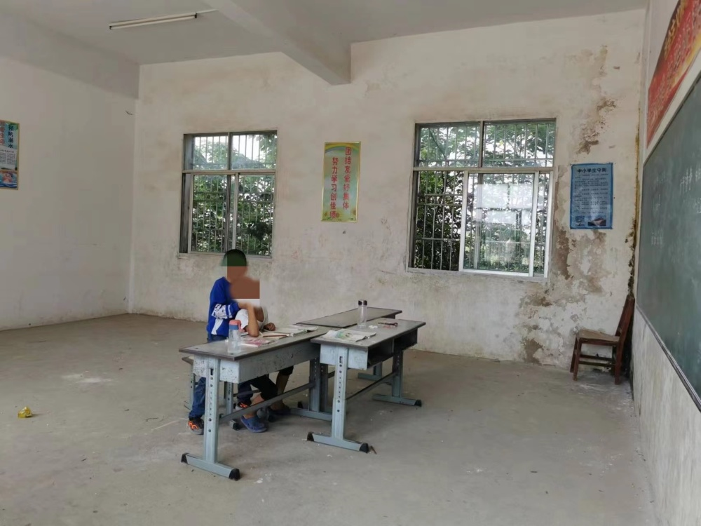
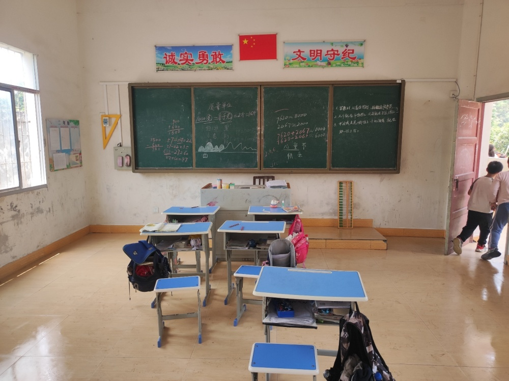
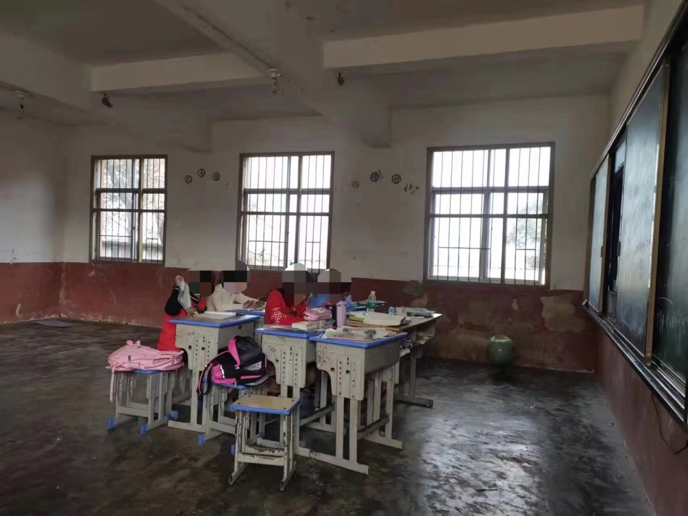

# 有学校只有一名学生，小规模乡村学校何去何从？学者：应集中生源

一所没有学生的村小，因没有老师被村民举报，最后配备了一位校长。一个人守着空荡荡的校园，与翻新后的教学楼一起，等待着没有定数的学生到来。

这是周新成在调研中遇到的真实案例。他是武汉大学社会学院的博士生。两年前，他和武汉大学中国乡村治理研究中心团队开始聚焦小规模学校撤并的议题。今年9月13日，他在研究中心官方公众号“新乡土”上发布《小规模学校，何去何从》一文，引发广泛关注。

在乡村，人数不足100人的学校会被划为小规模学校。他们调研发现，近年村小生源不断流失，多地区的小规模学校人数跌至个位数，有的学校甚至只有1名学生。与此同时，资源却不断向村小倾斜，教师、财政资金积聚于此。村小的老师们觉得像在给村民“看孩子”，崭新的多媒体教室等待被舍弃。现实的另一面是，老师们拼命向县一级流动，资源向村一级富集，乡镇学校不断被挤压。

周新成和团队成员认为，接下来几十年渐进式城镇化发展进程中，乡镇是乡村教育的重要载体。将资源适度向乡镇中心学校集中，提高乡镇学校的教学质量，撤并学生数量下降到一定数值以下的小规模学校，集中生源，这或许可以成为一个较优的解法。

_一所小规模学校，教室里摆放着2张课桌和1张教师办公桌。图/受访者提供_

**对话周新成。**

**【1】小规模学校主要在中西部**

**九派新闻：如何关注到乡村小规模学校撤校合并的议题？**

**周新成：** 2021年9月份后，我们团队就在做“一老一小”的项目，我主要聚焦乡村教育方向，在中西部做相关问题的研究。

**九派新闻：为什么聚焦中西部？**

**周新成：**
中西部很多省份如河南、江西，不少县域搞教育城镇化较为激进，推着农民进城买房，吸引资金办民办教育，把房地产给炒起来了。我国小规模学校也主要集中在中西部地区。我们去河南走访时发现，有的村组只剩两三户村民没有在县城里买房了，这就导致村一级的教育越来越差。

2012年，我国出台了遏制撤点并校的举措，大量的财政下乡，将村小翻新得很好，师资配备也很充足。但近年来，随着生源的流失，很多村小的减少至个位数，甚至出现了4个老师带5个学生的局面，很难形成教学秩序。

**九派新闻：调研过的乡镇中，村小人数如何分布？**

**周新成：** 一个有12所村小的乡镇中，仅有1所有百余名学生，其余11所人数不足15人，其中8所人数在5人以下，部分学校只有1名学生。

有些5名学生的学校，会配备4名老师。一个更夸张的例子是，学校已经没有学生了，也就没有老师了，有村民就此投诉，地方政府便派了一个校长过去守着。

在乡村振兴、资源下乡背景之下，大量的中央与地方财政资源投放到乡村教育领域。国家投入了大量的财政资源，建设小规模学校的基础设施，更新教学设备。与此同时，学生却不断流失。一些地方小规模学校刚修缮好却已经没有了学生。

**九派新闻：这会导致怎样的局面？**

**周新成：** 不仅是对小规模学校，对整个乡镇的学校都会有负面的影响。

有些省份，从师资总体比例来看，是符合国家标准的。但如果分为县、乡、村三级具体来看，4个老师去带了村小的5个学生，加上很多乡里的老师往县里流动的意愿强烈，那么乡镇小学的师资就被挤压，成为最薄弱的环节。曾经有乡镇的干部调侃，说小规模学校老师带的学生，比我们的硕博的老师带的学生还少。

在一个镇中学小学，我们发现孩子们的数学成绩很差，孩子们说：他们的数学是体育老师教的。这不是玩梗，是因为他们的数学老师被调走了，他们没有数学老师。

乡小的教学质量下降后，很多家长就会想，反正到乡里面上学也不方便，还不如一步到位直接到城里面上学。这就形成了恶性循环。

_一间小规模学校教室里，较新的地板和课桌。图/受访者提供_

**【2】小规模村小老师“觉得在帮村民看孩子”**

**九派新闻：从2021年9月至今，你持续2年的调研中，村小的生源流失明显吗？**

**周新成：**
村小的生源流失是一种自然状态，每年都会有学生升学，加之入学人数减少，有的学校慢慢就变成了无人小学。我们调研的很多学校，只是教学点，因为它可能只有一到三年级，四到六年级就要去中心学校寄宿了。

**九派新闻：小规模学校的生源和师资呈现出哪些特征？**

**周新成：**
在我们的调研中，中西部地区尤其是山区，留在小规模学校的孩子，基本都是“三特”家庭：特殊体质、特殊心理、特殊家庭。我们遇到一个读三年级的女孩，她妈妈身体不好在家休养，爸爸天天去钓鱼、打麻将，她还有两个哥哥在县城读职校。

村小的老师要么刚毕业没多久，要么已经准备退休了。年轻的老师觉得自己就是在帮村民看孩子，加上村里很难解决婚恋问题，特别想考走。

年纪大的更是在看孩子。我们团队成员在调研中甚至发现，一些接近退休的老师都不管小孩，因为他们害怕把小孩弄不高兴了，求着父母转到乡镇学校，教学点就要被撤了。

我们碰到过一些极端的例子，有老师上课就放电影，有的孩子到了初中，连名字都不会写。

**九派新闻：所以小规模学校，它更多承担的是一个照料的责任？**

**周新成：** 就是这样的，它很难承担起教育的责任。

有老师给我们提供的数据显示，一个五六年级的班里，数学成绩及格的只有一到两个人。这些孩子们到了乡镇的中学后，又怎么可能跟得上？

**九派新闻：从教育科学层面，小规模学校会对孩子的成长造成哪些影响？**

**周新成：**
孩子的成长一定要有同辈群体的社会化，只有在跟同辈群体交流中，他们才能习得更多的规范。另外，他们会模拟成人的状态，如果你让他们看到的全是父母离异，或者成天赌博打麻将，他们怎么去习得成人的规范？

只有到了一个同类群体比较多的地方，比如乡镇学校，他们看到老师是怎么跟别人交流的，会去观察、模仿，然后在同辈之间实践。为什么我们强调完善寄宿制？很多农村学校，家庭在教育里事实上是缺位的，需要学校承担起更多的管理责任。

_4名小规模学校的孩子在教室内自习。图/受访者提供_

**【3】撤并小规模学校有利于财政向乡镇学校倾斜**

**九派新闻：为什么说小规模学校的撤并势在必行？**

**周新成：**
随着城镇化的发展，村小生源流失已经是不可逆的趋势。保留具有一定规模的乡村学校，动态有序撤并学生数量下降到一定数值以下的小规模学校，可以使有限的财政资源向乡镇学校倾斜投入，振兴乡校。

**九派新闻：有网友提到，可以划“片区”合并。**

**周成新：**
我们从经验中也看到了“片小”这个选项，比如在几个边远村子的中间地带留一个小学校，把原来几个小规模学校的资源集中起来，实现优化。这也是一个方向。

**九派新闻：撤并小规模学校的同时，需要跟进哪些建设？**

**周新成：** 通过各方面的生源政策为乡镇中心学校留住生源，同时也要通过指标到校的政策，为孩子们提供升学的空间，避免农民家庭仅有村和城两个选择。

资源集中也很重要。撤并小规模学校后，更多的资金可以用于完善寄宿制度建设、校车接送制度、增强贫困生专项扶持、支持乡镇就学、设置特殊儿童保障制度，提高孩子们的上学质量，降低农村家庭的上学负担。

**九派新闻：有值得借鉴的例子吗？**

**周新成：** 四川的一个乡镇小学把寄宿制做得很好。他们新校长上任后，马上申请项目翻新了宿舍楼，并要求校长老师每天陪餐，来提高食堂的质量。

对于想要向县里流动的老师，学校制定了激励措施。如果老师在几年内达到了教学评比前列水平，促进了班级成绩的提高，学校也愿意帮忙推荐。两年内，这个学校就回流了一两百个学生。

**九派新闻记者 陈冬艳 实习记者 郑宏颖**

**编辑 刘萌**

【来源：九派新闻】

版权归原作者所有，向原创致敬

