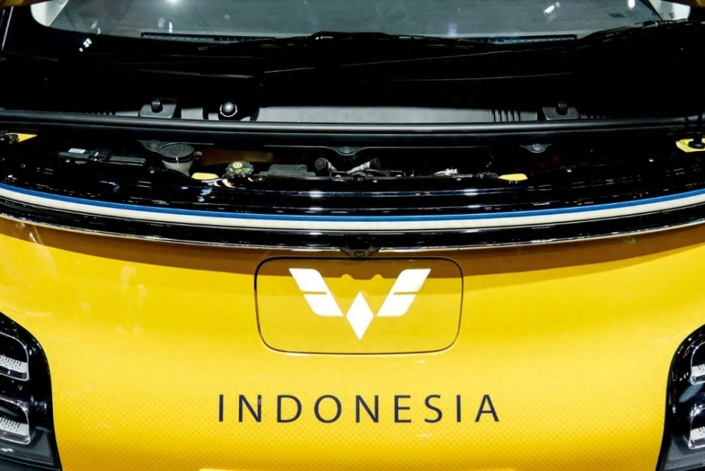
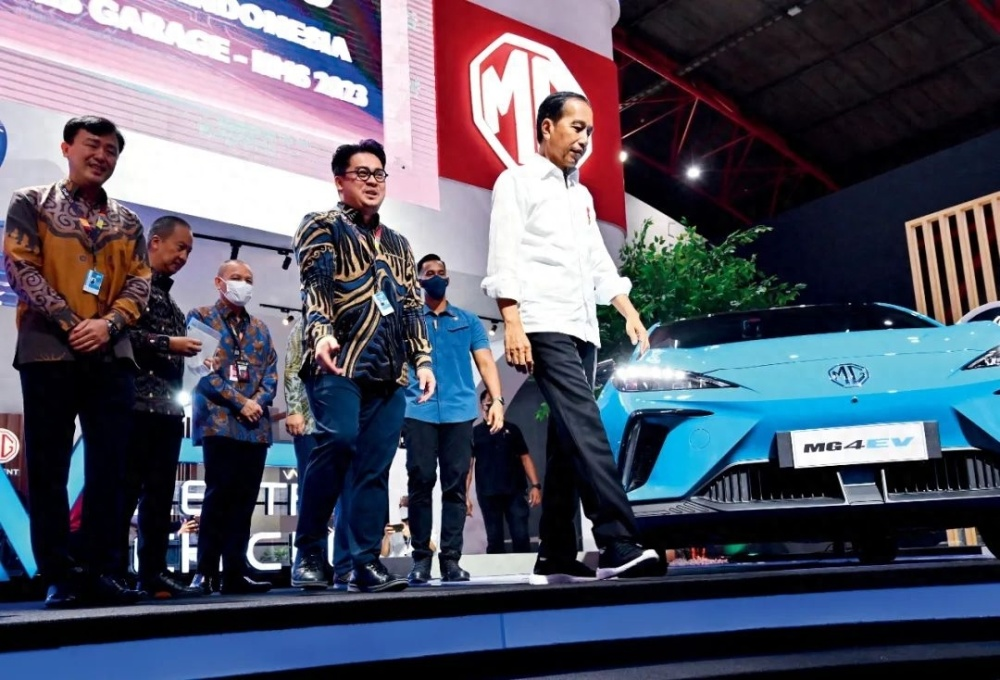
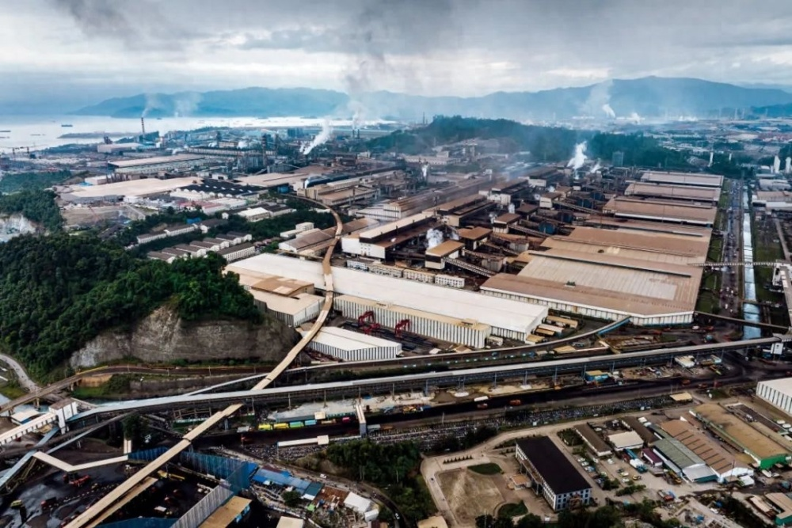
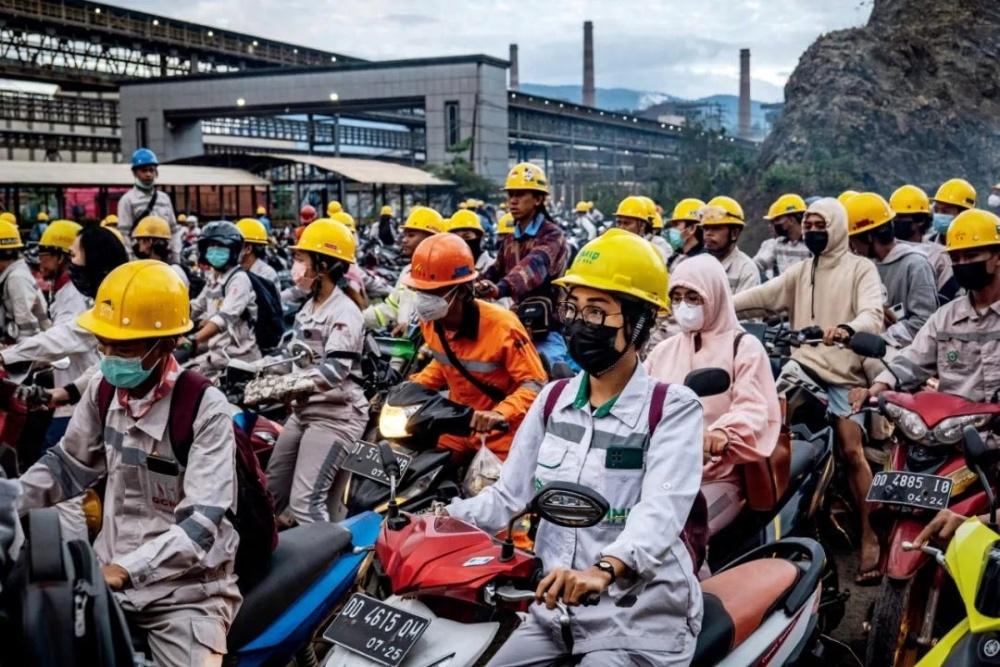
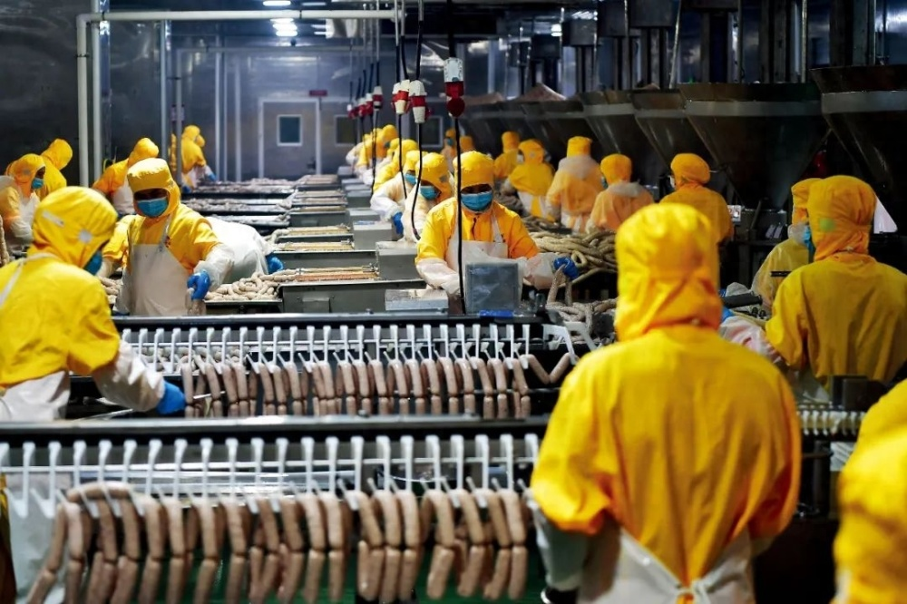

# 蜜雪冰城在这国开了1500家店 五菱拿走近八成电动汽车市场份额

“东南亚流行一个段子，说的是你必须留意你家附近的任何闲置空间，因为它很快就会变成一家新的蜜雪冰城门店。”这是今年7月18日印尼《雅加达邮报》一篇报道中的描述，文章称，在印尼，蜜雪冰城已经成为社交媒体上的热点。

“据蜜雪冰城印尼公司的特许经营经理安迪·迈特里·哈坦托介绍，截至3月，该公司在印度尼西亚已有约1500家门店，该公司希望在今年年底之前将其在印尼的业务扩大一倍。”《经济学人》杂志也关注到这一现象，称“该品牌的鲜红色标志和雪人logo已经遍布印度尼西亚的商场、尘土飞扬的小巷和商店”。

_印尼街头，人们在蜜雪冰城门店外排队。（视频截图）_

在国际媒体看来，这不仅仅是一个商业上的成功故事，它还可能以软实力的方式，成为两国关系的“大使”。蜜雪冰城在印尼爆红并非偶然，一向在出海圈“闷声发大财”的印尼今年突然被推到了C位。

“春节过后，国内来印尼的考察团呈现爆发式增长。”仅上半年，印度尼西亚中国商会总会接待的省部级官员带队考察就有四场，都是为中资企业出海打前站。

印尼投资部门数据显示，2023年第一季度投资实现额达到328.9万亿卢比，约合221.9亿美元，同比增长16.5％，环比上一季度提高了4.5％。来自中国香港和中国内地的投资额分别排名第二、第三，仅次于新加坡。

这个坐拥世界人口第四的千岛之国，已经默默成长为东南亚第一大经济体。2022年，印尼GDP总量位居东南亚各国之首，高于泰国和新加坡GDP总量之和。

自今年1月2日起，《区域全面经济伙伴关系协定》（RCEP）对印尼正式生效。印尼在中国—东盟自贸区基础上，新增给予中国700多个税号产品零关税待遇。“巨大的人口红利和消费市场，有待填补的产业空白，离中国近。”印尼中国商会总会常务副主席刘城细数印尼对中资企业的强势吸引力。

这个自古以来华人下南洋的目的地，在不断叠加的政策利好加持下，正成为中资企业出海最热门的目的地之一。

“RCEP带来的更大利好，一个是促进贸易投资自由化、便利化的范围扩大了，扩大到了本地区一些其他国家。再一个是理念上的一种纠偏。现在世界范围内出现了一些逆全球化的势头，甚至有人想带偏节奏。在这样的背景下，RCEP的达成和全面生效，更加坚定了本地区主要经济体继续致力于全球化发展、通过合作来促进地区繁荣稳定的方向。”中国驻印尼大使陆慷在接受《中国新闻周刊》专访时表示。

 _2022年8月12日，印尼雅加达郊区一次车展上的_

**“全家桶”式抱团出海**

在全球“堵城”雅加达，每天有超过2000万辆机动车行驶在路上，还有数百万人往来于印尼首都雅加达和卫星城。身形小巧灵活的“秋名山五菱”正成为新一代街车。

在印尼汽车市场上，中国品牌的电动汽车也正在打破过去由日系汽车绝对垄断的局面。

印尼汽车工业协会数据显示，2022年，中国五菱汽车占据印尼78％的电动汽车市场份额，韩国现代汽车收获了20％的份额。2023年5月印尼新车零售量数据显示，五菱依然是前十品牌中增长最快的，同比增长198％，初入印尼市场的另一款中国品牌奇瑞，排名第12。

受困于交通拥堵和空气污染等问题，印尼这个东南亚汽车保有量第一的国家，正在朝着电动化转型。按照印尼政府发布的规划，从2040年起销售的所有摩托车都将是电动的，从2050年起销售的所有新车都将是电动汽车。中短期来看，其计划2025年实现本地生产汽车的20％为电动汽车。

“日系车因布局时间早，至今仍在印尼拥有超过九成的市场份额，但日系以油车为主，电动转型给中国品牌开拓印尼市场提供了契机。”上汽通用五菱印尼汽车有限责任公司副总经理韩德鸿告诉《中国新闻周刊》，目前主要是中、韩两国品牌在争夺印尼的新能源汽车市场。

2022年，东南亚六大经济体的新能源乘用车年销量增至逾5万辆，对比2021年仅约1.6万辆的年销量，增长速度可谓惊人。

_2023年2月16日，印尼雅加达，印尼总统佐科（右一）走过车展上的_

而对印尼来说，发展新能源不但有市场，更有资源。印尼镍储量居世界首位，根据印尼能矿部发布的《印度尼西亚镍投资机会》资料，印尼的镍储量为7200万吨，占世界镍总储量的52％。

为摆脱资源型国家只能做原料供应的简单角色，印尼进行了一系列产业链本土化战略升级。2014年，印尼曾发布禁令，全面禁止未经加工的原矿出口，包括镍矿与铝土矿在内的多种原矿必须在本地进行冶炼或精炼后方可出口。

“当时国内不锈钢行业对印尼镍的需求超过60％，原矿出口被叫停，倒逼中国不锈钢相关矿业企业将工厂前置。”刘城回忆说，更早一批出海的青山、德龙等中资企业已完成前期投资建厂，成为行业头部，镍铁产业本地化后，填补了印尼在镍铁冶炼技术和产能上的空白。

今年7月28日，印尼总统佐科出席成都大运会开幕式并访华，主持了“中国企业家与中国印尼商会圆桌论坛”，并欢迎中国企业积极在印尼开展新能源汽车、可再生能源等领域的合作。

“通过一系列政策引导，印尼正将镍产业链价值最大化，计划打造世界动力电池中心，进而深度参与全球电动汽车产业链。”刘城分析。

2021年3月，印尼推出了《新投资清单》，汽车作为“优先发展行业”之一，可享受企业所得税减免、进口关税优惠等税收优惠，便捷取得营业执照、提供配套基础设施、保障能源和原材料供应等非税收优惠。

今年3月，印尼发布了补贴方案，将涵盖20万辆电动摩托车和3.59万辆电动汽车的销售，以及5万辆传统汽油车的改装。

印尼政府对电动汽车的补贴则以减免增值税的方式提供，即对于参与印尼工业部计划的国产率超过40％的电动汽车品牌，印尼政府将免除其10％的增值税，企业只需缴纳1％增值税即可。五菱汽车是目前获得这项补贴的两家企业之一，另一家是韩国现代。

刘城发现，此前的中资企业出海，主要围绕工程建设和镍矿冶炼，而这次印尼主导镍产业链升级，带动了新一轮以“新能源”为重点的中资企业出海热。

2018年以来，亿纬锂能、盛新锂能等锂电池材料企业陆续落地印尼，宁德时代、国轩高科等中国电池巨头也开始布局在印尼的锂电池产能。

“五菱在印尼做了全产业链投资建设，我们把电机、电控等核心供应商一起带到了印尼。”韩德鸿介绍，在印尼西爪哇省工业区的汽车聚集区，五菱购置了一片60公顷的土地，其中一半用来建设整车工厂，另一半用作零部件园区。

汽车企业进行“全家桶式”抱团出海，也是受益于RCEP协定。“按照框架协定承诺，印尼对纯电新能源汽车零部件进口实行零关税政策。”韩德鸿表示，未来还会引进更多新能源汽车车型，邀请更多上游供应链到印尼投资兴业。

**“就像90年代的中国，遍地机遇”**

在过去50年里，雅加达的城市化进程突飞猛进。在快速发展模式下，非正规居住区被清理，为城市开发让路。一些人则被遗留在运河和水库沿岸——雅加达最后的未开发地区。

全迅超的办公室就位于西防洪运河大桥与城市主干道坦林路的交汇处，可以一眼看尽城市的过去与未来。

沿着坦林路向北走到老城区，仿佛回到半世纪以前，随处可见低矮破旧的老建筑，沿街摊贩展示着廉价批发的小商品，当地人席地而坐，谈笑风生。而朝南跨过西防洪运河大桥则是雅加达最繁华的苏迪尔曼大街，高楼林立，绿荫夹道，尚未开通的轻轨和唯一一条地铁成为现代化新城的科技装饰。

这种极端反差也体现在印尼的人力市场上。“一端是为头部企业匹配高度国际化人才，另一端是海量蓝领劳工的求职与招聘需求，没有中间层。”数智方（DALLIGENT
SOLUTIONS）首席运营官全迅超说，2021年底，该公司孵化出了服务于东南亚蓝领及零工市场的招聘平台KUPU。

印尼的产业集中在制造业和低端服务业，即“新蓝领和初级白领”在供需两侧的市场都比较大，但印尼却并没有针对这一群体的招聘公司。全迅超说，印尼多数企业还不具备自营互联网网站来引流、招聘的能力，此前市面上唯一一家大型招聘公司是澳大利亚seek集团的Jobstreet。“又贵，又不好用，很多生意伙伴都来问我，什么时候能做个互联网招聘平台，快把Jobstreet干掉。”

全迅超已经在印尼生活了十四年，拿到印尼金光集团的天使投资后，KUPU准备在印尼大干一场。

人口红利是印尼最被看重的优势之一。据最新调查数据结果显示，截至2022年11月，印尼总人口数达2.7亿，仅次于中国、印度和美国，排名世界第四，东南亚第一。从人口年龄分布来看，印尼15岁至64岁的人口数量占比高达70％。另据KUPU统计，印尼劳动人口占比高达60％以上。

另一方面，印尼的移动互联网普及率高，具备发展互联网招聘的基本背景条件。有数据显示，印尼活跃互联网用户达1.5亿人，占总人口的56％，其中移动活跃互联网用户高达1.4
亿人。

“印尼是东盟政治环境最稳定、与中国关系升温最快的国家，可以说是‘一带一路’上最被看重的出海目的地。”全迅超接待了一轮又一轮前来考察的中国商团，见证了中资来印尼从集中在某几个领域到全行业开花的过程。

_2023年1月21日，印尼中爪哇省三宝垄，模特们穿着中国风服装参加中国新年时装秀。图/视觉中国_

2013年，中国先后提出共建“丝绸之路经济带”和“21世纪海上丝绸之路”的重大倡议，中国与印尼建立全面战略合作伙伴关系。“此后，中资企业布局印尼明显提速。”刘城说。

同一年，青山控股率先到印尼布局矿业，江苏德龙集团也于2014年开始筹建印尼德龙工业园区。目前两家工业园都已成为中国和印尼共建“一带一路”的重大项目。OPPO也于2013年进入印尼市场，经过十年发展，已成为印尼市占率第一的智能手机品牌。

OPPO前CEO李杰为解决手机在东南亚的配送问题，创办了印尼本土快递极兔，两年内做到印尼快递行业单量第一、全东南亚市场第二。随后，李杰团队在印尼又孵化了美妆品牌Y.O.U，为极兔带来源源不断的订单。

2014年，佐科就任总统。“佐科上台后，大力发展城市基础设施建设、稳定政局、改善营商环境，同时保护本国核心资源，将镍冶炼产业链本地化，吸引了大量上下游企业前来，填补了印尼工业生产的诸多空白。”刘城说。在社交媒体INS上，佐科坐拥5500万粉丝，曾被评为INS最受关注全球领导人第五名。

中国商务部数据显示，2022年中印尼双边贸易额近1500亿美元，前三季度中国对印尼直接投资额达51.9亿美元，同比增长128％，中国继续成为印尼最大的贸易伙伴、进口来源和出口市场。

“印尼这十年，就像90年代的中国，遍地机遇。”KUPU企业战略主管Max补充说，但又无法与中国的年代发展一一对应，印尼每个行业的发展速度参差不齐，例如印尼在去年已经实现全国统一的二维码支付，数字经济推广速度极快，但其工业体系建设尚不健全。

今年春节后，大批中资企业涌向印尼。“以IT人员为代表的印尼新中产即将发展壮大。”全迅超又看到了新的增长点：为新兴企业物色中等技术人才。

“印尼用工市场的成长空间巨大，我们希望中国团队将过往积累的技术经验、运营理念、管理模式和成果带来印尼，填补行业空缺。”全迅超说。

**用不卷的方式在印尼赚钱**

说到给中资企业在印尼发展的建议，印尼中华总商会主席张锦雄建议：“第一要守法，第二更要尊重当地风俗文化。”

尽管印尼信奉的宗教众多，但80％的民众以信奉伊斯兰教为主。

英国作家伊莉莎白·皮萨尼在《印尼Etc:众神遗落的珍珠》中分析，印尼的城市化和人口迁移冲淡了昔日支撑大众生活的部落制度和集体文化，但是宗教信仰重新为人们创造了一个熟悉安适的世界，并且成为某种鲜明的身份标记，还可以将宗族观念强烈的印尼人凝聚在一起。

自苏哈托时代以来，印尼每位国民都必须在身份证上注明宗教信仰。伊斯兰教规定，每个穆斯林每天应祈祷5次：分别是凌晨4点、中午12点、下午3点、晚上6点和7点左右，每次祈祷大约10~15分钟。

KUPU在印尼的办公区，专门为穆斯林员工设置了礼拜室。MAX介绍说，该公司的推广中心设在印尼，99％的员工是当地人，其中大部分对宗教信仰极其虔诚，上班时间通常会赶上中午和下午的两次礼拜时间，如果公司不提供场地，员工跑到外面做礼拜，反而不利于管理。

不只是多宗教国家，印尼还有上百个民族，200多种民族语言，和数不清的节日。企业不但要给员工放假，还要支付宗教节日津贴，不同工龄员工的津贴发放金额不同。企业如果在节日来临前7日内不进行支付，则有被罚款的风险。

此外，印尼法律对加班有着非常明确的规定。工作日加班的第一个小时，是时薪的1.5倍，之后每加班一小时，是时薪的2倍。如在休息日或法定节假日加班，计算方法又有所不同，且加班必须取得劳动者同意。“当地人热爱生活多过工作，到点下班，加钱都不来加班，一点都不卷。”Max说，当地最常见的一句口头禅是，“不是还有明天吗？”

不了解印尼风俗的中国企业家对此很是挠头，甚至会简单粗暴地得出结论：当地人不上进，不爱工作，没事就休假，做事拖沓，工作效率低。

印尼当地人同样不理解，“从早到晚只想钱，过着吃饭、赚钱、睡觉、赚钱、翘辫子的生活，究竟有什么意思？”

印尼更像是一个自足的世界。地处赤道的印尼横跨了三个时区，由一万七千多座岛屿构成，这片季风吹拂的土地只有旱雨两季。尽管印尼国土面积只排在世界第十五名，但却拥有富饶的土地。为当地孕育了产量甚丰的稻田，许多地方每年可种三季稻米。棕榈油、橡胶、咖啡、茶叶、烟草等经济作物产量排在全球前列，煤炭、镍等矿产资源丰富，还有太阳能、风能、地热、洋流能等丰富的再生资源潜力。

但其中大部分人的日子过得并不算富足，可他们并不着急，悠闲度日，如有余钱，也都拿去消费，而非储蓄。英国作家伊莉莎白·皮萨尼观察发现，“印尼有三分之一的年轻人全然不事生产，五名成年人当中有四个人没有银行账户，银行却不断借钱给民众买东西，而非让他们拿去创业。”

“关键是能否理解当地民俗，把企业管理和当地文化结合好。”刘城举例说，OPPO进入印尼后聘用了大量本地员工，经常组织活动，一大帮年轻人唱唱跳跳，活力十足，同时也靠当地年轻员工地推品牌和扩展门店，很快占领了手机市场。

即便是KUPU这家互联网公司，最初推广时也养了上百人扫街地推、组织各种线下活动，触达商家后，再结合线上推广。“印尼一定要靠线下渠道获客，国内那套裂变营销、私域流量的玩法在印尼行不通。”全迅超说。

_位于印尼中苏拉威西省的中国印尼综合产业园青山园区。图/视觉中国_

 _2023年8月2日，中国印尼综合产业园青山园区的员工在换班。图/视觉中国_

**“在东南亚，为中国”**

在国际舞台上，印尼一度被视为纯粹的“旅游目的地国家”，十年前还被摩根士丹利称为“脆弱五国”之一。如今，贴在印尼身上的标签正在被“崛起的中等强国”所取代。

在全球性挑战不断增多的2022年，印尼利用二十国集团（G20）轮值主席国身份，开展全方位穿梭外交，成功举办G20巴厘岛峰会。“不结盟”“不选边站”的印尼，不断为本国经济发展创造稳定的外部环境和新机遇。

不少来到印尼的企业，也是被这种力量所驱动。2020年6月，陈日铃在缅甸的箱包生产工厂再次接到大客户亚马逊的通知：尽快搬迁到低风险国家印尼。

陈日铃的箱包产品主要出口海外，2017年后，面临不出海就出局的抉择，陈日铃将工厂开到了人力成本较低、离广州总部较近的缅甸。

2018年初，印尼新工厂生产线刚铺设完，缅甸工厂就在战火中被烧了。暴乱从清晨开始，工厂联系不到任何外界救援，员工只能翻墙躲进草丛，直到翌日凌晨才全部撤离。这场意外让陈日铃损失了两三千万元，好在没有人员伤亡，说起当时的乱象，陈日铃仍心有余悸。

“来印尼前有很多顾虑，但来了就不想走了。”陈日铃说，1998年的“排华事件”几乎是所有印尼华人心中的痛，迁厂之前，陈日铃想派工人到印尼考察，都没人敢应，最后只能委托一个刚见过一面的代理人，全权代表他去印尼拿地建厂。

但让他感到惊讶的是，仅用了几个月时间，一个全新的箱包工厂就在印尼中爪哇省三宝垄东北部的哲帕拉县（Jepare）投产了。

现任总统佐科上台后，推行了一系列鼓励外国直接投资的政策和举措，例如印尼投资协调委员会（BKPM）开通了投资审批“一站式综合服务系统”（PTSP），涵盖了除金融和石油天然气的1198个领域，大幅简化手续，缩短审批时间。

2021年第 10
号总统令修改了投资政策，将此前20个禁止外国投资的行业缩减到6个。还推出了一份新的优先投资清单，符合标准的投资者将获得财政激励以及多种支持。

“当地人都习惯了华人不会说印尼语，对华人很热情。”今年3月，陈日铃才第一次踏上印尼这片热土，让他意外而欣喜的是，印尼员工爱干净、守规矩，年轻人有活力、新技术学得快，工作效率也比想象的高。新工厂如今月产能达300万个箱包，贡献了60％的营收。

工厂所在地三宝垄距离首都雅加达400多公里，是印尼仅次于泗水、雅加达的第三大港口，如今已成为印尼新兴的工业中心和贸易中心。在印尼总体规划发展的“六大经济走廊”中，三宝垄所处的爪哇走廊被定位于工业与服务业中心。

今年5月，陈日铃拿下了印尼巴塘工业园的200公顷土地，加上后续400公顷土地的二期建设，未来“巴塘—万信达产业园”能容纳五六百家企业入驻，提供约60万个就业岗位，这也是中印尼“两国双园”项目的一部分。

_2023年6月20日，在中国和印尼“两国双园”项目中方园区福建福州新区元洪投资区，工人们在一家食品企业生产线上作业。图/本刊记者 张斌_

“两国双园”是中国同东盟国家间首个经贸创新发展示范园区。早在2021年1月，中国和印尼就签署了“两国双园”项目合作备忘录，确定福州市元洪投资区为中方园区，印尼则采取一园多区模式，确定民丹工业园、阿维尔那工业园和巴塘工业园为印尼方合作园区。

“项目希望以园区为抓手促进中印尼双方经贸合作，实现优势互补、合作共赢。”陈日铃解释说，加入“两国双园”项目，既是为更多中资企业落地印尼铺平前期基建道路，也是解开自己的心结，希望借由国家背书的园区，团结更多中资企业，不再承受动乱惊扰。

今年春节过后，陈日铃已经陆续接待了200多位企业家，以华人为主，未来有意向落地的企业约八成，多为劳动密集型产业。

8月初，福州发布了“两国双园”首批支持政策，集中签约9个项目，涉及投资额近300亿元。“出于对等原则，印尼这边园区也在向当地政府申请五免五减半等优惠政策。”按照陈日铃的规划，未来落地园区的企业将享受“前五年免租赁税、后五年租赁税减半”的待遇。

据印尼投资部统计，2022年中国企业对印尼直接投资达82.3亿美元，创历史新高，位列印尼第二大外资来源国，仅次于新加坡。

“企业出海才能融入全球产业链，从而更好地服务中国。”陈日铃说，只有先出海，继续留在牌桌上，才得以将接近六成的业务留在国内。

浙江振石控股集团也曾对媒体介绍，在境外每投出1元钱，就有7毛来自中国的出口物资。振石控股集团印尼硕石镍铁项目在当地以采购土建资源为主，所需的挖掘机、桩机、板房等设备物资均由国内出口，仅硕石一个项目就能带动企业几十亿元的出口额。

巴厘岛G20峰会期间，中印尼两国领导人曾表示，双方将持续深化“一带一路”倡议同印尼“全球海洋支点”构想对接，继续推进“区域综合经济走廊”和“两国双园”建设；中方将继续鼓励优秀中资企业参与印尼重大基础设施项目建设，助力印尼建设新首都和北加里曼丹工业园，拓展数字经济、绿色发展等合作。

目前，中资企业在印尼投资领域广泛。“印尼主要行业领域的头部企业已经逐步形成，但仍有很多有待填补和挖潜的市场空白。”刘城说，只要印尼环境稳定，中印尼关系持续向好，印尼必然依旧是中资企业“走出去”最为集中的国家之一。

发于2023.9.18总第1109期《中国新闻周刊》杂志

杂志标题：中资出海印尼：“来了就不想走了”

记者：李明子（limingzi@chinanews.com.cn）

编辑：闵杰

