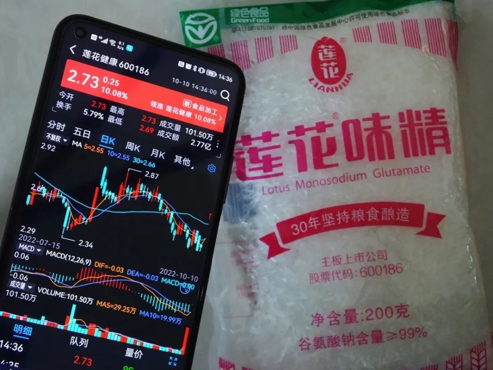

# 被谣言毁掉的莲花味精，凭借79元翻红

随着口碑的逆转，莲花味精也在试图重塑品牌。

**文｜《中国企业家》记者 谭丽平**

**编辑｜米娜**

**头图来源** ｜ **视觉中国**

曾经的“味精大王”莲花味精，正在社交平台上翻红。

“79（元）的（产品）下半辈子能吃完吗？”“松茸鲜怎么用？”“保质期多久？”9月13日晚间，老国货品牌莲花味精的抖音直播间格外热闹：接连与蜜雪冰城、雪莲、幸运咖、相宜本草、上海药皂等不同的老国货品牌连线直播，评论区的互动快速上升，同时在线观看人数最高达2万多人，背景音乐是欢快喜庆的民歌《好运来》，有网友在评论区说：“比春晚还精彩”。

主播显然也被这意外惊喜吓到了，直呼“何德何能让2万人来看我们”，并称 **“一些老粉知道，我们过去的直播间真的只有个位数”**
。在其它直播间接连上演“洗头”戏码之后，莲花味精的主播也“豁出去了”，准备了一口大锅，“人数突破两万五就直播洗头”。见此，网友们纷纷去其他直播间“摇人”。3个小时后，莲花味精抖音账号涨粉过万，总粉丝量突破30万。至9月14日中午，粉丝量已达32.8万。

流量与热度主要源于9月12日。继蜂花后，莲花味精也迅速在官方店上架79元套餐，相关话题登上微博热搜，引发大量网友涌入直播间购买支持。当晚，直播间同时观看人数便涨至1000多人。

如果细心观察，莲花味精的翻红始于更早之前。自今年6月开始，接连有科普博主发布有关“一句谣言，让一家民族企业彻底落寞”的视频，为莲花味精“平反”。这也让不少从小听着“味精致癌”长大的网友发现，原来“味精真的被误解太久了”，甚至鸡精、耗油等调味品中都含有味精，转而去直播间下单或发表评论以示支持。

莲花味精也觉察到了流量的变化。从9月7日开始，便将每日直播的主题改为 **“听说#泼天的富贵轮到莲花味精了！”**
直播间背景写有大大的“0色素、0香精、0防腐剂、0蔗糖”等字样，作为卖点。

_来源：直播截图_

在短视频平台上的翻红，让这个昔日的味精行业“老大”再次走进公众视野。公开资料显示，莲花集团前身是1983年成立的河南省周口地区味精厂，1998年于上海证券交易所上市。巅峰时期，莲花味精曾是全国最大的味精生产与出口基地，产量居世界第一，国内市场占有率高达43.4%。

但莲花味精后来的衰落真的是因为谣言吗？这次凭借口碑的逆转又能否翻身？

谁杀死了莲花味精？

根据目前网络上的说法，莲花味精的衰落很大程度是受谣言的影响。

关于味精的谣言，江湖上流传着很多说法，最深入人心的就是“味精致癌”。对此，一位三甲医院营养科的医生告诉《中国企业家》，这是不科学的说法，“无论是食品药品，都要看剂量、成分，抛开剂量谈毒性都是不科学的”，她表示，
**味精只是调味品，正常吃不会影响健康。**

根据中国科学院此前刊登的一份稿件，美国FDA、美国医学协会、联合国粮农组织和世界卫生组织食品添加剂联合专家组等权威部门的评审表示：味精在食品中的使用没有一定的限制，无需担心其安全性。因为味精的主要成分是谷氨酸钠盐，摄入进入人体后可转化为谷氨酸，谷氨酰胺和酪氨酸，而
**这些氨基酸是人体蛋白质的重要组成单元之一，有着重要的功能。**

不过，上述医生也提示，“味精也是一种隐形盐，对于这类高钠的食品摄入过多也不利于饮食健康，因此每天味精和盐的摄入最好控制在5g之内”。

虽然谣言一定程度上影响了味精行业的发展，但莲花味精后来的败落，也不能全归因于谣言。

这需要从莲花味精的历史说起。在上个世纪90年代，莲花味精厂不仅是河南的一张工业名片，也是全国名副其实的“味精大王”。

周口地区味精厂于1983年成立，13年后的1996年，公司整体改制为国有独资公司。在上市前的15年里，伴随着“莲花味精，味道无可替代”的广告语广为流传，莲花味精也发展迅速。数据显示，在1983年到1997年的15年间，莲花味精的年产量由400吨上升至12万吨，增长近300倍，产值也由945万元增至22.3亿元，为创办之初的236倍，单厂味精产量居世界第一位，国内市场占有率达43.4%。

1998年，莲花味精在上海证券交易所上市。当年，莲花味精的营收是12.21亿元，净利润为1亿元。到2001年时，莲花味精已经是中国最大的味精生产和出口基地。

然而就在2002年，莲花味精突然结束了高增长。《中国企业家》查询其年报发现，当年净利润下滑86.71%，到2003年则直接亏损1.45亿元。莲花味精出现下属公司爆出工人停工、隔月上岗、工资减半，以及控股股东莲花集团占用莲花味精资金等传闻。彼时，混乱之中，身兼莲花集团、莲花股份双料董事长的李怀清提出辞职，隐退江湖。

_来源：视觉中国_

“莲花现在面临五大问题： **体制问题、机制问题、管理问题、技术问题和资金问题。** ”彼时，莲花股份一位中层人士对媒体透露。

之后，莲花集团进入调整期，将亏损严重的下属企业逐步分离，莲花集团也逐步淡出公众视野。在此期间，莲花味精的业绩有所回升，直到2009年净利润实现史上最高的1.91亿元。但之后业绩再度陷入“一年盈利一年亏损”的震荡，到2015年亏损高达5.08亿元。

这期间，莲花味精几度易主。2009年12月，因莲花集团与河南省农业综合开发公司双方的债务纠纷，莲花集团以所持有的公司5400万股股份抵偿给河南农开，莲花集团不再对莲花味精拥有控制权。

2014年，被称为“资本玩家”的夏建统和他的睿康系登场，入驻莲花味精，并于2016年将莲花味精更名为“莲花健康产业集团股份有限公司”。当时，他提出了以“七朵莲花”为板块，未来五年全面进入智慧农业和大健康领域。

原本外界都对有着“哈佛博士”“天才少年”“资本大鳄”等诸多光环加身的夏建统充满期待，但2016年年报显示，莲花健康公司主要业务依然为生产销售味精、鸡精、面粉等，且味精营收占总销售额的67.91%。也就是说，之前所设想的七大业务板块并未扩展开。

最终，夏建统因涉嫌背信损害上市公司利益罪被批准逮捕。而莲花健康也因2017年、2018年连续两个会计年度经审计的净利润为负值，且2018年度经审计的期末净资产为负值，股票于2019年4月29日被监管部门实施退市风险警示。

除了公司自身经营不善之外，莲花味精的溃败也与整体味精行业的衰落有关。据公司财报显示，味精行业历史悠久、用途广泛，生产和使用已超过百年。1950年~1980年期间，全国味精生产厂家约有80家；改革开放后，因行业技术趋于成熟、成本低、市场大等特点吸引了众多投资，顶峰时期味精生产企业超过200家、年产能达到256万吨。
**2000年后市场出清调整，生产厂家数减少至100家左右。自2007年开始，受国家环保政策趋严影响，行业竞争日趋激烈，历经数轮整合后产能5万吨以下的味精生产企业已全部被淘汰出局，**
目前行业集中度极高。

经过多次整合，味精行业目前以阜丰集团、梅花生物、宁夏伊品生物以及莲花健康这几家大的品牌为主。

2020年，通过重整收益，莲花健康最终艰难保壳成功，并完成重整。在重整过程中，莲花健康的实际控制人也发生了变更，控股股东变更为莲泰投资，李厚文成为莲花健康实际控制人。

“要让大家知道你们还在”

借着社交媒体的发展，从去年以来，莲花味精也在试图重塑品牌。

2022年10月，在海天味业出现添加剂风波时，莲花味精就因“配料表简单干净”重新得到网友们的额外关注。配料表显示，莲花味精的配料只有谷氨酸钠，并且谷氨酸钠含量≥99%。从那时起，其抖音官方平台也开始带着#辛吉飞科技与狠活#的话题发动态。

如今莲花味精抖音账号的第一条视频，特地向大家分享了味精的生产过程。据讲述，味精的主要原料是玉米、小麦、大米等，“以玉米为例，需要先将玉米制成玉米淀粉，把玉米经过糖化制成葡萄糖，葡萄糖经过微生物发酵会收到制成的谷氨酸，谷氨酸经过提纯后和纯碱混合形成了谷氨酸钠，谷氨酸钠经过提纯再进行自然结晶，就形成了所看到的味精的晶体。可以称之为味精，也可以称之为高纯的谷氨酸钠。”

主播解释了其安全性。“谷氨酸钠是一种弱碱性的盐，会在胃酸的作用下出现谷氨酸和钠离子，而这两种物质都是人体所需的，尤其是谷氨酸，是人体所需的二十多种氨基酸之一。所以说味精是十分安全的产品，大伙可以放心使用。”

从2023年6月12日，莲花味精正式发力，短视频平台几乎每天发布一条视频；与此同时，莲花味精也在近期上了小杨哥的直播间；在花西子事件中加入国货“商战”，“蹭”了不少流量出圈；加上最近不少短视频博主为其申冤，这也引发了不少网友的关注。

网友纷纷在评论区为其崛起出主意：“你们内容单一，建议学习瑞幸咖啡和蜜雪冰城，去热门视频下面评论，这样曝光多一些”“就该多花点广告费请几个大V讲讲你们的故事，让大家知道你们还在”。

**股价多年维持在2元/股水平的莲花健康，也于7月底开始波动，截至目前，已经超过5元/股。**

一系列的动作，或许与其“品牌复兴战略”相关。据莲花健康今年上半年财报显示，当前，公司正全面贯彻落实521品牌复兴战略，并提出了六项举措。

其中之一就是抓住国货崛起的新机遇，加强品牌建设等工作。莲花健康表示，公司先后与业内网红达人在抖音、快手、微信视频号、小红书、B站等数字新媒体渠道通过短视频矩阵等形式，积极开展味精健康正名和莲花健康品牌宣传，引起年轻一代消费者的高度关注。

此外，莲花健康还提到要优化调整产品体系和收入结构、积极探索第二增长曲线，包括“积极 **布局多元化调味品、饮用水、预制菜等相关领域产品** ”。

事实上，今年3月，莲花健康曾披露，拟以现金3亿元~6亿元收购自热品牌“自嗨锅”母公司杭州金羚羊不低于20%的股权，旨在完善产业布局，提升未来盈利能力。这也被业界解读为莲花健康入局预制菜的信号，但最终，此项收购最终因双方未能达成共识而失败。

如今，在莲花健康的官方店铺中可以看到，目前莲花味精的产品结构除了味精、鸡精主导系列外，还有面包糠、淀粉、小苏打等淀粉系列，醋、芝麻酱、火锅底料、芝麻油等调料系列，以及糖类等。

根据2022年年报，其主营业务中，氨基酸调味品营收占比达75.94%，利润占比为82.28%；鸡精等复合调味品收入占比11.20%，利润占比12.85%。也就是说，
**超过95%的利润由味精、鸡精取得，产品结构依旧严重依赖味精、鸡精。**

就近期流量变化等问题，《中国企业家》联系莲花味精，但未获得回复。

不过今年上半年，莲花健康实现营业收入9.74亿元，同比增长13.15%，实现归属于上市公司股东的净利润5015.96万元，同比增长57.23%。半年净利润已经超过2022年全年总额（净利润为4616.71万元）。看起来企业正逐步向好，但未来如何，就要看莲花味精能否抓住这波国货崛起的新机遇了。

参考资料：《“莲花”如何败落？一个上市公司的坎坷路》大河网

《谁杀死了莲花味精？曾经世界第一，如今濒临破产》南方人物周刊

《“莲花”商标拍卖背后：味精王国崩塌 产业发展受限》第一财经

《味精，真的对人体有害吗？》中国科学院亚热带农业生态研究所

新闻热线&投稿邮箱：tougao@iceo.com.cn

