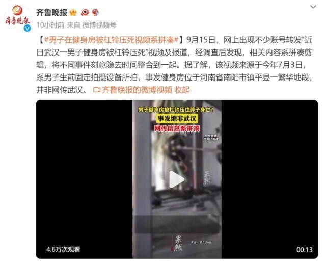

# 27岁男子被杠铃压脖致死 涉事健身房已停业 负责人：死者曾是健身教练

9月15日，网上出现不少账号转发“近日武汉一男子健身房被杠铃压死”视频及报道，经调查后发现，相关内容系拼凑剪辑，将不同事件刻意隐去时间整合到一起。据了解，该视频来源于今年7月3日，系男子生前固定拍摄设备所拍，事发健身房位于河南省南阳市镇平县一繁华地段，并非网传武汉。

据扬子晚报报道，相关事件发生于河南省南阳市镇平县一家健身房内。事发时健身房并非营业时间，遇难男子系独自进入健身房卧推120公斤杠铃失败，杠铃砸下压到脖子后无法自救死亡。9月16日，涉事健身房负责人赵先生告诉记者，遇难男子小侯今年27岁，曾在他们健身房做过健身教练，小侯也是他最好的朋友之一。

据赵先生介绍，出事前小侯已经没再做健身教练，而是到当地检察院当书记员，但平时还会利用午休的时间过来自己锻炼。对于小侯是如何进入非营业时间的健身房，赵先生称，“健身房钥匙是他在我这干健身教练的时候就自己留了的。”

事发当天健身房监控视频显示，下午1点57分，小侯一个人在未营业的健身房内挑战大重量杠铃卧推。他将杠铃从架子上取出后无力支撑，失控的杠铃重重压在了其脖子处，挣扎自救数分钟后，失去意识不再动弹。该段自行记录的完整视频长达半个小时，按照营业时间推断，应该是在下午2点半，工作人员上班时才发现男子被困，彼时施救已晚。据了解，健身房正常营业时间为下午2点半至晚上9点。

另据记者了解到，男子遇难后，涉事健身房已停止营业至今。有知情者表示男子家属与健身房老板的纠纷仍在通过司法途径解决中。

网友评论：

来源：澎湃新闻

