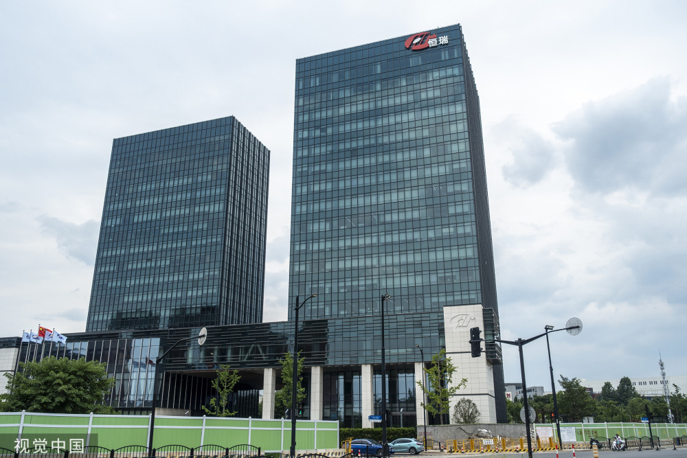

# “医药一哥”解散子公司：没有产品的药企，投资者失去了耐心

**特约作者|陈方**

**编辑|陈弗也**

**出品|棱镜·腾讯小满工作室**

过去几年，医药行业在创新领域快速扩张，但到了今年，这个行业或许迎来了一个拐点。就在几天前，出现了一些行业标志性事件。

9月14日，有消息传出：瑞石生物经营停摆，公司现有员工解散。

瑞石生物成立于2018年4月，天眼查显示，2022年底，其参保人员有136人，没有获批上市的产品。可以看出，这是一家典型的初创期创新药企，在行业中名不见经传。但这家公司有一个很强硬的靠山“恒瑞医药”，后者是瑞石生物的母公司。

恒瑞医药有着国内“医药一哥”之称，十多年来一直致力于医药创新，是医药行业的最大“白马股”，也是投资机构最关注的医药企业之一。瑞石生物是恒瑞为数不多的直接投资设立的创新药企，没想到竟传出了解散的传闻，自然引发行业关注。

根据财联社的报道，瑞石医药停摆、遣散员工的事情确实存在。作者从恒瑞医药内部人士获得的表述是：“瑞石这家公司规模很小，无论如何，都不会影响到恒瑞医药。”

在那几天，恒瑞的糟心事并不止这一件。

业内还关注到：恒瑞正在向曾经的合作方万春医药“讨要”产品授权款。2021年恒瑞医药首次宣布从外部引进产品，买下的就是万春医药一款抗癌药物，但这款药物研发不利，最终没能在中国上市。恒瑞就跟万春打起了官司，想要拿回2亿元首付款。

医药创新曾是过去几年的热门话题。可现在，创新的价值正在受到各方面因素的严峻考验。

**3个月前，就已有迹象**

根据9月15日财联社的报道，当天上午，在瑞石生物公司内部走廊上有员工排队，大家感到都很突然。有员工表示：他们也得知消息不久，还在等通知。

招聘软件BOSS直聘上可以看到，瑞石生物目前还有在招岗位，但招聘者在近半年时间里都没有活跃过。

15日下午，证券时报报道，瑞石生物举行了内部会议，股东会决议中止公司经营活动，运营工作由恒瑞成立工作组接管；对部分员工进行遣散，但遣散方案还没确定。

时间退回到两年前的9月14日，上海张江迎来了一场启动仪式，瑞石医药正式启用新药研发实验室。

瑞石生物和很多创新药企一样，当时成立还不到三年，公司启动时由恒瑞医药出资1亿美元，占股95%。2022年，瑞石生物吸引到华盖资本及其管理的首都大健康基金共同领投的1亿美元投资。

瑞石的重点产品是JAK1抑制剂SHR0302，这是一种治疗特应性皮炎、强直性脊柱炎等自体免疫疾病的药物，曾被国家药监局认定为突破性治疗品种，是很有希望获批上市的创新药。

按照一般的发展路径，瑞石生物IPO基本是眼前就能预见到的事情。只是没想到，这一场前景无限广阔的合作，会落到公司停摆、产品撤回申报的结局。

今年6月，恒瑞其实已经公告过，“经与药监机构沟通，瑞石生物主动撤回SHR0302活动性强直性脊柱炎适应症的药品注册申请，计划尽快重新递交。”外界没注意到，那可能就是恒瑞换掉瑞石、换成其他申报主体所做的准备工作。

上述知情人士向作者表示：“SHR0302其实一直在恒瑞医药手里研发，公司能完全控制这款药物。”言下之意，瑞石生物这家公司在与不在，都不会影响药品的开发。

**没新产品上市的药企，值多少钱？**

恒瑞医药早年间靠仿制抗癌药、麻醉药等起家，因为紧跟医药创新潮流，逐步从仿制过渡到创新，成长为国内首屈一指的医药企业。

然而在底色上，恒瑞医药和当下不断冒出的创新药企业相比总是差了一些。虽然被叫为“创新药一哥”，但与百济神州、康方生物等新兴企业相比还是保守了很多。

恒瑞医药投资瑞石生物，其实是一件有标志性意义的事件。

瑞石生物A轮拿到华盖等机构的投资之后，一向低调的恒瑞医药董事长孙飘扬表示：“瑞石生物对外融资是恒瑞在模式创新方面的有益探索；瑞石生物是恒瑞投资孵化企业的优秀代表，希望瑞石团队能够不忘初心、砥砺前行，为人类健康事业贡献一份力量。”

瑞石代表的是小而灵活的创新力量，恒瑞代表的是稳定强大的运营基础。全球大型跨国药企在近15年几乎都是贯彻这一模式，即从创新引领者逐步转变为投资者，孵化更有创新力的小微医药企业。

而且，在恒瑞投资设立瑞石生物之初，退出路径是非常明确的，近几年国内创新药企业在A股和港股的IPO都很顺利。即便是华盖入资的2022年上半年，医药一级市场的环境也远比现在要好得多。

但进入2023年之后，一系列的深刻变化让医药行业认清了现实：光有创新，没有市场认账，恐怕就不太容易IPO。

今年4月，生物制药公司智翔金泰在科创板上市。这家公司的和瑞石生物有相似之处，也是开发自体免疫类药物。智翔金泰背靠的是国内金牌HPV疫苗代理商智飞生物，实力也不俗。但智翔金泰的IPO引发一系列讨论：“还没有创新产品上市的企业，应该值多少钱？”

这些讨论直接导致资本市场对医药创新的信仰崩溃。过去10年，只要敢喊出创新，市场就会给予足够的耐心等待企业长大，百济神州、君实生物等企业至今仍巨额亏损，但并不影响他们的百亿、千亿市值。

可如今，资本市场已经不再像5年前那样有耐心了。瑞石生物的遭遇表明，连产业投资者恒瑞医药可能也失去了耐心。

**生存空间受到挤压**

今年9月可以说是恒瑞的“多事之秋”。

就在前几天，恒瑞医药因为2亿元首付款，少见地向合作方大连万春提起诉讼。大连万春的一款创新药研发基本失败，恒瑞希望要回当年给出去的首付款。

可见无论成与不成，创新药的生存空间都受到了很严重的挤压。

这种产业界的悲观已经影响到了上游。今年3月末，CRO巨头的药明康德叫停了上海细胞与基因治疗子公司的工厂进展，原因正是相关创新药品种订单不足。2023年中报显示，今年上半年药明康德的亚洲员工减少了近3000人，多集中在研发部门。这是药明康德近几年少有的现象。

更严重的影响来自于政策端。

今年七、八月份，医疗反腐开始席卷全国。创新医药本来就严重依赖面对面的推广，很多新药，医生听都没听说过，要让医生信赖新药的疗效，了解新药的使用场景，学会新药的不良反应控制，这些都需要大量的学术推广工作。如果学术推广停止了，新药的出路基本就被掐断了。

国家层面已经在积极纠偏，可临床的学术推广是否能回到过去那样，恐怕任何一家药企都没把握。

医药链条长且复杂，需要投资人、产业人士、医生、患者、政府部门等多方努力，才能构筑行业繁荣的局面。目前销售端和二级市场的消极反馈，已经影响到了产业前端和投资前端。有行业人士称，未来创新药品和器械企业的上市标准将趋于收紧，创新性的要求将会提高。上市后的减持、增发等变现和融资方式则已经受到了证监会的限制。

对于瑞石生物这样的企业来说，此前能跑通的路径，如今已经不好走了。瑞石的遭遇，只是当下医药创新大环境的一个小小注脚。

