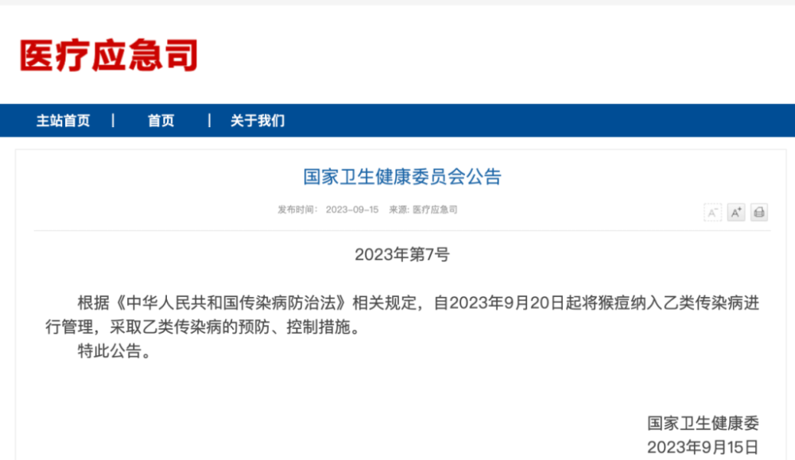

# 中国首次报告5例女性猴痘病例，“未来甚至可能出现家庭内传播”

据国家卫健委公告，自2023年9月20日起将猴痘纳入乙类传染病进行管理。中疾控9月8日发布的检测情况显示，中国内地（不含港澳台）8月新增报告501例猴痘确诊病例，其中，首次报告5例女性病例。

“出现女性感染者，意味着我国猴痘感染人群进一步扩大。”南方医科大学公共卫生学院生物安全研究中心主任赵卫告诉记者，从此次报告看，病例中的女性感染者发病前21天内均有异性性接触史，因此通过异性性接触感染可能性大。总体上来说，猴痘通过性接触以外的其他接触方式传播风险低，因此对普通人来说，只要性伴侣双方没有不洁性行为，感染的风险极低，在女性群体中出现大范围传播的可能性也极低。

_国家卫健委公告，9月20日起，将猴痘纳入乙类传染病进行管理。官网截图_

据中疾控通报，根据流行病学调查分析，猴痘疫情呈现以下特点：一是98.9%病例为男性，92.5%病例明确为男男性行为人群。二是病例中有5例女性，发病前21天内均有异性性接触史，异性伴侣中3例为猴痘感染者、1例近期有出疹史、1例无猴痘相关症状。

北京佑安医院感染综合科主任医师李侗曾在接受记者采访时指出，过去三个月，我国绝大多数猴痘感染都发生在男男性行为比较活跃的群体中，猴痘在国外的主要传播途径同样是男男性行为接触。从传播途径上来说，无论男女，如果发生皮肤密切接触，就有被感染的风险。由于感染者的皮疹液中携带病毒，一旦病毒通过皮肤伤口或黏膜上的细微伤口进入身体，就容易引发感染。一些男性感染者也会与女性发生性行为，因此，出现女性感染者是很自然的情况。

此前，国外已出现猴痘女性感染者。据法新社2022年6月21日报道，法国确认发现首例女性猴痘病例；据中新网2022年8月6日报道，法国成年女性猴痘感染者已增加至20名。

“未来女性感染者数量可能会增加，甚至可能出现家庭内传播，例如老人和孩子被传染了，但概率较低。预防的策略是不变的，大家不必恐慌。”李侗曾提醒，要尽量避免和健康状况不明的人发生密切接触，尤其是已经出现发烧、疱疹的人群；当个人身上有伤口时，外出乘坐公共交通工具和去人员密集场所，要注意使用创可贴、无菌纱布覆盖伤口，避免意外接触感染。此外，感染者本人要做好自我隔离，避免传染他人。

赵卫同样提醒，预防猴痘感染的方法是尽量避免接触患者。“特别是他们的皮疹和体液，注意外出活动后，使用洗手液和流动水彻底清洁双手。”

（来源：人民日报健康）

