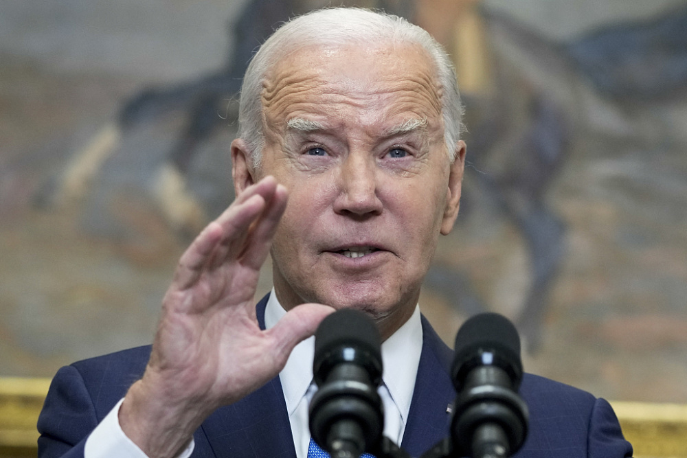

# 历史性罢工冲击美国汽车行业，美媒：拜登被送上“政治钢丝绳”

【环球时报驻美国特约记者 李勇 环球时报特约记者
刘皓然】由于未能在最后期限前达成劳资协议，美国汽车工人联合会（UAW）在当地时间15日零时开启大罢工，参与者约1.3万人。这是UAW的罢工活动首次同时覆盖美国三大汽车制造商——通用汽车、福特汽车和斯特兰蒂斯，美国媒体因此用“历史性”“史无前例”来描述这场罢工行动。UAW主席费恩称，如果谈判不顺利，罢工规模有可能进一步扩大。这三大车企的UAW成员共计14.6万人。拜登政府对这场罢工行动给予高度关注，美国“政治新闻网”认为，正寻求在明年大选中获得连任的拜登被送上“政治钢丝绳”。“他现在既要做‘最支持劳工’的总统，又要做‘最环保’的总统……他太难了。”密歇根大学罗斯商学院教授戈登说。

_由于未能在最后期限前达成劳资协议，美国汽车工人联合会（UAW）在当地时间15日零时开启大罢工。工人高举“UAW罢工”标语。_

**40%与20%**

罢工从通用汽车、福特汽车和斯特兰蒂斯（为北美市场生产克莱斯勒、道奇、Jeep等品牌的车）分别位于密苏里州文茨维尔、密歇根州韦恩以及俄亥俄州托莱多的工厂开启。《今日美国报》描述称，14日晚，韦恩市的福特汽车工厂附近化作一片红色海洋，工人高举着“UAW罢工”“拯救美国梦”等标语，路过的车辆对罢工人群鸣笛致敬。

据美国有线电视新闻网（CNN）报道，UAW要求三大车企为工人在未来4年涨薪40%，并推动每周4天的工作制、与通货膨胀相匹配的涨薪机制、退休后的医疗福利等。工会涨薪要求的依据是，这三大汽车巨头过去4年为高管涨薪40%，而工人薪资涨幅仅6%左右。

美国全国广播公司（NBC）说，通用汽车首席执行官（CEO）的收入水平是普通员工的362倍，福特为281倍。UAW成员特洛伊·戴尔表示，他为福特打工7年多，时薪为29.63美元，自己的大多数工友也都是勉强糊口。38岁的罢工参与者洛佩兹在通用汽车当了3年半的临时工，时薪仅17美元、且“转正”无望。她表示，企业对临时工的差别待遇很明显，比如疫情期间正式工可以居家，但临时工必须到岗，这种日子“糟透了”。CNN介绍称，在三大车企工作的UAW成员的起薪为18美元，大部分人能拿到32美元，临时工的起薪是15美元。目前，三大车企都表示愿意涨薪20%，但拒绝“4天工作制”诉求。

据估算，UAW的一系列要求将使得直接人工成本从目前每小时64美元大幅提升至150美元以上。CNN引述通用汽车CEO玛丽·博拉的话说，UAW的要价相当于逾1000亿美元，这是该公司总市值的两倍以上，工会的要求应该“现实些”。福特汽车CEO吉姆·法利认为，“UAW想让我们走向破产，而不是支持我们的工人”。在业界分析人士看来，美国汽车行业面临着技术变革，企业正承受着巨大的竞争压力，并且需要斥巨资推进电动化、智能化转型，同意工会的要求所承担的成本上涨“无异于自杀”。

**工会“新打法”有的放矢**

UAW将此次罢工称为“站立罢工”，这主要是区分于行业工会上世纪三四十年代惯常采用的大规模“静坐罢工”。根据以往惯例，UAW的罢工通常只覆盖一家车企，之后将达成的协议作为“模板”与其他制造商展开谈判。2019年，UAW发动通用汽车工人进行40天的罢工。

尽管这是UAW首次将罢工目标同时对准三家车企，但其打击面显得更精准。比如，它选择通用汽车一家主要生产中型皮卡以及普通厢式货车的工厂作为罢工目标，却有意“放过”该公司利润最丰厚的越野车及全尺寸皮卡生产线。美国韦恩州立大学商业教授马斯特斯表示：“他们并未把企业逼到墙角……把野兽逼至绝境是很危险的。”

《今日美国报》分析说，这种罢工模式既能打乱车企的供应链、让企业对经济损失感到“肉疼”，又不至于令公司运营陷入瘫痪。另一方面，这一策略也给工会留下转圜余地——如果后续谈判不顺利，UAW可以号令其他厂区的工友“站出来抗议”，企业对于工会如何选择无法预判，防不胜防。美国乔治城大学劳工问题历史学者麦卡廷认为，此次罢工标志着争取劳工权益的一次“重大革新”，工会领导层不仅变得更加精明，而且“战斗力更强”。

有经济学家认为，这场罢工对美国宏观经济层面的影响不大。若UAW发动所有在三大车企工作的14.6万成员罢工6周，可能会导致美国第四季度的国内生产总值减少0.2%。但CNN称，美国安德森经济集团的估算显示，14.6万汽车工人罢工10天可能造成50亿美元的损失。而且，罢工可能为汽车零件供应商带来某种“涟漪效应”。若劳资双方一直僵持不下，很快就会有三大车企的一级供应商开始裁员，接下来就是二级供应商。罢工期间，参与者每周只能得到500美元的补贴，这只是他们平均薪资的40%左右，专家担忧有些罢工者很可能会“吃了上顿没下顿”。

**拜登被送上“政治钢丝绳”**

UAW的罢工行动引起美国政府的高度关注，拜登15日发表讲话，对工人的沮丧表示“理解”，同时称自己希望看到“双赢”局面。白宫已经派代理劳工部长苏维思和高级顾问史伯林前往底特律，代表联邦政府斡旋劳资谈判。不过多家外媒注意到，拜登并未发表支持工人“走上街头”一类的言论，而是一再强调“没人想要罢工”。

 _当地时间2023年9月15日，美国华盛顿特区，美国总统拜登就全美汽车工人联合会罢工发表讲话。（视觉中国）_

美国“政治新闻网”评论称，UAW发起的罢工无异于将拜登送上“政治钢丝绳”，他一直自诩“历史上对工会最友好”的总统，如今他既要拉拢工会、维持竞选承诺，又不能忽略对新能源行业和环保事业的支持。

拜登“挺工会”的立场已经引发商界不满。美国《国会山报》引述美国商会主席克拉克15日的话说，UAW带来的“巅峰罢工活动”是拜登政府“不计代价推广工会化的必然结果”，这种政策方向造成的恶果还在不断叠加——从消费成本的上升，到相关供货企业的损失。她还强调，美国私营领域高达94%的雇员不属于任何工会。

美国广播公司称，拜登在大选关键州密歇根州已经开始“走钢丝”。该州共和党籍参议员韦伯批评拜登政府向新能源产品的匆忙转型为经济发展带来了相当程度的不确定性。美国前总统特朗普此前批评拜登政府的举措会“杀死美国的汽车制造业、毁掉无数就业岗位”。

