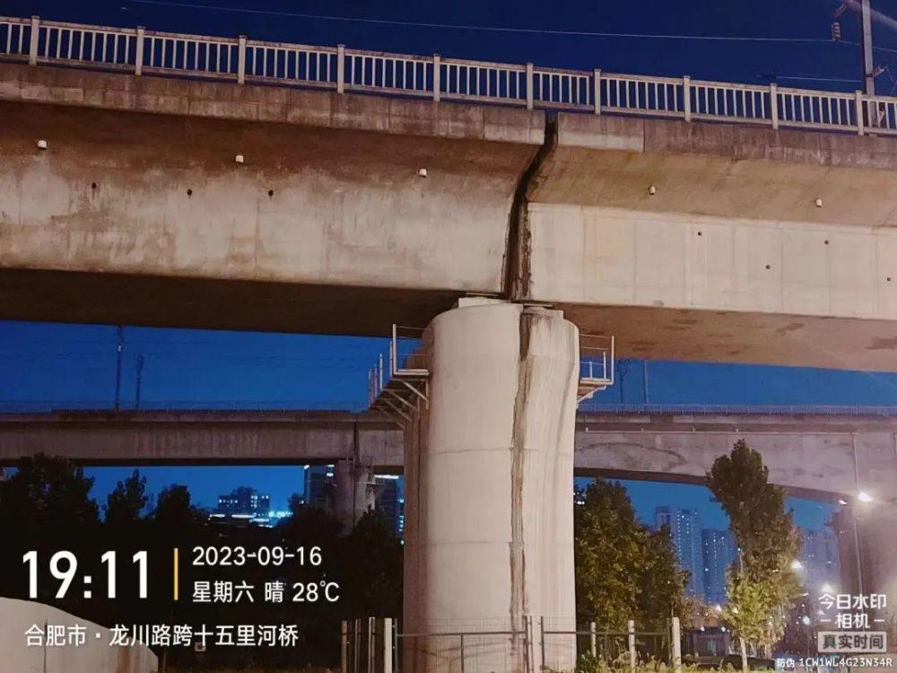
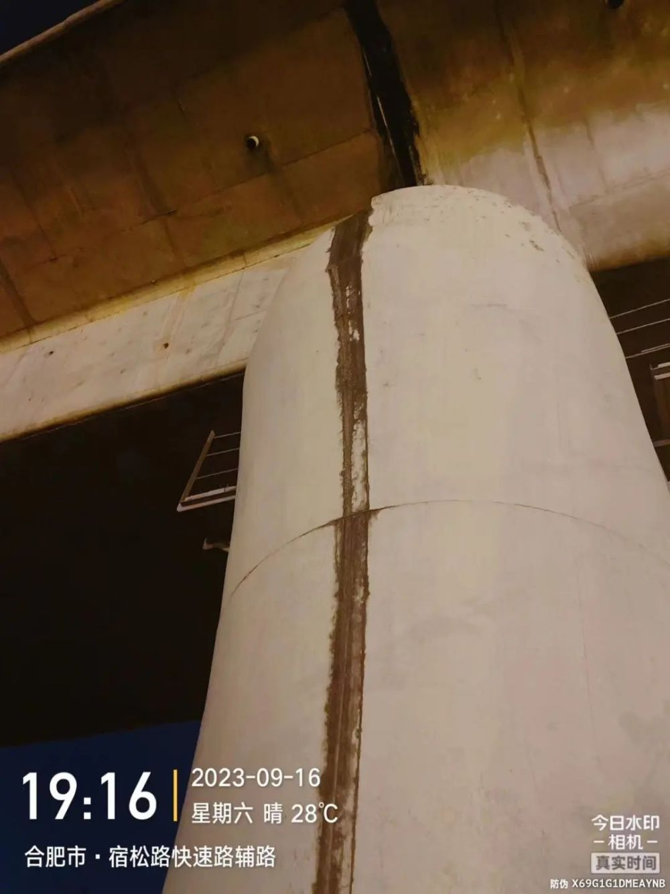
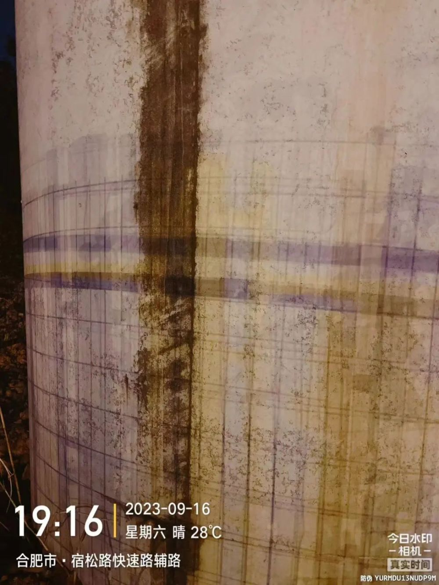

# 合肥一铁路桥连接处疑出现分离？官方：系伸缩缝，无安全问题

近日，有网友发帖反映合肥南站龙川路与宿松路西南角一处铁路桥桥梁连接处疑似出现分离，存在安全隐患。

合肥市城乡建设局9月18日晚间通报称，获悉此事后，合肥市城乡建设局当即安排桥梁方面专业人员到现场查勘和检测。经核实，该网友反映的“桥梁连接处缺口”为桥梁伸缩缝位置，该处伸缩缝渗水至桥墩，下淋形成水渍，并非桥墩出现裂缝和分离，桥梁（墩）无安全问题。经与桥梁管养单位铁路合肥工务段联系，将安排人员及时对水渍进行处理。

