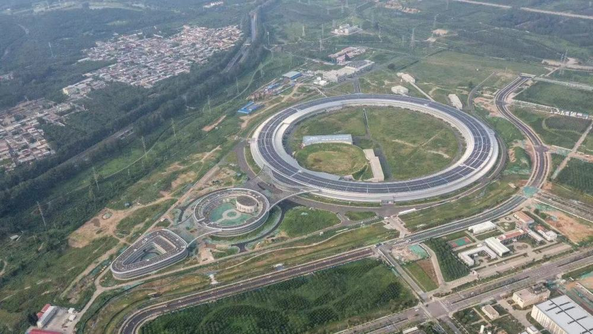

# 国产光刻机工厂落地雄安？中国电子院澄清：这是北京高能同步辐射光源

近期，一则消息在各大视频平台广为传播，称清华大学EUV项目把ASML的光刻机巨大化，实现了光刻机国产化，并表示这个项目已经在雄安新区落地。

对此，中国电子工程设计院有限公司（下称中国电子院）9月18日发声，称该项目并非网传的国产光刻机工厂，而是北京高能同步辐射光源项目（HEPS）。

北京高能同步辐射光源项目坐落于北京怀柔雁栖湖畔，是国家“十三五”重大科技基础设施，它是我国第一台高能量同步辐射光源，也是世界上亮度最高的第四代同步辐射光源之一。该项目早在2019年就开始建设、将于2025年底投入使用。

_北京高能同步辐射光源项目实拍图_

HEPS是干嘛用的呢？它的作用是通过加速器将电子束加速到6GeV，然后注入周长1360米的储存环，用接近光速的速度保持运转。电子束在储存环的不同位置通过弯转磁铁或者各种插入件时就会沿着偏转轨道切线的方向，释放出稳定、高能量、高亮度的光，也就是同步辐射光。

中国电子院解释称，HEPS可以看成是一个超精密、超高速、具有强大穿透力的巨型X光机，它产生的小光束可以穿透物质、深入内部进行立体扫描，从分子、原子的尺度多维度地观察微观世界，HEPS是进行科学实验的大科学装置，并不是网传的光刻机工厂。

中国电子院称，该项目由全国勘察设计大师、国投集团首席科学家娄宇带队，中国电子院多个技术科研和设计团队协同合作，从项目可研立项到项目落地攻克了多项技术和工艺难关。目前高能同步辐射光源配套工程已全面完工。

