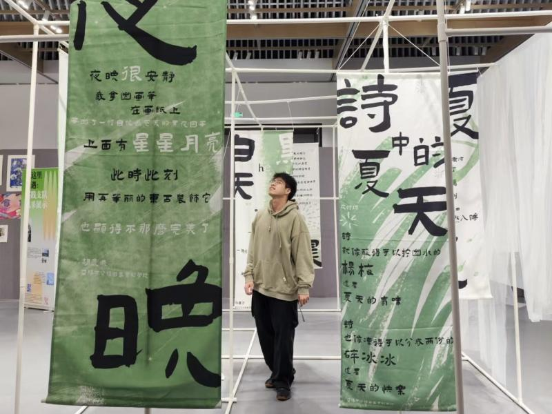
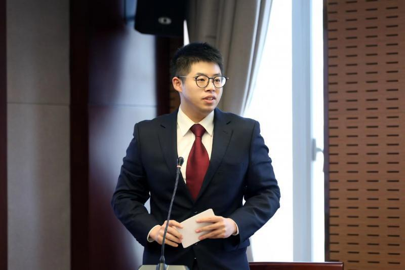
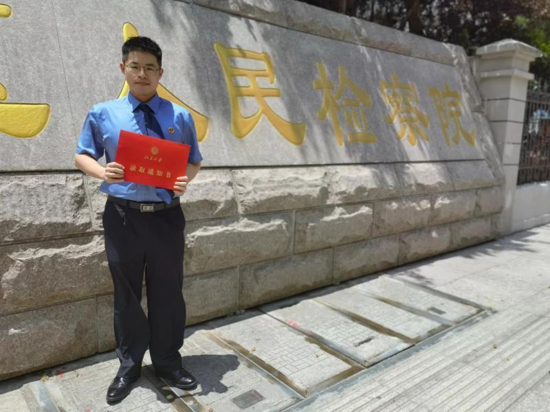
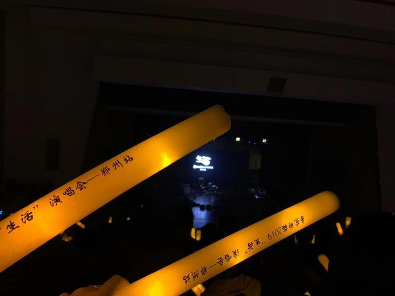
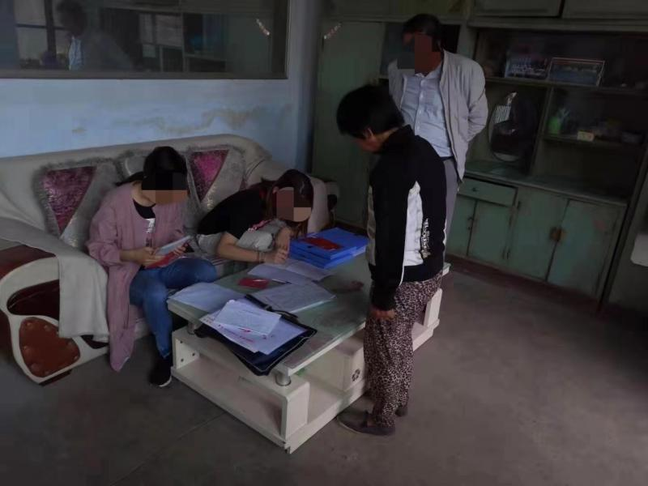
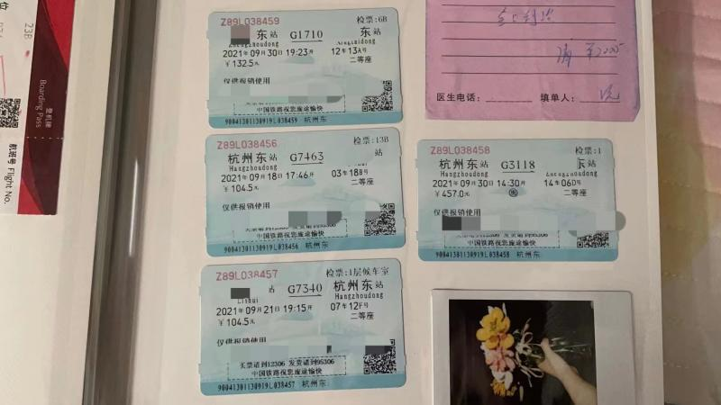

# 在考公大潮中，他们选择“扔掉”铁饭碗

近年来，考公热居高不下。不少名校毕业的年轻人选择加入考公队伍，为上岸高价报班、全职备考。

其实，公职并不是一生的“铁饭碗”。随着社会的多元化，公务员越来越成为一份“能进能出”的职业。

当下，一些年轻人在考公大潮中逆向而行——他们原本拥有一份体制内的工作，却因学业、爱情、家庭、职业规划等原因放弃这个“铁饭碗”，决定重新开始另一种人生。

**01 为了深造，**

**选择告别检察院**

北大二教，思政课堂。30岁的徐开朗重回校园，成了一名学生。墨蓝衬衫、黑西裤、黑皮鞋，他特意选了一套干练装束。只见他神采奕奕地走上讲台，拿起话筒，打开ppt，开始汇报。

“噢！这是那位网红检察官！”有同学一眼就认出了他。

不久前，徐开朗在b站发布的视频《告别检察，奔赴北大》获得了超过28万的播放量。在这则视频中，他是一位拥有7年工作经历的检察官助理，辞去了公职到北大读研。

_徐开朗在工作_

今年30岁的徐开朗，本科毕业不久便考上了家乡县城检察院，成为一名检察官助理。进入检察院后，他在监所科、公诉、未检等多个部门轮过岗，2021年，他还曾被借调到浙江省检察院工作。

“我很热爱我之前从事的未成年人保护的相关工作。个案办理中未成年人的变化、社会面貌的整体改善都是我工作成就感的来源。那些变化的背后有我们的工作身影，也让我看到了自己的工作成效。”在日常的工作中，徐开朗迅速成长。

但仍有不少时间，他感觉自己完全陷入了劳累的机关生活，无法自拔。

2019年，徐开朗第一次萌发了辞去公职的想法。当时，他被借调到其他部门，因对工作内容不太适应，陷入了“精神内耗”。与此同时，检察院的同仁考上北大的消息也在这时“刺激”了他。

“他能考上，我也一定能考上！”想到自己此前在工作中擅长调研，徐开朗觉得自己或许更适合做研究，于是他动了考研的念头。

放弃“铁饭碗”、重回校园，这个决定在考公热潮下无疑带着几分“逆行”的魄力。亲友一时之间也不太理解他的决定。在家乡小城，拥有一份体面稳定的工作是多好的一件事，徐开朗为何还想折腾？

_徐开朗准备考研复试_

在职备考不是易事，但对于徐开朗而言，这是一个必达的目标。他每天必须在高强度的工作之余抽出时间学习。从早上7点到8点，晚上8点到凌晨1点，早晚各靠两杯咖啡“续命”。

长期的透支和高压必然给他带来了身体的不适。2020年，徐开朗的身体亮起红灯，他只得求助精神科医生，每天靠药物维持不到4小时的睡眠。2021年，他在不知不觉间长出了很多白发。

连续两年，徐开朗的考研初试成绩都是363分，没能够上北大法律专业全日制硕士研究生的分数线。就在他几乎要放弃时，检察系统一位老领导问了一句，“你还考吗？”又令他重新点燃了心火。

2022年4月，查到考研成绩、确认拟录取的那晚，给父母报完喜后，徐开朗立刻打电话跟那位领导分享喜悦：“我考上北大了！”

_徐开朗收到录取通知书_

2022年9月，徐开朗终于走进梦寐以求的北大。刚进校园时，他还留着小平头，习惯穿衬衫，不少老师同学一眼就辨认出了他的“机关气质”。如今，他烫了时下流行的发根烫，留着碎盖头，衣着也更加休闲，整个人透露着松弛感。

“校园生活治愈了我。北大是一个很自由的地方，我在这里实现了‘行为自由’‘发型自由’‘批评自由’。这里有最好的读书环境，我如果不好好学习就是辜负。”于徐开朗而言，校园生活来之不易，所以他格外珍惜。他喜欢坐在教室的第一排听课，在第一学期的考核中，他获得了4个A、3个B+的成绩。

2023年夏秋之际，和大多数同学一样，徐开朗再次踏上了找实习、求职的道路，他先后面试了多家律所、公司，期待自己尝试更多不同领域，“每个人内心都有自己不同的价值排序，我希望自己未来可以成为在一个领域内有所建树的人。”

_徐开朗在北大_

**02 与“队友”异地5年，**

**她为爱情放弃铁饭碗**

面包和爱情，哪个更重要？在这个经典难题上，95后小毕毫不犹豫地选择了后者。

2023年8月，她辞去公职，奔赴杭州，与“队友”团聚。

小毕今年27岁，和“队友”从确认恋爱关系到结婚，维持了5年异地恋。2017年，俩人相识于考研培训班。

2018年，“队友”上岸浙江杭州某高校全日制研究生，小毕调剂到广西大学非全日制研究生，同时以笔试、面试第一的成绩考上河北某区定向选调生。自此，俩人各在一城求学、工作，开始了异地爱情长跑。

_小毕和“队友”一起奔赴郑州看演唱会_

异地恋带来的麻烦显而易见。最初，俩人趁着假期约在广西、杭州短暂相聚。后来，随着疫情爆发、各地封控，俩人很难有机会见面。

时间最长的一次，俩人长达9个月都没能见面，只能靠电话、视频联系，“那时常常三天一小吵、五天一大吵，僵持三五天谁也不理谁。”

在这期间，小毕还同时面临工作适应和学业压力的问题。考公上岸前，她对公务员的工作抱有一些想象，而实际情况却与想象中并不一样。

小毕一入职就被安排下基层两年，每天早八晚六，在县里参与扫黑除恶、扶贫工作。同时，她还需每周值一次夜班，通宵住在单位。按照非全日制研究生培养的要求，她在集中授课期间会请假一个半月至两个月左右去上课。工作、学习、爱情“多面夹击”，小毕常处于煎熬的状态。

_小毕参加扶贫工作_

2021年，这对情侣都研究生毕业了，他们又再次面临选择。“队友”上岸杭州当地某事业单位，小毕第一次向工作单位提出辞职，但那时她的服务期尚不满5年，辞职申请没有得到领导批复。

家人对小毕的决定也持反对意见。“一个年轻女孩，放弃稳定的公务员工作，离开家乡，独自到陌生城市重新开始，这简直不可思议。”为了防止小毕偷偷结婚，父母甚至藏起了户口本。

隔着1000公里的距离，小毕和“队友”的感情却没有变淡，俩人都变得成熟了不少，不再互相埋怨，开始一起为团聚努力。

但凡有假期，小毕就立即赶到杭州与男友相见，全年三分之二的工资都花在了路费上。考虑到这样来回奔波及成本花销，小毕坚定选择了放弃“铁饭碗”，来到杭州与“队友”团聚。

 _小毕往返杭州等地的车票_

如今，她通过招考也成为杭州当地一所法院的司法雇员，正在准备入职中。

偶尔往回想想，如果不辞职，自己现在大概会是三级主任科员、副科待遇。“对于是否一定要选择‘铁饭碗’，我没有明确的答案；对于面包和爱情孰轻孰重，我觉得好的爱情对我个人而言更重要。”小毕认为，爱情是可遇不可求的，需要两方的你情我愿。而面包，小毕有自信，能在适应社会的同时有比较好的发展。

小毕说，“相对而言，我也更喜欢偏自由的职业，未来几年，我要好好沉淀，在专业领域多学习，希望未来能成为一个出色的律师。”

**03 她因辞去公职，**

**在家乡小城遭调侃**

作为一个生在中国东部大省、父母都在体制内工作的年轻人，除了考公，周婧此前没想过其他路径的人生规划。

“我们那的人都很注重编制，‘不孝有三，无编为大’。大学四年，我没有过迷茫，一心坚定要考公。”周婧回忆，从大一开始，她就断断续续在看考公的材料。大四那年，她同时上岸本校的研究生和家乡小城的公务员。她一边工作，一边取得了非全日制硕士学位。

如果按照原计划，周婧会在她出生的小城度过安稳的一生：结婚生子、职级逐级上升。但她并不满足于此。

在哈尔滨上了四年大学，她意识到大城市与小县城之间还是有很大的信息差。于是，她和丈夫开始互相鼓励，尝试前往大城市定居。

随着丈夫通过公司内部选拔到济南工作，原本师范院校物理学专业毕业的她也通过了当地一所小学的招聘考试，进入教师队伍。此时，她决定要向原单位辞职。

辞去公务员去当老师，这在小县城是件罕见的事。收到周婧的辞职报告时，领导很惊讶：“工作这么多年，我第一次给人批辞职。”

而在体制内工作的父母也一度觉得“抬不起头来”——只听说过老师辞职考公务员，没听说过公务员辞职考教师。消息在小城里总是传得特别快。有时，“辞职”传着传着就变成了“辞退”，这让父母一度“没脸”上班。

面对流言蜚语，周婧依旧坚定自己的选择。离开家乡来到济南，在教师岗位工作一年后，她进入了当地的一家出版社工作。

 _周婧辞去公职，决定“转场”济南_

入职三年，同批的12名新人中，周婧的成长速度最快。目前，她已经是项目负责人，同时承担策划编辑、文字编辑、营销编辑多项职能。

相比于当时在家乡小城的清闲稳定，如今周婧的工作忙碌许多。正常工作时间之外，她常常在外联络项目，不时需要出差。

寒暑假期间，见原来学校的老同事们又出门玩了，周婧不时也心生羡慕，但相比之下，她依旧更喜欢现在的生活。

最近，像当年的周婧一样，亲友家中刚大学毕业的四个弟妹正准备考公、考编，周婧无私地把自己的备考经验和在不同工作中的不同体验都分享给了他们。

“每个人都有自己的选择，我尊重弟弟妹妹的选择。但如果重新回到大学，我不会再选择考公，而是会直接读研。我也不想再选师范类专业，而是希望接触更多前沿的知识，进入像华为那样的大企业。”周婧说。

**04 体验过体制内的生活，**

**这次要选条不一样的路**

本科毕业考入人社局、3年后裸辞、读研、参加法考、到律所实习挂证、成为一名独立律师，刘凌这一路走来可谓“很折腾”。

“说不后悔是假的，毕竟谁又能拒绝‘铁饭碗’的香呢？”回忆起最初在人社局的工作，刘凌有些感慨：朝九晚五上下班、同事相处轻松愉快。每月10号，手机短信“叮”的一声响起，工资一到账，她就开始琢磨可以买些什么。

对这样稳定的工作和生活，那时的她并不知足。辞职后，她考上了南京某高校的法律硕士。研究生毕业时，同学们大多选择考公或做律师。她想，既然已经体验过体制内的生活了，这次她要选另一条路。

 _刘凌毕业答辩_

不过，这是一条充满挑战的路。备考半年，通过法考；进入律所实习一年，通过考核、排队挂证，再到拿到律师证……她花了17个月的时间。在律所实习期间，工作量大，但收入还无法覆盖基本的生活支出，刘凌基本处于“倒贴上班”的状态。

但这还不是最大的困难，最困难的是要培养专业的律师思维。像被领导要求不断改合同条款这种事，成为刘凌的家常便饭。在她实习期间，合同修改最多的一次改了7版。

在这样的锻炼中，刘凌开始逐渐成长为一名独立律师。不久前，她刚处理完一宗离婚纠纷案。在这个案件中，她不仅帮当事人争取到孩子抚养权及相应抚养费，而且在面对财产分割难点时，通过仔细分析双方名下多家公司股权的复杂状况，帮助当事人争取到了满意结果。

案件办理结束，当事人的感谢让她感受到工作中的成就感。

_刘凌律所挂证期间参加律所年中会议_

刘凌毕业后做了律师，而她读研期间的同学大多选择考公，疫情期间，一些律师同行也辞职加入了考公队伍。对此，她既不羡慕，也不对比，“我非常理解他们的决定，体制内的稳定生活或许是绝佳的选择之一。如果我再年轻几岁，可能也会和大家一起。但我已经在体制内待过了，相比于那份稳定，我更向往自由、有挑战的生活。”

现在，刘凌憧憬自己能成为一名专业、严谨、负责的好律师。在这条“一眼望不到头”的路上，她担心路途艰险，也期待无限可能。

（徐开朗、小毕、徐婧、刘凌为化名）

撰文 | 北京青年报记者 陈静

统筹 | 林艳 张彬

图片 | 受访者供图

