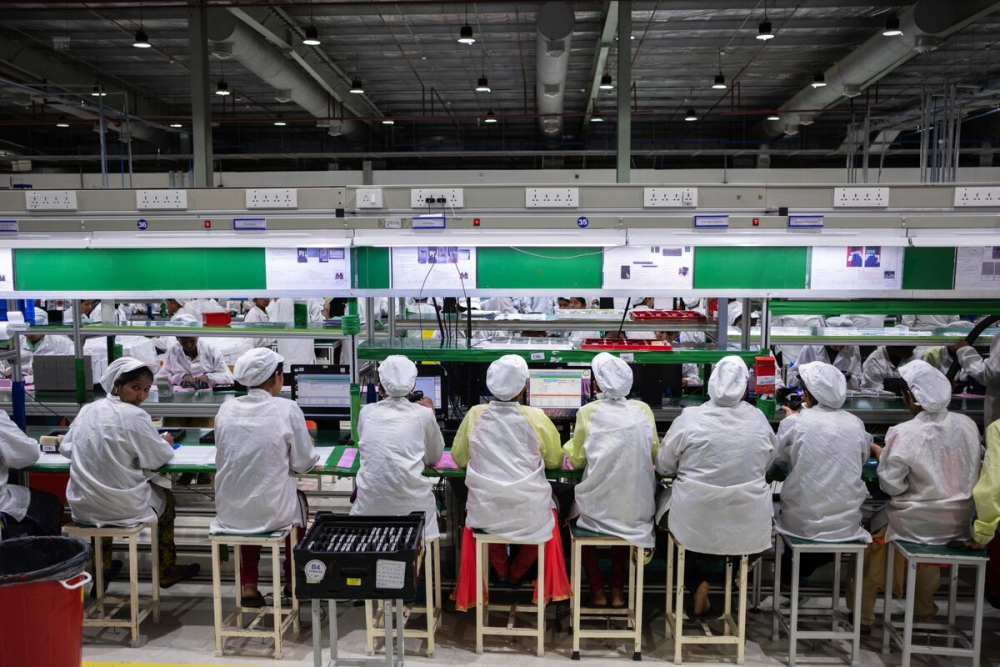

# 富士康为莫迪“祝寿”，称计划明年将在印投资翻倍，外媒又扯上中国

【环球网报道】据彭博社报道，苹果公司最大的iPhone代工制造商富士康科技集团当地时间17日发文为印度总理莫迪祝寿，并称，计划明年将其在印度的投资和员工数量增加一倍。彭博社借此炒作称，这凸显随着中美紧张局势加剧，“在华制造业正加速外迁”。关于制造业外迁、产业链转移，中国工信部此前曾表示，外商对华投资步伐并没有放慢。

_富士康科技集团在印度南部泰米尔纳德邦的一家制造手机的工厂。 图源：彭博社_

彭博社称，富士康驻印度代表当地时间17日在领英发文，祝贺印度总理莫迪73岁生日快乐，并称计划把公司在印度的规模扩大一倍。但他没有透露更多细节。

“我们将更加努力，明年为您送上更丰厚的生日礼物，目标是在印度的雇工人数、外国直接投资和业务规模都再翻倍。”富士康驻印度代表说。

报道称，富士康计划在靠近印度南部卡纳塔克邦首府班加罗尔机场的300英亩土地上建厂。该工厂可能被用于组装iPhone，预计将创造约10万个就业岗位。

彭博社继而炒作称，富士康在印度的扩张凸显
“中国正面临失去全球最大消费电子产品生产国地位的风险”。苹果和其他美国品牌正在探索其他可替代中国的生产地，例如印度和越南。

报道还称，富士康母公司鸿海集团董事长刘扬伟上月称，富士康计划加大在印度的投资。该公司已在印度运营9个生产园区和30多家工厂，雇用数万名员工。刘扬伟称，富士康正处于在印度扩张的早期阶段，每年的营收约100亿美元。

作为苹果最大的代工厂，富士康一举一动备受关注。今年6月，对于苹果是否计划将供应链从中国大陆迁出的问题，刘扬伟曾对《环球时报》记者表示“没有！”刘扬伟在2019年7月正式接棒富士康创始人郭台铭，执掌这家全球代工巨头。在6月天津举办的第十四届夏季达沃斯论坛上，刘扬伟对媒体记者表示，去风险化不是去产能化，“这种风险是管理上的风险，不是产能上的风险，例如碰到地震、风灾等，主要不是去风险，是为了企业的可持续发展”。

关于制造业外迁、产业链转移，时任工信部规划司副司长姚珺去年7月在新闻发布会上表示，总体而言，外商对华投资步伐并没有放慢。据姚珺介绍，当前，我国制造业对各类资源要素的吸聚力正在不断增强，越来越多外资主动投向先进制造、高新技术、节能环保等重点领域。“关于制造业外迁、产业链转移，我认为总体上这是一种正常的经济现象，是全球化和市场机制发挥作用的结果。”姚珺说。

