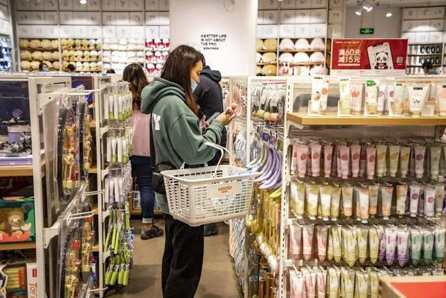
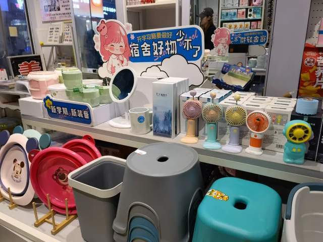
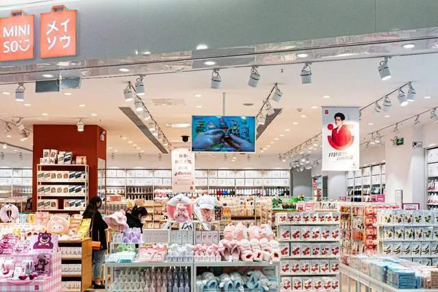

# 年轻人重新迷上十元店，店老板感叹幸好没干餐饮

“十块钱买不了吃亏，十块钱买不了上当。”这个时代，“十块钱”似乎在重塑人们的消费观。

在线上，九块九包邮，是一个颇有魔力的口号，成为电商平台们的获客手段；在线下，诸如名创优品、满库这样的十元店们也开始高速扩张。

十块钱的低价效应，也带来了亮眼的营收数据，今年9月15日，被称为“十元店之王”的名创优品，其中期业绩净利润同比大幅增长177.2%；主打便宜的拼多多，更是在2023年Q1，实现了净利润81亿，同比增长高达212%。数据背后，一个低价格零售时代正在来临。

十块钱为什么有如此大的魔力？十元店这种模式又是如何再度火爆的？每日人物探访多家十元店，与身处消费一线的店长和顾客们聊了聊，他们讲述了自己经营十元店的真实经历，这关于时代之下的选择，也关于如何更好地活下去。

**文 |** 杨璐源 张辰萌

**编辑 |** 易方兴

**运营 |** 圈圈儿

**重新火热**

“就算一把火把你的十元店烧了，我都不会感到一点可惜！”

纪胜秋的老公终于爆发了。在大吵中，他脱口而出这七年来被压抑的心声。

这与纪胜秋的十元店生意越来越火有关。因为生意越好，她就越忙。这家满库十元店开在山东潍坊的步行街，此时正是开学季，店里经常挤满顾客，大多是年轻人。每天，她都要忙到晚上11点，甚至更晚。连吃饭都是奢侈，“一家人在一起吃饭（的机会），就好像过年一样”。

“十块钱买不了吃亏，十块钱买不了上当。”这句话在中国，相信所有人都不陌生。顾名思义，在纪胜秋的十元店里，任何东西都是十元，从项链、耳钉、帽子、墨镜，到挂件、玩偶、摆件、化妆品，再到美妆护肤生活用品，几乎覆盖了生活的各个方面。

十元店的火爆，给了她极大的安全感。如今，她们家房子的首付，就是靠着十元店攒下的。说起这个，她颇为自豪，“我不愿意花他的钱”。但老公却希望她能“相夫教子”，把重心放在家里。双方经常为此吵架。

这种争执，某种意义上，是十元店这种业态再次火起来的注脚。这年头，尤其是过去几年，坚持不下去的小店太多了，但纪胜秋觉得自己很幸运，选了十元店，所以能活下来。其他类型的店或许就没这么幸运了。从她的店往前走几步路，是一家烤鱼店，它从疫情前的两层门面，到现在只剩一层，员工被辞退了一大半，主厨现在天天都在街上发小广告。

_▲ 图 / 视觉中国_

危机中常常蕴含着一线生机，而纪胜秋的遭遇也并不是孤例。

距离纪胜秋的十元店约200公里外，在山东泰安，何佳佳的十元店生意也越来越火爆。作为店长，她亲自举着喇叭吆喝：“十元满库，全场十元……”吆喝声之大，盖过了街道的喧嚣。“全场十元”似乎是有魔力的四个字，无论是年轻人，挽着胳膊的夫妻，还是推着婴儿车的宝爸宝妈，都有可能成为这家绿色招牌十元店的潜在顾客。

何佳佳记得生意最火爆的那一天。一场突如其来的雷阵雨之下，那天，十元店里所有的雨伞被一抢而空。在她的店里，雨伞不会加价，依旧是十元一把。货卖空了之后，“没办法我只好冒着雨，骑着电动车，赶往其他分店紧急借雨伞，再运回来接着卖。”那天她有些狼狈，但她讲述这些的时候显得很高兴。

以何佳佳所在的山东泰安为例，如果你真正地来此地看一看，可能会惊讶于这里十元店的数量——在这个人均GDP排名在山东中等水平的三线城市里，一共开出了3家名创优品、5家满库十元店、2家“那只猫的口袋”五元店，以及9家杂牌两元店。这还只是泰安市区里的数量，并不包括下辖的县城。

而泰安市里十元店的数量之多，也侧面证明十元店这种模式的火热。如果人们发现一种商业模式有效，常常会反复投资，而在泰安，何源自己一个人就开出了四家十元店。七年前，他开了第一家十元店，后面越开越多。尤其是在疫情时，大部分人选择关店，他反倒是又把十元店开进了市区里的新商城中。

“虽然疫情期间的营业额和人流都大大减少，但还算干得下去。”何源说。如今，疫情过去，四家十元店的正向流水，也印证了他的选择。

**野草的生命力**

如果把投入大、客单价高的店铺比作精致的盆栽，那么十元店则更像生命力旺盛的野草，它在恶劣的条件下也能存活。而一旦环境变好，野草则会长得更茂盛。

纪胜秋在山东潍坊开了七年的十元店，熟悉这里的消费水平，她常常喜欢把潍坊谦虚地称作是 “小县城”。对于这里的消费趋势变化，她极为敏感。

比如，现在她就发现，如今的人们更倾向于非必要不花费。“虽然下馆子可以通过团购和优惠券得到一个便宜价，但是，这里的人还会考虑他们需不需要，因为自己在家做饭，那岂不是更便宜？能不花的钱尽量不花，这就是人们当下的消费观。”

这种观念也影响着十元店的生意。

去年因为疫情，是小店的至暗时刻，一个半月都处于闭店状态。“我那时心里承受的压力非常大，每天都很烦躁。”

为了活下去，纪胜秋试着在社交平台上开了个“虚拟十元店”，每天都在上面分享店里的商品。结果，“没想到有那么多人想要买我店里的东西，尤其是省外一些大城市的人，她们觉得十元相当便宜。”于是胜秋邮寄给她们，这份额外的收入令她感到惊喜。

来自省外大城市的需求，让她的十元店活了下来。这也从侧面说明，十元店可以“吃遍”全国。

_▲ 图 / 视觉中国_

而到了现在，大街上的人气恢复了，她也看到了曙光。每天九点半一开店门，人呼哧呼哧往里面进。“没人有货愁，有人没货更愁。”店里商品经常供不应求。

而在中国，如果要说到十元店，那就一定也绕不开“十元店之王”——名创优品。

受到十元店的启发，2004年，有个叫叶国富的湖北人，开了一家叫做“哎呀呀”的饰品连锁店，一度发展到两千多家。到了2013年，叶国富又创立了一家经营日用杂货的公司，不光卖饰品，还卖日用品、玩具等，取名叫MINISO，中文名是名创优品。

一时间，名创优品几乎是跟日本的无印良品打价格贴身战。比如无印良品里上百元的杯子、袜子，名创优品里只要十几块到几十块。靠着性价比，名创优品自2013年成立起迅速扩张，其招股书显示，店里50%以上的商品都是十元，截至去年，名创优品全球门店数量达5440家。因此，它有了个别名——十元店之王。

而在如今，名创优品又一次迎来了高速的发展。其用户画像显示，约60%的消费者为30岁以下的年轻群体。今年9月15日，名创优品发布中期业绩公告显示，其净利润同比大幅增长177.2%，达到了17.69亿元，其年内股价也翻了倍。

但抓住时代机遇的，不只是名创优品一家十元店。

2014年，名创优品正忙着在国内扩张圈地，一年新店的数量是无印良品的十倍以上。也是在这一年，一个叫于树明的济南人，跑到美国和日本去调研了一圈，在看到了美国和日本的十元店之后，他说自己“不敢嘚瑟了”，日本大阪的七千多平方的“100日元店”大创百货给他留下了极为震撼的印象，回国一年后，他在济南也创办了自己的品牌——满库十元店。

满库十元店，从于树明的大本营山东起，也开始向全国扩张，如今也开出了500家左右。尤其是山东人，对此一定不陌生。除此之外，于树明还推出了“那只猫的口袋”五元店，售价更加便宜，也更加下沉。一名满库推广人员也宣称，今年开店势头很猛，算上五元店，开店数量多达百家。

**为什么是十元？**

纵观国内外，与十元店的模式相似，似乎每个国家的消费者，对于这类店铺，都有着自己的一套心理价位。

在日本，一般开的是“100日元店”；在美国，则是“一美元店”；在英国，则是“一英镑店”。而在中国，人们更加接受的是十元店。可以发现，这些金额的价值大致相当。

觉得钱不值钱了——这或许是如今许多人的想法。人们会问，“如今十块钱还有什么购买力？”但实际上恰恰相反，十块钱能买到的东西相当丰富。

“在开这家十元店之前，我完全不敢相信，成本居然能压到这么低。”山东潍坊的十元店老板纪胜秋，连她自己都对店里商品的成本价感到惊讶。不仅便宜，质量也还不错，“虽然只要十元，但质量完全不输给贵的商品”。

追求性价比的人群，喜欢逛这一类十元店，尤其是学生群体，或者刚工作不久的人。年轻人会买盲盒、水杯、本子、小包，上班族更多的会买一些家居用品，比如收纳框、拖鞋、水杯和防晒帽。纪胜秋对自己店里的十元凳子很满意，她觉得“没有哪个地方的凳子性价比比我们更高”，一些小公司给员工搞团建，都来她这批量买凳子。

_▲ 山东一家满库店里的十元商品们。图 / 每日人物_

而名创优品的创始人叶国富，也对十元的定价，有过自己的解释。为了营造消费者“占到便宜”的感觉，十元属于一个黄金价位。他曾表示，“要让顾客到你店里想买就买，想用就用，这才是最好的东西，一定要达到这种情况，所以10元是黄金价位，让顾客没有任何压力。”

不光如此，十元这个价位，还方便进行人际口碑传播。

9月初，在山东泰安的满库十元店里，就发生了这样的一幕。22岁的文淼，当时正拽着她母亲往人挤人的十元店里塞，“想让我妈看看我们年轻人都在逛什么，省得她总说我买一堆小首饰乱花钱”。

 _▲ 图 / 视觉中国_

她对于“十元好货”这几个字没有抵抗力，但妈妈却不屑一顾，“十块钱能有什么好东西，不想往里挤了，咱还是用点质量好的吧。”推搡着她就要离开。

但拗不过女儿，文淼拉着妈妈，挤进店里。妈妈的目光，很快被店里的家用品吸引，她一直想买个衣篓和洗脚桶，可每次去商场里看见都嫌有点贵，觉得不是太有必要。“家里普通的盆也能洗脚，倒不用非买个洗脚桶。”妈妈嘴上说着，手里却放不下这个淡绿色的洗脚桶，拿在手里，反复检查，还凑上去，使劲闻了闻有没有劣质的塑料味，企图找出一些质量不好的证据。

“就十块钱，拿着呗。”站一旁的导购看她犹豫半天，也凑上来介绍。盆底还有按摩足部的突起，塑料桶的手感也没挑出毛病，“实在不行这桶拿回家用来涮拖把。”文淼直接拉着妈妈去结账，最后，俩人拎着一只巨大的洗脚桶挤出了十元店。

“我妈也就嘴上嫌弃，身体却很诚实。”文淼挽着她妈妈说。就这样，十元店又多了一个潜在的客户。

另外，十元这个价位的确定，也与全球经济下行压力加大，大家“收紧钱袋子”的时代背景密切相关。

如果参照日本“100日元店”的崛起之路，可以发现，它兴起于上个世纪90年代后半段。数据显示，在1998到2003年期间，日本大创百货的复合收入增速高达40%；在1990到1999年期间，无印良品的经营利润翻了一百多倍。

而1990年代，也被称作是日本“失去的十年”。随着地产泡沫破灭、经济下行，从1991到1993年，日本GDP增速从6%骤降至0.6%，几乎是零增长。最具消费弹性的中产阶级受损最严重，在缩减支出之后，“100日元店”遇到了黄金发展期。

但十元店这种模式也存在明显的弊端。

首先是由于低价策略，其利润势必会被大幅压缩。山东一家满库十元店的加盟商对每日人物表示，门店的毛利润在30%左右，但是，如果再扣除运费、房租、人工、破损、水电之后，“净利润就少的可怜，只有10%”。而这10%里面，公司还要再扣除销售额百分之一的管理费，剩下的才是加盟商得到的。

照此计算，一个月要卖出约一万件十元商品，月收入才会达到万元左右。这是一个纯靠走量的生意，极度依赖客流，相当于每天需要卖出三百件商品以上。

其次，相当多的消费者对于十元的商品依旧持怀疑态度。在山东济南，还上大二的李响，除了陪女朋友来逛满库，其他时候“完全没有挤进去的欲望”。他评价，里面的东西大多是“美丽的废物”，他觉得那些东西买回去也就是放着落灰。

**十元战争**

如今，随着消费者越来越多地把目光投在性价比上，十元店的赛道上竞争也在加剧。

在山东济南历城区的一家商场步行街里，名创优品巨大的红白标志颇为显眼。在它旁边，不到百米开外，就是一家五元店“那只猫的口袋”，紧挨着的，还有正在装修即将开业的满库十元店。正如瑞幸咖啡旁边经常会有库迪咖啡一样，十元店与十元店之间，火药味儿也颇为浓烈。

“现在我们店里十元的商品占比能有70%。”这家名创优品的店长鑫然强调说，“但我们可不（只）是十元店。”在店内，口罩、袜子、餐具等商品，是十元一件，但是像帽子、墨镜、玩偶、杯子这些，经常是39.9元、49.9元的价格。

十元店的竞争，也催生了形态的分化。名创优品如今向着更精致的方向在改变。正如创始人叶国富所希望的那样，“要重视情绪价值”。如今，名创优品开始大量与猫和老鼠、Hello
Kitty等知名IP联名，售价往往也会更贵——比如最近爆火的芭比联名，在名创优品里会摆在最显眼的位置上，一个印着芭比粉红标志的小笔记本要19.9元。

有意思的是，人们过去经常会把名创优品称为无印良品的平替，而现在，连名创优品自己也出现了许多平替者。大家模式相近，“质优低价”的理念也相同。按照名创优品2023年的投资政策，加盟商每年需要缴纳1.98万元特许权使用费；而满库则是一次签三年，一共交六万品牌使用费，之后每年交一万。

但无论竞争如何激烈，归根结底，最后都是供应链的竞争。

由日本大学教授撰写的《义乌，百元店的故乡》一书中写道，在日本“100日元店”内所经营的“几乎所有的物品都来自中国，如果没有中国提供的商品，商店几乎不能正常营业”。从这个角度上，中国本土的十元店，在供应链上更有优势。

但凡是像名创优品、满库这样有品牌的十元店，通常都是采用统一供货的模式，相当一部分是直接与工厂合作，另外一部分则会由自有设计师设计，来不断推出新产品，维持新鲜感。

《2023年中国消费者洞察白皮书》显示，疫情后“精细化”成为消费关键词，超过92%的消费者表示自己的消费观念更加保守，需要更精细地规划或减少消费，并有45.6%的00后年轻人表示会尝试产品平替。

但即便如此，只要是十元店，都会遇到一个跨不过去的难题：十块钱，如何真的保证质量？

24岁正在读研的艺琴也是满库十元店的常客。但她也不是什么都买——小项链、小耳钉这类可以买，另外买得最多的则是十元一大包的抽纸。

_▲ 图 / 视觉中国_

“但是有些东西我是不会买的。”她不会在十元店买的东西，包括所有用在身上的化妆品，香水，甚至是水杯。“小玩意用用可以，真用在脸上的东西还是算了。”言下之意，她还是无法完全信任十元店。不过，根据店员所说，美妆护肤品的销量还不错，尤其是一些中学生和化妆新手，会买这些来低成本化妆品练手。

但无论是消费者还是经营者，他们实际上都没有什么更多的选择。正如9月中旬的一天夜里，山东潍坊的纪胜秋依旧在自己的十元店里忙碌着。她下班依然很晚，十元店像冰山一样，横亘在她与家庭之间。七年来，她把所有心血都投在了店里，她承担了养家的责任，也造成了家人对她的疏远，说起这些，她也很无力。

十元店还能一直火下去吗？她不知道。“我干这一行都七个年头了，没法再跨到其他行业了，别的我啥也不会，真的。”

“所以我可一定不能失去工作啊。”她最后说。

（文中受访者均为化名）

**文章为每日人物原创，侵权必究。**

