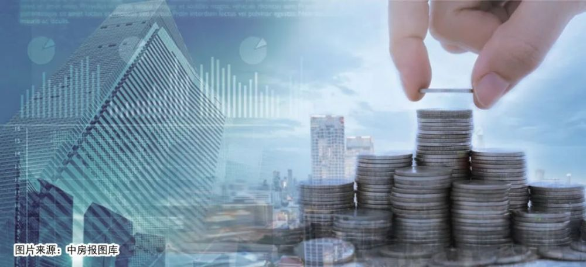

# 房地产税立法暂缓，媒体：5年内难开征

从长远看，房地产税立法方向未改，待条件成熟后，不排除未来推出房地产税改革试点。

**中房报记者 许倩丨北京报道**

备受关注的房地产税立法工作，再度被搁置。

近日，十四届全国人大常委会立法规划对外公开，在财税领域，增值税法、消费税法、关税法等明确在本届人大常委会任期内提请审议。备受关注的房地产税立法和个人所得税法修订并未在此次立法规划中提及。这意味着房地产税立法暂缓。

在2018年9月《十三届全国人大常委会立法规划》中，房地产税法被纳入第一类项目，属于条件比较成熟、任期内拟提请审议的法律草案。但在十三届人大常委会任期内，房地产税法未能提请审议；在本次立法规划中，甚至未再提及房地产税。

这期间，全国房地产市场销售额从2020年的18.7万亿元跌至2022年的13万亿元，创下6年新低。“房地产市场供求关系发生重大变化。”这是中央对全国楼市走向的最新判断。

“立法开征新税需要择机而行，尤其是影响广泛而深远的房地产税。目前的经济形势不适合，此时出台任何增负措施都要格外谨慎。此外，房地产税还涉及许多尚未理清的理论与实务问题。”中央财经大学财经研究院院长王雍君表示。

“从房地产税开始立法，到落地执行至少需要3年以上准备时间，因此5年内最多会有少部分城市进行房地产税试点，真正意义上一二线城市全面开征房地产税至少是5年之后的事情，也就是2028年之后的事情。”镜鉴咨询创始人张宏伟预计。

**征收时机未到**

今年年初，财政部原部长楼继伟发表题为《新时代中国财政体系改革和未来展望》的文章指出，房地产税是最适合作为地方税的税种，在经济转为正常增长后应尽快开展试点。这一度被市场解读为“房地产税征收快了。”

事实上，房地产税涉及面广、情况复杂，其立法的步伐、路程一直非常谨慎，也非常曲折。

“第一次听说这事儿是1992年楼继伟还当财政部副部长的时候就提出来的，从1992年到现在20多年了。”一位房地产企业家在2016年一次经济学家年会上曾这样表示。

2013年，党的十八届三中全会首次提出加快房地产税立法并适时推进改革。2015年7月有官媒报道，房地产税立法初稿已基本成形，正在内部征求意见并不断完善中。

2016年7月23日，在一场G20税收高级别研讨会上，时任财政部部长楼继伟表示，受制于信息征集能力弱及利益调整阻碍，房地产税制改革尚未推出正式方案，但下一步将“义无反顾”推进改革。

但在2017年3月4日，十二届全国人大五次会议新闻发言人傅莹答记者问时说，“今年没有把房地产税法提请全国人大常委会审议的安排。”

房地产税一直被业内视为房地产行业重大利空，尤其在楼市上涨期，房地产税推出呼声渐高。2019年3月8日十三届全国人大第二次会议上再次提到房地产税法后，港股地产股、内房股于当日全线大跌。

2021年10月，全国人大常委会通过《关于授权国务院在部分地区开展房地产税改革试点工作的决定》。随即，2022年3月16日，财政部作出关于“今年（2022年）内不具备扩大房地产税改革试点城市的条件”的表态。

这期间，楼市遭遇大幅度下滑，房企债务违约进入集中爆发期。2020年，违约房企4家；2021年，房地产市场开始深度调整，又有15家房企出现债务违约；2022年房企违约进入集中爆发期，42家房企接连暴雷；今年以来，又有超过5家房企违约。

“尽管房地产税法出台的主要目的不是为了调控房地产市场特别是调控房价，而是作为一种中长期制度为地方政府筹集财源，但该立法安排可能会比较明显地为影响到市场预期，所以房地产税法立法进程逐渐放缓。”上海交通大学财税法研究中心副主任王桦宇表示。

在当前房地产市场低迷和经济恢复尚不牢固等现状下，十四届人大常委会立法规划不将房地产税立法纳入一二类项目，实是稳妥之举。于当前而言，鼓励消费、刺激内需、稳定房地产市场及预期是更为重要的任务。

**立法大方向不变**

房地产税立法暂缓，并不意味着放弃立法。在多位业内人士看来，从长远看，房地产税立法方向未改，待条件成熟后，不排除未来推出房地产税改革试点。

“房地产税立法是房地产改革重要基础性制度建设中不可或缺的一项，势在必行。”中国财政科学研究院研究员贾康表示。在其看来，征收房地产税的必要性是多方面的，这也是其多年来一直力推房地产税的原因。

首先，该税种有利于房地产业界形成健康发展的长效机制。房地产税作为房地产开发保有环节的一种税收负担，可有效遏制炒房行为。房地产税负担也可以为买方市场带来长远效益，将会有越来越多人根据自身能力，重新考虑购房户型，而不是拼命争取大户型，因为大户型可能意味着高税收。如果越来越多人以这样模式选房子，其结果是开发商会适应市场预期，提供越来越多中小户型，进而促使土地集约化使用。在土地资源紧缺情况下，这是一种正面效应。

其二，通过房地产税收有利于地方政府形成财源建设内洽机制，有效解决地方财源建设问题，从而推动地方政府转变职能，尽心尽力做好公共服务，优化投资环境。“还有利于优化收入分配，越是有经济实力，住大房子、住好房子的人，可能越需要更多地为国库作贡献，这不就是所说的促进共同富裕的调节机制吗？”

张宏伟表示，当前不适合房地产税立法，主要是因为楼市处于调整周期，不能再造成向下的趋势压力。但未来几年有可能继续会推进。尤其是当核心一二线城市房地产市场进入下一轮上行周期，并且达到高点这个时间，有可能是下一轮房地产税立法再被提及或落地的最佳时间。

“未来3年内推进房地产税立法的概率已经不高了。因为即使是一二线城市，要普遍性回暖，并且达到下一轮市场周期的高峰时间，如果没有特别大的政策力度情况下，恢复时间周期至少需要2~3年，因此近3年内基本上不用再担心房地产税立法问题。”张宏伟预计。

“即便后续适时推动房地产税立法，也要注重征税的方式方法和技巧。预计会适时在部分条件成熟城市推出改革试点，总结经验后推动立法。”一位财税专家表示。

**值班编委：樊永锋**

**责任编辑：马琳 刘亚**

**审读：戴士潮**

**中国房地产报版权所有**

**未经授权不得转载以及任何形式使用**

