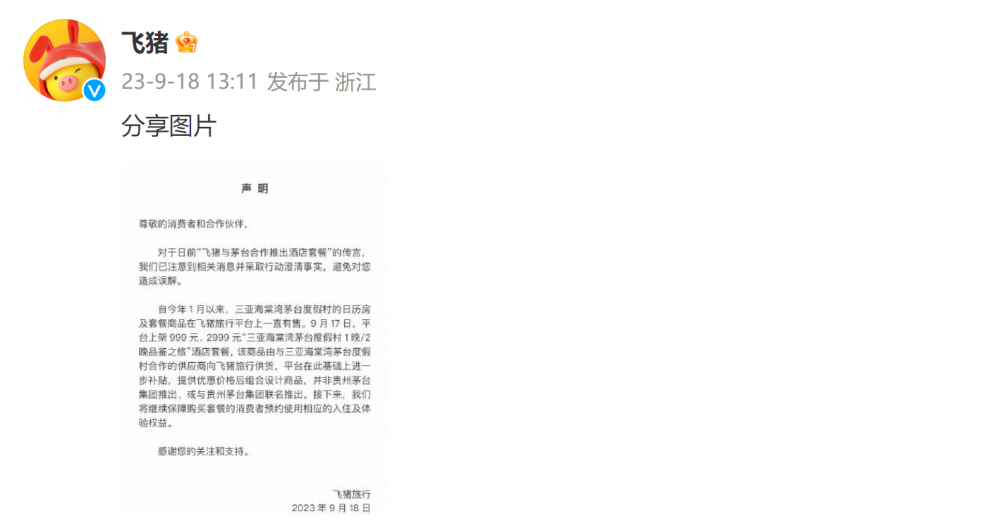
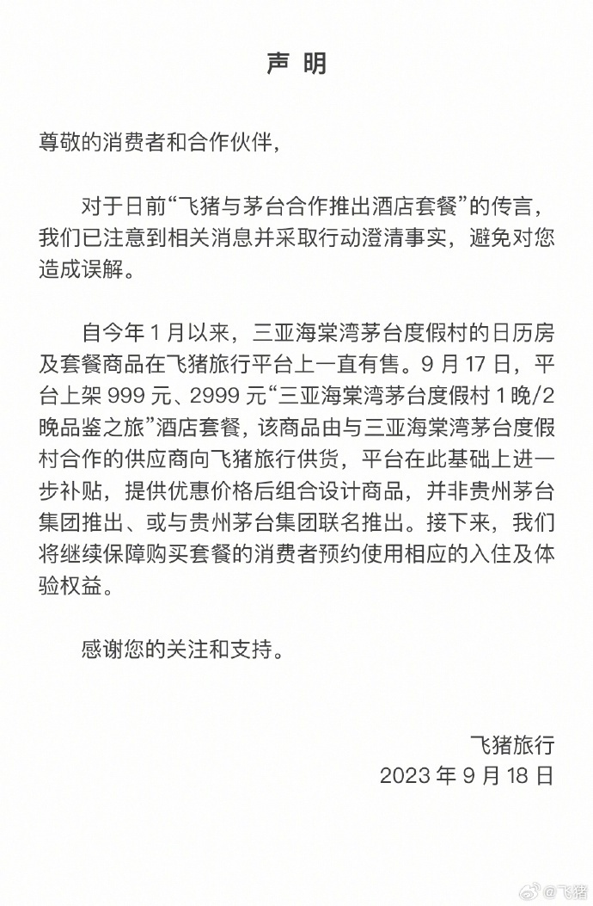

# 有传言称“飞猪与茅台合作推出酒店套餐”，飞猪发布声明澄清

9月18日中午，飞猪官方发布声明：

对于日前“飞猪与茅台合作推出酒店套餐”的传言，我们已注意到相关消息并采取行动澄清事实，避免对您造成误解。

自今年1月以来，三亚海棠湾茅台度假村的日历房及套餐商品在飞猪旅行平台上一直有售。9 月17日，平台上架 999 元、2999 元“三亚海棠湾茅台度假村
1晚/2晚品鉴之旅”酒店套餐，该商品由与三亚海棠湾茅台度假村合作的供应商向飞猪旅行供货，平台在此基础上进一步补贴，提供优惠价格后组合设计商品，并非贵州茅台集团推出、或与贵州茅台集团联名推出。接下来，我们将继续保障购买套餐的消费者预约使用相应的入住及体验权益。

**【来源：飞猪】**

