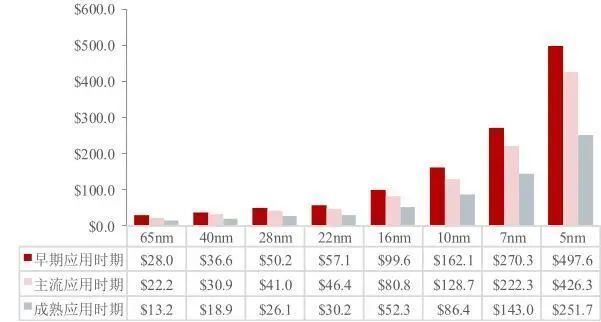
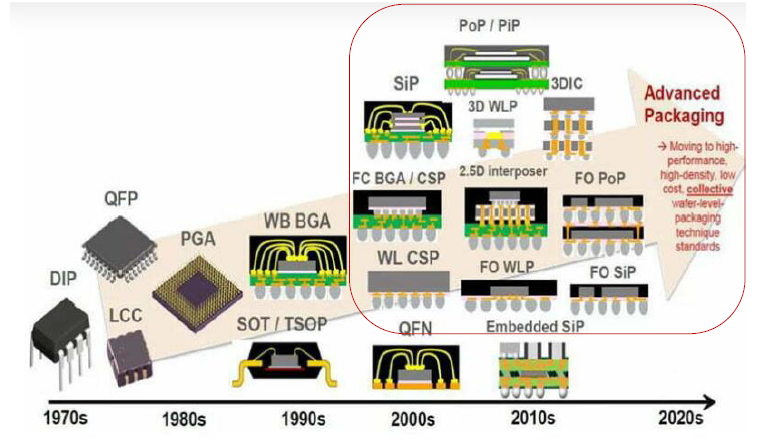
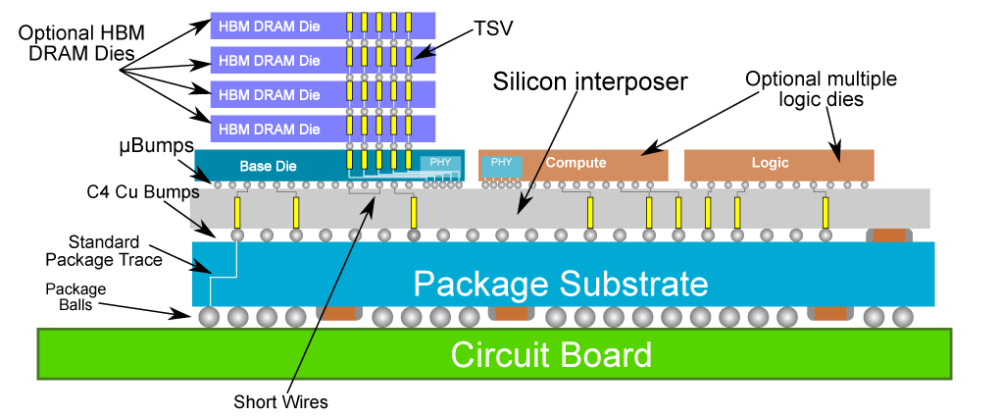
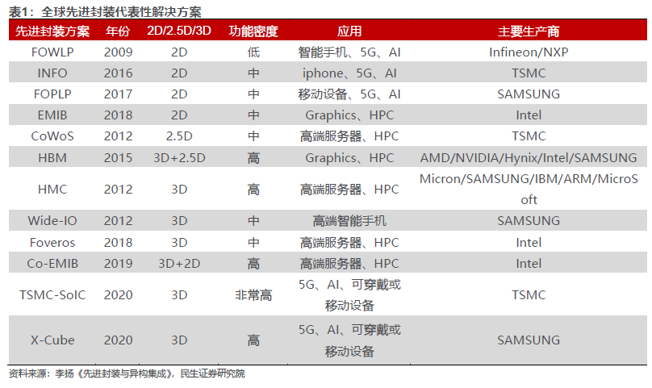
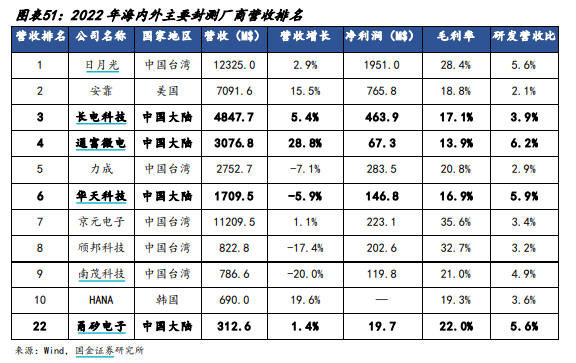

# 没有EUV光刻机，也造不了3nm，国产芯片如何突破？

_“芯事重重”是腾讯科技半导体产业研究策划，本期聚焦先进的封装工艺对于半导体产业发展的价值分析。_

潮流如暗流，迅猛而至，行业龙头也被冲击的手忙脚乱。

当半导体加工的制程微缩游戏走到尽头，先进封装，逐渐成为芯片行业的胜负手。

01

潮流如暗流：黄教主上阵催单，台积电慌忙扩产

年初，任谁也料想不到，今年的半导体产业会如此的冰火两重天。在今年整个芯片行业由于去库存满目哀鸿遍野之际，英伟达的AI芯片却一颗难求，国内互联网大佬们亲自飞往英伟达总部加州，只为多求几颗A800和H800。

这倒并不是黄教主奇货可居，奈何是因为整个AI芯片行业都受困于台积电产能不够。

5月27日，黄教主明面上是到台湾大学发表毕业典礼演讲，创业大佬给后生的心灵鸡汤固然好喝，但实际上，敦促台积电扩产才是老黄此行的核心目的之一。据了解，台积电已经在协调提升产能，预估2024年底将冲刺20万片的产能，台积电股东会上CEO魏哲家表示，将会在龙潭厂加大力度扩充CoWoS产能，竹南AP6厂也将加入支援。

_图：黄仁勋出席台大毕业典礼发表演讲_

不是说芯片代工产能过剩吗，怎么还需要老黄亲自跑到台积电督战？与一般的认知不同，这次吃紧的不是台积电7nm、5nm这些先进制程的晶圆代工，而是那些以前不被人重视的先进封装，成为了整个产业链的最短板。

在半导体的行业分工中，封装一直都是鄙视链最底部的存在，低附加值高资本开支，芯片企业尽量都是绕道走。

而这次AI芯片的缺货潮使得先进封装技术代表之一的CoWoS，第一次走到了聚光灯下，以前这一冷门的名词，变得家喻户晓；业内甚至夸张到可以直接通过跟踪先进封装CoWoS的产能，来预判英伟达的下个季度的业绩，然后在英伟达的财报季疯狂买入看涨期权。

如果自上而下做逻辑推演，那就是：产业巨头争相进行AI的军备竞赛—>AI军备竞赛需要大量AI芯片—>AI芯片需要台积电代工—>台积电代工被先进封装CoWoS产能制约。

毫不夸张的说，先进封装一夜乌鸡变凤凰，成为制约TMT行业发展的最大瓶颈。

哪怕作为半导体制造无可撼动的大哥，台积电虽然仍在引领先进封装，但显然对这一潮流的迅猛之势准备不足，在客户的催促下，也只能紧急催单设备商去被动的增加CoWoS产能。

这也是第一次，大家不得不正视封装这个行业。

_图：半导体产业链；中泰证券_

02

当传统思路走到尽头

提高芯片性能最直接的方式尽可能多的增加晶体管的数量，这跟提升电动车续航靠堆更多的电池包别无二致。所以对于半导体行业的发展而言，先进芯片研发的传统思路，从来都是“在晶体管上做文章”，简单来说就是在制程微缩的同时扩大芯片面积。

其中，制程微缩的目的是为了在单位面积上放更多的晶体管，也就是我们常听到的14nm、7nm、5nm、3nm，这样可以把晶体管越做越小，自然单位面积能堆的晶体管就变多了；另外的方式是扩大面积，就是在给定制程的前提下，尽量把芯片做得更大。

可以说过去数十年，我们使用的电脑和手机的逻辑芯片，都是靠这种方法在续命。而这种方法发展到今日，已经无可避免的直接撞上两大限制。

限制一，制程微缩的边际收益越来越小。

其实从28nm之后，芯片设计中追求更先进的制程的性价比就越来越低了。根据芯原股份的招股书披露的数据，芯片的单位面积成本在14/16nm
后迅速增加，摩尔定律不断放缓。随着制程从28nm 制程演变到5nm，单次的研发投入也从5000万美元剧增至5亿美元以上。

先进制程成了烧钱竞赛，所以最先进的芯片，只剩下苹果、英伟达、三星、AMD、英特尔、联发科、特斯拉、华为等少数几家企业在做；年初OPPO无奈解散旗下的哲库团队，便是研发先进芯片高门槛的最好体现。

正是由于先进的投入产出比并不一定合适，所以很多芯片停留在28nm之后，便不再一味追求先进制程。

_图：不同工艺节点处于各应用时期的芯片设计成本（单位：百万美元）；来源：芯原股份招股说明书_

限制二，大尺寸芯片的良率越来越低。

除了追求先进制程将晶体管密度提升外，另外一个方法就是把芯片做大，所谓大力出奇迹。然而这一朴素的方法也基本走到了尽头。

仍然以英伟达的AI芯片为例。由于相较于传统芯片，AI芯片为了实现极限性能将面积做的更大，英伟达的AI裸芯片尺寸通常超过800mm2，是普通手机主控芯片的数倍大；芯片太大带来的直接问题就是生产的良率迅速降低。

业内有一个判别工艺制造良率的Bose-Einstein 模型：良率=1/(1+芯片面积*缺陷密度)n。从这个公式不难看出，单芯片的面积越大，良率就会越低。

有人自然会说了，良率低无所谓，多做几个不就行了？这显然是对工业化生产了解不够，英伟达AI芯片现在单颗出售价在1万美元以上，良率低带来的损失谁都承受不起。

根据模型估算，150mm²的中大型芯片的良率约为80%，而700mm²以上的超大芯片，良率会暴跌至30%。而且根据业内人士透露，由于光刻掩膜版的尺寸限制，其实单个芯片的面积一般不超过800mm2，所以英伟达的AI芯片其实已经逼近面积上限。

当推动先进芯片进步的方法，都开始遭受前所未有的挑战，行业势必要寻找新的续命手段。

03

撞见未来，揭开先进封装的神秘面纱

**虽然封装行业不如芯片设计和晶圆代工那么引人注目，但得益于芯片种类的大发展，全球芯片封装行业的规模也比较可观，在2022年的市场规模超过了800亿美元，是一个很难被忽视的行业，只不过一直被贴上周期的标签。**

回归到产业，半导体封装是半导体制造工艺的后道工序，本身是为了更好的让芯片和其他电子元器件实现电气连接；曾有业内人士做过一个形象的比喻，芯片就相当于大脑皮层，而封装就像大脑的颅骨；所以在半导体的历史长河中，封装都是配角的存在，市场关注度并不高。只是先进封装让封装行业第一次走到了台前。

另外一个层面，封装行业的技术发展也并不慢，不是所谓的“纯周期”行业。

过去70年，封装行业至少经历了四次大的技术变革。尤其是从2010s开始，行业逐渐进入到先进封装的新发展阶段（2010年，蒋尚义先生提出通过半导体公司连接多颗芯片的方法，区别于传统封装，定义为先进封装）。自此之后，新的概念也开始层出不穷，比如有FC、SiP、2.5D封装、3D封装、FO、RDL、TSV等等。

当然，这也使得2023年学习先进封装的研究者，一下子扑面而来众多陌生的词汇，着实有些招架不住。

 _图：封装技术发展历史_

先进封装的理解其实并不复杂。顺着之前讲的思路，既然单纯的扩大单一芯片面积和缩小制程变得愈发不可行了，那能不能把原本应该超大的单一芯片，拆成不同的功能模块，然后都在某种制程下做成性能优异的小芯片，最后再把这些小芯片拼在一起组成一颗“大芯片”，实现“三个臭皮匠顶个诸葛亮”的效果。

这就是先进封装最底层的原理，用化整为零的方法大幅降低难度。如果都用相同的材料做不同的芯片，然后再将各个芯片封装到一起，这种在业内就被称为异构集成；如果甚至有些芯片，都是用不同的材料制造，然后封装到一起，这种在业内被称为异质集成。

为了实现以上想法，产业靠开发新的工艺，将这种设想变成现实,比如实现硅片之间连接的TSV技术（Through Silicon
Via，硅通孔技术）、RDL（重布线技术）。

以3D
封装为例，对于上下堆叠是同一种芯片，通常TSV就可以直接完成电气互联功能了，而堆叠上下如果是不同类型芯片，则需要通过RDL重布线层将上下层芯片的IO进行对准，从而完成电气互联。

仍然回到英伟达的AI芯片，作为先进封装的代表方案，CoWoS虽然是10年前台积电联合赛灵思开发的，但是最终在英伟达的AI芯片上被发扬光大。

NVDIA当前主力产品A和H系列，都是采用了台积电CoWoS
2.5D封装，以A100为例，其中的主芯片A100为单芯片架构采用7nm制程，然后配备了海力士的HBM，而这两个最重要的芯片之间，正是通过CoWoS的方式实现高速互联。

 _图：台积电给英伟达提供的CoWoS封装方案。_

所以说，以前产业还对先进封装将信将疑（封装厂并未大量投资，而晶圆厂台积电却异军突起），而英伟达热卖的AI芯片，正式宣告先进封装正在成为半导体的胜负手。

产业龙头玩家也意识到，先进封装在摩尔定律逼近物理极限的当下，将发挥越来越重要的作用，因此紧急地在先进封装上追赶。

比如牙膏厂英特尔，重点布局的有两种先进封装方案：

**1）2.5D封装EMIB，主打低成本；2）Foveros3D face-to-face芯片堆叠封装工艺，主打高性能。**

据报道，英特尔今年计划推出的14代CPU Meteor
Lake，将首次引入Tile这种类Chiplet设计，集成CPU、GPU、IO和SoC四个独立模块，并采用Foveros封装技术。

三星目前先进封装的方案有四种，包括I-Cube、X-Cube、R-Cube、H-Cube。技术原理上大同小异，也就不展开细聊了。

抛开技术细节不谈，其实不同厂商的先进封装都与台积电类似，只不过为了区分和避免专利纠纷，做了一定程度的规避。名字不同没啥本质区别，更为关键的是，巨头们在开始认识到先进封装的重要性后，选择了打不过就加入。

根据民生证券的总结，我们可以看到，以后靠先进封装的产品，将渗透到服务器、手机、AI、可穿戴还有图形显示中去，基本涉及到生活的方方面面，重要性与日俱增。

_图：全球先进封装代表性解决方案；资料来源：民生证券。_

**04多一重意义，对国内产业链意味着什么？**

大家自然要问，对于这么重要的一个趋势，我们国内做得又怎么样？

首先要厘清一个潜在的思维误区，虽然国内的半导体行业发展是滞后的，但是封装产业链由于技术壁垒相对低、发展相对早，因此全球竞争力还是可圈可点的。

根据数据统计，在全球前十大封装公司中，中国大陆占到了3家，中国台湾占5家，美国为1家。其中，长电科技、通富微电和华天科技，被称为国内封测3巨头，均位列全球前十。而且这3家封装厂，业务布局非常全球化，海外收入占比均超过50%，以其中通富微电为例，AMD的大部分封装都由通富微电来完成。所以说国产的封装厂具备全球化的竞争力，也毫不为过。

_图：全球主要封测厂排名；资料来源：国金证券。_

不得不说，虽然封装我们并未掉队，但是先进封装确实慢人一步。

还是拿数据来说话，在整个先进封装领域，日月光的份额达到26%，其次是台积电和安靠，而国产排名最高的长电科技市场份额只有8%；如果是进一步上升到最尖端的先进封装，那国产的存在感就更弱了，可以作为佐证的是，英伟达所需的CoWoS，中国大陆产业链存在感等于0。

随着这波先进封装的全球浪潮，国内的封装厂也开始及时转向。根据产业调研信息：

**● 长电科技在TSV-less、RDL 等技术方面有所布局，已经推出XDFOI技术方案，并实现国际客户4nm节点Chiplet产品的量产出货。**

**● 通富微电推出融合了2.5D、3D、MCM-Chiplet 等技术的先进封装平台——VISionS，目前已经具备7nm
Chiplet规模量产能力，并持续与AMD等龙头厂商加强合作，估计在AMD即将量产的MI300中扮演重要的角色；**

**● 华天科技推出由TSV、eSiFo、3D SiP构成的最新先进封装技术平台——3D Matrix。**

抛开这些封装厂，那先进封装对国内半导体产业链，又有着什么样的意义？

先进封装其实不仅是发展AI等芯片的必需工艺，更为国内实现突破卡脖子的重要“弯道”。这是因为，先进封装是实现chiplet技术的基石性工艺。

很多人将chiplet与先进封装混淆，从定义上来说，chiplet，就是将大型单片芯片划分为多个相同或者不同的小芯片，这些小芯片可以使用相同或者不同的工艺节点制造，再通过跨芯片互联和封装技术进行封装级别集成，降低成本的同时获得更高的集成度。

所以chiplet只是一种设计理念，而实现这种设计理念最重要的依赖工艺之一就是先进封装。只不过这种理念，对于国产芯片的发展，意义更为重大。

在海外的封锁下，如果仅靠国内产业链，我们芯片制程目前能够做到的理论极限是7nm左右，这跟海外的3nm仍有二代以上的代差。进一步弥补代差就需要通过多颗小芯片的堆叠，这是可能能够做出更高性能的产品的。

简单来说，就是我们可以通过chiplet来实现封锁突破，甚至是换道超车。

于行业发展规律而言，先进封装正在日益成为半导体竞争的胜负手，与先进制程一起成为先进芯片的必备工艺；于国产链而言，先进封装是实现弯道超车的必由之路。叠加起来，国内发展先进封装实则是更为紧迫的，当革命有了新的方向，同志们则更需努力。

