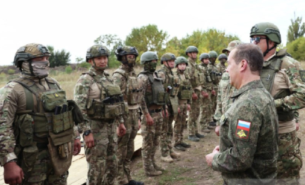
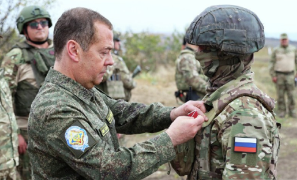
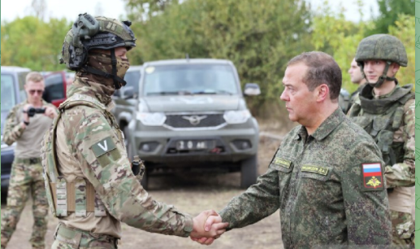

# 现场画面公开！俄媒：梅德韦杰夫赴顿涅茨克视察，与俄方士兵交流

【环球网报道】综合俄新社、《莫斯科晚报》网站等多家俄媒18日报道，俄罗斯联邦安全会议副主席梅德韦杰夫在顿涅茨克地区视察的画面公开。俄新社日前报道称，梅德韦杰夫对顿涅茨克一个合同兵训练场进行了视察。

《莫斯科晚报》网站报道称，上述公开的画面显示，梅德韦杰夫与俄方士兵交流，他还亲手给一名士兵戴上了奖章。

俄新社18日称，这是梅德韦杰夫在顿涅茨克的画面。

据俄新社15日报道，梅德韦杰夫的助理奥列格·奥西波夫告诉该媒体，梅德韦杰夫按照俄总统兼武装力量最高统帅普京的指示对顿涅茨克地区一个合同兵训练场进行了视察，期间了解合同兵训练过程等有关情况。奥西波夫还对该媒体说，该训练场位于俄乌军队接触线附近。

