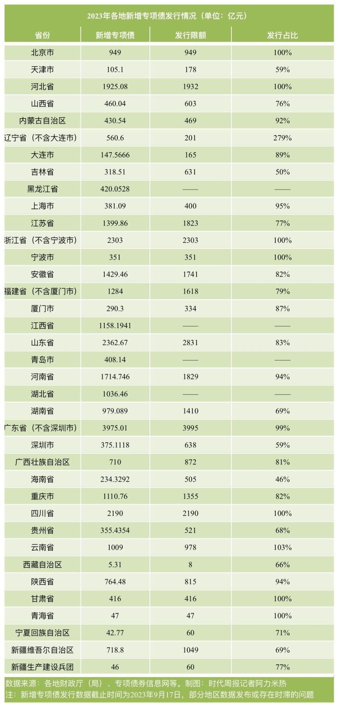

# 详解地方专项债：九省份完成发债任务，超三成投向市政和产业园区

本文来源：时代周报 作者：阿力米热

新增专项债是带动扩大有效投资、稳定宏观经济的重要手段。

按照财政部的安排，2023年全年安排地方政府新增专项债务限额3.8万亿元，比上年增加1500亿元。规模上升，意味着地方可以筹集更多的债券资金用于重大项目建设。

从发行节奏来看，由于今年地方债提前批额度较多、下达时间较早，所以一季度发力明显，但二季度主要经济指标略有下行，需要发挥专项债更大的逆周期调节力度。

因此，7月24日中央政治局会议提出，要“加快地方政府专项债券发行和使用”。

8月以来，随着多地重大项目的落地，新增专项债的发行正在提速。专项债券信息网数据显示，截至9月17日，全国累计发行新增专项债32414.5049亿元，占比超全年限额的85%。另据证券日报消息，8月份单月新增专项债发行规模达到5945.77亿元，创年内新高。

按照《国务院关于今年以来预算执行情况的报告》要求，今年新增专项债券力争在9月底前基本发行完毕，用于项目建设的专项债券资金力争在10月底前使用完毕，研究扩大投向领域和用作项目资本金范围，引导带动社会投资。

这意味着，9月份是新增专项债发行的冲刺时期，以此带动扩大有效投资，补短板，为稳定宏观经济大盘提供支撑。

仅剩不到半个月的时间，各个省份的发行情况如何，资金都投去哪些领域？

福建率先完成发行

总规模3.8万亿元的新增专项债限额，分配到各个省份，额度各有不同。

按照现行的管理机制，为防控地方政府债务风险，地方债是采取限额管理，为地方举债设立“天花板”。目前，全国地方政府新增债券和再融资债券总额度由全国人大批准，财政部则将这一总额分配给各省份。

时代周报记者经梳理各省份公开披露的预算调整方案报告发现，一般情况下，经济大省、财政强省能获得更多的额度。

分省份来看，广东省（含深圳）分到的新增专项债额度最高，为4033亿元，其次为山东（2831亿元）、浙江（含宁波）（2654亿元），三省份额度合计9518亿元，约占全国总额度的25%。

而西藏、青海、宁夏三省份的额度则较少。

距离9月30日还有十多天，具体到各个省份的发行情况如何？

截至9月17日，从各地发行新增专项债的占比来看，当前近九成地区的发行占比超60%。在这些省份当中，已有福建、四川省公开宣布已完成全年新增政府债券发行任务。

此外，北京、河北、辽宁、浙江、云南、甘肃和青海虽然没有宣布完成全年发行任务，但时代周报记者根据各地财政厅（局）、专项债券信息网等公开信息统计发现，上述省份也已基本完成发行任务。

值得注意的是，福建是全国率先完成全年新增政府债券发行任务的省份。

福建日报消息显示，6月8日，福建省在中央国债登记结算有限公司成功发行新增政府债券561.49亿元。至此，除厦门自发自还部分外，今年财政部下达福建省的新增政府债务限额已全部发行完毕，成为全国首个完成全年新增政府债券发行任务的省份。

粤开证券首席经济学家、研究院院长罗志恒告诉时代周报记者，个别地方发行快与慢，与当地的经济社会发展形势、债务风险和专项债的储备情况有较大关系。比如有省份人口持续流入，土地出让形势相对较好，财力相对充足，对专项债的依赖度没那么高，自然发行进度慢；比如部分地区经济增长乏力，需要基建托底，发行节奏也自然偏快。

“又比如说，当前审计部门对专项债的违规使用以及投向项目难以自求平衡等，提出了较多的整改意见，财政部门发行、使用专项债会考虑到储备项目的质量等情况，避免形成资金的浪费等，这些都可能影响专项债的发行节奏。”罗志恒说道。

新增专项债的发行进度，一方面与相关项目储备、质量、经济形势高度相关，另一方面也很大程度受到地方财政低迷、项目资本金缺位或导致专项债难以落地使用等影响。

_福建省厦门市海滨的世茂海峡大厦及周边建筑落日风光 图源：图虫创意_

对于福建来说，新增专项债发行速度较快，或与福建项目储备比较充足有关。

根据福建省财政厅披露，2023年该省获财政部和国家发展改革委均审核通过的项目已达1631个、资金需求达3430亿元，专项债的工作重点将落在交通、水利、新能源、新基建等领域。

与此同时，从经济发展来看，福建也需要加快脚步。

统计数据显示，今年上半年，福建GDP同比增长3.8%，低于全国平均水平。叠加当前国际环境复杂多变的影响，体现出市场需求不足制约明显，经济恢复基础还不稳固。

投资作为拉动经济的“三驾马车”之一，一头连着需求、一头连着供给，对于恢复和扩大需求，激发经营主体活力发挥着重要作用。而政府债券特别是专项债券，是拉动有效投资的主要工具之一。

因此，福建省率先完成新增专项债发行、加快将债券资金转化为实物工程量，也有利于确保全年经济在合理区间平稳运行。

基建领域仍是重头

各地发行的新增专项债资金，都花在哪里了？

财政部公布的新增地方政府专项债务情况数据显示，1-8月，各地在批准下达的新增债务限额内，发行用于项目建设的专项债券29455亿元。

这意味着，基础设施建设依然是大头。

罗志恒分析称，1-8月新增专项债主要投向市政和产业园区、棚户区改造、医疗卫生、农林水利和铁路五大领域，占比分别为31.5%、9.1%、7.4%、7.1%和4.9%。

从重点投向来看，市政和产业园区、农林水利、交通基础设施属于中央确定的重点投资领域，能够带动扩大有效投资，棚户区改造、医疗卫生属于惠民生、解民忧领域投资，亦是专项债项目申报重点。

这些新增地方债发行过后，罗志恒认为，将对四季度和全年经济形成有力的支撑。“一般而言，专项债券在发行后3-6个月内可以形成实物工作量。当前加快专项债发行使用的情况下，从资金到投资的时间有望进一步缩短。”

_交通基础设施建设 图源：图虫创意_

新增专项债的加速发行并尽快投入到项目中，也是当前扩大总需求重要的一部分。不过，在当前专项债的使用方面，也出现了一些专项债存在资金闲置、投向不合规、资金挪用、项目收益不及预期等问题。

如何强化管理提高专项债资金使用效益，也成为近年监管部门关注的重点之一。

对此，罗志恒分析称，短期来看，应当允许专项债加快发行进度并尽快投入到项目中，避免“半拉子”工程和无效投资，同时在当前扩大总需求的背景下，非常有必要去稳基建稳投资。从中长期看，则要采取一系列提前防范风险的措施。

具体来看，可以从增量的角度去解决问题，采取压降专项债占比、提高一般债占比，压降地方债占比、提高国债占比等方式，通过发行长期建设国债来实施一些具有较强外部性的项目，形成长期建设国债、地方一般债、地方专项债并行且各司其职的局面。

此外，还要加大项目信息公开力度，让市场对项目进行严格的审核论证。对于受条件限制，实际项目进度或收益不佳的项目，地方应该加紧督促力度，切实解决困难，加大招商引资，从各种角度提高项目收益。

 _图源：图虫创意_

当前，新增专项债发行已处于冲刺阶段，作为投资项目中的重要资金来源，明年专项债的发放限额会有何变化？罗志恒预计，与今年持平的可能性较大。

“专项债的规模不能单纯看专项债本身，要放到财政政策组合的角度看。”罗志恒表示，当年的预计经济形势会产生对财政政策逆周期调节力度的客观需要，需要财政支持，至于是通过专项债，还是国债、地方一般债来弥补，这就是政策组合的问题。

“不存在说专项债必然要到多少规模，这要取决于国债、一般债的力度，还要考虑项目储备情况。”他指出，如果考虑到地方债务风险偏高，那国债就可能更多加杠杆，专项债规模可能压降。但是，市场对专项债规模较为关注，难以从综合角度看，更多看单一指标，因此这个指标又具有较强的信号意义。

“综上来看，虽然理论上应该大幅压缩专项债，提高赤字率尤其是提高国债金额和占比，但专项债与今年持平的可能性较大。”罗志恒说道。

