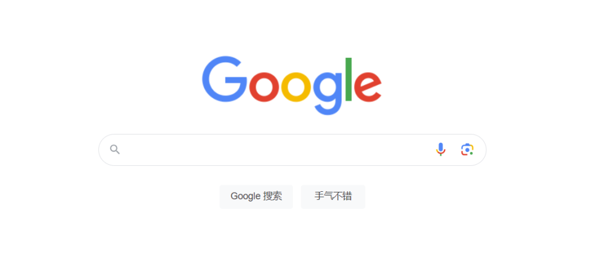

# 谷歌面临25年来最大反垄断审判，如果此案发生在中国，会怎么判？

据媒体报道[i]，近日美国法院正式启动了司法部起诉谷歌的反垄断案审判，谷歌正在面临创立25年以来最大的一次反垄断审判。美国司法部称，谷歌每年向苹果、三星等公司支付超过100亿美元，以保持其在电脑和移动设备上作为默认搜索引擎的地位。此举将竞争对手拒之门外，扼杀行业创新。

笔者查看了美国司法部网站上的案件起诉书，以及谷歌公司的抗辩声明，发现如果案件发生在中国，根据我国的司法实践，尤其是奇虎360诉腾讯案件的判决书确定的规则，法院可能会驳回起诉，而且这个案子变数多，甚至ChatGPT都会给谷歌加分。中国的《反垄断法》理论和美国同源，中国赢不了的案子美国也悬。但美国司法部起诉的另一个针对广告服务的反垄断案，谷歌可能风险比较大。

**一、案情简介**

美国司法部称，谷歌至少到2010年就已经成为垄断者，目前控制着在线搜索市场89%以上的份额。该公司滥用了垄断地位，每年支付超过100亿美元，与苹果、三星等手机制造商以及网络浏览器服务商签订独家协议，让谷歌成为大多数设备上的默认搜索引擎。美国司法部的诉状称，独家协议也增加了竞争对手的进入障碍，尤其是无力支付数十亿美元的入场费用的小型创新搜索公司。对搜索引擎行业而言，规模非常重要，谷歌和苹果、三星等公司签订的协议锁定了自己的规模并剥夺竞争对手的规模，是在非法维持其垄断地位。

谷歌方面否认了这些指控，坚称其在搜索领域的主导地位是因为它提供了比竞争对手更好的服务，向苹果、三星和网络浏览器服务商等合作伙伴付款是为了补偿他们的工作，以确保他们的软件获得安全更新和其他维护。对此，与谷歌签订协议的苹果公司蒂姆库克CEO称[ii]，苹果让谷歌成为
Safari浏览器中的默认搜索引擎主要是因为他们的搜索引擎是最好的。

谷歌的这段回应[iii]很棒：值得注意的是，2014
年Mozilla（浏览器服务商）选择把雅虎作为默认搜索引擎，但很多用户实际上又改回了谷歌。换句话说，虽然默认设置很重要（这就是我们付费的原因），但它们很容易更改。人们可以而且确实会进行切换。相比之下，
**微软在
Windows上预装了Edge浏览器，将Bing设为默认搜索引擎，并积极加大切换难度。尽管如此，绝大多数微软用户还是选择使用谷歌进行搜索。事实上，“Google”是Bing全球排名第一的搜索查询。**
与司法部的理论相反，人们知道他们有选择，并且他们会做出选择。

**二、默认搜索引擎协议的合法性和正当性分析**

这个诉讼很有意思，但如果在中国，笔者认为原告不乐观。谷歌斥巨资购买默认搜索引擎地位的行为，《反垄断法》上涉嫌两种垄断行为，违法垄断协议和滥用市场支配地位，但中国《反垄断法》上不能找到其直接违法的条款。

**1、先看垄断协议的条款，没有直接违反涉及横向垄断的第十七条：**
禁止具有竞争关系的经营者达成下列垄断协议：（一）固定或者变更商品价格；（二）限制商品的生产数量或者销售数量；（三）分割销售市场或者原材料采购市场；（四）限制购买新技术、新设备或者限制开发新技术、新产品；（五）联合抵制交易；（六）国务院反垄断执法机构认定的其他垄断协议。

**2、没有直接违反涉及纵向垄断的第十八条：**
禁止经营者与交易相对人达成下列垄断协议：（一）固定向第三人转售商品的价格；（二）限定向第三人转售商品的最低价格；（三）国务院反垄断执法机构认定的其他垄断协议。

**3、没有直接违反涉及滥用市场支配的第二十二条：**
禁止具有市场支配地位的经营者从事下列滥用市场支配地位的行为：（一）以不公平的高价销售商品或者以不公平的低价购买商品；（二）没有正当理由，以低于成本的价格销售商品；（三）没有正当理由，拒绝与交易相对人进行交易；（四）没有正当理由，限定交易相对人只能与其进行交易或者只能与其指定的经营者进行交易；（五）没有正当理由搭售商品，或者在交易时附加其他不合理的交易条件；（六）没有正当理由，对条件相同的交易相对人在交易价格等交易条件上实行差别待遇；（七）国务院反垄断执法机构认定的其他滥用市场支配地位的行为。

**4、谷歌行为的本质是内卷。** 以上三条中的“其他”条款还是有可能违反的，但毕竟不是违反明文规定。除了违法性，还要看正当性，我个人的感觉，
**谷歌斥巨资购买默认搜索引擎的行为没有特别的不正当，因为这个行为的本质是：内卷，是一种隐性排挤。**
谷歌给苹果、三星、Mozilla这些搜索引擎入口出高价，高额基础默认搜索引擎设置费用和高额广告分成，利用自己的规模效应，财大气粗，排挤竞争对手。类似的行为，所有的to
C领域的行业领先公司都会做，比如快消品支付较高的超市货架费获取黄金位置。 **但他们能在市场上战胜竞争对手，主要还是靠更好的服务品质。**

**5、微软的Bing也在做同样的事情。**
而且谷歌没有做绝，他们和苹果三星们签的默认协议不禁止用户使用竞争对手的服务，用户可以更换默认搜索引擎，也没有像当年微软对网景浏览器那样恶意不兼容，要指责其具有严重不正当性，依据并不充足。更具有讽刺意义的是，同样的事情现在微软也在PC上做，因为微软有垄断的Windows操作系统，所以新电脑第一次开机用户都必须打开微软浏览器，比如Edge，还有当年的IE，它们都是以微软的Bing做默认搜索引擎，
**但用户不喜欢Bing的服务，打开Bing第一件事就是搜Google，所以尽管PC上Bing是默认搜索引擎，他们在美国的市场占有率还是只有谷歌的大概十分之一。**

**三、3Q大战判决和ChatGPT对谷歌案的影响**

虽然也涉及垄断协议，但如果本案在国内起诉，原告多半会选择滥用市场支配地位作为重点诉由。但关键问题是：谷歌的技术更强大，服务更好。所以，如果违法性和正当性上都能守住，哪怕谷歌在通用搜索引擎市场具有市场支配地位，但这个行为也未必会被认定为构成滥用支配地位。

而且，国内法院对于互联网领域市场支配地位的认定也一直比较谨慎，
**经典的奇虎360诉腾讯滥用市场支配地位案中，和谷歌一样，市场占有率超过50%的腾讯，其作为即时通讯软件服务商，网络效应和客户粘性都远比谷歌的搜索引擎服务更高，但也没有被认定为拥有市场支配地位。**
因为最高人民法院认为，根据《反垄断法》的规定，哪怕市场占有率达到反垄断法规定的50%，还要看商品和服务提供者是不是具有市场支配力，在奇虎360诉腾讯的案件中，腾讯不具有市场支配力，所以也就没有市场支配地位。

**奇虎案一审判决：**
2．关于“客户粘性”与网络效应……在腾讯公司和腾讯计算机公司开发经营QQ产品之初，MSN是国内市场份额最大的即时通信服务提供商。但腾讯公司和腾讯计算机公司依靠具有特色的产品和优质的服务迅速扩大经营规模，吸引用户数量，最终在较短时间内在市场份额上超过MSN。由此可见，网络效应和用户锁定效应对于即时通信产品和服务来说并非不可逾越的壁垒。

**奇虎案二审判决：**
一审法院以腾讯QQ成功进入MSN占较高市场份额的即时通信服务市场为例，论证网络效应和用户粘性对于市场进入的阻碍并不明显。本案一审证据中，并无相关证据可以直接证明MSN在腾讯QQ进入市场时在中国大陆地区即时通信市场具有市场支配地位，且与当时的市场状况相比，市场环境已经发生变化。因此，一审法院的这一论证缺乏扎实的事实基础和说服力。但是，一审法院并非仅以此认定即时通信服务市场的进入比较容易，而是综合分析多种因素作出最终判断。这一论据本身存在的问题并不影响其最终结论的正确性。

**就连腾讯的PC端即时通讯服务在国内都没有市场支配地位，谷歌的搜索引擎服务凭什么可以认定有支配地位？**
本案如果在国内打，就没法破这个点吗？其实还是有办法的，关键还是要看相关市场怎么界定，3Q大战是2010年的事情，十三年后的市场已经有了变化。移动端是产业发展的主流战场，而且和PC端更开放、兼容并且容易被替代的服务相比，移动端更加的封闭、排他，同时服务的替代性也更弱，所以，
**互联网服务的相关市场如果界定在移动端，或者至少把移动端包含进去，要证明市场支配地位就会比PC端更可能有突破。**

**如果诉讼在国内，另一个变数在ChatGPT。**
今年人工智能是互联网产业发展的焦点，但谷歌的人工智能服务Bard比OpenAI的ChatGPT要逊色不少。而微软重金投资了OpenAI，帮助其研发ChatGPT，并以此取得了搜索引擎独家合作的权利。微软的Bing已经在搜索引擎内嵌入了ChatGPT的人工智能服务，搜索体验有大幅改进，出现了有挑战谷歌潜力的兆头。如果法院在国内审理谷歌搜索引擎反垄断案，这也会是一个法院认定市场支配地位的重要考量因素：
**搜索引擎服务市场的竞争也比较激烈和开放，所以谷歌哪怕有较高的市场占有率，其对于市场不一定会有超强的支配力。**

**四、谷歌的风险在双边市场的另一边**

本案如果在国内审理，关注度肯定比3Q大战低。因为3Q大战时，腾讯要求用户在360和腾讯间二选一，所以用户感知比较强。而谷歌这个案件对消费者的影响比较间接，虽然理论上说，垄断行为会损害消费者可以从正常竞争秩序中获得的竞争红利和创新红利，但
**搜索引擎是双边市场，服务商并不向消费者收费，所以消费者对于垄断行为危害性的感知较弱。**

什么叫
**双边市场，通俗的说，就是一边基础服务免费赚吆喝，另一边增值服务收费赚钱，两个边同时进行，美国的Google、facebook，中国的百度、腾讯都是这个模式。**
比如我们使用百度搜索内容，搜索服务就是双边市场的一边，在这边百度是不向我们收费的，但搜索结果里，百度会给一些广告，这些广告就是双边市场的另一边，搜索结果里出现的广告，广告商要给百度交展示费用，如果我们点击了广告，广告商还要向百度支付点击费用，广告要排名靠前的，还得以类似拍卖的模式支付竞价费用。在搜索引擎的基础商业模式上，谷歌和百度是差不多的。

再说下相关市场是啥，前文提到的市场占有率，就是在反垄断案件中界定出的相关市场中的占有率，相关市场怎么界定，对反垄断案件能否胜诉至关重要。因为搜索引擎是双边市场，
**所以本案的相关市场有二：一个是美国的通用搜索服务市场。**
谷歌在美国通用搜索服务市场拥有垄断地位。目前这个市场上只有四个有意义的通用搜索提供商:Google、Bing、雅虎和DuckDuckGo。根据公开数据来源，
**谷歌如今在通用搜索服务市场份额约为89%。**

**另一个相关市场是美国的搜索广告市场。**
广告市场由相应在线搜索查询而生成的所有类型的广告组成，包括通用搜索文字广告（由Google和Bing等通用搜索引擎提供）以及其他专业搜索广告（由通用搜索引擎和专业搜索提供商提供，例如
Amazon、Expedia或 Yelp）。基于公开的美国搜索广告总支出预估, **谷歌在美国所占份额搜索广告市场占比超过70%。**

为什么要在最后介绍双边市场，因为我的判断是本案美国司法部可能打不赢，但除了本案之外，美国司法部2023年初还起诉了谷歌另一个反垄断案：指控其在广告模式存在违法垄断，同时代理网站和广告客户，自己还做在线广告交易所，就好比其作为高盛、大摩这样的券商，同时还干了纽约证券交易所的活儿，利益冲突严重。
**该案可能会打到谷歌的软肋，该案的重点就在在双边市场的另一边，谷歌的违法垄断构成利益冲突，损害广告客户和出售广告位的网站利益。**
这个案子，在弗吉尼亚州的一个地方法院审，司法部的负责检察官曾在谷歌的竞争对手微软、Yelp 和新闻集团工作过[iv]，更了解谷歌，所以打法可能更对路。

本文作者：游云庭，上海大邦律师事务所高级合伙人，知识产权律师。本文仅代表作者观点。

[i] https://finance.sina.com.cn/jjxw/2023-09-14/doc-imzmqtuy7095368.shtml

[ii] https://www.fastcompany.com/90269911/apple-ceo-tim-cook-says-this-is-the-
best-search-engine-out-there

[iii] https://blog.google/outreach-initiatives/public-policy/response-us-v-
google/

[iv] https://edition.cnn.com/2023/08/31/business/google-doj-antitrust-
chief/index.html

