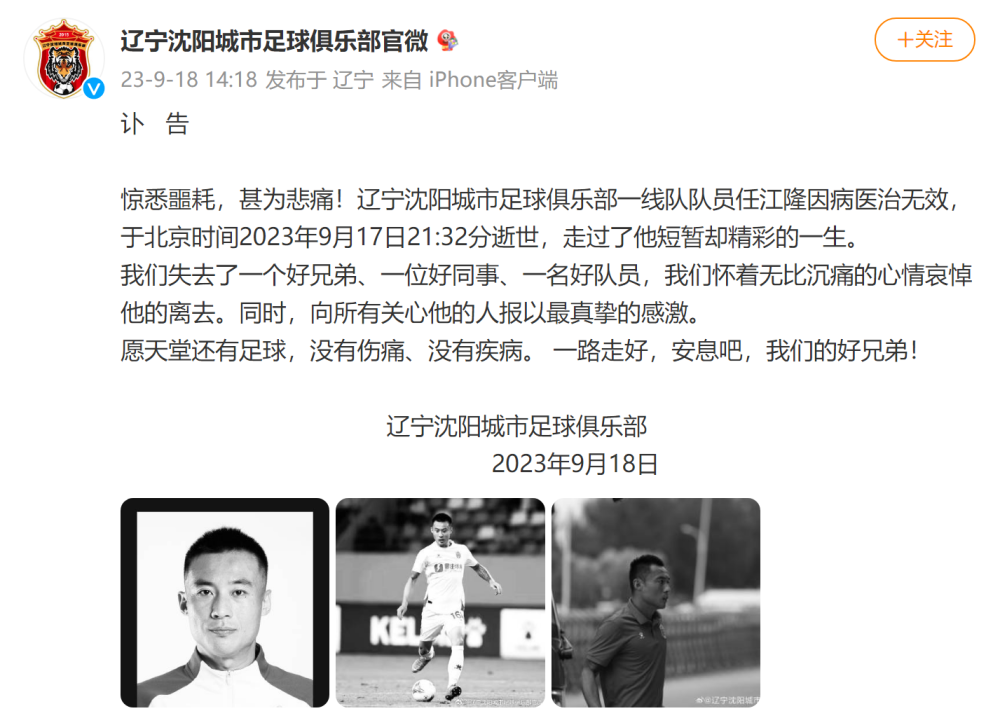
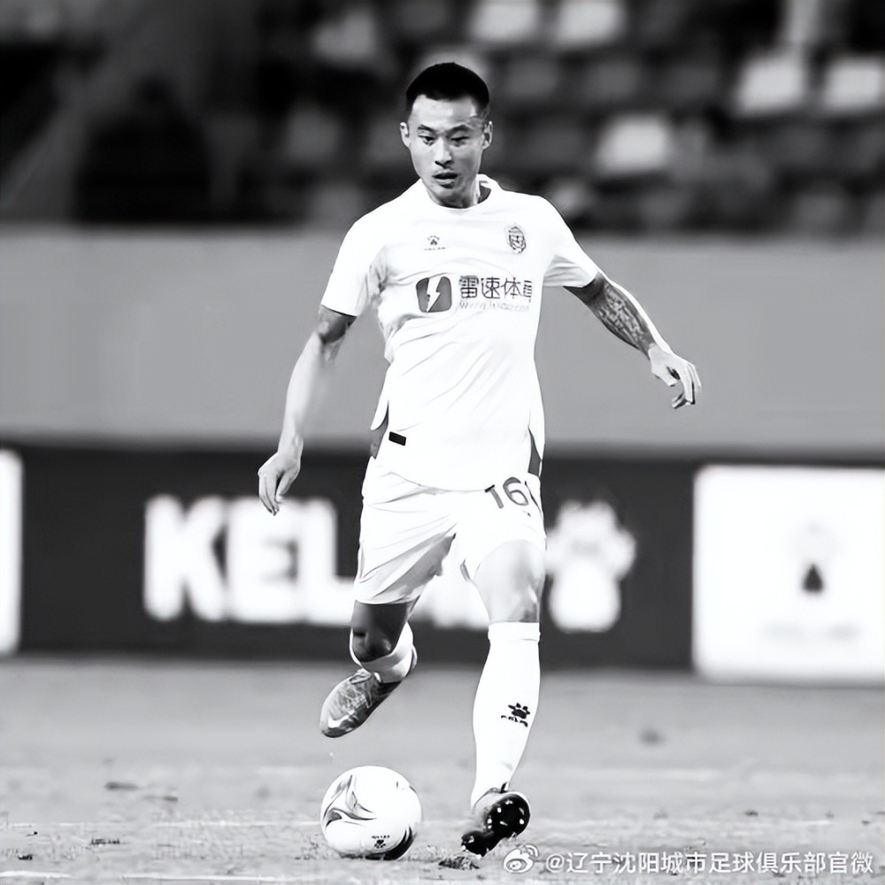

# 辽宁沈阳城市足球俱乐部发布讣告：一线队队员任江隆去世

9月18日，辽宁沈阳城市足球俱乐部官微发布讣告：

惊悉噩耗，甚为悲痛！辽宁沈阳城市足球俱乐部一线队队员任江隆因病医治无效，于北京时间2023年9月17日21:32分逝世，走过了他短暂却精彩的一生。

我们失去了一个好兄弟、一位好同事、一名好队员，我们怀着无比沉痛的心情哀悼他的离去。同时，向所有关心他的人报以最真挚的感激。

愿天堂还有足球，没有伤痛、没有疾病。 一路走好，安息吧，我们的好兄弟！

**【来源：辽宁沈阳城市足球俱乐部】**

