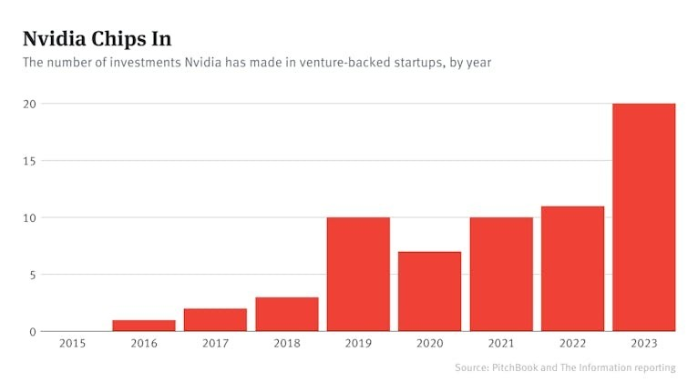

# 钱多到不知道该怎么花？英伟达变身投资怪咖 今年已完成20多笔交易

**划重点**

  * _1_ 手握大笔现金的英伟达今年已经进行了20多笔投资，而专业风投机构老虎今年也才完成了大约30笔交易。
  * _2_ 英伟达的投资范围很广，投资对象包括其客户、合作伙伴以及收购目标，以便为公司寻找持续增长动力。
  * _3_ 英伟达也在大力投资有前途的AI创企，比如Databricks、Enfabrica、Cohere和Adept以及Hugging Face等。

作为全球最大的芯片公司之一，英伟达主要从事图形处理器（GPU）和人工智能（AI）芯片的设计、制造及销售。但随着市值突破1万亿美元，手中现金储备不断增加，英伟达开始将目光对准了投资领域。

统计显示，英伟达今年已经完成了20多笔投资交易。相比之下，知名专业风投机构老虎全球管理公司(Tiger Global
Management)今年也才完成了大约30笔投资初创企业的交易。

在2020年金融科技空前繁荣的时期，支持全球主流跨境电商平台的Stripe也曾掀起投资狂潮。但在经历了一个繁荣与萧条的周期后，Stripe在风险投资交易方面后退了一大步，今年只进行了三笔投资，因为经济低迷对更广泛的金融科技领域造成重创。

如今，一家拥有数十年历史的芯片制造商取代了Stripe的位置，其人工智能芯片的销量创下了纪录。英伟达第二季度的收入达到135亿美元，是去年同期的两倍，该公司预计第三季度收入将增长170%。简而言之，英伟达手头的钱多得不知道该怎么花！

作为未雨绸缪之举，这家芯片巨头试图在失去增长动力之前，投资于每一个可能的客户、合作伙伴和收购目标。或者用一位科技投资者的话说，“任何闻起来像人工智能的东西”。英伟达预测，其芯片供应最终将与需求平衡，该公司的爆炸式增长也将放缓。

与此同时，英伟达还投资了多家看起来很有前途的人工智能公司。上周四，软件初创公司Databricks宣布获得5亿美元融资，估值达430亿美元，英伟达也参与其中。

英伟达首席执行官黄仁勋表示：“Databricks正在利用英伟达的技术推进令人难以置信的工作，以加快数据处理和生成式人工智能模型。”他补充说，企业数据是生成式人工智能的“金矿”。

上周，英伟达还参与了由Atreides Management牵头的、对网络芯片初创公司Enfabrica的1.25亿美元投资。

英伟达最近投资的其他公司包括OpenAI的竞争对手Cohere和Adept，以及开发人工智能软件开源工具的Hugging Face。

这些交易帮助英伟达赢得了领先人工智能公司的忠诚，而且，由于这些公司中的大多数都是英伟达的客户，该公司将赚回资本。批评人士称，像英伟达这样的公司从这些初创公司获得收入的方式是“往返交易（洗钱的一种方式）”。

然而，初创公司似乎对此并不介意。毕竟，他们需要现金，更重要的是，他们需要芯片。获得英伟达投资还有其他好处：英伟达带来的光环效应可以帮助他们吸引其他投资者的兴趣，因为人工智能领域的每个人都希望与英伟达友好共处。

除了聊天机器人公司Inflection
AI之外，英伟达通常不会主导投资交易，因此它并不与传统投资者竞争。风险投资者可能会意识到，英伟达的猛烈攻势似乎只是暂时的，将会随着投资者对生成式人工智能的兴趣逐渐消退而停止。

在此之前，一大批资金充裕的初创公司可能会加入到企业风投的游戏中。此前，Stripe、Coinbase、Slack和FTX也曾以私人公司的身份成为风投投资者。当然，其中有些努力最终以彻底失败告终。FTX
Ventures花了超过10亿美元投资初创公司，现在这些股份被列入交易所破产遗产的一部分。

Touchdown Ventures致力于帮助企业建立风险投资部门，该公司联合创始人斯科特·莱内特(Scott
Lenet)表示，他预计明年会有几家人工智能初创公司宣布企业风险投资项目。他希望这一次与过去有所不同。

莱内特解释称：“区块链初创公司在没有适当监管或最佳商业模式的情况下推出CVC基金，可称为前车之鉴。无论是从战略层面还是其他方面来说，投资仍然是一门学科，需要遵守流程并受到监督。”（文/金鹿）

