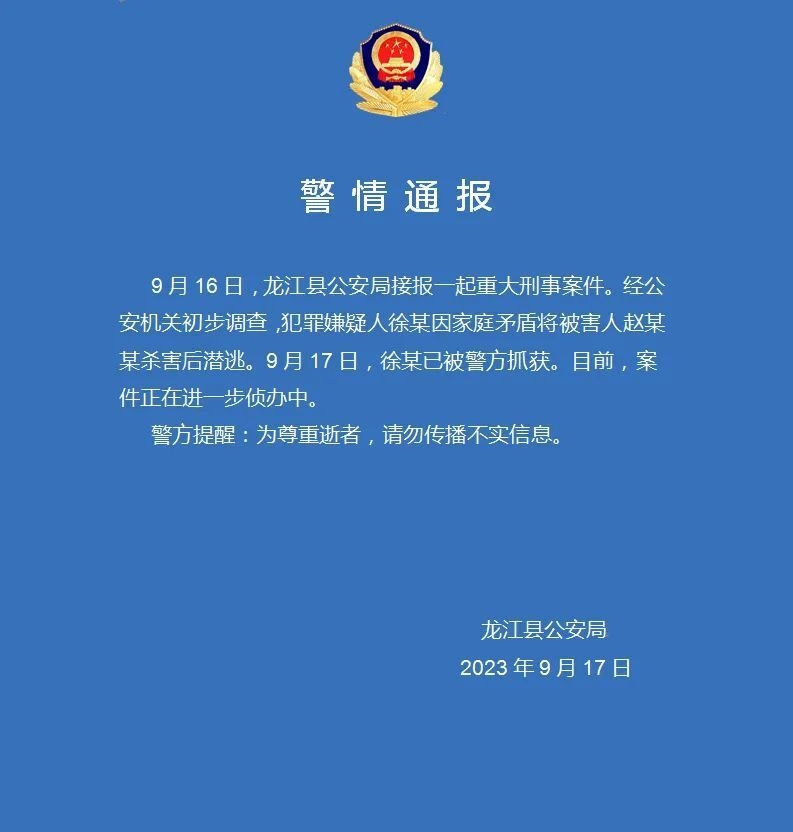

# 黑龙江龙江县警方：徐某因家庭矛盾将被害人杀害后潜逃，已被警方抓获

来源：龙江县公安局

警情通报

9月16日，龙江县公安局接报一起重大刑事案件。经公安机关初步调查，犯罪嫌疑人徐某因家庭矛盾将被害人赵某某杀害后潜逃。9月17日，徐某已被警方抓获。目前，案件正在进一步侦办中。

警方提醒：为尊重逝者，请勿传播不实信息。

龙江县公安局

2023年9月17日

**此前报道：**

[黑龙江发生重大刑案！警方发布协查通报 ](https://new.qq.com/rain/a/20230917A05U4Z00)

