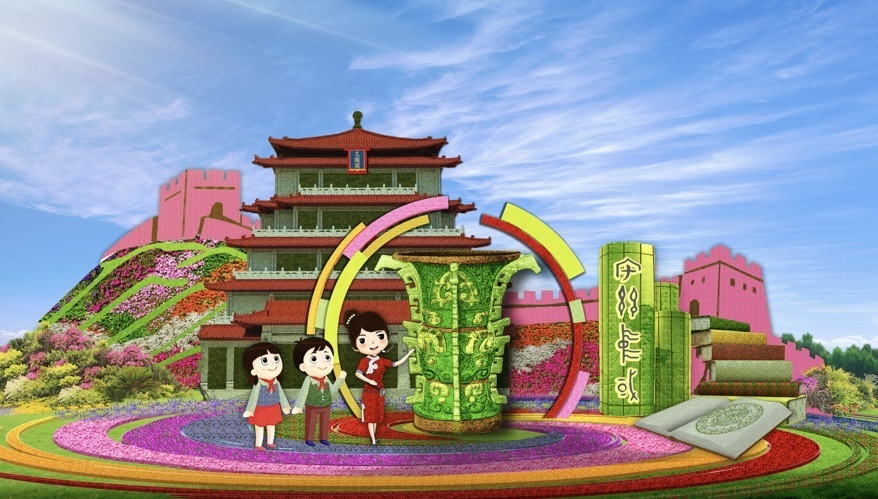

# 2023国庆摆花方案公布，大花篮里首次装上了“五谷”

北京日报客户端 | 记者 朱松梅

9月19日上午，北京市园林绿化局公布了2023年国庆天安门广场及长安街沿线花卉布置方案，“五谷丰登”首次亮相大花篮。
**花卉布置已于9月15日夜间进场施工，预计9月25日左右完工，与市民共庆佳节。**

**18米高花篮装满花卉和五谷**

今年，天安门广场中心的“祝福祖国”主题花坛以喜庆的花篮为主景。篮内选取了拥有美好寓意的花卉和喜庆丰收的五谷（水稻、小麦、小米、黄米、大豆），体现花团锦簇、五谷丰登。

花坛底部直径45米，为牡丹图案，寓意繁荣昌盛。花坛顶高18米，篮体高16米，篮盘直径12米，花篮篮体南侧书写“祝福祖国，1949-2023”，北侧书写
“欢度国庆，1949-2023”字样。

象征着丰收的五谷首次应用在大花篮上。技术团队参照真实五谷原型设计建模，通过3D打印对比调整，再进行放大加工。每一颗谷粒都是经过阻燃处理后，精细打磨、上色，然后将谷粒汇成小支，最终组成整枝谷穗。

**10处主题花坛将亮相长安街**

天安门广场两侧绿地延续吉祥如意花带布置方式，花卉布置总面积5050平方米，两侧还将布置花球共18个。

今年，长安街沿线的建国门至复兴门之间还将布置主题花坛10处。其中，东长安街5组花坛以中国式现代化五大特征为主线，描绘出全面推进中华民族伟大复兴的宏伟蓝图；西长安街5组花坛以人民对美好生活的向往为主线，展示人民群众不断提升获得感、幸福感的美好画面。

1，建国门西北角的“万众一心”花坛顶高8米， 以人民对美好生活的向往为场景，寓意了全国人民万众一心、奋勇直前，共建人口规模巨大的现代化建设之路。

2，东单东北角的“文明华章”花坛顶高8米，以国宝文物何尊、“宅兹中国”文字、国家版本馆等为场景，寓意中华文明赋予中国式现代化以深厚底蕴，在古为今用中赓续中华文明，走向更开阔未来。

3，东单东南角的“共同富裕”主题花坛顶高达9.5米，以欣欣向荣的城乡融合发展为场景，描绘了中国式现代化全体人民共同富裕的美好蓝图。

4，东单西北角的“和谐共生”花坛顶高8.5米，“三北工程”绿色长城为主景，配以野马（西北）、麋鹿（华北）、白鹤（东北）、胡杨等典型物种，体现了生态治理的典范，寓意坚定不移走好人与自然和谐共生的中国式现代化之路。

5，东单西南角的“和平发展”花坛顶高8米，以白鸽、帆船、骆驼等为主景，寓意走和平发展的中国现代化道路，展现合作共赢的美好未来。

6，西单东北角的“全民健身”花坛顶高8.5米，以丰富多彩的全民健身为题材，配以篮球、羽毛球、跑步、滑雪等运动场景，寓意全民健身共享美好生活。

7，西单东南角的“幸福之路”花坛顶高9米，以中欧班列、货轮以及海豚为主景，寓意共同把“一带一路”这条造福世界的幸福之路铺得更宽更远。

8，西单西北角的“花好月圆”花坛顶高8米，以一家人中秋团聚的温馨画面为场景，体现了花好月圆下百姓幸福生活。

9，西单西南角的“美好家园”花坛顶高8.5米，以京城胡同百姓的幸福生活为场景，配以放风筝的少年、柿子树、花架、中轴景观等生机盎然的景象，书写了人民幸福生活的新图景。

10，复兴门东北角的“筑梦未来”花坛顶高8.5米，以中国航天员、空间站为主景，寓意航天强国建设蓬勃发展，助力中国梦早日实现，全面推进中华民族伟大复兴，谱写新时代中国特色社会主义更加绚丽的华章。

