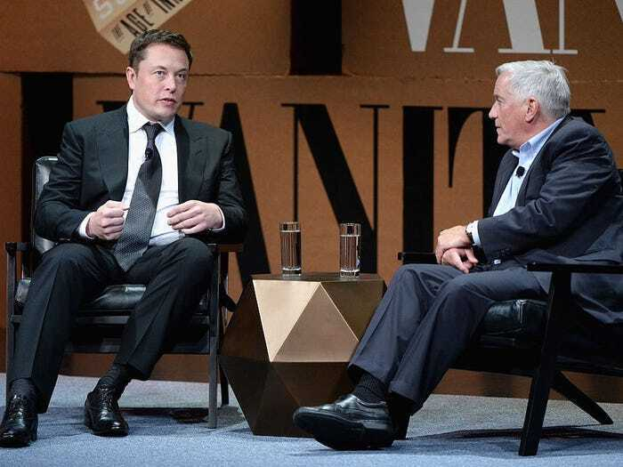

# 专访马斯克传记作者：他就是个混蛋 但只有这样够狠够强硬才能成功

**划重点**

  * _1_ 《埃隆·马斯克传》作者沃尔特·艾萨克森认为，马斯克是个“混蛋”，因为他“不善解人意”，“也不关心别人”。
  * _2_ 艾萨克森为马斯克辩护，认为“关心和情绪化”的高管可能会阻碍公司发展，因为“他们不敢得罪甚至解雇员工”。
  * _3_ 艾萨克森将马斯克与早期创业时的盖茨和贝索斯进行了比较，并表示他们也都采取了“硬核工作制”来运营微软和亚马逊。

新书《埃隆·马斯克传》（Elon Musk）已经出版，其作者沃尔特·艾萨克森(Walter
Isaacson)最近接受了美国新媒体Quartz执行编辑希瑟·兰迪（Heather Landy）采访时回答了诸多细节问题，包括：

**——马斯克的异常行为还能持续多久？**

**——还能指望他旗下SpaceX、特斯拉和X等公司实现他所追求的生产力提升，实现保护和维持人类生存的首要任务吗？**

**——马斯克是个有爱心的人吗？**

**——与其他科技大咖相比，马斯克对支撑其宏伟愿景或想法的细节了解得怎样?**

**——我们是否都应该像马斯克那样担心谷歌涉足人工智能领域，还是这也是他制造的一出闹剧？**

在与马斯克以及其家庭成员、浪漫伴侣和亲信助手相处了两年之后，艾萨克森对这位世界首富的评价是：“他就是个混蛋，因此并不令人感到钦佩，但这也正是他取得成功的关键。”

**以下是兰迪专访艾萨克斯全文：**

**兰迪：在马斯克旗下多家公司中，他所提倡的硬核文化和高效还能保持多久？我没有做过统计，但“硬核”这个词在马斯克传记中出现了很多次。在马斯克身边度过了两年时光，或者在他的生活中与不同的人和公司打交道，你认为他还能在保持这种强硬态度的同时保持高效多久?**

艾萨克森：我认为他始终能坚持下去。他是个喜欢全力以赴的人，即使在孩提时代，他就几乎把戏剧、风暴与爱联系在一起。我的意思是，他有一个不太正常的、心理上有问题的童年。但只要事情平静下来，他就显得不太高兴。而当有暴风雨时，他会全身心投入。当他首次进入X总部的时候，每个人在心理上都很安全，并试图继续留在那里。但马斯克表示：“我们需要打造硬核文化，我们将全力以赴！。”

**兰迪：他肯定把这种文化带入了新公司，而且肯定有很多类似的场景。**

艾萨克森：我认为这是我们在公司中看到的最大文化变革之一，X员工此前的悠闲心态发生了转变，他们现在就像是全天24小时都在工作的黑客。

**兰迪：在几个小时的时间里就发生了这样的改变？**

艾萨克森：没错。

**兰迪：书中有很多这样或那样的场景，让我们质疑马斯克的人性？他在SpaceX的一位前副手曾解释说，马斯克实际上非常关心宏观意义上的人类。**

艾萨克森：是这样。

**兰迪：你认为马斯克是个有爱心的人吗?**

艾萨克森：不。他没有同情心，也不在乎任何人。正因为如此，他就是个混蛋，也并不令人感到钦佩。但正如他争辩的那样，有时那些关心他人、感情丰富的人，他们往往不敢解雇别人，他们不够强硬，不够粗暴，但这可能会伤害整个公司，因为他们太渴望让面前的人喜欢他们了。

我知道自己不可能像他那样。我以前在CNN工作，也许我们应该更强硬一些，也许我应该对人更严厉些。但是你看看那些坚持硬核的人，比如微软早期的比尔·盖茨（Bill
Gates）、亚马逊早期的杰夫·贝索斯（Jeff
Bezos）以及马斯克，虽然我不一定钦佩他们，但这是他们能够取得成功的重要原因。这是因为，他们把企业的成功置于首位，而不是对他们面前的人保持友好和亲切。

**兰迪：没错。沿着这条线，书中曾有一个场景，马斯克看到特斯拉装配线上的某个机器人移动速度太慢，他对此感到很不满意。为此，他让人把机器人拆开，然后意识到出厂设置让它智能以最高速度的20%运行。于是，马斯克自己重写了代码。**

艾萨克森：的确如此，他是在自己笔记本电脑上完成的。

**兰迪：就是为了让机器人移动得更快。马斯克与你写过传记的其他人相比，他对支撑其宏伟愿景或想法的细节了解得怎样?**

艾萨克森：最让我惊讶的一件事是，我没有意识到他是个如此喜欢亲力亲为的制造工程师，他每天走在特斯拉或SpaceX的装配线上，并不断提出问题，比如“为什么这个螺丝要这样转动?”，或者“为什么它移动得这么慢?”他甚至可以帮助重写代码来改进。当工程师们无法给出满意答复时，马斯克仍然会举机器人的例子：他把机器人的速度调至最高速度的80%，这导致机器人无法继续工作，最后他不得不下调些速度。但马斯克说，除非你用力过猛，速度太快，有时甚至会把事情搞砸，否则你就无法确定正确的速度。

**兰迪：是这样。但在他的生活或工作中，有一个领域他一开始就有点厌恶风险，那就是人工智能，以及他对人类未来命运的担忧。所以早在2014年与DeepMind合作时，马斯克就非常担心谷歌在安全问题上有所松懈。**

艾萨克森：自那以后，他不再和拉里·佩奇（Larry
Page，谷歌联合创始人）说话了，而他过去常常睡在佩奇的沙发上。马斯克就像是世界上最富有的沙发冲浪者，他不喜欢住在帕洛阿尔托的酒店里。他和佩奇就像是亲密战友，但后来他们在马斯克的一次生日聚会上就人工智能安全问题发生了争执。当马斯克听说佩奇要收购DeepMind时，他们正在楼上参加派对，马斯克和另一个朋友走进壁橱，这样他们就可以和DeepMind首席执行官丹尼斯·哈萨比斯（Dennis
Hassabis）通过Skype交谈，试图阻止他把DeepMind卖给谷歌，但他们以失败告终，这也是马斯克创办OpenAI的原因。可以说，马斯克对未来的预测有点悲观，他认为将来可能走向世界末日。他曾质疑：如果我们不能确保人工智能的安全，结果会怎样？

**兰迪：我们现在应该担心谷歌涉足人工智能领域吗？或者，根据你为写这本书而做的研究，这只是马斯克编造的另一场闹剧？**

艾萨克森：在我看来，这当然是一部马斯克所编造的世界末日戏剧，尽管也许这有点过于夸张了。马斯克担心人工智能会将人类推向世界末日。不久前，他曾在国会山与美国参议员查克·舒默（Chuck
Schumer）和克里斯·库恩斯（Chris Coons），以及马克·扎克伯格（Mark Zuckerberg）和萨姆·奥特曼（Sam
Altman）谈论人工智能，我认为他说我们需要一个监管机构是对的。他说，我们不需要国会制定专门的规则，但就像联邦航空管理局(FAA)负责管理民用航空事务、联邦通信委员会(FCC)监督无线电频谱使用、国家公路运输安全委员会（NHTSB）监管运输安全一样，我们也需要一个由专家组成的监管机构来处理人工智能问题。

**兰迪：马斯克现在经营或管理着大约六家公司?**

艾萨克森：是的，实际上他有7家公司，这取决于你怎么计算，因为新成立的xAI也是一家公司，甚至有些公司在内部还有子公司，比如特斯拉内部的Optimus和SpaceX内部的星链。（文/金鹿）

