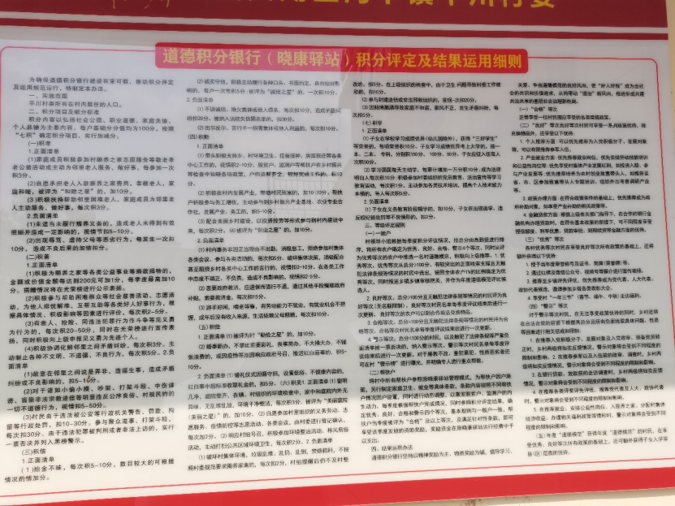

# 农村大搞“道德积分银行”：有村庄每月给1700人打分，干部负责加减分

**核心要点：**

  * _1_ A村是一个产业村，家家户户忙于产业经营，整体经济条件也比较富裕，村民并没有很强的动力参与活动，村干部表示，“实际上没什么人去积分兑换，也就只有一些老人小孩会去换点洗衣粉什么的，他们愿意登记（善举）就可以兑换”。
  * _2_ B村村干部日常会在电脑系统上登分，加分减分都由村干部负责，扣了分可能村民本人也不知道，积分多了村干部就打电话通知村民来领东西。负责的村干部说：“坏事就自己写，好事才会通知（村民），你要是打电话通知他扣分他骂不死你，我们不去管……反正如果有人问‘哎，我怎么没有积分’，我们就会解释给他哪里扣了分”。
  * _3_ C村的道德积分制一经实施，最积极的是在外的乡贤能人，他们对于建设家乡的热情空前高涨，对于自己赞助的奖项也非常关切，有老板特意从外地赶回来作为嘉宾出席“好婆媳”颁奖仪式；还有一位乡贤捐款92万，用于修建村庄文化礼堂，C村同样加分给这些乡贤作为一种表彰和感谢。

**于桐月 武汉大学社会学院博士生**

“道德积分银行”、“诚信档案”、“诚信银行”、“家庭诚信积分”……这些大同小异的积分制活动在全国各地的村庄轰轰烈烈地开展着，我们在各级各类报道中常常能看到相关的创建新闻，虽然称呼五花八门，但是其实它们有着类似的制度设计和治理目标，可以统称为
**道德积分制** 活动。

道德积分制顾名思义，就是通过将群众日常生活中的善行善举或不道德行为进行量化打分，登记在一家一户为单位的道德档案上，村庄将定期进行积分的评比公示和奖励表彰，农户则可以通过积分兑换相应的物资奖品，奖品通常是
**日化用品、米面粮油、超市卡**
等等。这类活动最初常见于城市社区之中，往往是由居委会牵头，通过联络周边的大型商超赞助物资奖品，用于奖励社区中参与志愿活动的积极分子和志愿者。那么当道德积分制活动被引入村庄社会，其运行方式和实践效力如何？

笔者在中部两省三市调研过的三个村庄形成了一种有趣的对照。

在加分规则的设置上，三个村庄的细则大同小异，一般都会给每家每户设置100分（兑换价值100元）左右的初始积分作为参与激励。道德积分制活动的加分项目不外乎积孝、积善、积信、积勤、积俭、积美、积学等方面，一般的积分情形如
**投工投劳参与村庄建设、婆媳邻里和睦、帮助老人、见义勇为、庭院整洁、奖励考学和参军入伍** 等等；扣分行为主要是
**庭院摆放杂乱无序、缠访闹访、焚烧秸秆、酒驾违法等**
。积分登记一般采取村干部统计、自我报道和他人汇报的方式进行。村庄每年度会根据积分评选出“好婆媳”、“热心公益模范”、“劳动模范”并颁发证书表彰，相应地还会贴出道德积分制红榜与黑榜，以示嘉奖和警示。

在活动资金量和资金来源方面三个村庄稍有不同。

A村是全县“诚信超市”的68个试点村社之一，乡镇政府定期向每个村拨款4-5千元至1万元不等的运行资金，A村和镇上的超市商店合作设置了几个物资货架供村民兑换。B村所在市将“道德积分银行”作为市域社会治理的一个部分在全市范围内大力推广，政府规定每个村的驻点帮扶单位每年度赞助两万元，另外乡镇政府和村级财务再配套部分资金确保积分银行的运行，B村的三个帮扶单位今年就为村庄积分银行赞助了6万元的活动资金。

比较特殊的是，C村所在镇政府规定，道德积分制资金来源由村书记自行负责，不得向上级政府申请。乡镇党委书记认为资金筹措本身也是激活村庄参与的关键一环，“奖金取之于民用之于民，只有这笔钱出自村庄，大家才会珍惜重视这个奖金……另外，村书记能不能筹到钱，也是检验村书记工作能力的试金石”。C村的村干部也表示，“村书记要做事好，别人才会出钱给你，不然这个工作就做不下去”。村委预计“积分制”一年的运行资金在5万元以下，C村目前已经筹措到了近10万元的资金，主要来自村庄乡贤能人的捐款。

可以发现，ABC三个村庄不同的积分制的资金渠道带来了不同的工作难度，A村和B
村的活动资金有一定制度保障，自上而下的资金下拨到村庄，村庄只需负责活动执行部分，总体压力较轻，资金相对比较稳定有保障。而C村需要村干部具有更强的动员和号召能力才能将这个活动支撑起来，然而，作为一项乡镇党委书记牵头打造的亮点品牌，道德积分制其实是不得不完成的中心工作，因此C村的积分制活动在同样刚性的要求下承担着更重的资金压力和来自村庄的舆论评价压力。

然而，“全国统一”的道德积分制活动在三个村庄的推行效果究竟如何呢？

**A村：“一袋洗衣粉，很多人看不上”**

因为A村是盆景产业村，家家户户以前店后园的形式经营产业，所以村委在制定规则时特意将环境卫生整洁纳入了加分考评，将庭院修剪不整齐、路边盆景摆放杂乱无序纳入了扣分项目。这些加减分项目的设置实际上很符合当地的村貌民情，但正因为A村是一个产业村，家家户户忙于产业经营，整体经济条件也比较富裕，村民并没有很强的动力参与活动，村干部表示，
**“实际上没什么人去积分兑换，也就只有一些老人小孩会去换点洗衣粉什么的，他们愿意登记（善举）就可以兑换”。**
大多数村民确实也是抱着冷眼旁观的态度，一位退休的老村长说：“诚信超市就是给那些扶贫致富的、邻里团结、尊老爱幼的家庭记一个优等诚信积分，发点洗衣粉什么的，其实效果不行，但是新闻报道说的神乎其神……其实都是创建形式，现在搞的创建活动太多了”。

然而，对于这点不被看重的物资，村书记在化解占地难题时将之发挥了妙用，“村里要修一条路，有一户人就是不同意让地，因为占地并没有补贴，这户人就一直不太情愿，正好诚信超市还有剩余吗，我就以支持项目建设的名义给他荣誉加分，实际也能让他拿些补偿，这事儿不就解决了吗”。

_道德积分银行评分细则_

**B村：“坏事自己写，好事才通知”**

B村是三个村庄中活动资金最充裕的一个村庄，无需乡镇政府和村委配套也能够保障制度稳定运行。然而，B村的困难在于很难加满足够这笔钱很难花出去。
**最大的问题是村干部难以承担额外的工作负荷** 。因为活动涉及的户数太多而积分线索太少，村干部很难在本职工作外留意到一些细节。

负责这项任务的村干部对笔者说：“每个月要求打一两千分，不好加，线索太少……从前管理晓康驿站，只有21户贫困户，感恩教育会评议一下，上门看看卫生合格就可以叫商店配奖品了，现在管理1700人不知道怎么加”。线索一般有三个来源，一是组织摸排，即村干部和村组长如果听说有谁做了好事就汇集起来形成加分线索，“比如谁把老人带出去采购东西，摔跤了把人扶起来这样的”；二是个人申报，这种情况比较少见；三是部门推送，即政府或单位评选推送的道德模范或优秀个人，也可成为加分的依据。然而，总体能够收集的情报还是相当有限。

由此衍生的 **第二个问题是技术难题**
，一家一户的积分档案要留存纸质版，这很难保存在村民家中，只能由村委代管，还要录入电子档案并制作台账用于留存记录和检查；然而，B村是单姓宗族村，名单系统内重名的人很多，汇报上来的善行善举很难准确对应到人。正因为这项工作非常琐碎且需要电脑技术，所以被移交给了新来的信息员负责，新信息员不熟悉村庄情况，“经常就加分加重复了”。

**第三个问题是创建活动与村民疏离导致的活动形式化**
，村干部日常会在电脑系统上登分，加分减分都由村干部负责，扣了分可能村民本人也不知道，积分多了村干部就打电话通知村民来领东西。负责的村干部说：“坏事就自己写，好事才会通知（村民），你要是打电话通知他扣分他骂不死你，我们不去管……反正如果有人问‘哎，我怎么没有积分’，我们就会解释给他哪里扣了分”。总之，计分成为了村委的内部工作，制度运行和村民之间仿佛隔着一层秘密的幕布，积分的存取都成为一种带有神秘性和随机性的个人行为。村干部不无抱怨地说，“这到底搞了干嘛的我也不知道”。

最后，原本按照1分1元设计的、价值6万元的奖品没有对应足够多的积分，村委商议将积分增值，以1分兑换5元，或者1分兑换10元以便将今年的额度在规定期限内用完。

与此形成鲜明对照的是，B村为高龄老年人设置的长者食堂一年只有两万元经费，镇里为了保证饭堂能够持续运营下去，不得不年年压缩开支，将所有经营成本控制在每人每天9元以内，饭堂的菜品质量和数量都有所下降。然而，面对村内的两大财务难题，村干部说：“没办法，专款专用，积分银行的钱我们也不可能用在其他开支上面”。

**C村：“村里人的钱，大家还是在意的”**

C村的道德积分制一经实施，最积极的是在外的乡贤能人，他们对于建设家乡的热情空前高涨，对于自己赞助的奖项也非常关切，有老板特意从外地赶回来作为嘉宾出席“好婆媳”颁奖仪式；还有一位乡贤捐款92万，用于修建村庄文化礼堂，C村同样加分给这些乡贤作为一种表彰和感谢。虽然乡贤领到的奖励远远少于自己捐出的金额，但他们都将此视为一件很荣誉的事情，毕竟无论是出钱支持家乡文化建设，还是获得家乡评选的道德模范都意味着村庄社会对其道德、能力和成就的认可，从而获得一种精神与社会层面的满足感。C村第一年顺利筹措到了近10万元的资金。在此期间，改善民风的成效还有待观察，但目前看来C村的群众参与度比较高，“毕竟是村里自己的钱，怎么使用大家还是比较在意的”。

虽然高度的民众参与度更能够激发村干部办好活动的动力，但是活动维系的压力也会更大。因为道德积分制的启动经费来自村民的期待和信任，是一笔“信任贷款”，如果能够转化为村庄的公共参与和公共道德，那么它可以储蓄村庄治理的无形资源；如果积分制的实践效果不好，则会首先反映在资金源流上，C村的积分制活动将难以为继，甚至后续的公共公益事务都会遭到打击。

**道德积分制为何无效？**

根据笔者在多地的调研经验发现，A村和B村的情况实际上反映了大多数村庄积分制活动创建的现状。可以发现，两村的群众对于道德积分制活动有着明显的疏离感，无论是积累积分还是领取奖品，都没有激起群众太多的参与热情，大多数人对这种创建活动抱以冷眼旁观的态度，只有村委不得不将其作为一种工作任务推行下去，最终的结果就是
**“干部干，群众看”，“官方热得不得了，群众冷得不得了”。**

笔者认为，这其中反映了两个问题。

**第一个问题是创建活动与村民生活之间的低度关联。**
积分制作为一项致力于建设美好文明乡风的文化活动，它的需求程度不像长者食堂那样迫切，实践效果也并非立竿见影，但这也并不代表村庄对于乡风文明建设没有需要。积分制的设想很精细很美好，但是积分制作为一项制度、一个文本，具体怎样落地运行是一个实践问题，在此过程中，怎么做老百姓的工作很考验干部的基层治理能力。制度文本想要发挥作用必须与村庄中流通的资源相结合，必须转化为实际的社会伦理和公共道德，才能形成村庄新的规范。因此，积分制的实践，要与群众工作结合起来，也需要一定的具体事件为抓手。

例如，在A村村书记巧用诚信超市，让一个潜在“钉子户”变成了热心公共事务的榜样村民；在C村的实践中，村干部借助乡贤捐赠文化礼堂的公益氛围，将众多乡贤能人动员起来为道德积分制捐钱，带动了村庄社会热心公益和关注公共事务的群众风气。因此，如果能够在具体的事件和群众工作中发挥作用，一袋洗衣粉就超越了其本身的价值，成为了撬动公与私之间边界的一根杠杆。如果活动与民众的关联只局限在表面和形式上，那即使制度设计再精妙也无法真正与民众生活衔接。

**第二个问题是民风治理与指标管理之间存在一定张力。**
政府大力推行积分制的根本目的在于移风易俗，培育文明乡风民俗，从而让民风在基层治理中发挥润物细无声的作用。但是当民风建设与行政体制密切捆绑起来，往往会造成形式替代目标的后果，科层体制以管理学的技术方法将民风这类抽象的治理目标分解并指标化，作为行政任务推行下去，强调量化、留痕和可视化，最终很可能与治理的目标相背离。

具体而言，首先，政策执行的短期化与长期治理目标之间存在矛盾，民风是行为的习惯法化，从行为到习惯，时间变量在其中发挥着重要作用。
**民众对活动冷眼旁观往往是基于“运动式治理”的短期预期，因此对参与活动并没有很高的热情。**

其次，村庄事务的内生性、复杂性、不规则性与量化标准存在矛盾，奖励与惩戒不适用于统一的标准，定期检查、定时花费、定量积分并不能检验工作的有效性，反而给村干部工作带来了负担，也与村庄的现实不甚匹配。这也是为什么很多村庄的道德积分制最终沦为村干部的表格工作，脱离了村民的真实需要和村庄生活实际，而最终能够准确落实的只有与村庄崇学风气相匹配的奖学积分。

再次，柔性治理与刚性管理存在矛盾，治理需要发挥人的主体性和能动性，这既需要给村干部留有一定的自主空间，又需要与群众工作、群众参与相结合，将道德积分灵活变通地运用于治理事件当中；而“管理”的思路是以人为客体，机械地遵循一套刚性的制度设计和评价体系，形成“全国统一”的活动模板，结果很可能是被村民忽略甚至排斥，这很大程度上消解了治理的内核。柔性的文化治理是从人到人，从规则到习惯，而非从文本到文本。

**道德积分运行何以有效**

道德积分运行如何有效，背后的问题是一个制度文本在农村社会能否落地、如何落地。

其实，无论是来自乡贤筹措还是财政拨付，道德积分制本质上是用一种小的经济激励发动村民，辅以荣誉面子等社会激励来激活和撬动村庄社会参与治理，这个治理的目标可以是移风易俗、环境卫生、投工投劳参与项目建设等等。相比于城市社区，农村社会其实有着更丰富的人情、面子、舆论评价等熟人社会资源，更容易形成公共参与，C村的案例就展现了一种可能性。

因此， **一个关键在于积分制的资金和制度能否转化为村庄社会内通用的资源和规则**
，从而发扬村庄的互助风气，营造崇学氛围，引导社会竞争成为良性的建设力量；如果不能实现转化，积分超市则会从经济及社会激励降维成纯粹的经济补偿，活动也就失去了必要性。

**第二个关键是制度能否长期维系**
，文明乡风的培育与人们对美好生活的需求息息相关，但很需要时间将制度内化成为风气和习惯，如果将奖励小微善行形成长期行为，积分制活动未必不能变成一种村庄小传统。一位老书记说了一句意味深长的话：“积分制活动很好，但是不好搞，不是长期坚持不会有效果”。

