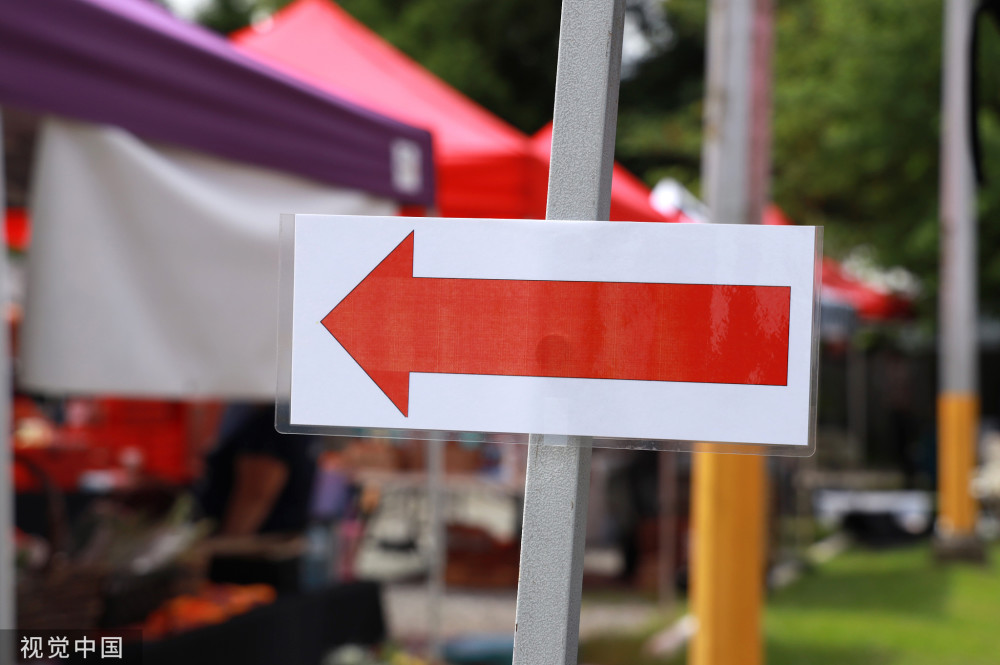
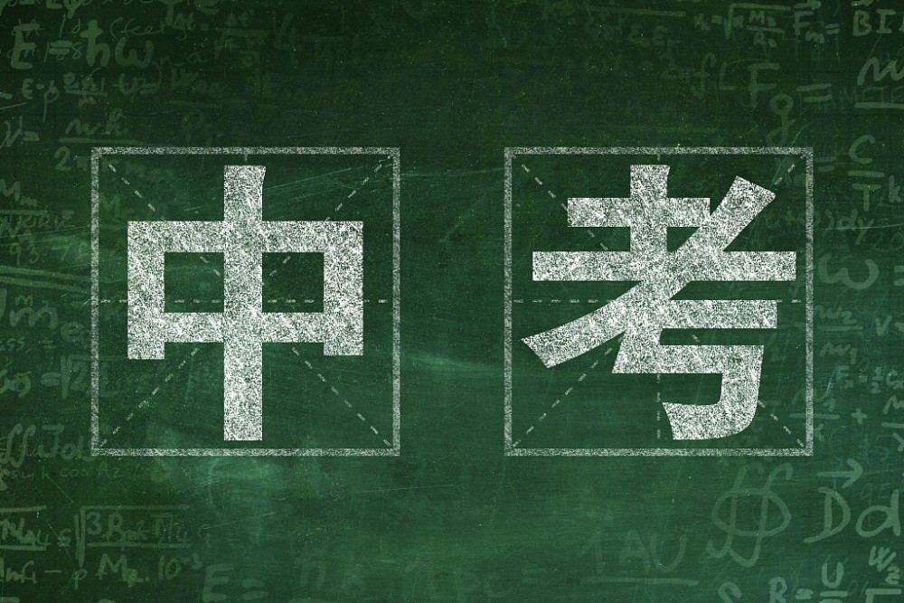

# 农村学生就读中职比例较高，普职分流是否造教育竞争和内卷提前？

从个人和社会两个角度出发，“普职分流”都有其合理性。国家在政策制定、资源配置方面应继续加大力度，满足人民对于优质教育的期待和需要，广大学子也要适时调整观念，选择最适合自己的道路，无论普高还是职高，都应专注所学，实现自身价值。

**核心观点：**

  * _1_ 在“内卷”的现实情况下，“普职分流”带来焦虑是难以避免的，但在孩子面临路径选择时，家长还是要理性对待、多方考量、扬长避短。
  * _2_ 职高不意味着失去升学机会，也并非所有职业学校的教学环境都很差。
  * _3_ 每个孩子都有自己的优势，无论是理论型人才还是技能型人才都能在社会上找到用武之地，重要的是提升自己。
  * _4_ 无论是“普职分流”，还是设立综合高中，本质上透露的还是职业教育的质量问题，而提升职业教育的地位和质量还要依赖于国家高端制造业的发展。

近期，教育部提出扩大优质普通高中招生名额，在有条件的地区举办综合高中。公众舆论对此保持高度关注，对于“扩大优质普通高中招生规模”应如何理解？如何缓解群众的“职普分流焦虑”？有人认为这种分流制度残酷，扼杀了很多孩子成才的可能性，而另一些人则认为普职分流是有其合理性的，是当下实际与布局未来的一种制度设计。

本期腾讯新闻《文话教育》栏目邀请中 **国教育在线总编辑陈志文；北京大学中国教育财政科学研究所副研究员田志磊**
两位专家做客直播间，解答广大家长对普职分流认知的误区。

**问：“普职分流”政策为何成为家长教育焦虑的重要原因？**

我认为首先是出于整个社会对于教育公平的关注。因为针对“普职分流”这个问题，各国采取的方式不同。有些国家是根据兴趣或能力来分流，那么这些国家的教育焦虑可能会小一点，但通常是因为它们整个社会的公平程度比较高，才可以采取这样的方式。
**而在我国，数据显示，的确是家庭背景更好的学生在读普高，家庭条件相对差一点的在读中职，尤其是农村学生读中职的比例非常高，这样的话可能就形成了一个“普职分流”是否会造成社会不公平及教育不公平、从而带来教育的代际固化和家庭背景固化的担心。**

其次就是教育竞争和内卷的提前。很多家庭从初中甚至小学就开始投入大量资源来提升孩子的成绩，而这些家庭往往经济条件更好，这就导致在竞争过程中，家庭条件相对差一点的孩子无法享受到同等的资源。而一旦有人花高价去上名师补习班，所有人就都搞起了“军备竞赛”，焦虑也就越来越严重。

**陈志文：我补充一下，这种焦虑还有几个误解。第一，有人认为实施“普职分流”后，仅有不到半数的学生能够读普通高中；第二，读了中职就不能考大学；第三，中职缺乏健康良好的教育环境。**
这些误解也是导致焦虑的重要因素。但事实上，据2022年教育统计公报的数据，普高和中职的招收比例为66:34；其次，中职的升学道路也是畅通的，根据北大的调查，2020年大约百分之六十的毕业生上了大学，其中约10%考上本科；第三就是刚才田老师说的，中职学校并非一定是问题少年的聚集地，一些中职学校的环境还是很好的。

**问：为什么要搞“普职分流”，合理性在哪里？全面取消职普分流是否可行？**

**田志磊：**
所有的教育政策，都要同时满足多方的诉求，不仅是老百姓，还要满足社会发展的需要，所以对于教育结构，国家是有一个理性的考量的，不是所有人都要拿到博士学位。“普职分流”的合理性，首先就在于每个孩子都有自己的特点和优势，有些孩子擅长动手，有些擅长抽象思考。很多孩子在义务教育阶段，到了高年级已经开始有点吃力，尤其是高中的物理和数学。所以他如果一定要走这条路，不仅自己吃力，还可能会影响整个班级的学习进度。所以就有了分流的需要。

其次，分流是社会的客观需要。 **任何一个国家的发展都需要兼备理论型人才和应用型人才。**
比如现在要造一架航天飞机，我们都是钱学森，都能够计算，但是却没人能够把这个零部件造出来，这也是不可行的，所以我们现在才会有“大国工匠”这样的提法。社会的多样化需要就决定了条条大路通罗马，各种人才都会有其用武之地。

**陈志文：**
赞同田老师说的，最主要的是，任何一个社会国家，人才必然是一个金字塔结构，不可能都是顶尖人才，人人都是大学生，研究生是否可能？目前培养一个大学生，国家的投入就是4万，更重要的是否必要？

**问：一些家长认为，“普职分流”政策剥夺了孩子平等接受普通高中的权利，初中生年龄偏小、心智尚未成熟，尤其是男生，也是不公平的。那么什么时候、依据什么进行“普职分流”更合理？**

田志磊：关于分流时间，国际上一个普遍的数据是16岁分流大概占到四分之一左右，15岁分流的大概有百分之四十，15岁以下约百分之三十，比如德国就是10岁分流。它是10岁进行第一次分流，但比例并不高，16岁再进行第二次更大规模的分流。而整个东亚地区都是15岁分流。男孩成熟晚是有共性的，分流的时间可以灵活地去讨论。

关于分流依据，目前国际上的主流方式是根据成绩分流。在我个人看来， **我倾向于按照兴趣和个人选择进行分流，因为这是尊重个人受教育权利的体现。**
但是这是一种理想化的想法，在当前社会阶层鸿沟巨大的现实情况下是难以实现的。日后我们不仅应该扩大优质高中的供给，还要扩大优质中职教育资源的供给，实现二者的平衡之后才有可能实现自由分流。

**陈志文：目前我们的分流依据就是分数，这个担心是正常的，也的确存在，尤其是中考全面去区分度的情况下，考的是扎实仔细，这显然更有利于女生。**
所有人都希望是自由选择，但这需要一个过程，尤其是社会保障制度，阶层差异的缩小等。目前我们是按分数，但也在逐步变化，比如综合高中的出现，就多了变化。

**问：最近教育部开发布会明确提出在有条件地区举办综合高中，什么是综合高中？是普高转设还是职高转设？**

**田志磊：** 通俗地说，综合高中就是普通高中和职业学校的结合体。也就是说，你可以在综合高中里同时修读普通高中的课程，也可以学习职业技术。

综合高中会有普高转设和职高转设（即普高转成综合高中或职高转成综合高中）两种情况都有，在地方上有很大的灵活性。目前部分地区已经出现普高因在竞争中没有优势而被中职学校兼并的情况。这两种转设没有好坏之分，但是我希望对于一些本身与产业联系紧密的中职学校在此次综合高中的转设过程中不要受到过多影响，继续坚持面向产业的职业教育。而这种平衡就非常考验政府政策的制定了。

**问：2021年起，中等职业教育已经从就业全面转向升学与就业并重，对职业教育的影响有哪些？对教育与社会发展的影响又有哪些？**

**陈志文：**
这个说法其实对应了综合高中的概念，我认为其至少在理论上给大家提供了多样化的选择。升学还是就业，这也是向广大家长抛出了一个问题，促使他们思考自己的孩子到底更适合走哪条路。我想提醒的，目前大学招生1000余万，一半的专科，专科分数线往往仅有150分，大量的孩子分数很低，从一个层面也反映，我们是否适合继续在这条道路上奔跑？另一方面，如何办好职业教育、提升质量，让学生有所得才是当下亟待解决的问题。
**当我们的职业教育也能获得体面的工作和收入时，不用强制分流，也会吸引到很多人。**

以德国的“双元制”为例，其实行的前提基础就是高度发达的制造业。当产业水平发达时，对人才的需求就会相应增加，通过校企合作就会吸引到更优秀的人，职业教育也能迎来春天。与之相反，快递需要3年的职业教育吗？

中职以升学与就业并重，还是存在争议的，第一就是我们一开始谈到的人才结构问题，完全都是大学生是否必要？适合？第二，就是如果强调升学，和普高的区别是什么？

编辑：丁哲宇

审核：蔡娟

版权声明：本文系腾讯新闻《文话教育》独家稿件，未经授权禁止媒体转载。

