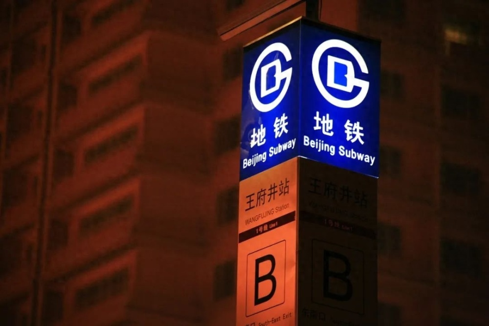
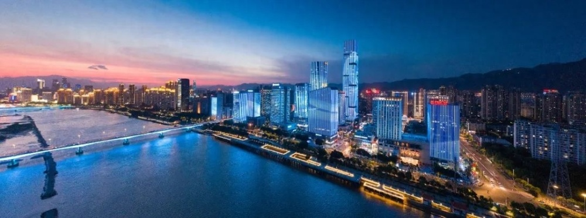
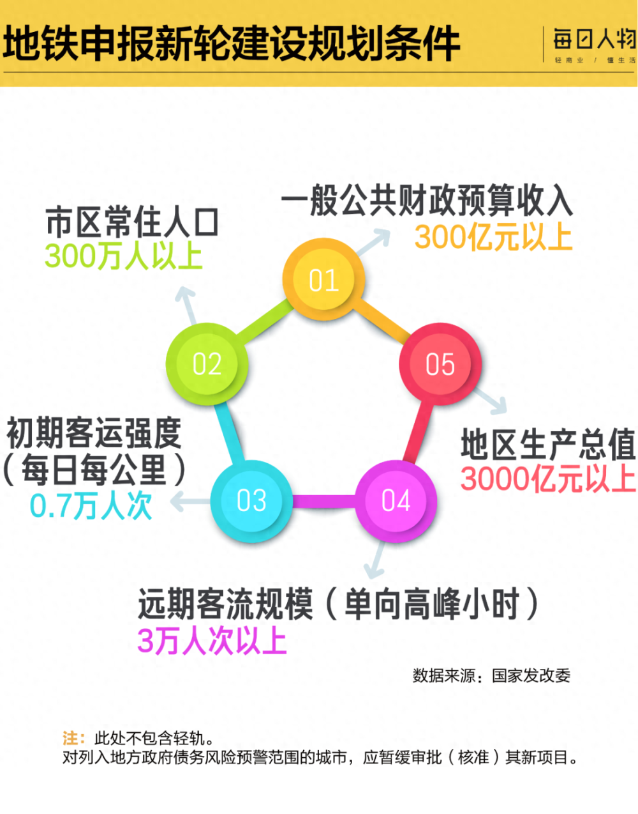
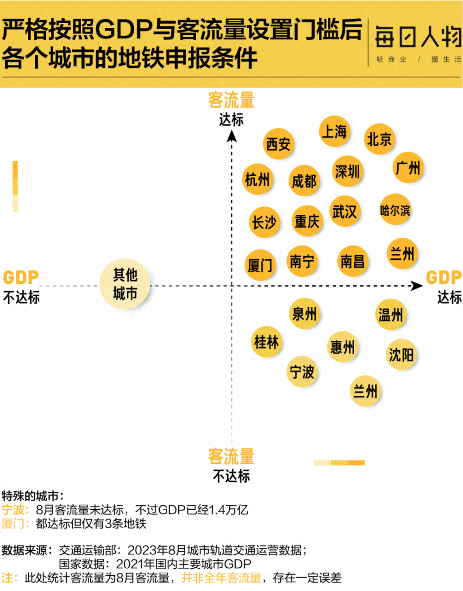
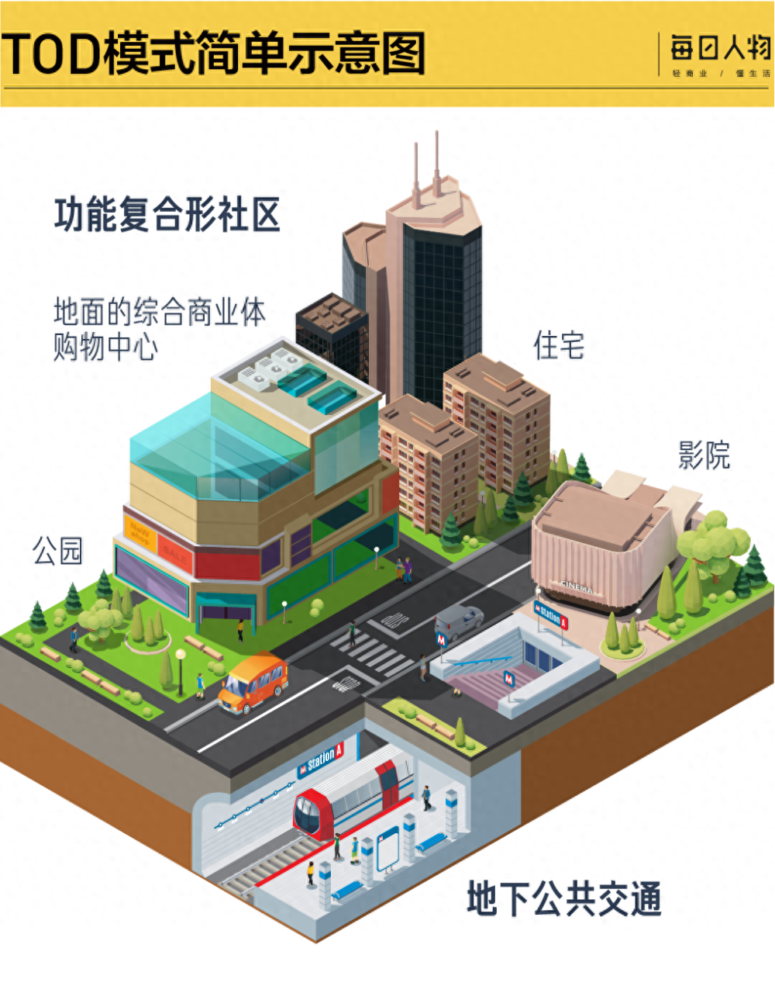
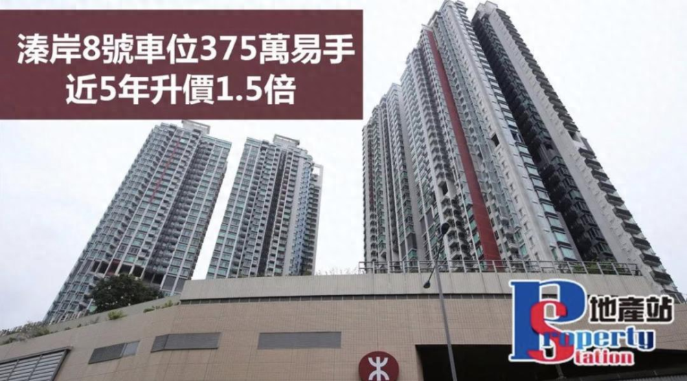

# 北上广都在亏钱，这些小县城却修了地铁，今年仍有30个城市申报新建

**今年7月，多个城市公布了2022年地铁报告。北上广深四大城市，毫无疑问成为地铁人流量最大的几个城市，全国日均客流量前十的地铁线路，广州和上海占了3条，北京和深圳各占2条。**

**在大城市挤地铁，是许多人的噩梦。虽然人流量如此巨大，在北京和广州，地铁运营仍然是一个赔钱买卖，深圳和上海，也全年也仅仅是数亿的微利。而翻开全国各大城市的地铁公司业绩，能赚钱的屈指可数，大部分都靠着政府补贴存活。**

**明知不赚钱，各地在修地铁这件事上依然狂热，尤其近几年，很多小城市也纷纷上马地铁项目。算盘打得很清楚，地铁建好了，地价跟着上涨，相比卖地的钱，亏损不算什么。但现实往往给人当头棒喝，高昂的造价，迟迟收不回来的成本，远低于预期的消费拉动能力……在地铁申报越来越难的当下，许多城市是“硬着头皮”在干。**

**2022年，常州地铁杀出重围，净利润为0.36亿元，是唯一一个利润为正的非一线城市。苏州、金华、佛山、柳州等城市，不出意料地亏损了。**

**地铁修好了，房价却涨不动，根本原因，还是没人了。修建地铁的门槛越来越高，光有GDP不行了，常住人口和客流量也得达标，许多城市的地铁计划不得不按下暂停键。小城市的地铁热，被浇了冷水。**

**本期数据栏目，我们来聊聊修地铁背后的那些账。**

**文 |** 介里

**编辑 |** 赵磊

**数据 |** 介里 辰萌

**制图 |** 韦恩

**运营 |** 圈圈儿

**一线城市，也难赚到钱**

地铁，更适合都市打工人体质的交通工具。但是打工人并不喜欢坐地铁，“大城市的地铁简直是大型贴脸现场”，一个急刹车就能和陌生人玩堆堆乐。

广州地铁3号线，北京地铁10号线和6号线，“挤”出了名。

出行一客对2022年各大城市的地铁客流量作了统计，广州、北京、上海，不负众望成为地铁最拥挤的代表城市。

可以看到，在一线城市，最繁忙的线路广州地铁3号线，日均客流量能达到130万人次，北京10号线作为环线，每天也运送了超过100万人次。

尤其到了早晚高峰期，“拥挤”只是一个相对文雅的说法，体验过这两条线路的朋友们想必都深有体会。

当然，这里的客流量只是一个大致的数据。同时坐过北京6号线和10号线的打工人，想必感受更深，10号线线路长，换乘站点多达45个，6号线则贯穿东西，因为过于拥挤，高峰时期需要增设间隔更短的区间车来缓解运载压力。因此，从体感来说，6号线和同为东西走向的1号线，在早晚高峰，恐怕是更令人“窒息”的线路。

汇总来看，2022年，北京和上海各条线路日均客流量超过700万人次。深圳地铁线路较短，整体超过400万人次。

但是，最新公布的2022年地铁营收报告，扣掉政府补贴，净利润为正的城市仅有武汉、深圳、济南、上海和常州，北京和广州都在亏损。利润为正的深圳，和排名第一的武汉也相差近10亿元，上海盈利都不到1亿元。

其他城市都在亏损，加上政府补贴之后，大部分才勉强有点盈余，沈阳和兰州，由于补贴力度不是很大，在补贴后依然亏损。

比杭州亏得还多的，乃至于上表都放不下的，是“显眼包”北京。

2023年，北京地铁公布的政府补贴为262亿元，除去补助，净利润为-241亿元，#北京地铁一年要付149亿利息#一度上了热搜。此前，《中国经营报》提到，2020年，北京20条地铁线平均运营成本达13.05元/人次，但是乘客平均支付的票价只有4.5元/人次，剩余部分主要靠政府补助。也就是说，每有一人坐一次地铁，政府就需要补助8.5元左右。

地铁本身就是昂贵的，建造成本太高，后期运营成本也是天价。但其他城市的地铁也面临同样的问题，北京还有什么“Bug”，能亏这么多呢？

拿去年盈利的武汉地铁作为对比，武汉地铁的上盖商业建设相对比较成熟，人流量也比较充足。武汉是“大学生之城”，2014年，武汉的高校数量就高达85所，其在校高校生数量早已突破百万。大学城分布在洪山区的各个方位，而学生们的流动和地铁发展形成呼应。

在武汉，江汉路、银泰创意城、光谷商圈、中山公园、武胜路、王家湾商圈等人流密集地，修建了密集的地铁上盖项目，地下商业街也十分繁忙。

对比之下，北京的地铁交通是“摊大饼”，辐射范围广、沿线站点多，但同时也不够集中。在传统商圈西单、王府井，地铁尚且无法直达核心区域，比如西单大悦城，实际上距离地铁还有5到10分钟的路程。灵境胡同地铁，距离老佛爷百货，又需要再走至少10分钟。

地面商业不集中，费腿，地下更难。由于政治原因和规划问题，北京地铁极少配有地下商业，甚至连便利店，也是近几年才陆续搬进地铁的。对于绝大多数站点而言，下到北京地铁，就仿佛远离了商业世界。地铁上盖商业的站点，在北京地铁站中的比例非常低，每条线上可能只有三四站能实现，如6号线青年路站，7号线九龙山站，10号线双井、安贞等站。

即便不考虑沿线物业赚钱，从票价角度看，对于北京、上海这样的超大城市，平均乘坐距离远，运营费用高，却不能靠提高票价赚回来。目前的铁路票价已经是政府补贴之后的，这是因为除了盈利，地铁还担负着缓解地面交通、方便人们出行的功能。这是出于公益的考量。

一系列的原因 ，让北京地铁既花得多，短时间内又赚不回来。

但从另一个角度看，即便亏损额最高的北京地铁，其附加经济价值仍然是巨量的。聚焦北京国贸的《装腔启示录》，将北京东三环CBD的现状如实拍下，那些跟着主角唐影一同涌出地铁的人潮，就是地铁的价值所在。每天早晚，远郊的人们乘坐地铁汇聚到CBD、金融街、中关村、望京，互联网、金融业、现代服务业等蓬勃发展，各类经济要素随着人流动起来，创造出巨大的经济价值。

且不说地铁沿线房地产的增值空间，将视野拉到大城市的外延区域，缺乏核心产业的小城市，也能够享受到大城市产业和消费的外溢。从公路时代进入地铁时代，依然是“要想富，先修路”，大大小小的城市们，当然对地铁这块“肥肉”垂涎。

不过，未来的趋势是地铁规划审批越来越严，已经有地铁的城市还稳得住，还没有城市的小城市，看着别的城市，甚至是县城，借助地铁吃到大城市的红利，心里肯定不是滋味。

**这些小城市，竟然有地铁**

过去修建地铁，GDP是申报的主要条件。从2022年公布地铁报告的城市名单也可以看出，不少城市来自浙江、江苏沿海富裕省份。

有些县城，还真有地铁。“最强县级市”昆山，拥有28个站点，两条轨道交通，连通苏、沪。义乌、长沙（县）、闽侯、新郑等县市，也修建了地铁。

有地铁的县城们，实际上并不仅仅靠自己。以昆山为例，它常常被评为中国最强县级市，强势的经济，优越的区位，让它得以修建地铁。但从更大的范围来看，昆山受到上海和苏州的辐射，昆山地铁及其沿线地产、商业，带动的不仅仅是昆山本地人，还有一大批长三角地区的流动人口。

近十年来，昆山市区的平均房价从每平方米6000元左右上涨至2万元左右。上海地铁11号线于2013年10月建成，延伸至昆山。安居客显示，2023年，11号线末端的花桥区，新房房价达到了2.1万到2.5万每平方米。

因此，能修地铁，自身强固然重要，但位置好更关键。

比如简阳市，其地理位置离成都市中心有五六十公里，但因为修建了天府机场，地铁等基建在短短两三年内拔地而起。目前，从成都市中心春熙路坐地铁到天府机场，可以实现地铁全程直达航站楼。在成都新一轮地铁规划中，位于东部的简阳或将与成都南部新区相连，简阳就会进一步融入成都，分享红利。

对于许多县城而言，地铁是中心城区线路扩张修建而来，比如福建的闽侯，拥有2条地铁线路，均从福州城区延伸而来，它也常常被调侃为福州的“编外区”。

_▲ 福州城市航拍图。闽侯与福州主城区就是通过这样的大桥相连。图 / 视觉中国_

闽侯仅隔一条乌龙江，七座大桥，与福州紧密相连。据说，许多闽侯人称自己是福州人，而经济、科教等领域的能量，也从福州辐射到闽侯。2021年，闽侯入选福建省“十强县”，过去十年，闽侯基本都在各大“百强县”榜单牢牢挂着。在县域经济强势到可以自成一派的沿海地区，闽侯和福州显得十分“兄友弟恭”，因为闽侯的发展很大程度上绑定了福州。

中心城区对于周边县域的辐射，从地铁开始。对于大城市周边的小城而言，地铁可以带动地价上涨，当地政府喜闻乐见，但并不是所有县城都有足够的实力承担地铁运营带来的亏损。

前些年，大力修建地铁的热潮，让很多城市不惜负债也要申报修建地铁。但2018年国务院《关于进一步加强城市轨道交通规划建设管理的意见》出台，给这些城市浇了一盆凉水。

**哪些城市，还在“苦等”地铁**

打开地铁相关的新闻，不少热评都在问：“我家怎么没地铁？”许多城市要钱有钱，要人有人，就是修不了地铁。眼睁睁看着各个大城市申报新线路，只能感慨一声“旱的旱死，涝的涝死”。

苦等地铁的城市，泉州算一个。根据中经数据，2022年，泉州市GDP为1.21万亿元，早就超过了GDP
3000亿元的要求。网友吐槽：“泉州应该是极其少数之一有钱但没有地铁的城市。”毕竟，2014年，作为地级市的泉州，就已经有了自己的国际机场。

于是，有人直接去人大提了个建议。官方给的解答很“无情”：“城市轨道交通是超大、特大城市公共交通系统的骨干.......从目前情况看，泉州市区常住人口共计156.7万人，具备申报轻轨建设规划的条件，但未达到‘市区常住人口在300万人以上’的地铁建设规划申报条件。”

也就是说，GDP再高，如果达不到规定的常住人口数量，依然没办法拥有地铁，或是开启新一轮的地铁规划修建。和泉州类似的，还有温州、桂林等城市。

就在今年8月，温州迎来自己的S2线，和原有的S1线成网，将两头的瑞安和乐清联通。从S1线开通以来，温州人民翘首以盼的S2线，其实从2015年就开建了，但是因为种种推迟、延期，过了8年，温州才迎来第二条自己的地铁线路。

其实，S1和S2线，更准确地说是城际轨道交通，而非严格意义上的地铁。它们的作用是促进城际交通，也就是我们常常听到的“区域一体化”。所以，狭义的“地铁”，温州确实是没有的。

近些年来，温州也想要打造M线地铁，但今时不同往日，更高的准建门槛，不复往日繁荣的地产业，都让温州地铁运营变得有些尴尬。许多当地人遗憾于温州错过撤市设区的窗口期，以致城市升级滞后，连带着影响了地铁规划。

 _▲ 图 / MetroMan地铁通_

以往，一个城市想要修建地铁，其GDP和财政收入，不得低于1000亿元和100亿元。但2018年以后，GDP和财政收入需要分别达到3000亿元和300亿元，翻了3倍，市区人口则需要达到300万以上。除此之外，对客流量也有了明确的规定，0.7万人次每日每公里，是客流量的基本线。

这才把温州这样万亿GDP的超强城市，挡在地铁的门外。

对于不那么有钱的城市而言，提升硬性门槛，也是对城市高负债率的遏制。以往，不少城市借钱修地铁，指望通过地铁带动沿线房地产发展，促进消费，但实际结果可能是，消费没拉动，票价也没回本。

2018年的《意见》，开始陆续劝退高负债风险的城市，绝不鼓励借债修建地铁，对于负债风险高的城市会更加严格审核。截至2022年底，我国大陆地区有41个城市运营地铁。

今年，有30个城市正在申报新建地铁，扩充站点，增加里程，铆足了劲儿要把地铁往郊区铺，而这些城市大多已经有了1号线和2号线，有的城市比如北上广成杭等，已经拥有十几条线路，北京的地铁线路早已突破20条，形成密密麻麻的路网。一条都没有的新申报城市几乎没有。

根据城市财经统计，如果严格按照客流强度门槛执行，还能申报地铁的城市只有：广州、深圳、西安、上海、长沙、北京、成都、沈阳、哈尔滨、兰州、武汉、南昌、南宁、重庆，近一半的城市规划都可能被暂缓，连杭州这样的人口流入大市都被卡在门外。

而目前没有地铁的城市，或是仅仅依靠大城市辐射拥有1-2条线路的城市，独立申请新建地铁线路难度将会变得更大。

**地铁赚钱，难在哪里？**

地铁的存在，是为了促进人的流动。反过来，人不够，是地铁难修建、难赚钱的根源。

一句话，城市化到了一定阶段，地铁投资回报率变低了。今年9月，一线城市成交房套数同比下滑了42%，二线城市下滑了15%。以往修建地铁，带动的是房价增长，而现在，人少了，钱也少了，买房的人也跟着少了，地铁已经无法像过去那样汇聚起人流，带动城市扩张。

因此，提高修建地铁的门槛，暂缓里程竞赛的势头，对于没钱又没人的小城市而言，是一件好事。

地铁是对综合规划能力的大考，对很多城市来说，与其说是建地铁，不如说是“旧城改造”。以2022年实现盈利的武汉地铁为例，修建地铁，让更多区域连通，给城市带来新的活力，需要天时、地利、人和。

武汉和香港一样，采用的是TOD模式（TOD：Transit Oriented
Development，以公共交通站点为核心发展商业）。作为全球少数实现地铁盈利的大城市，香港地铁的上盖商业非常发达，港铁实现了吃、住、逛、行、教一体化。

2014年，武汉开始布局TOD。据时代周报统计，截至2022年，武汉地铁各类物业项目109个，涉及创新研发、文体广告、物业经营等方面。

对于一个搭地铁的普通人而言，最理想的状态可能是：走出地铁，刷卡出站，可以选择去地铁同层或上层的小吃街、商业街，也可以选择到达地面的综合商业体。

设想一个极端的场景：出站时因为人太多，你的鞋子不小心被挤到轨道上，那么你只需要坐电梯往上，就能够在地铁上盖的商城买到一双鞋子，还能顺便享用一顿美食，抚慰一下失去鞋子的“悲伤”。吃完饭，你可以选择去五楼看个电影，再去隔壁做一个按摩。

对于真正实现TOD模式的地铁枢纽站而言，普通人能够实现“足不出户”，一站式享受和购物。更重要的是，没有“费脚”的焦虑。要是正好住在地铁上盖的小区，甚至连楼也不用出，就能实现“四通八达”。这在香港地铁是十分常见的的场景，但是对于很多新建地铁的城市来说，站点只做到了延伸，至于商业聚集，恐怕还需要漫长的规划和积累。

这也是小城市修建地铁的难度所在。即便人口流量多如北京、上海，模仿港铁也并非易事。这和城市政策有一定关系，也跟地铁商业化的能力有关。

港铁（MTR）的物业布局，从80年代就已经开始。以人流量最大的站点之一中环站为例，1980年竣工的环球大厦，早被港铁物业收入囊中，商用面积可以达到7100平方米。有的站点甚至还能出售车位，只有你想不到，没有港铁物业卖不了。

_▲ 图 / 网络_

地铁上盖物业，不仅仅关联到地铁人流量，也关乎周围的居民。现有的很多“县城地铁”，实际上也是大城市功能的延伸。如果只寄希望于地铁拉动经济，而配套却没有跟上，也是杯水车薪，最终免不了债墙高筑。

据统计，南京地铁2号线一期，每公里造价为5.10亿元，杭州地铁1号线每公里4.92亿元，成都地铁18号线每公里的造价更高达10.26亿元左右。单靠运营收入，很难覆盖高额的修建成本。

因此，对于更小的城市而言，修建地铁固然是未来趋势，因为它意味着高效、便捷，背后藏着无限发掘的商业潜力，但同时，它也是枚炸弹，当它让城市的债务超额，但又没有达到预期的收益，里子就无法撑住面子。

政策的导向是明确的，对于很多城市而言，兴建地铁表面上看起来是锦上添花，实际上，更像是是把鸡蛋都放在一个篮子里，稍不留神，地方政府背上巨额债务，民生工程恐怕反而误了民生。

另一方面，地铁的里程竞赛，也略显空洞。很多城市在宣传中，会提到地铁里程数，但对于个体而言，它背后所代表的利益、资源，对于普通人来说是遥远的，但每节车厢的冷气，每个站台的电梯，每级台阶的整洁度，才是个体可以触碰到的存在。

城市的光环固然需要强大的基建，但具有人文关怀的细节，才能够成为城市的脉络，修建地铁，还得回归四个字：以人为本。

**参考资料**

[1] 张迎捷.地铁对沿线房价影响的实证研究——以上海地铁 11 号线为例[D].浙江：浙江大学，2019：26-27.

[2] 2023年8月城市轨道交通运营数据速报.交通运输部

[3] 国务院办公厅关于进一步加强城市轨道交通规划建设管理的意见.国务院公报

[4] 什么样的县城能有13所大学、8条地铁？.未来城不落

[5] 谁是中国地铁第一城？.时代周报

[6]在中国，哪个城市的地铁最赚钱？.出行一客

[7] 32城地铁账本出炉：谁在赚钱，谁在靠补助.时代周报

[8]30个城市，争抢申报地铁.财经

[9] 在北上广深，谁是最“挤”的地铁线.出行一客

[10] 温州S2线开通后的喜与忧.温州留守青年

**文章为每日人物原创，侵权必究。**

