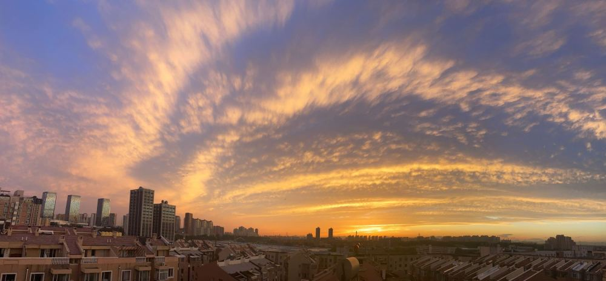
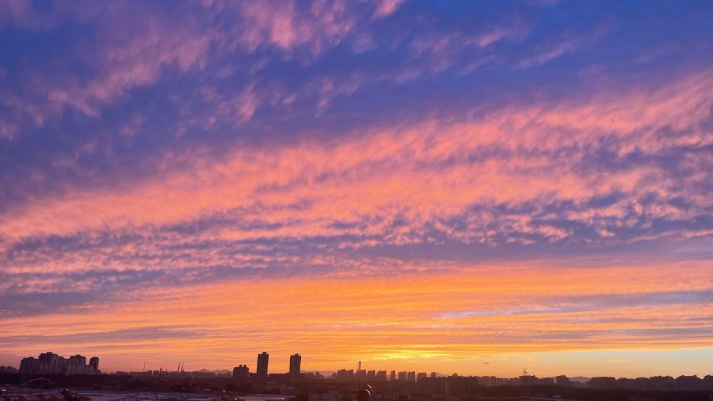
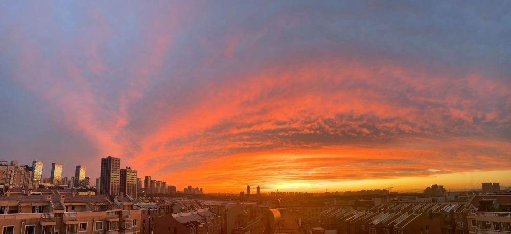
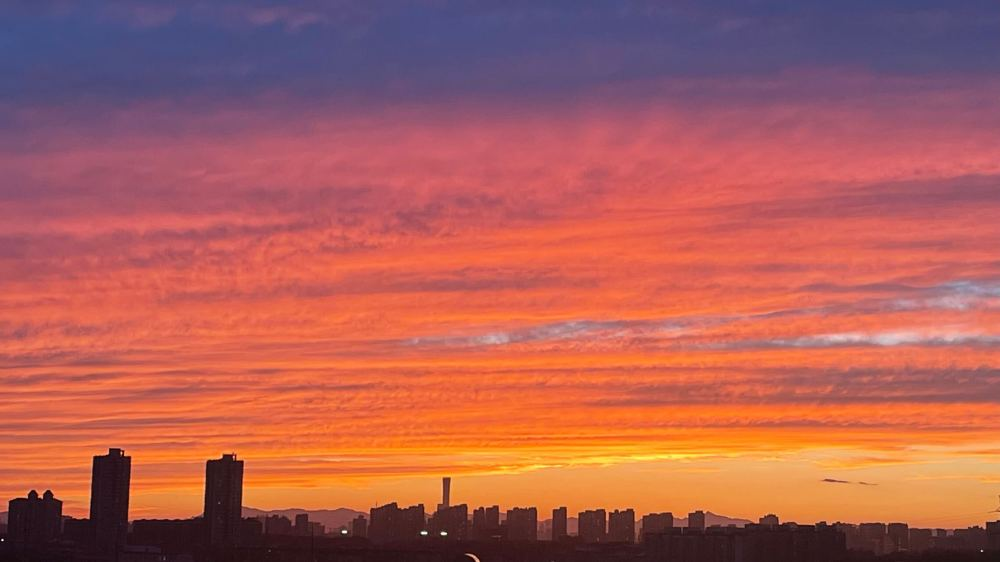
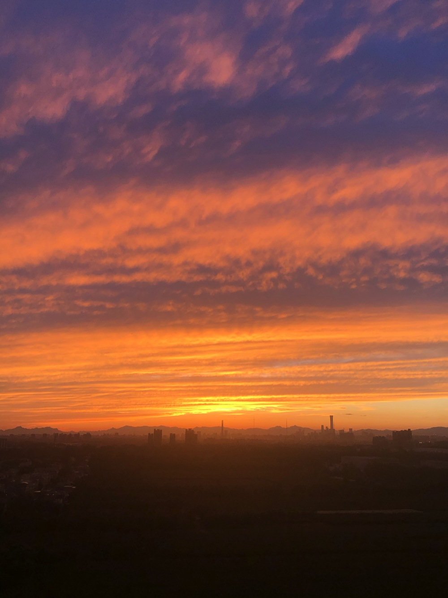
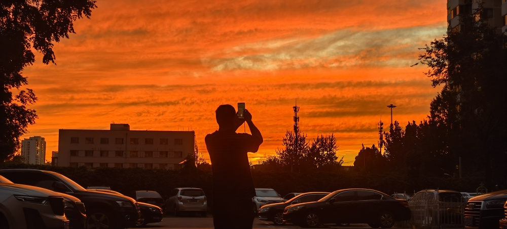
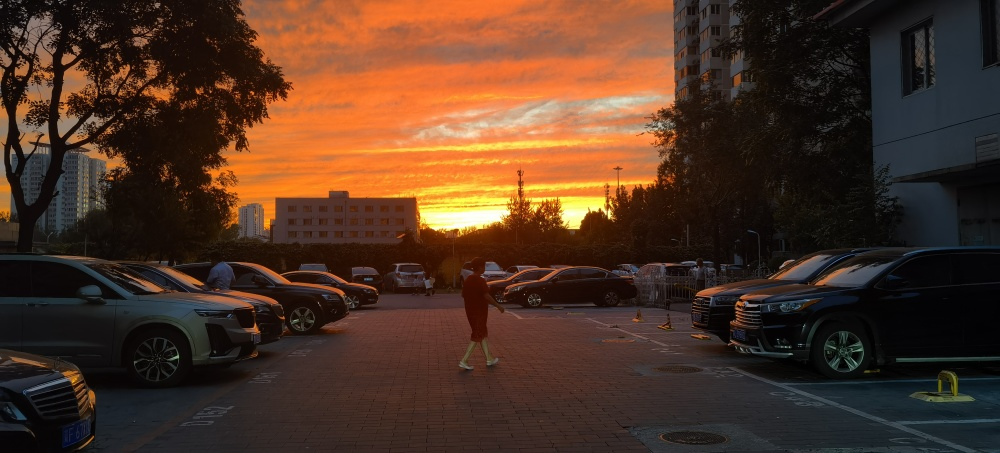
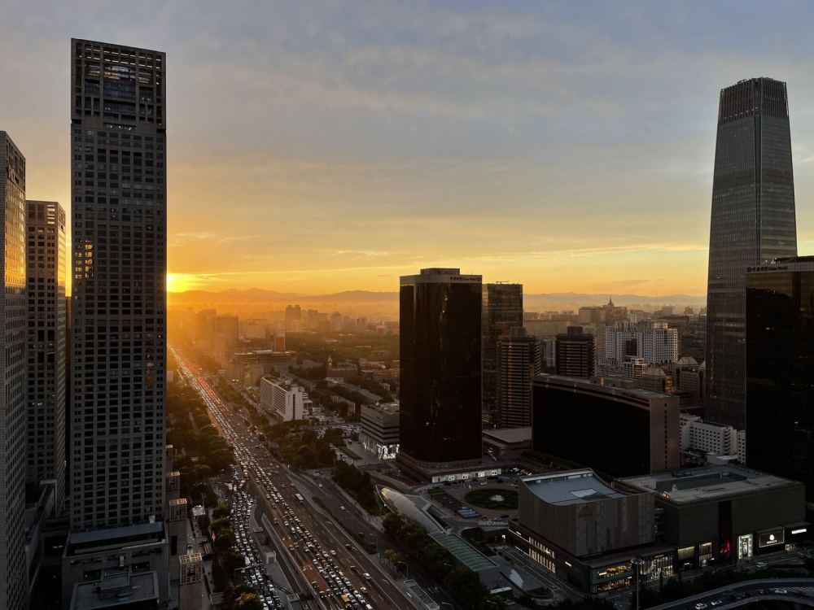
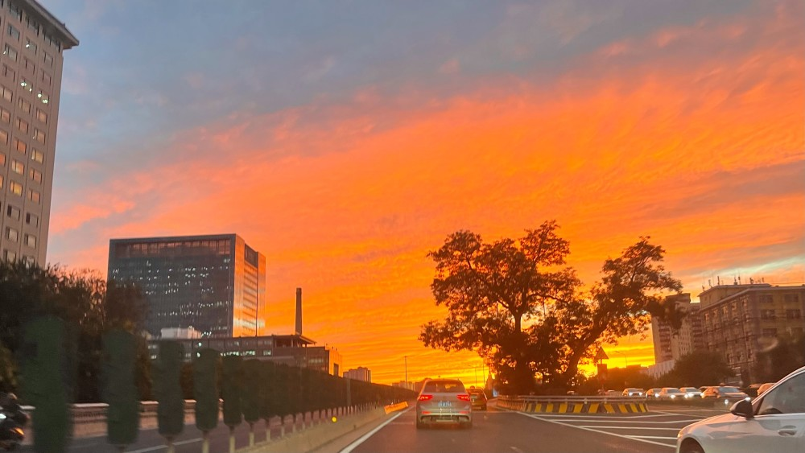

# 北京今天的晚霞壮美至极！火烧云层叠绚丽，多图回顾

今天傍晚，北京的晚霞铺满天空，绚烂壮观。

远眺天际，云彩与蓝天交织，层次分明。白云被夕阳镀上了一层金色，壮美至极！

随着时间推移，红色逐渐渲染天空，出现了火烧云，景象格外温馨浪漫。

_白继开 摄_

 _白继开 摄_

_白继开 摄_

_白继开 摄_

 _王雅贤 摄_

吴鲁萍 摄

_吴鲁萍 摄_

_吴鲁萍 摄_

_吴鲁萍 摄_

_程功 摄_

 _温红征 摄_

来源 北京日报客户端| 记者 白继开 王雅贤 程功 作者 吴鲁萍 温红征

编辑 实习编辑 赵司尧

流程编辑 刘伟利

