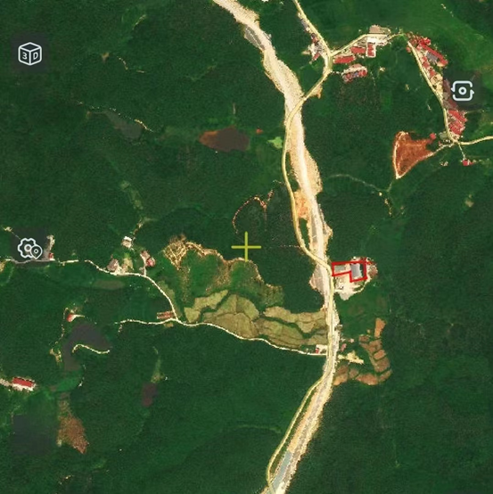
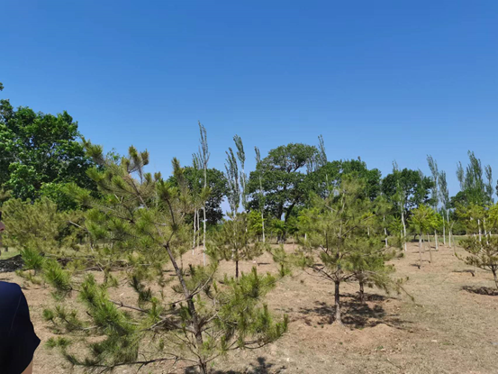
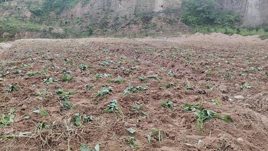

# 卫星图片失误导致土地性质频繁变化？对话武大博士生王波：基层干部雇人种地

同一块土地在卫星图片上来回转换着颜色时，1个月内，它必须从林地变成耕地。结果是，一片林木茂盛的地方，空空躺着几亩光秃秃的耕地。10年内，这片土地经历了四到五次的性质变化。而整改后，基层干部还要掏钱雇人耕种。

近日，武汉大学社会学院博士生王波在腾讯新闻发表的文章[住了几十年的房子，卫星拍照认定违法须拆除，执法人员：我都觉得不对
](https://new.qq.com/rain/a/20230915A02EN200)引发关注，该文聚焦卫星治理耕地流出。

2023年的夏天，王波和团队在调研中发现，我国目前采用土地卫片执法，通过卫星拍照判断土地用途是否发生变化，当卫星图片出现失误后，很多被错判性质的土地只能遵循卫片结果改变。

在王波的调研中，有的土路被判断成耕地，硬化后也要想方设法“伪装”成耕地，暂时种上菜的宅基地很可能不能再建房子，还有果树在挂果后只能被拔掉。

王波认为，这导致本该与农民形成最有效沟通的基层部门也变成了技术结果的执行者。“基层干部也觉得自己在做一件毫无意义又得罪群众的事情，但他们必须得做。”王波说，群干矛盾就这样被激化了。

某处的卫片，其中红色的方框部分是需要整改的地方。受访者供图

**对话王波：**

**【1】有土地10年内被改变了四五次土地性质，基层为保持耕地属性雇人种地**

**九派新闻：卫星图斑如何形成？**

**王波：** 不同性质的土地会在卫片影像上呈现不同的颜色。卫星每隔一段时间拍摄一次，如果某个地方有变动，那么变动的地方就会自动生成一个图斑并被圈出来。

带着图斑的卫片由上级部门下发到下级部门，下级部门会根据图斑的位置去当地核查、整治。圈出来的部分就是要整治的部分。不同的地方图斑卫片下发间隔时间不同，以前有的地方半年一次，有的地方一季度一次，有的地方则一个月一次。随着整治力度越来越大，现在全国大部分地区基本上是每个月下发一次图斑卫片。

**九派新闻：如何关注到图斑整治这一议题？**

**王波：** 今年5月，我去一个北部的乡镇访谈的时候，被忙碌的工作人员带到了一处执法现场。当我询问询问了此次外勤的工作任务时，带头的干部回答我：“拔树！”

追问之下我才知道，他们是在做耕地流出整改工作。他们发现，有一块地在之前的卫星影像中被认定为基本农田，现在被改成了林地。我了解到，这块土地在近五到十年的时间反复更改了四五次土地的性质。我觉得这是一个在折腾土地的行为。

**九派新闻：这块地最终被如何处理了？**

**王波：**
当地政府强硬地表示，无论付出多大代价，都要把这块土地变成耕地。他们最后花了两个小时就把这块几亩的地上面的树都拔了，改成了耕地。当地农民在七八年前就已经不种地了，都没有剩余的农具。但村里有了基本农田，也不能荒着，所以基层就花钱雇人去种。

整治树林现场。受访者供图

**【2】卫星系统两组数据依据存在冲突，错误卫片反馈至少需90天**

**九派新闻：这是个例吗？**

**王波：** 我们后来又在中西部的乡镇发现了相同的现象。

**九派新闻：在中西部的调研中有哪些发现？**

**王波：**
卫星系统依据2009年第二次全国国土调查（简称二调）以及2019年第三次全国国土调查（简称三调）的统计数据，判断拍摄到的土地是否为耕地。二调和三调的结果存在很大的冲突。中西部一个省份的乡镇干部曾向我们表示，至少30％耕地流出的任务是由于三调失真导致。

该省份的基层干部反映了一个问题：二调的时候，卫星拍摄清晰度不高，无法识别土路，因为周围都是耕地，在无法识别土路的情况下，卫星就把土路当成耕地了。三调的时候，卫星的清晰度变高，此时土路变成一条柏油路，就被认定这是违法占用耕地。这时候当地就必须要去整治，把它变成耕地，不然就要被处分。

类似的事情很多，比如村民种完水稻之后会灌水养虾之类的，然后卫星一拍耕地变成水塘了，也要整治的。还有的老百姓将水稻该种成其他经济作物，树苗还没长大的时候，像庄稼一样，等到开始挂果的时候，卫星一拍，说这是基本农田，不能种果树，就只能全部拔掉。

**九派新闻：当二调和三调发生冲突时，卫片会以哪个为主要参考标准？**

**王波：** 二调和三调的结果都要参考，但如果在两次调查中，有一次认定这块土地是耕地，那么就会最终被认定为耕地。

**九派新闻：基层干部具体如何执行图斑整治任务？**

**王波：** 乡镇一级一般会让村干部去劝说村民整改，劝不动的话，乡镇相关部门的人就会出动。如果村民还是不愿意整改，这时候可能分管的副镇长就要去劝导。

**九派新闻：卫片判断失误的话，能向上反馈吗？**

**王波：**
可以反馈，但据我们调研的情况来看，这个要一级一级往上反映，程序走下来至少要90天，而且还要派人核查，还要提供证据，需要证明这个地方以前确实是什么性质的土地。这是个特别麻烦的过程。

一般来说，乡镇不会对此抱有希望。另外，如果一定时限内无法按照卫星结果恢复土地性质，上级部门也会对下一级部门做出严厉的问责，所以大部分地区会采取更直接的方式去处理。

油茶树林整治之后种上了红薯苗。受访者供图

**【3】错误卫片激化基层干群矛盾，土地性质固化影响中西部产业发展**

**九派新闻：在你们的调研中，基层干部对错误的卫片持什么态度？**

**王波：** 基层干部也觉得很离谱，因为他们无法说服自己，觉得自己在做一件毫无意义又得罪群众的事情，但他们必须得做。

悖论在于，貌似很精准的卫星技术，实际上在执行过程中有很多不精准之处。另一方面，基层在践行保护耕地措施的过程中，变成了一个机械的执行者，运用的很多手段反而挑起、制造了更多的矛盾。群众在这些过程中更不会理解基层干部了。

**九派新闻：执行过程会激化基层干部和村民之间的矛盾吗？**

**王波：**
在我们的调研中，这个现象非常突出。有些省份推行宅改，村民就把老房子拆了，但保留着宅基地，有些人不愿把地荒着，就开垦成农田种点菜。等到相关部门来查看的时候，有的村民可能外出打工了，无法核实的情况下，这个土地就被直接划为基本农田。村民肯定就不干了。

所以，但因为技术的错误，上级又不断施压让基层干部去执行，反而激起了基层群干之间的很多矛盾。

**九派新闻：卫片将土地性质固化后，还会造成哪些影响？**

**王波：** 乡村振兴一个很重要的方面是产业振兴。但我们发现，土地性质转化，即土地审批的问题，会影响中西部乡村产业的发展。

我们在调研中发现，卫星执法将土地性质固化了，现在土地审批特别难。同时，经营用地也是固定的，你屋顶上换个瓦，水泥地上换个颜色，卫星都会实时监测，如果它发现一个月内这个地方颜色变化太明显，就会开始判断，然后形成图斑。

有些经过审批的施工，卫星也会拍，今天推个土，明天挖个塘，后天搭个砖，它都有可能形成图斑。这就导致，在施工的过程中，下级部门要源源不断地跟上级反映这个地方是经过审批的。

**九派新闻：对生态环境会产生什么影响？**

**王波：**
我们调研发现，耕地流出遵循占补平衡的原则。如果某一种性质的土地缺失，部分基层就会用另一种性质的土地去补，例如用填塘补耕地。因为池塘算作湿地，于是又用草地补充湿地。最后发现，很多草地被用来做占补平衡。

乡镇干部指挥发掘机进行图斑整治工作。受访者供图

**【4】技术治理消除了违规的乱搭乱建行为，也消解基层自治空间**

**九派新闻：你在文章中提到，北部乡镇干部“拔树”是当前国土治理领域困境的缩影。当前土地治理的困境是什么？**

**王波：** 通过技术治理推动国土发展，实际上技术本身并不能代表一种效能。一方面，技术治理有漏洞，而且它也在消解基层自治的空间。

卫星直接对国土上任何一个地方进行监控，这个时候就不需要基层去做调查、发现和反馈的工作了，只能依据技术确定的结果去执行。基层自治的空间就被大大压缩了。

在耕地性质整改这件事上，如果卫星判断出错，但向上反馈的缓慢、上层的严厉问责，基层干部就只能通过收买群众去说服他们。老百姓觉得，你花了钱，就是错的，认为这就是对他们的一个伤害，这个过程其实也给基层治理埋下了很多隐患。

**九派新闻：你在文章中还提到，卫片治理忽视了基层社会的复杂性。**

**王波：** 在技术层面，土地是一个物理性质的概念。它是林地还是草地，这是一个客观的事实。但实际上，土地在农村被赋予了更多的意义。

比如有些地方的宅改，可能是文化的寄托。农民种了一辈子地，对土地有感情了，肯定还有精神寄托。所以土地的性质其实的多维度的，但技术记录是片面的。当这种片面的界定和多维度的性质无法匹配，农民就很容易觉得这个政策很不合理，这也是技术本身无法克服的困境。

**九派新闻：那卫片治理有没有什么好处？**

**王波：**
最大的好处是，一些违规的乱搭乱建行为没有了，确实对耕地产生了保护。但是技术需要不断地完善，比如说提高计算反馈的效率、速度，增加反馈的渠道。技术本身是有好处的，但需要更符合基层的实际，才能跟基层对接起来。

**九派新闻:如何把握卫片治理与基层治理的平衡？**

**王波：** 我们要意识到卫片治理不是非黑即白，做到既利用这种高科技来识别这种物理的属性这种变化，又给予基层一定的自主性，给基层判断和沟通的空间。

**九派新闻记者 陈冬艳 实习记者 曾粤萍**

**编辑 曾金秋**

**【爆料】请联系记者微信：linghaojizhe**

【来源：九派新闻】

版权归原作者所有，向原创致敬

