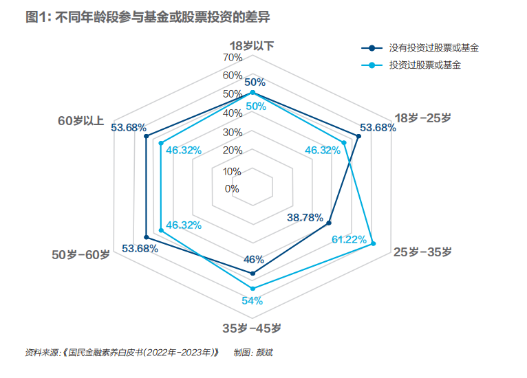
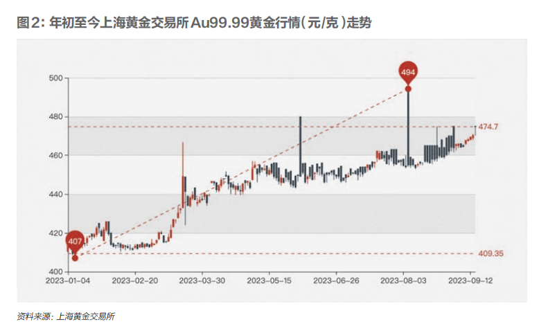
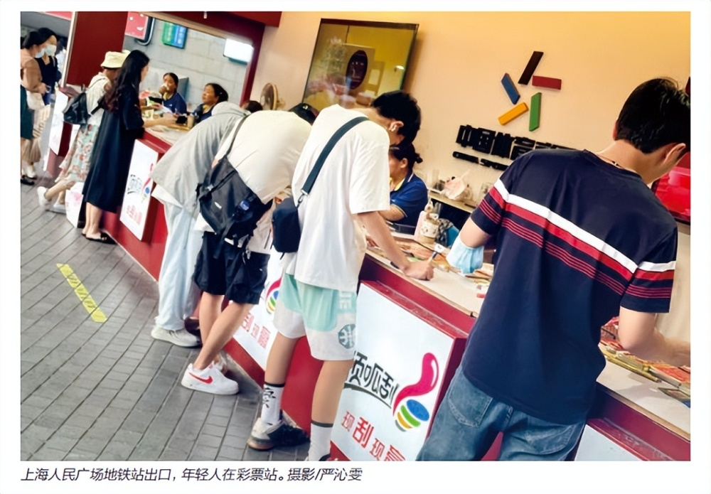

# 存款、黄金与彩票，年轻人对抗不确定

**文｜陈洪杰 严沁雯 张颖馨**

**编辑｜张威 袁满**

彩票中了1.7亿元后，应该做什么，要不要上班？

分享上述看法的UP主（上传者），可以轻松获得超10万次的点赞量。这类讨论亦成为2023年网络热门话题。

第三方数据显示，2023年1月至5月，在社交媒体上发布彩票相关内容的用户，60%为21岁-30岁的年轻人。其中，21岁-25岁的年轻人最为活跃。

与此同时，年轻人变得谨小慎微，对银行存款、投资黄金展现出极大的热情。为此，这类群体不仅做起了跨城存款特种兵，还迷上了撸金豆。

这正是当下年轻人财富观的缩影。数量超2亿人口、占总人数比重接近20%的Z世代（本文聚焦在出生于1995年-2000年有一定投资能力的年轻人），其投资行为及财富理念正在发生变化。上述变化的背景是：疫情暴发、经济下行、地缘政治冲突、就业不及预期……

**中国人民大学中国普惠金融研究院院长贝多广认为，上述行为是当代年轻人的理性选择，并非个人问题，而与整体经济状况有关。**

在前景不确定性较高时，诺奖得主Daniel Kahneman（丹尼尔·卡尼曼）的展望理论表明，人们会高估极端事件的几率。
**“而尚未完全复苏的经济对年轻人的冲击最高，所以有些人买彩票搏一把，有些人买金制品避险。”香港大学经济及工商管理学院金融学教授林则君对《财经》称。**

**对于年轻人的财富理念变化，大部分资管机构显得后知后觉。**
中国首席经济学家论坛理事刘锋对《财经》表示，资管机构没有深入研究年轻客群消费意愿和金融习性；此外，从商业角度来看，资管机构对年轻客群经营的投入难以短期内创造收益。

“资管机构若错过此次战略布局，相当于放弃了面向未来的长期征程。”中国社科院金融研究所财富管理研究中心主任王增武表示。“年轻人现在的投资理念，可能会影响他们以后的财富观、社会观。所以，不仅资管机构，各个家庭以及全社会应该以更多的时间和资源培养年轻人甚至更小孩子的财商和才商意识。”

跨城寻找高收益存款

8月的一个早晨，陈墨踏上从连云港去往杭州的高铁。与她一同出发的，还有15万元。

“我是去存钱的。”这是陈墨第一次尝试跨城市存款，自2023年在社交平台频繁刷到他人分享的相关经历后，这一行程便被她列入计划清单。

从连云港到杭州，距离有500多公里，单程高铁则要耗费四个半小时。时值盛夏，室外居高不下的温度让陈墨额角的汗水直冒，而她却无暇顾及长途奔波带来的劳累。因为在陈墨眼中，这趟存款之旅已经“值回票价”。

“我们本地的大行早就没有3%以上的存款了，但这家中小银行却能达到3.3%。”陈墨算了一笔账，“我拿15万元存本地大行，年化利率只有2.9%，在这家银行存三年，利息就能多1800元左右，加上赠送的300元的购物卡就更划算了。”

**事实上，自存款降息以来，像陈墨一样的存款特种兵便越来越多。他们中不仅有人在相近区域内跨城存款，更有人远赴香港开户，只为获取更高的存款利率。**
在此之中，不乏年轻一代的身影。

年轻人也爱存款？
**2022年7月，根据腾讯研究院发布的《2022年轻人理财大调查》，在“90后”“00后”中，79.2%的人投资过货币基金、债券基金等稳健型理财产品，位列第一；而银行存款，则以51%人的购买经历位列第二。**

在陈墨现有的20万元资金中，存款就占据了四分之三，其余的活钱则放在余额宝中，等攒到10万元她打算一并再存进银行。

中国储蓄率整体一向较高。IMF（国际货币基金组织）数据显示，1980年中国国民储蓄率为32.63%，最高峰时曾一度超过50%，到2022年的占比也达到了46.18%。

“Z世代出生和成长在物质生活富足的时代，我曾认为中国储蓄率整体会降低，至少该群体的存款占比会降下来，但目前改变了以上的看法。”一位经济学家对《财经》表示。

在通过某社交平台分享自己的跨城存款经验后，猛增的点赞与收藏数亦让陈墨体会到与她一样心态的人不在少数。“在当前的经济环境之下，越来越多的人需要安稳的保本理财方式。随手发布的存款分享便突破了2.6万次阅读量的热度，我觉得可以侧面反映现在年轻人的理财观念，普遍都是求稳。”陈墨表示。

**求稳的年轻人的确不在少数。**
“我是绝对的风险厌恶者，主打一个保守。”圆子25岁，硕士毕业一年有余，通过银行定存、活钱理财等方式，她攒下了近30万元。而其于2023年4月开始经营的“圆子的攒钱日记”账号，已在社交平台收获近3000次点赞及收藏。

23岁的乐悠亦有相同的理念，虽然才刚刚步入社会，但她已尝到了存钱的乐趣。5万元、10万元、15万元，回忆起存钱路上的一个个“里程碑”，乐悠直言已经上瘾。

对于存钱，乐悠有自己的规划：每月收到工资后，她便会拿出工资的近40%购买期限较短的稳健型理财产品，剩余的则用于日常开销和备用。当放在理财产品中的钱积累到一定规模，她便会将钱存入银行。

圆子的资产配置则更加多元，除了银行定期存款和活钱理财，她还进行了黄金定投和基金（债基类）配置。“我的理财方式与资金量有关，在我攒到25万元之前，我对保本的需求比较大，主要投银行定期和活钱理财；但是当我存到30万元，算是有个保底的小金库了，以后赚到的钱就会分配给固收类或者中短债等。总体还是以风险较低的产品为主。”

**与此同时，部分受访者表达了对部分小银行的不信任感。**
一位1999年出生的女生称，受上年村镇银行事件的影响，她在存钱时会看银行背后的股东支持。当谈到“存款保险实行限额偿付，最高偿付限额为50万元”，她说，了解这个政策，但依然不愿意冒风险。

**京华世家家族办公室董事长聂俊峰称，就业与收入预期的不确定性正在改变年轻人的储蓄与消费观，出现了群体性的资产配置保守化的倾向。**
这是疫情冲击下的“疤痕效应”，而且这一效应其实不独限于年轻人群，居民储蓄存款的增加和增额终身寿险产品的火爆都是资产配置保守化的体现。

在南京银行上海分行相关业务负责人看来，年轻人当下偏稳健的资产配置策略，与这一客群自身的特点有一定关联。当下大部分年轻人的资金的留存体量较小，所以会更加偏爱透明度较高、门槛也相对较低的定期存款、稳健的银行理财等产品。

**当下年轻人普遍求稳的心态，不仅与之所处特殊人生阶段有关，亦与他们在财富增长之路上“受过伤”的经历紧密相连。**

根据国家金融与发展实验室发布的《国民金融素养白皮书（2022年-2023年）》，在金融市场参与度方面，25岁-35岁居民中，有61.22%的受访者投资过股票或基金，62.24%购买过金融理财产品。而与此同时，这一年龄段的居民在以上产品的盈利与亏损均较高，存在更大的收益波动性。

2022年11月下旬，债券市场波动，逾千只银行理财产品破净；2023年以来，基金市场震荡分化，不少人选择赎回。“我们发现，一部分年轻人表现得特别积极，而另一部分年轻人表现得特别佛系，选择了躺平，只想放存款，甚至接受不了银行理财产品。”招商银行首席财富顾问郑致芬在5月曾透露。

圆子提到：“我在2019年底投了基金，因为看到网上对‘坤坤’吹得火热就无脑入了。一开始一个月可以赚1000多元，但到现在收益率已经变成负40%。我想以后还是会更倾向于做风险小的债基。”

不只是本就风格稳健的圆子，在27岁曾宇的资产配置中，权益类基金及股票一直占据着大头，但现如今他的心态亦有了转变。“不光股票亏着，去年至今，基金也亏了4万元，我打算以后多配置点存款或者稳健理财。”

**某城商行人士分析称，在股债市场整体波动的基调下，青年客群本身适应性较强，避险情绪产生的边际效应相较其他客群更快。**
就年轻客群（以90后为划分依据）对公募基金的赎回情况而言，占比可能在20%到30%之间，不过持仓体量较小。

而在微众银行行长助理方震宇看来，对于“90后”或“00后”，近年来的基金亏损可能是他们财富管理的第一课，不排除部分以前购买基金产品的客户会转移到银行理财等其他的投资中。

“与其说年轻人理财观念变佛系，不如说面对震荡的市场，年轻投资者的观念在逐步走向成熟，追涨追热点、频繁操作的现象逐渐减少。”蚂蚁基金总经理林思思指出。

热爱黄金的双重属性

在低利率时代，资产收益出现了一轮又一轮的下调，无论是银行客户经理对贵金属的持续宣传，还是社交媒体的大肆渲染，都让不少人将目光转向黄金。

“买黄金真香！”有用户在社交平台分享自己的买金经历：上年7月-8月买入1万多元后，在2023年3月收益已经达1000多元。不过由于涨势过猛，该用户彼时选择将黄金卖掉止盈，转为定投。

圆子亦在2023年选择了定投黄金。据她介绍，自己目前可支配资金有限，所以设置了双周定投，每次放入少量钱。“虽然我现在是小打小闹地投，但我应该会一直坚持下去。”

**因财力有限，投资金条的年轻人并不多，更多迷上了攒金豆。一个金豆重量大多是1克，价格在每克500元左右，与传统黄金首饰、金条相比，购买门槛更低。**

“金豆可以满足购买欲，又能实现储蓄，还容易变现。”张言雪称。作为一位全职妈妈，她在过去大半年内积攒过30个左右的金豆，也兑换过现金。“我老公的工资并不高，每个月刨除房租和吃穿用度，剩余不了多少。不买金豆，会花在其他东西上。”她称。

除了攒金豆，张言雪几乎没有投资其他产品。她说，短期银行存款利息低，而长期存款无法满足流动性需求。金豆则不同，急用钱时，只要到回收处，“一手交货，一手拿钱”。

然而，黄金虽然稳定，价格每天都在变化，如何熨平中间的波动？根据张言雪与其他年轻人在社交平台交流的攻略，通过积分签到、做任务、领取优惠券等即可“撸金豆”，降低购买的价格。

“比如在某家银行开设个人养老金账户，领取50元的立减金礼包后，再通过移动端搜索该行的电子商务金融服务平台，可获得20元优惠券，运气好还能遇到小额微信立减金以及促销活动。我曾以270元的价格购买过一个金豆。”张言雪说。

**另一方面，卖金豆的线上商家亦重视投教工作。**
不少商家通过出示相关证书、发送鉴定视频、赠送运费险等打消年轻人的顾虑。一位电商负责人称，“这届年轻人很喜欢在网络上分享，只要赢得一个人的信任，便可带动一大批金豆的销量。”

**既能做成耀眼精致的配饰，亦是储存财富保值的手段——黄金的双重属性既符合年轻人储蓄的诉求，亦能满足他们对美和消费的追求。**

《2022国潮珠宝研究报告》称，中国内地金店主要消费人群年龄集中在25岁-

34岁间，占比55%，高居第一；其次，35岁-44岁年龄层占比36%，位居第二。

中国黄金协会的数据显示，2023年上半年全国黄金消费量554.88吨，比上年同期增长16.37%。“从黄金首饰消费的产品类别来看，因金价持续处于高位，消费者更倾向于购买轻克重产品，且按克重计价产品销量的增幅显著高于按件计价产品。”中国黄金协会有关负责人表示。

“追求财富的增值保值是对美好生活的向往。当下年轻人面临较大压力，通过投资小金豆的行为虽然属于次优选择，但合乎情理。”华泰资产首席经济学家王军对《财经》表示。

在光大期货研究所有色金属研究总监展大鹏来看，玉和翡翠等品种，本身水太深，价格不透明，有进入门槛。
**金价虽有调整但长期来看一直处于上涨趋势，投资者以及年轻人更喜欢确定性的品种。**

同时，展大鹏也提醒，投资者购买黄金实物，要分清金饰品等消费品和金条等投资品，二者在回收之时在扣减方面会有一定不同；另外，黄金现货、黄金衍生品的特性不同，在趋势研判逻辑上会有较大不同。

林则君称，除了手持实物黄金，黄金ETF（交易所交易基金）也是一种相对简单的投资方式，具有交易便捷、成本低的特点，也可以作为年轻人避险的一种工具。

押宝彩票小概率事件

**存款与黄金，折射出当代年轻人求稳的佛系态度。而在另一方面，年轻人渴望短期内获得大量财富，选择小概率事件，**
“买张彩票，老天自有安排。你若不买，老天怎么安排”？

**在经济学上，彩票的期望通常为负值。不过，近年来，一大批彩票站迅速占领了商业综合体、地铁站等人流量密集区。**
一句“挣1000万元比中1000万元难太多了”的标语击中了年轻人的内心。

28岁的王帅便是彩票站的常客之一，爱好投注双色球，每次的花费金额则在5元-20元不等。他和其他年轻同事通常一周固定光顾三次。

王帅告诉《财经》，此前自己并未有购买彩票的习惯。“我的学校不差，当时通讯行业就业非常好。但没想到，毕业后没多久便遇上经济下行。顶不住北京高成本的生活压力，两年后我便回到了老家河北廊坊。”他说。

“现在我月工资到手差不多7000多元，除去2000多元的房贷，还需要开销和给儿子预留养育基金，存款几乎为零。此外，我房子的单价已由买时的1.6万元/平方米，降至1.2万元/平方米。”在王帅看来，虽然中奖概率极低，但作为年轻人情绪的疏导口，彩票寄托着希望，即便只有几万分之一、几千万分之一的可能。

**人的财富观与所处的社会环境有内在逻辑联系。**
“年轻人买彩票的行为是在寻找心理上的安慰，花钱不多但开心取乐。”王增武称，“用2元钱博取1000万元”是风险收益变化的新表现。

“之前中国的经济处在上升期，工作机会较多，利率环境整体收益偏高，大部分人通过努力，就能获得相对可以的工资性收入以及财产性收入。而最近几年，伴随经济形势变化，个人工资上限可以预见，8%或者10%的投资收益不复存在，大家的风险认知以及收益边界出现了重新认定。”王增武表示。

**对于有积蓄的中青年人而言，通常使用“杠铃策略”来应对不确定性。**
杠铃两头大、中间小，重量在两侧，但它却具有很强的稳定性，映射到投资中：在面对未来不确定性时，投资者可把90％的已有资金配置在相对安全的资产上，剩下10%则投资于高风险高收益的资产，以等待市场的复苏。

但在年轻人身上则体现出了差异性。
**王增武表示，原因在于他们现有积蓄较少，加之未来工资性收入想象空间有限，边际效应发生变化，所以更在意财产性收入的提升，于是衍生出跨城存款、撸金豆，以及购买彩票等行为。**

与王帅不同，当下正处在研二的刘美则爱好刮刮乐。因为经常在网络上看到彩票中奖的新闻，同学亦曾尝到甜头。“我的运气向来不错，为什么幸运的人不会是我呢？”她说。

林则君称，“95后”是网络原住民，极容易吸收网络信息，一旦从中了解到暴富的案例，会出现从众心理，高估自己的胜算。另外，从实证案例来看，年轻人活力四射，喜欢冒险，乐于在股市中不断交易，但在经济不景气时，投资战场转移到了彩票行业。

投资获得感有待提升

**当年轻群体的投资理念和财富观正发生变化，大多数资管机构的金融服务却有所缺位。**

“中国资管机构牌照垄断，在躺赢中度过了数十年，能力存在短板，产品类型和功能同质化严重，体验感也不好。”刘锋表示，另外，“95后”“00后”们的财富积累较少，资管机构出于商业性考虑，尚未专门针对这类群体的特性研发太多产品。

“但年轻人终将走向成熟，Z世代群体也终将成长为成熟的客户群体。资管机构应针对新一代年轻人设计更具有稳定性、长期化、低成本的投资产品。”刘锋称。

王增武亦有类似观念。
**他表示，年轻群体的投资理念与他们的收入收支结构有关。学生阶段表现出来的特性和工作之后的特性不同，但他们每个阶段的财富观都会影响人生的下个阶段，这值得资管机构关注，以免错过未来的增长点。**

“中国金融要吸取历史的教训，在过去因为传统金融机构不太重视包括年轻人在内的长尾客群，把这块市场让渡给了P2P这类互联网金融平台，造成了很大的危害。持牌的资产管理机构要加紧研究，提供符合年轻群体特征的金融服务。”王军提醒道。

根据《2021中国统计年鉴》的数据，中国人口总数为14.1亿人。结合国家统计局公布的出生率，测得Z世代人口约2.79亿。目前，第一批Z世代已经年满28岁，即便他们按部就班在国内攻读硕士学位，也已到了工作岗位的年纪。

**随着时间推移，会有越来越多的Z世代完成身份转变。一些资产管理机构也开始了探索。**
在郑致芬看来，经历了上年以来的市场波动，2023年的年轻人有了另一种变化。但和中年人客群不同，年轻人会“受伤”，但恢复也快。同时，年轻人的学习力非常强，随着移动互联网的发展，学习相关理财课程的渠道亦在拓宽。

“今年产品以稳健类趋向为主。作为银行或专业的财富管理机构，既要符合客户的理财要求，提供相应服务；又要不断通过投教牵引着他们往资产保值与增值的道路去走。”郑致芬指出。

**南京银行上海分行相关业务负责人则提到，一方面银行需要顺势而为。**
随着年轻客群心态上趋于稳健，对于这类客群加大对低波、稳健类理财的推广，与其稳健投资的目标相匹配。

**另一方面，银行可针对年轻客群进行多元化资产配置的投教工作。**
“尽管当前市场依旧相对低迷，但是一旦出现回暖迹象，作为对新生事物接受程度较高的客群，年轻群体会逐渐成为多元资产配置的主力。”上述负责人称。

而在方震宇看来，在服务客户的过程中，根据不同客户的需要给予不同的服务。“我们会建议年轻的客户做资产配置，通过‘配置加克制’的理念，帮助年轻人实现资产的增值和保值。比如权益类基金投资比例若超过20%，我们会提醒。但我们也鼓励年轻人了解股票、基金等权益类投资，只是要掌握一个度。”方震宇指出。

**此外，林思思认为，伴随市场行情的复杂变化，投资者心态也往往面临考验。**
难点在于如何帮助投资者改善频繁交易、分散配置不足等非理性行为，帮助树立合理的“风险收益观”，从而提升投资获得感。

“将根据每位客户的风测水平和投资目标等，做好适当性管理。对于理财经验不够充足的年轻用户群体，我们会更加重视风险提醒，通过各类深度服务引导理性理财、不盲目跟风。”林思思称。

对于新一代年轻人所表现的特征，王增武称，若他们看重收益的细小差别，金融机构除了通过减费让利来增加提高产品收益，更重要的是通过投资资产组合或者新技术的应用来提高收益能力或者拓展收益的边界，更好地满足该群体的需求。

“若部分有时间的年轻人喜欢薅羊毛，资管机构可以设置一些任务，并且根据他们资产规模和活跃度，给与相应的权益，增强黏性。”王增武认为。

**值得一提的是，相较于关注金融品牌是否“潮流”，Z世代对于安全、专业度和流程便捷的诉求反而比稍年长的人群更为重视。**

“银行需要通过客群经营来培养忠诚的年轻客群，为银行客群不断注入新鲜血液，实现长期持续的价值提升。在客户经营策略方面，运用综合金融立体打法、生命周期长期打法和融入生活场景打法组合拳。”安永在2022年9月发布的《银行年轻客群战略白皮书》上称。

**此外，投资教育成长，不仅是资管机构的事情，更是来自于全社会的责任。**
“财商教育应从娃娃抓起，设置相应课程，让他们认识到不当使用金融的危害以及正确投资带来的好处。当然，认识钱、使用钱、管理钱只是狭义上的财商教育，更重要的是培养孩子的才商，健全人格。”王增武表示。

需要指出的是，当代年轻人投资理念的形成，与大环境的变化息息相关，被打上了时代的烙印。在此背景下，多位专家认为，目前最重要的任务是树立年轻人的信心，优先发展吸纳就业能力强的行业产业，激发市场活力，加大对吸纳就业多的行业进行政策补贴支持。
**“应帮助年轻人，优化产业政策，引导他们投资自己的未来。”林则君称。**

**刘锋呼吁，要建立对投资者的长期保护机制，推进法治化建设，保持政策连续性、稳定性、可持续性，促进经济发展，增强年轻人对未来的乐观预期。**

这一切正逐渐发生变化。2023年4月以来，两次国务院常务会议均将稳就业列为主要议题之一。根据部署，要不断优化完善相关稳就业政策，加大对吸纳高校毕业生数量多的企业的政策、资金支持，推动应届毕业生多渠道就业。

“随着组合拳各项政策效果不断显现，下半年经济将在上半年持续恢复的基础上，保持稳定向好态势。”8月4日，国家发展改革委相关人士称。

**(受访者陈墨、圆子、乐悠、曾宇、张言雪、王帅、刘美为化名；《财经》记者张威对此文亦有贡献；作者为《财经》记者；本文刊于2023年9月18日出版的《财经》杂志)**

【本文为《财经》杂志原创文章，作者为《财经》记者，未经授权不得转载或建立镜像。如需转载，请在文末留言申请并获取授权。】

