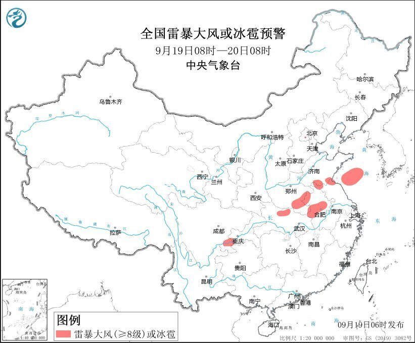

# 强对流天气蓝色预警：山东河南安徽等地将有8-10级雷暴大风或冰雹天气

**中央气象台** **9月19日06时** **发布强对流天气蓝色预警：**

预计9月19日08时至20日08时，山东南部、河南东部和南部、安徽中北部、江苏北部、湖北北部、四川东南部以及黄海中南部等地的部分地区将有8-10级雷暴大风或冰雹天气；陕西南部、山东东部和南部、河南中东部和南部、安徽中北部、江苏中北部、湖北、四川中东部、重庆东北部和西部、云南东北部和西南部等地的部分地区将有短时强降水天气，最大小时雨量30-50毫米，局地可达60毫米以上。

预计，强对流的主要影响时段为今天白天至夜间。

